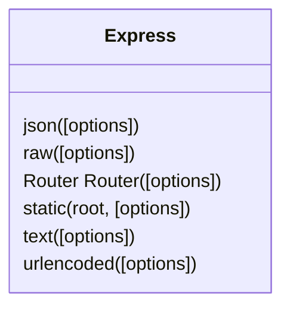
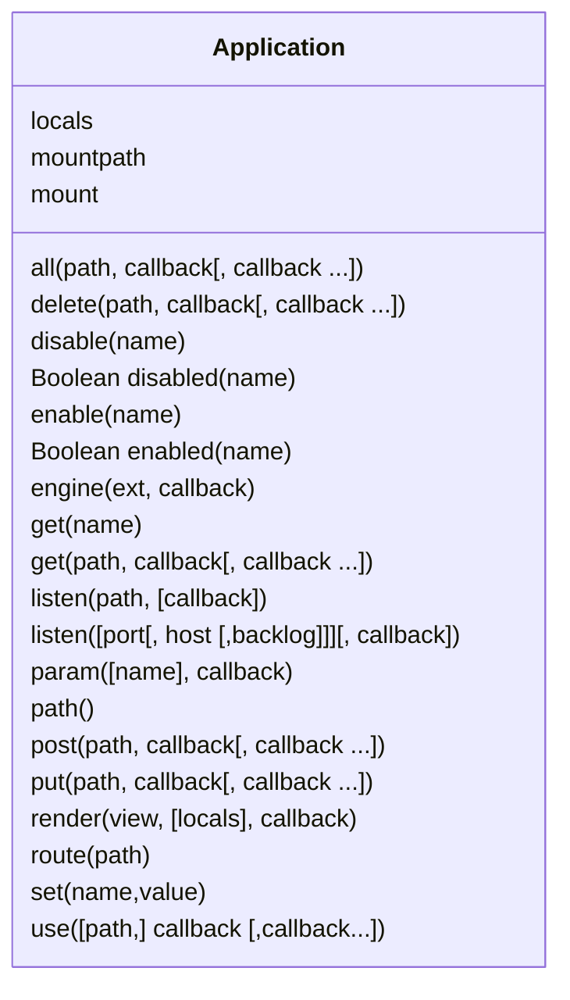
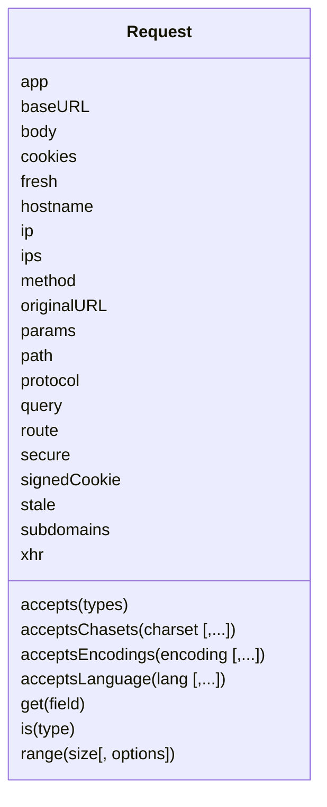
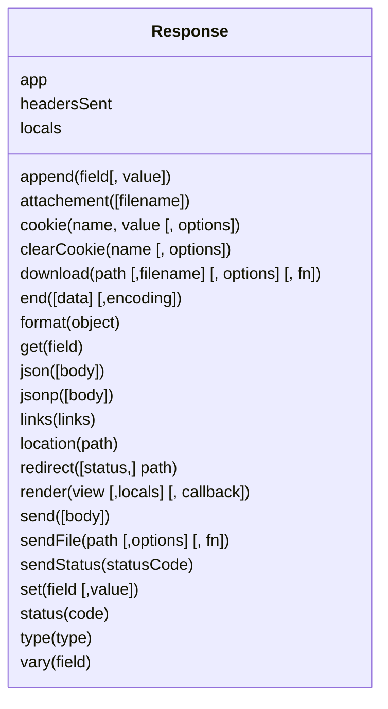
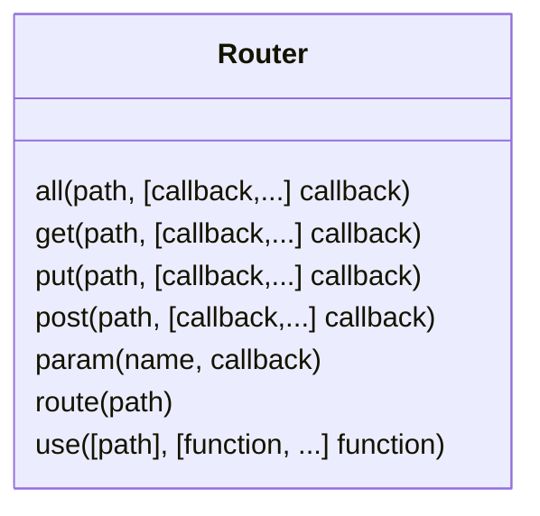

# Express.js

> :construction: **UNDER CONSTRUCTION**: This page is a work in progress.

[toc]

---

## Introduction

**Express** (or Express.js) descibes itself as a "Fast, unopinionated, minimalist web framework for Node.js".  For the most part, Express provides a concise library of functions (many of which appear to be part of Node.js) boiled down to a more frequent set of objects. 

### Why?

Even thouh Express is NOT part of LC101, Express is the "E" in "MEAN" (MongDB, Express, Angular, Node). Thus, a lot of applications use Express.

## Installation

```bash
npm install express --save
```

## API

> :reminder_ribbon: **TODO**: Make sure depricated items are not listed.

### `express()`




#### Methods

### `app` (Application)




#### Properties

#### Events

> :reminder_ribbon: **TODO**: How does somone add an Event to a Class Diagram?

#### Methods

### `req` (Request)



#### Properties

#### Methods

### `res` (Response)



#### Properties

#### Methods

#### Deprecated Methods

* **`param`**`(name[, defaultValue])` - Use `req.params`, `req.body`, `req.query` instead.

### `router` (Router)



#### Methods


---

## References

[ ^ express ]: ExpressJS.com(https://expressjs.com/).

[^ express-api ]: ExpressJS.com - [4.x API](https://expressjs.com/en/4x/api.html).

---

#Nodejs #Express