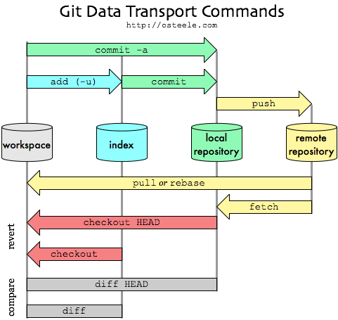

# Git Gud Quick!

[toc]

---



## Create a New Repo

```bash
mkdir "${repo}"					# Create repo directory
cd "${repo}"					# Go to the repo directory
echo "# ${repo}" >> README.md	# Create the README.md file
git init						# Initialize the repo
git add README.md				# Stage the README.md file
git commit -m "first commit"	# Commit the repo for the first time
git remote add origin https://github.com/${user}/${repo}.git 	# Set the remote
git push -u origin master		# Push the repo for the first time
```

### Push to an existing repo

Use this method if you create a new repo via the Github.com website

```bash
mkdir "${repo}"
## If you are creating an Angular project, follow the instructions from the
## Angular_Guide.md instead of creating a enw directory
cd "${repo}"
git remote add origin https://github.com/${user}/${repo}.git
git push -u origin master
```

## Clone

> **NOTE:** Clone should pull the most recent changes. If it doesn't or if it has been a while, you may want to `git pull` to get the most recent upgrades.

```bash
git clone https://github.com/${user}/${repo}.git
cd ${repo}
## If you want to contribute or have access to do so, 
## establish the remote like below
git remote add origin https://github.com/${user}/${repo}.git
git push -u origin master
```

## Staging

* `git add ${files}` - Add files to the repo
* `git remove ${files}` - Remove files from the repo

## Committing

> **NOTE:** Commit and Push frequently!

* `git commit -m "${message}"` - Commit changes 

## Push and Pull

>  **NOTE:** Remember to `pull` before you `push`!

* `git pull` - Get any recent changes.
* `git push` - Push your contribution to the repo.

## Branch, Checkout, and Merge