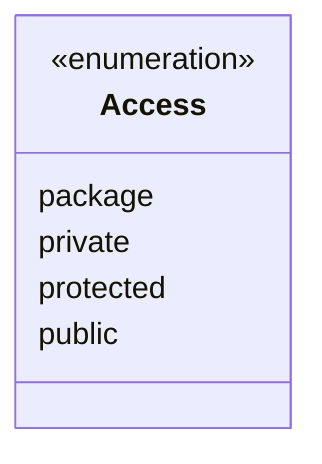

## JSDoc and Semver

> :construction: **UNDER CONSTRUCTION**: This document is a work in progress, however unlike most of the documents under construction, this one is actually usable enough for the moment.

[toc]

---

## Introduction

## Installation

I recommend installing JSDoc from [NPM](https://www.npmjs.com/package/jsdoc).

To install the latest version of JSDoc globally (which may require `sudo`):

```bash
npm install -g jsdoc
```

To install the latest version of JSDoc locally and save it in your package's `package.json` file:

```bash
npm install --save-dev jsdoc
```

There's also another tool called [jsdoc-to-markdown](https://www.npmjs.com/package/jsdoc-to-markdown) that can generate API documentation from a JavaScript file that is using JSDoc, but I'm not goin to get into that right now.

## Tags

JSDoc supports two kinds of tags:

* **Block tags** which are top level of a JSDoc Comment.
  * Block tags usually provide detailed information about your code, such as the parameters that a function accepts.
  * Block tags always begin with an at sign (`@`). Each block tag mus be followed by a line break, with the exception of the last block tag in a JSDoc comment.
* **Inline tags** which are within the text of a block tag or a description.
  * Inline tags usually link to other parts of the documentation, similar to the anchor tag (`<a>`) in HTML.
  * Inline tags also begin with an at sign, however inline tags and their text must be included in curly braces. If your tag's text includes a closing curly brace (`}`), you must escape ith with a leading backslas (`\`). You do not need to use a line break after inline tags.

Most JSDoc tags are block tags.

### Examples

In the following examples, `@param` is a block tag, and `{@link}` is an inline tag.

You can use inline tags with a description (like in the first example below), or within a block tag (like in the second example below).

When you use multiple block tags in a JSDoc comment, they must be separated by line breaks.

#### Block and inline tags in JSDoc comments

```js
/**
 * Set the shoe's color. Use {@link Shoe#setSize} to set the shoe size.
 *
 * @param {string} color - The shoe's color.
 */
Shoe.prototype.setColor = function(color) { /* ... */ };
```

#### Inline tag used within a block tag

```js
/**
 * Set the shoe's color. Use {@link Shoe#setSize} to set the shoe size.
 *
 * @param {SHOE_COLORS} color - The shoe's color. Must be an enumerated
 * value of {@link SHOE_COLORS}
 */
Shoe.prototype.setColor = function(color) { /* ... */ };
```

#### Multiple block tags separated by line breaks

```js
/**
 * Set the color and type of the shoelaces.
 *
 * @param {LACE_COLORS} color - The shoelace color.
 * @param {LACE_TYPES} type - The type of shoelace.
 */
Shoe.prototype.setLaceType = function(color, type) { /* ... */ };
```


---

### Block Tags

#### `@abstract`

>  synonms:  `@virtual`

This member must be implemented (or overridden) by the inheritor.

#### `@access`

Specifies the access level of this member (`private`, `package-private`, `public`, or `protected`).

#### `@alias`

Treat a member as if it had a different name.

#### `@arg`

See `@param`

#### `@argument`

See `@param`

#### `@async`

Indicate that a function is asynchronous.

#### `@augments`

See `@extends`

#### `@author`

Identify the author of an item.

#### `@borrows`

This object uses something from another object.

#### `@callback`

Document a callback function.

#### `@class`

> synonyms: `@constructor`

This function is intended to be called with the `new` keyword.

See also

* `@hideconstructor` (in the `@constructor` context)
* `@interface` (in the `@class` context)
* `@extends` for `class` inheritance.
* `@implements` for `interface` implementation.

#### `@classdesc`

Use the following text to describe the entire class.

#### `@const`

> synonyms: `@constant`

Document an object as a constant (`const`).

#### `@constant`

See `@const`

#### `@constructor`

See `@class`

#### `@constructs`

This function member will be the constructor for the previous class.

#### `@copyright`

Documents some copyright information.

#### `@default`

> synonyms: `@defaultvalue`

==Documents the default value.==

#### `@defaultvalue`

See `@default`

#### `@depricated`

Documents that something is no longer the preferred way. (When you use this, provide an alternative whenever possible)

#### `@desc`

> synonyms: `@description`

Describe a symbol.

See also `@summary`

#### `@description`

See `@desc`

#### `@emits`

See `@fires`

#### `@enum`

Describe a collection of related properties. Typically, in UML, this collection would be part of an object with the `enumeration` stereotype.



#### `@event`

Document an event.

#### `@example`

Provide an example of how to use a documented item.

#### `@exception`

See `@throws`

#### `@exports`

Identify the member that is exported by a JavaScript module.

#### `@external`

> synonyms: `@host`

Identifies an external class, namespace, or module.

> :reminder_ribbon: **TODO**: Is `@external` the proper syntax for `#include`, `import`, or `require`?

#### `@extends`

> synonyms: `@augments`

Indicates that a symbol inherits from, and adds to, a parent symbol.

See also

* `class`
* `implements`

#### `@file`

> synonyms: `@fileoverview`, `@overview`

Describe a file. Typically, I just use it to say what the file's name is.

#### `@fileoverview`

See `@file`

#### `@fires`

> synonyms: `@emits`

Describe the events this method may fire.

#### `@func`

> synonyms: `@function`, `@method`

Describe a `function` or method.

See also

* `@param`
* `@property`

* `@var`

#### `@function`

See `@func`

#### `@generator`

Indicate that a function is a generator function.

See also `@yields`

#### `@global`

Document a global object.

#### `@hideconstructor`

Indicate that the constructor should not be displayed.

See also `@constructor`

#### `@host`

See `@external`

#### `@ignore`

Omit a symbol from the documentation.

#### `@implements`

This symbol implments an `interface`.

See also 

* `@extends`
* `@interface`

#### `@inheritdoc`

Indicate that a symbole should inherit its parent's documentation.

#### `@inner`

Document an inner object.

#### `@instance`

Document an instance member.

See also `@static`

#### `@interface`

This symbol is an `interface` that others can implement.

See also

* `@class`
* `@implements`

#### `@kind`

What kind of symbol is this?

> :reminder_ribbon: **TODO**: Doesn't UML have a defintion of "kind"?

#### `@lends`

Document properties on an object literal as if they belong to a symbol with a given name.

#### `@license`

Identify the license that applies to this code.

> :reminder_ribbon: **TODO**: List some common options.

#### `@listens`

Lit the events that a symbol listens for.

See also `@event`.

#### `@member`

See `@var`

#### `@method`

See `@func`

#### `@memberof`

This symbol belongs to the parent symbol.

> :reminder_ribbon: **TODO**: Could this be related to `@namespace`?

#### `@mixes`

This object mixes in all the members from another object.

#### `@mixin`

Documents a `@mixin` object. (More common in Ruby than JavaScript.)

#### `@module`

Document a JavaScript module.

#### `@name`

Document a the name of an object.

#### `@namespace`

Document a `namespace` object.

#### `@override`

Indicates that a symbol overrides its parent.

#### `@overview`

See `@file`

#### `@package`

This symbol is menat to be `package-private`.

> :information_source:: In Java, this symbol indicates a `package` name.

See also

* `@access`
* `@public`
* `@protected`
* `@private`

#### `@param`

> synonyms: `@arg`, `@argument`

Dcoumetn the parameter to a function.

See also `@function`

#### `@private`

This symbol is meant to be `private.

See also:

* `@access`
* `@package`
* `@public`
* `@protected`

#### `@prop`

See `@property`

#### `@property`

Document a property of an object.

#### `@protected`

This symbol is meant to be `protected`.

See also:

* `@access`
* `@package`
* `@public`
* `@private`

#### `@public`

This symbol is meant to be `public`.

See also:

* `@access`
* `@package`
* `@private`
* `@protected`

#### `@readonly`

This symbol is meant to be read-only.

See also: `@const`

#### `@requires`

This file `requires` a Javascript module.

#### `@return`

See `@returns`

#### `@returns`

> synonyms: `@return`

Document the return value of a function.

#### `@see`

Refer to some other documentation for more information.

#### `@since`

When was this feature added. (Use semantic versioning!)

See also `@version`

#### `@static`

Document a `static` member.

See also:

* `@instance`
* `@member`

#### `@summary`

A shorter version of the full description.

See also `@desc`

#### `@this`

What does the `this` keyword refer to here?

#### `@throws`

> synonym: `@exception`

Describe what errors could be thrown.

#### `@todo`

Document task to be completed.

#### `@tutorial`

Insert a link to ain included tutorial file.

#### `@type`

Document the type of an object

### `@typedef`

Document a custom type.

#### `@variation`

Distinguish different objects with the same name.

#### `@version`

Document the version number of an item. (Use [semantic versioning](https://semver.org/)!)

> :reminder_ribbon: **TODO**: Say something about semver.

See also `@since`

#### `@var`

> synonyms: `@member`

Documents a member.

See also

* `@func`
* `@member`
* `@instance`
* `@static`

#### `@virtual`

See `@abstract`

#### `@yield`

See `@yields`

#### `@yield`

Document the vaule yielded by a generator function.

See also:

* `@generator`
* `@returns`

### Inline Tags

#### `{@link}`

> synonyms: `{@linkcode}`, `{@linkplain}`

Link to another item in the documentation.

#### `{@linkcode}`

See `{@link}`

#### `{@linkplain}`

See `{@link}`

#### `{@tutorial}`

Link to a tutorial.

See also `@tutorial`

---

## Versioning

Just about any project now-a-days uses what is caled **semantic versioning** to list what version of their project is (`@version`) and since when specific functions were part of a project (`@since`).

The quick rundown is that the numbers for the version are made of three parts.

Given a version number **`MAJOR.MINOR.PATCH`**, increment the:

1. **`MAJOR`** version when you make incompatible API changes
2. **`MINOR`** version when you add functionality in a backwards compatible mannor.
3. **`PATCH`** version when you make backwards compatible bug fixes.

Additional labels for `pre-release` and `build metadata` are available as extension to the `MAJOR.MINOR.PATCH` format.

### Semantic Versioning Specfications (Semver)

1. Software using SemVer MUST declare a public API. This API could be declared in the code itself on exist stricly in documentation. However it is done, it SHOULD be precise and comprehensive.
2. A normal version number MUST take the form `X.Y.Z` where `X`, `Y`, and `Z` are non-negative integers, and MUST NOT contain leading zeros. `X` is the major version, `Y` is the minor version, and `Z` is the patch version. Each elements must increase numerically. (e.g. 1.9.0 → 1.10.0 → 1.11.0)
3. Once a version package has been released, the contents of that version MUST NOT be modified. Any modifications MUST be released as a new version.
4. Major version zero (`0.Y.Z`) is for initial development. Anything MAY cange at the time. The Public API SHOULD NOT be considered stable.
5. Version 1.0.0 defines the public API. The way in which the version number is incremented after the release is dependent on this public API and how it changes.
6. Patch version Z (`x.y.Z | x > 0`) MUST be incremented if only backward compatible bug fixes are introduced. A **bug fix** is defined as an internal change that fixes incorrect behavior.
7. Minor version Y (`x.Y.z | x > 0`) MUST be incremented if new, backwards compatible functionality is introduced to the public API. It MUST be incremented if any public API functionality is marked as deprecated. It MAY be incremented if substantial new functionality or improvements are introduced within the private code. It MAY include patch level changes. Patch version MUST be reset to 0 when minor version is incremented.
8. Major version X (`X.y.z | X > 0`) MUST be incremented if any backwards incompatible changes are introduced to the public API. It MAY also include minor and patch level changes. Patch and minor version MUST be reset to 0 when major version in incremented.
9. A `pre-release` version MAY be denoted by appending a hypen and a series of dot separated identifiers immediately following the patch version. Identifiers MUST comprise only ASCII alphanumeric and hyphen `[0-9A-Za-z-]`. Identifiers MUST NOT be empty. Numberic identifiers MUST NOT include leading zeros. Pre-release versions have a lower precedence than the associated normal version. A pre-release version indicates that the version is unstable and might not satisfy the intended compatibility requirements as denoted by its associated normal version. (Examples: `1.0.0-alpha`, `1.0.0-alpha.1`, `1.0.0-0.3.7`, `1.0.0-x.7.z.92`.) (You should probably keep it simple and mark it `alpha`.)
10. `build metadata` MAY be denoted by appending a plus sing (`+`) and a series of dot separated identifiers immediately following the patch or pre-release version. Identifiers MUST compirse only ASCII alphanumerics and hypen `[0-9A-Za-z-]`. Identifiers MUST NOT be empty. Build metadata MUST be ignored when determining version precedence. Thus two versions that differ only in the build meta data, have the same precedence. (Examples: `1.0.0-alpha+001`, `1.0.0+20130313144700`, `1.0.0-beta+exp.sha.5114f85`.) 
11. **Precedence** referes to how versions oare compared to each other when ordered. Precedence MUST be calculated by separating the versions in to major, minor, patch, and pre-release identifiers in that order (Build metadata does not figure into precedence. Precedence is determined by the first difference when comparing each of these identifiers from left to right as follows: Major, minor, and patch version are always compared numerically. (Example: `1.0.0 < 2.0.0 < 2.1.0 < 2.1.1`). When major, minor, and patch are equal, a pre-release version has lower precedence than a normal version. (Example: `1.0.0-alpha < 1.0.0`.) Precedence for two pre-release versions with the same major, minor, and patch version MUST be determined by comparing each dot separated identifier from left to right until a difference is found as follows: identifiers consisting of only digits are compared numerically and identifiers with letters or hyphens are compared lexically in ASCII sort order. Numeric identifiers always have lower precedence than non-numeric identifiers. A larger set of pre-release fields has a higher precedence than a smaller set, if all of the preceding identifiers are equal. Example: `1.0.0-alpha < 1.0.0-alpha.1 < 1.0.0-alpha.beta < 1.0.0-beta < 1.0.0-beta.2 < 1.0.0-beta.11 < 1.0.0-rc.1 < 1.0.0`.)

---

## References

[^jsdoc]: [JSDoc.app](https://jsdoc.app).
[^jsdoc-gh]: GitHub. [JSDoc](https://github.com/jsdoc/jsdoc).
[^ jsdoc-npm ]: NPM. [JSDoc](https://www.npmjs.com/package/jsdoc).
[^ semver ]: [SemVer](https://semver.org/).
[^ semver-gh ]: Github. [SemVer](https://github.com/semver/semver).
[^ semver-npm ]: NPM. [SemVer](https://www.npmjs.com/package/semver).
[^ semver-npm-gh ]: Github. [node-semver](https://github.com/npm/node-semver).
[^ jsdoc2md-gh ]: Github. [jsdoc2md](https://github.com/jsdoc2md/jsdoc-to-markdown).
[^ jsdoc2md-npm ]: NPM. [jsdoc-to-markdown](https://www.npmjs.com/package/jsdoc-to-markdown).


---

#Documentation #NodeJS