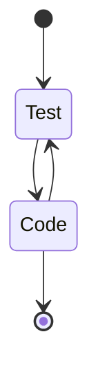

# TDD In Depth

[toc]

---

Chapter 14 introduced us to Jasmine, which was a beast! In this document, some review.

## 14.2. Reverse Function With Tests

### 14.2.1. Using Jasmine

First thing we did was we run some [tests for the `reverse` function](https://repl.it/@launchcode/reverse-Function-With-Tests).

Three files to look at

1. `reverse.js` contains the `reverse` function, which must be exported for use in other files.
2. `spec/reverse.spec.js` containst the test for `reverse`, our `describe` and `it` functions.
3. `index.js` contains the Jasmine code needed to run the tests. This is the file that execues when you hit "Run" in REPL.it.

We just need to run it and have it report `4 specs, 0 failures`.

### 14.2.2. Hello, Jasmine!

The second thing we did, was try out Jasmine with [this project](https://repl.it/@launchcode/Hello-Jasmine-Starter-Code).

### 14.2.2.1. `index.js`

This is what is will look like.

```js
const Jasmine = require('jasmine');
const jasmine = new Jasmine();

jasmine.loadConfig({
   spec_dir: 'spec',
   spec_files: [
      "**/*[sS]pec.js"
   ],
});

jasmine.execute();
```

When you hit "Run", REPL.it will install Jasmine.

But here's what's going on:

1. Lines 1 and 2 import the Jasmine module and create a new Jasmine object `jasmine`.
2. Lines 4 through 9, configure Jasmine to look in the `spec` directory. Any file in this directory ending with `.spec.js` will be assumed to contain test and will be executed by Jasmine.
3. Line 11 triggers Jasmine to find and execute the tests.

### 14.2.2.2. `hello.js`

Here's where well be writing our `hello` function in a new file `hello.js`

```js
function hello(name) {
   if (name === undefined)
      name = "World";

   return "Hello, " + name + "!";
}

module.exports = hello;
```

The last line tells us that `hello` is to be exported.

### 14.2.2.3. `spec/hello.spec.js`

The third file is where the TDD magic happens! We create `spec/hello.spec.js`

We create two test cases:

1. The function is called with a string argument. In this case, a customized greeting should be returned.
2. The function is called with no argument. In this case, the general greeting should be returned.

```js
const hello = require('../hello.js');
const assert = require('assert');

describe("hello",function(){
    // case 1
    it("should return custom message when name is specified", function(){
   		assert.strictEqual(hello("Jasmine"), "Hello, Jasmine!");
	});
    // case 2
    it("should return a general greeting when name is not specified", function(){
     assert.strictEqual(hello(), "Hello, World!");
 	});
});
```

We can now go to `index.js`, hit Run.

Jasmine should return this.

```
Started
..


2 specs, 0 failures
Finished in 0.025 seconds
Randomized with seed 81081 (jasmine --random=true --seed=81081)
```

TWO DOTS! = Good, unless there a situation where [you should only see one dot!](https://www.youtube.com/watch?v=lm2BSWjcYvI)

> "Two dots!? This never needs to be more that ONE DOT!" --Rick Sanchez, "A Rickle in Time", *Rick & Morty* (2015) ..

If any of those dots show an `"F"`, that's bad. It meas something needs to be fixed. A test didn't match the expected results.

### 14.2. in a nutshell

In that first test project with the reverse function, we just needed to run it and have Jasmine show four dots. (Oh why does that keep reminding me of that *Rick and Morty* episode!)

In that second test project, we just need to write our `hello.js` and `spec/hello.spec.js` files and get two dots when Jasmine check.

## 14.3. Unit Testing in Action.

We have three types of **test cases** we get to write:

1. **postivite test cases** where we write tests where things come out with the results we wanted. These test should be `true`.
2. **negative test cases** where we write tests where things don't produce the results we wanted. These test should be `false`.
3. **edge cases** which are psotive test cases, but are at the limits of what a postive test case should be. They should return `true`, but if they are off by just a bit they could become `false`.

### 14.3.2. Setting things up

We're given with a [new version of our palindrome app with testing](https://repl.it/@launchcode/isPalindrome-With-Tests-Starter).

First we have our `palindrome.js` file with an export statement at the bottom.

```js
function reverse(str) {
   return str.split('').reverse().join('');
}

function isPalindrome(str) {
   return reverse(str) === str;
}

module.exports = isPalindrome;
```

The next part we create our `spec/palindrome.spec.js` file.

```js
const isPalindrome = require('../palindrome.js');
const assert = require('assert');

describe("isPalindrome", function(){

   // TODO - write some tests!

});
```

#### 14.3.3.1. Postive cases

Here we add our postive test cases to the spec file.

```js
const isPalindrome = require('../palindrome.js');
const assert = require('assert');

describe("isPalindrome", function(){

   // Positive cases!
    
   it("should return true for a single letter", function(){
      assert.strictEqual(isPalindrome("a"), true);
   });

   it("should return true for a single letter repeated", function(){
      assert.strictEqual(isPalindrome("aaa"), true);
   });

   it("should return true for a simple palindrome", function(){
      assert.strictEqual(isPalindrome("aba"), true);
   });

   it("should return true for a longer palindrome", function(){
      assert.strictEqual(isPalindrome("racecar"), true);
   });

    // TODO: Negative Cases
    // TODO: Edge Cases
});
```

#### 14.3.3.2. Negative Test cases

Next we add some negative cases

```js
const isPalindrome = require('../palindrome.js');
const assert = require('assert');

describe("isPalindrome", function(){

   // Positive cases!
    
   it("should return true for a single letter", function(){
      assert.strictEqual(isPalindrome("a"), true);
   });

   it("should return true for a single letter repeated", function(){
      assert.strictEqual(isPalindrome("aaa"), true);
   });

   it("should return true for a simple palindrome", function(){
      assert.strictEqual(isPalindrome("aba"), true);
   });

   it("should return true for a longer palindrome", function(){
      assert.strictEqual(isPalindrome("racecar"), true);
   });

    // Negative Cases!
    
    it("should return false for a longer non-palindrome", function(){
   		assert.strictEqual(isPalindrome("launchcode"), false);
	});

	it("should return false for a simple non-palindrome", function(){
   		assert.strictEqual(isPalindrome("ab"), false);
	});

	it("should be case-sensitive", function(){
   		assert.strictEqual(isPalindrome("abA"), false);
	});

	it("should consider whitespace", function(){
   		assert.strictEqual(isPalindrome("so many dynamos"), false);
	});
    
    // TODO: Edge Cases
});
```

#### 14.3.4. Edge Cases

Finally, we added an edge case.

```js
const isPalindrome = require('../palindrome.js');
const assert = require('assert');

describe("isPalindrome", function(){

   // Positive cases!
    
   it("should return true for a single letter", function(){
      assert.strictEqual(isPalindrome("a"), true);
   });

   it("should return true for a single letter repeated", function(){
      assert.strictEqual(isPalindrome("aaa"), true);
   });

   it("should return true for a simple palindrome", function(){
      assert.strictEqual(isPalindrome("aba"), true);
   });

   it("should return true for a longer palindrome", function(){
      assert.strictEqual(isPalindrome("racecar"), true);
   });

    // Negative Cases!
    
    it("should return false for a longer non-palindrome", function(){
   		assert.strictEqual(isPalindrome("launchcode"), false);
	});

	it("should return false for a simple non-palindrome", function(){
   		assert.strictEqual(isPalindrome("ab"), false);
	});

	it("should be case-sensitive", function(){
   		assert.strictEqual(isPalindrome("abA"), false);
	});

	it("should consider whitespace", function(){
   		assert.strictEqual(isPalindrome("so many dynamos"), false);
	});
    
    // Edge Cases
    
    it("should consider the empty string a palindrome", function(){
   		assert.strictEqual(isPalindrome(""), true);
	});
});
```

While the book doesn't mention it, you should probably keep your postive, negatve, and edge cases group together like in the above code.

### 14.3. in a nutshell

We just need to write our `spec/palindrome.spec.js` file and know what the three kinds of test cases are.  We should have a test result of `9 specs, 0 failures`.

## 14.4. Test-Driven Development

Having understood how test cases work, we should now have some clue as to what Test-Driven Development (TDD) is all about.

In TDD, we Test first then Code!



Basically, we write tests in our spec file first, then flesh it out with the code in the file.

I know, it sounds like putting the cart before the horse. But the logic is to ask what sorts of things we want to do first then add them.

### 14.4.2. Red-Green-Refactor

The order of testing should should go in the following order:

1. <span style="color:red;">**Red**</span>: Write a failing test! (Negative case!)
2. <span style="color:green;">**Green**</span>: Make it pass by implementing the code. (Positive case!)
3. **Refactor**: Make the code better! Refactor the code. It should work like it did before but better, maybe faster or with more programmer things.

### 14.4. in a nutshell

This one had to be the most confusing. Basically, we're introduced to a new workflow and some instructions on how to make tests and refactor code.

## 14.5. TDD in Action

Here's the big part of the chapter! We're given [some new starter code](https://repl.it/@launchcode/Transmission-processor-TDD-starter)!

I'm going ot head back to the Chapter 14.

> :reminder_ribbon: **TODO**: Make some notes here!

## 14.5. in a nutshell

> :reminder_ribbon: **TODO**: Write a summary of what happened here.