# Jasmine

[toc]

---

## Introduction

**Jasmine** is a simple JavaScript testing framework for browsers and Node.js. In LC101, we will use it for Test Driven Development (TDD).

> :reminder_ribbon: **TODO**: Is Jasmine a way to do [Expect](https://core.tcl-lang.org/expect/index) stuff in JavaScript?

## API

> :construction: **UNDER CONSTRUCTION**: This file is a work in progress. The details will be filled in later.

> :reminder_ribbon: **TODO**: Avoid listing deprecated members, properties, and values.

### Namespaces

#### `async-matchers`

> :lemon: **UNACCEPTABLE!** How the Jasmine programmers got away with using [namespace](https://www.uml-diagrams.org/namespace.html) that has a *dash* in it is ponderous. Mermaid won't accept it, and I can't blame it for being so picky. Who put's a dash in a namespace?!  Because of this, any place in this document that uses `"async-matchers"` will be replaced with `"asyncmatchers"`.

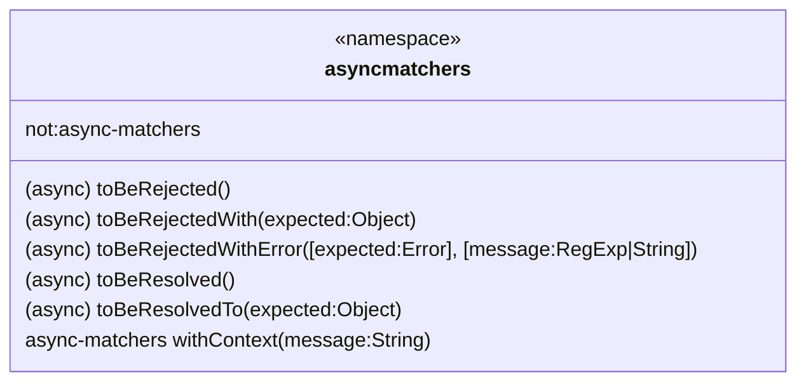

`async-matchers` is a namespace representing asynchronous matchers.

##### Members

###### `not`

`not` inverts the matcher following this `expectAsync`.

```js
/* @variable: not
 * @type: async-matchers
 */
```

##### Methods


#### `jasmine`

> 🧜‍♀️ **MERMAID**: Because Typora hasn't updated their version of mermaid, static members, properties, and methods start with a dollar sign `$` indicating that it should be lead with the class name followed by a do. (e.g. `$sin(x)` means `Math.sin(x)`)
>
> :information_source: **NOTE**: Constant members and properties are generally in all caps with underscores. Launch Code doesn't believe in this, but that's how its been done in C, C++, Java, PHP, and JavaScript.

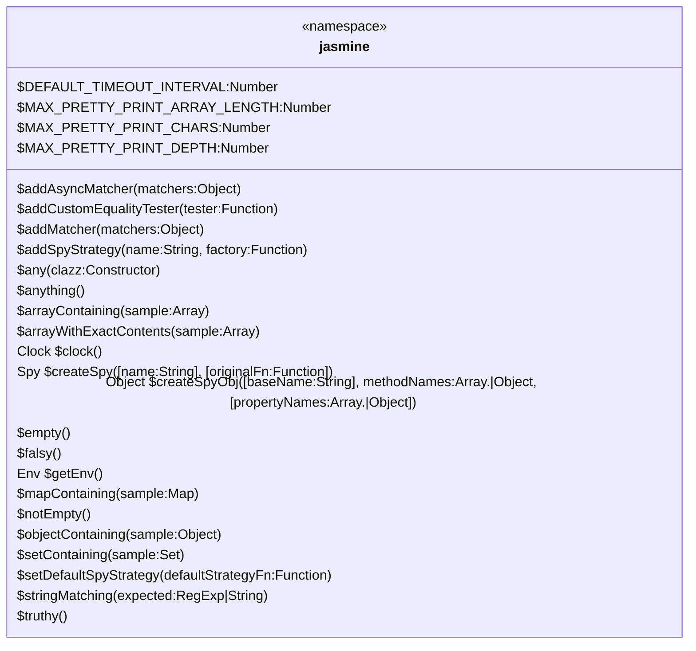

##### Members

##### Methods

#### `matchers`

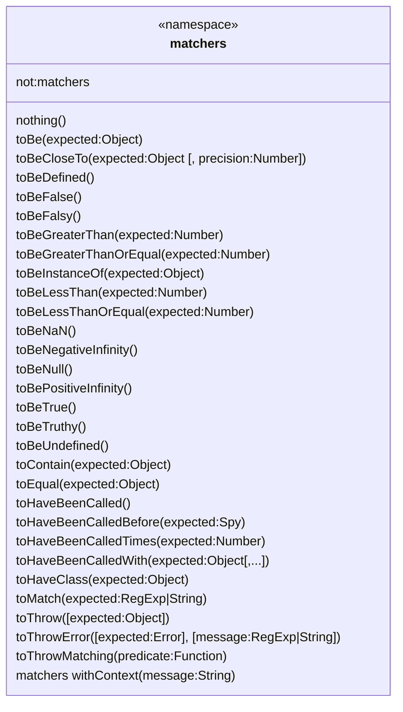

These are the **`matchers`** that come with Jasmine out of the box.

##### Members

##### Members

#### `Spy#calls`

See `Spy` Class.

### Classes

#### `Clock` :stopwatch:

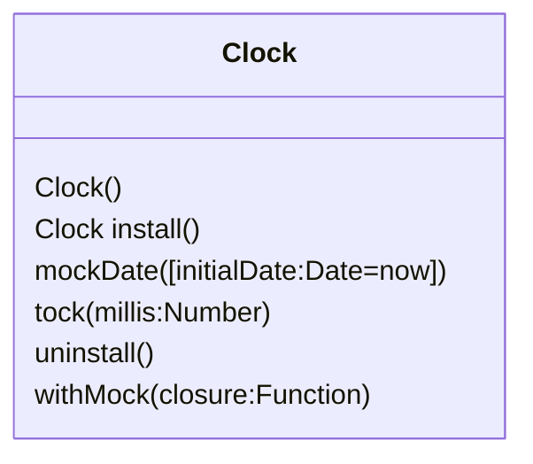

**`Clock()`** is Jasmine's mock clock that is used when testing time dependent code.

##### Constructor

##### Methods

#### `Env` :earth_americas:

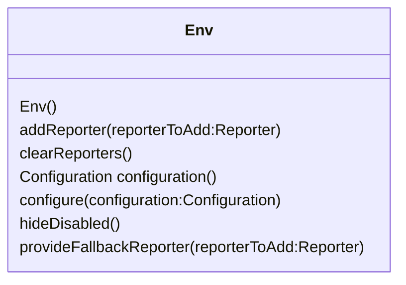

**`Env()`** returns the Jasmine environment.

##### Constructor

##### Methods

##### Deprecated Methods

* `randomizeTests(value:Boolean)` - Use the `random` option with `Env#configure`
* `seed(value:Number)` - Use the `seed` option with `Env#configure`
* `stopOnSpecFailure(value:Boolean)` - Use the `failFast` option with `Env#configure`
* `throwOnExpectationFailure(value:Boolean)` - Use the `oneFailurePerSpec` option with `Env#configure`

> :reminder_ribbon: **TODO**: Probably should put those depircated methods into a a table that points to options in `Env#configure`.

#### `jsApiReporter` :newspaper:

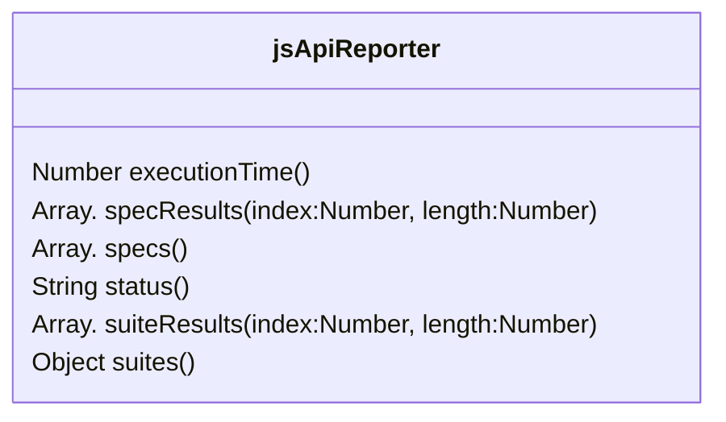

##### Methods


#### `Spy` :detective:

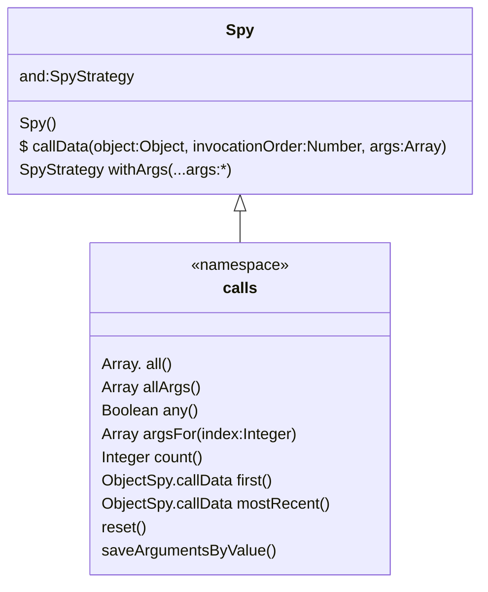

##### Constructor

##### Namespace `calls` Methods

##### Members

##### Methods

### Interfaces

> :reminder_ribbon: **TODO**: How to do I add interface implementations to classes? (That is their purpose, right?)

#### `Configuration` :gear:

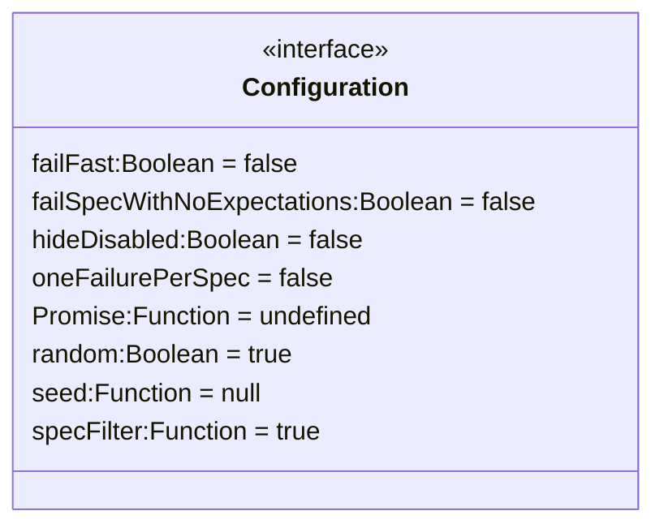

**`Configuration`** represents the available options to configure Jasmine. Options that are not provided will use their default values.

##### Members

* **`failFast`**`:Boolean = false` - Whether to stop execution to the suite after the first spec failure.
* **`failSpecWithNoExpectations`**`:Boolean = false` - Whether to fail the spec if it ran no expectations. By default, a spec that ran on expectations is reported as passed. SEtting this to `true` will report such spec as a falure.
* **`hideDisabled`**`:Boolean = false` - Whether or not reporters should hid disabled specs from their output. Currently only supported by Jasmine's `HTMLReporter`.
* **`oneFailurePerSpec`**`:Boolean = false` - Whether to cause specs to only have one expectation failure.
* **`Promise`**`:Function = false` - Set to provide a custom `Promise` library that Jasmine will use if it need to create a `Promise`. If not set, it will default to whatever global `Promise` library is available (if any).
* **`random`**`:Boolean = true` - Whether to randomize spec execution order.
* **`seed`**`:Function = null` - Seed to use as the basis of randomization. `null` causes the seed to be determined randomly at the start of execution.
* **`specFilter`**`:Function = true` - Function to use to filter specs

#### `Reporter` :newspaper:

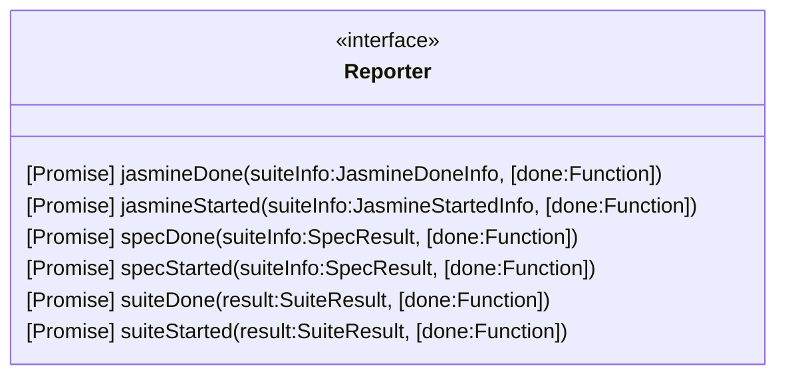

**`Reporter`** represents the available reporter callback for an object passed to `Env#addReporter`.

> :reminder_ribbon: **TODO**: Be sure to look over the article about [custom reporters](https://jasmine.github.io/tutorials/custom_reporter) later.

##### Methods


#### `SpyStrategy` :detective:

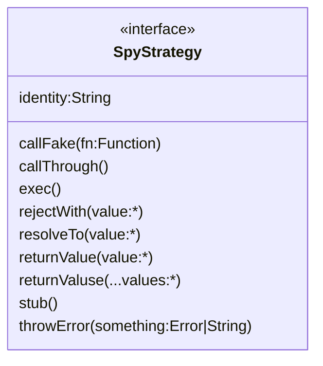

##### Members

##### Methods


### Global

> :reminder_ribbon: **TODO**: Would it be wise to put all my global methods into a class diagram?

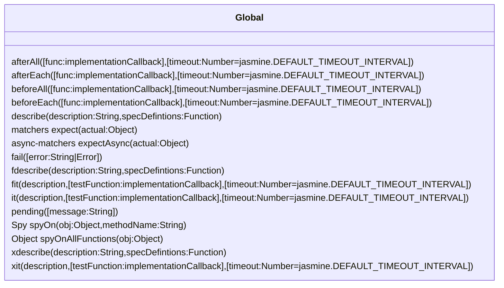


#### Methods

* **`afterAll`**`([func:implementationCallback],[timeout:Number=jasmine.DEFAULT_TIMEOUT_INTERVAL])`
* **`afterEach`**`([func:implementationCallback],[timeout:Number=jasmine.DEFAULT_TIMEOUT_INTERVAL])`
* **`beforeAll`**`([func:implementationCallback],[timeout:Number=jasmine.DEFAULT_TIMEOUT_INTERVAL])`
* **`beforeEach`**`([func:implementationCallback],[timeout:Number=jasmine.DEFAULT_TIMEOUT_INTERVAL])`
* **`describe`**`(description:String,specDefintions:Function)`
* **`expect`**`(actual:Object): matchers`
* **`expectAsync`**`(actual:Object): async-matchers`
* **`fail`**`([error:String|Error])`
* **`fdescribe`**`(description:String,specDefintions:Function)`
* **`fit`**`(description,[testFunction:implementationCallback],[timeout:Number=jasmine.DEFAULT_TIMEOUT_INTERVAL])`
* **`it`**`(description,[testFunction:implementationCallback],[timeout:Number=jasmine.DEFAULT_TIMEOUT_INTERVAL])`
* **`pending`**`([message:String])`
* **`spyOn`**`(obj:Object,methodName:String): Spy`
* **`spyOnAllFunctions`**`(obj:Object) : Object`
* **`xdescribe`**`(description:String,specDefintions:Function)`
* **`xit`**`(description,[testFunction:implementationCallback],[timeout:Number=jasmine.DEFAULT_TIMEOUT_INTERVAL])`


---

## References

[^ jas ]: [Jasmine](https://jasmine.github.io/).
[^ jas-gh ]: Github.com. [Jasmine](https://github.com/jasmine/jasmine).
[^ jas-api ]: Jasmine. Global API. [v3.5](https://jasmine.github.io/api/3.5/global).


---

#Jasmine #NodeJS