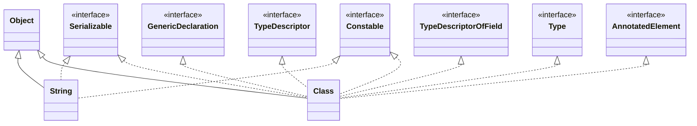
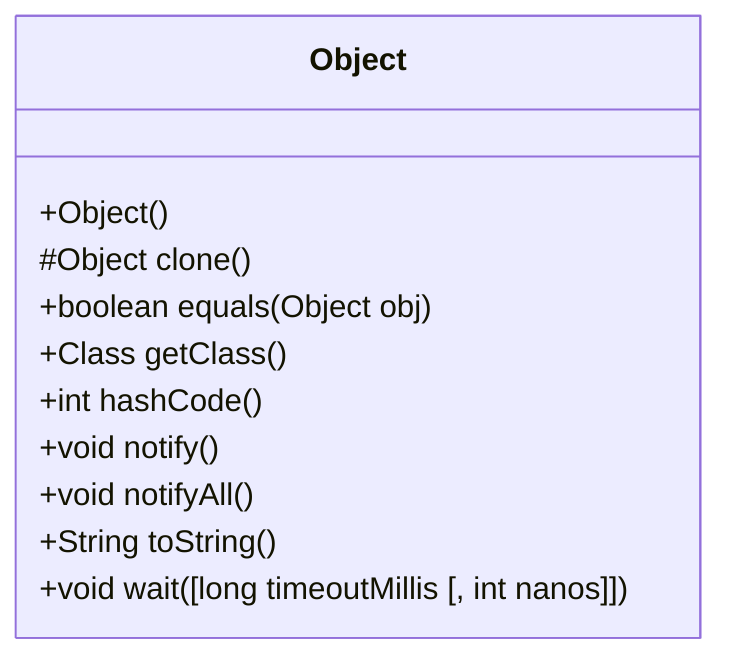
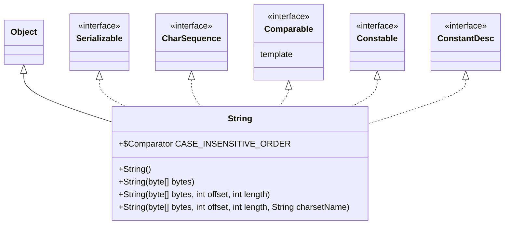

# Java Reference

> :tired_face: **UGH! This is taking too long!** I though about making a Java Reference. It's just too much work for right now.

[toc]

---

## UML Map

## Classes

### Object

### String

