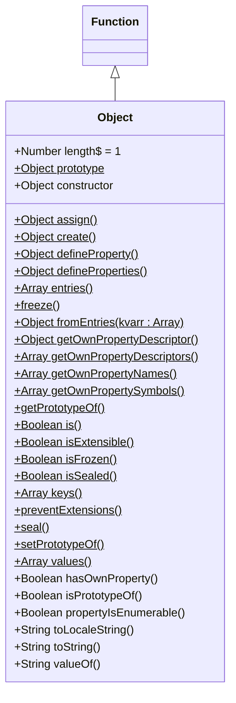

# Object

> :reminder_ribbon: **TODO**: ==Complete this!== It's not done!

The `Object` constructor` creates an object wrapper.

[toc]

---

## Diagram

> :fuelpump: **YMMV**: Depending on what markdown editor you use, you may have mermaid features or not. Mermaid also doesn't have proper UML notation for abstract and static properties and methods. For now, static features (which should be <u>underlined</u>) end with a dollar sign and abstract features (which should be *italic*) end with an asterisk.



---

## Syntax

```js
// Object initializer or literal
{ [ nameValuePair1[, nameValuePair2[, ...nameValuePairN ]]] }

// Called as a constructor
new Object([value])
```

### Parameters

<dl>
    <dt><var>nameValuePair1, nameValuePair2, ...nameValuePairN</var></dt>
    <dd>Pairs of names (strings) and values (any value) where the name is separated by the value by a colon.</dd>
    <dt><var>value</var></dt>
    <dd>Any value</dd>
</dl>

---

## Description

The **`Object` constructor** creates an object wrapper for the given value.

When called in a non-constructor context, `Object` behaves identical to `new Object()`.

---

## Static Properties

<dl>
    <dt><code>Object.length</code></dt>
    <dd>Has a value of <code>1</code>.</dd>
	<dt><code>Object.prototype</code></dt>
    <dd>Allows the addition of properties to all objects of type <code>Object</code>.</dd>
</dl>

---

## Static Methods

<dl>
    <dt><code>Object.assign() : Object</code></dt>
    <dd>Copies the values of all enumerable own properties from one or more source object to a target object.</dd>
	<dt><code>Object.create() : Object</code></dt>
	<dd>Creates a new object with the specified prototype object and properties.</dd>
	<dt><code>Object.defineProperty()</code></dt>
	<dd>Adds the named property described by a given descriptor to an object.</dd>
	<dt><code>Object.defineProperties()</code></dt>
	<dd>Adds the named properties described by the given descriptors to an object.</dd>
	<dt><code>Object.entries(kvobj : Object) : Array</code></dt>
	<dd>Returns an array containing all the <code>[key, value]</code> pairs in a given object's <b>own</b> enumerable string properties.</dd>
	<dt><code>Object.freeze(obj : Object) : Object</code></dt>
	<dd>Freezes an object. Other code cannot delete or change its properties.</dd>
	<dt><code>Object.fromEntries(kvarr : Array) : Object</code></dt>
	<dd>Return a new object from an iterable of <code>[key, value]</code> pairs.(The reverse of <code>Object.entries()</code>.)</dd>
	<dt><code>Object.getOwnPropertyDescriptor()</code></dt>
	<dd>Returns a property descriptor for a named property or an object.</dd>
	<dt><code>Object.getOwnPropertyDescriptors() : Object</code></dt>
	<dd>Returns an object containing all own property descriptors for an object.</dd>
	<dt><code>Object.getOwnPropertyNames() : Array</code></dt>
	<dd>Return an array containing the names of all the given object's <b>own</b> enumerable and nonenumerable properties.</dd>
	<dt><code>Object.getOwnPropertySymbols() : Array</code></dt>
	<dd>Returns an array of all symbol properties found directly upon a given object.</dd>
	<dt><code>Object.getPrototypeOf()</code></dt>
	<dd>Returns the <code>prototype</code> of the specified object.</dd>
	<dt><code>Object.is() : Boolean</code></dt>
    <dd>Compares if two values are the same value. Equates all <code>NaN</code>values (which differ from both Abstract Equality Comparison (<code>==</code>) and Strict Equality comparison (<code>===</code>)).</dd>
	<dt><code>Object.isExtensible() : Boolean</code></dt>
	<dd>Determines if extending of an object is allowed.</dd>
	<dt><code>Object.isFrozen() : Boolean</code></dt>
	<dd>Determines if an object was frozen.</dd>
	<dt><code>Object.isSealed() : Boolean</code></dt>
	<dd>Determines if an object is sealed.</dd>
	<dt><code>Object.keys(kvobj : Object) : Array</code></dt>
	<dd>Returns an array containing the names of all the given object's <b>own</b> enumerable string properties.</dd>
	<dt><code>Object.preventExtensions(obj : Object) : Object</code></dt>
	<dd>Prevents an extensions of an object.</dd>
	<dt><code>Object.seal(obj : Object) : Object</code></dt>
	<dd>Prevents other code from deleting properties of an object.</dd>
	<dt><code>Object.setPrototypeOf()</code></dt>
	<dd>Sets the object's prototype (its internal <code>[[Prototype]]</code> property.)</dd>
	<dt><code>Object.values(kvobj : Object) : Array</code></dt>
    <dd>Returns an array containing the values that correspond to all of a given object's <b>own</b> enumerable string properties.</dd>
</dl>


---

## Instance Properties

<dl>
    <dt><code>Object.prototype.constructor : Object</code></dt>
    <dd>Specifies the function that creates an object's prototype.</dd>
</dl>


---

## Instance Methods

<dl>
    <dt><code>Object.prototype.hasOwnProperty() : Boolean</code></dt>
    <dd>Return a boolean indicating whether an object contains the specified property as a direct property of that object and not inherited through the prototype chain.</dd>
    <dt><code>Object.prototype.isPrototypeOf() : Boolean</code></dt>
    <dd>Returns a boolean indicating whether the object this method is called upon is in the prototype chain of the specified object.</dd>
    <dt><code>Object.prototype.propertyIsEnumerable() : Boolean</code></dt>
    <dd>Return a boolean indicating if the internal ECMAScript <code>[[Enumerable]]</code> attribute is set.</dd>
    <dt><code>Object.prototype.toLocaleString() : String</code></dt>
    <dd>Calls <code>toString()</code></dd>
    <dt><code>Object.prototype.toString() : String</code></dt>
    <dd>Returns a string representation of the object.</dd>
    <dt><code>Object.prototype.valueOf() : String</code></dt>
    <dd>Returns the primitive value of teh specified object.</dd>
</dl>


---

## Special

### Deleting a property from an object

There isn't any method in an `Object` itself to delete its own property (such as `Map.prototype.delete()`). To do so, one must use the `delete` operator.

> :reminder_ribbon: **TODO:** How?

---

## Examples

### Using `Object` given `undefined` or `null` types.

The following examples store an empty `Object` object in `o`:

```js
let o = new Object();
let o = new Object(undefined);
let o = new Object(null);
```

### Using `Object` to create `Boolean` objects.

The following examples store `Boolean` objects in `o`:

```js
let o = new Object(true);		// equivalent to o = new Boolean(true);
let o = new Object(Boolean());	// equivalent to o = new Boolean(false);
```

---

## References

[^mdn-object]: MDN Web Docs. [Object - JavaScript](https://developer.mozilla.org/en-US/docs/Web/JavaScript/Reference/Global_Objects/Object).
[^mdn-object-init]: MDN Web Docs. [Object initializer](https://developer.mozilla.org/en-US/docs/Web/JavaScript/Reference/Operators/Object_initializer).

