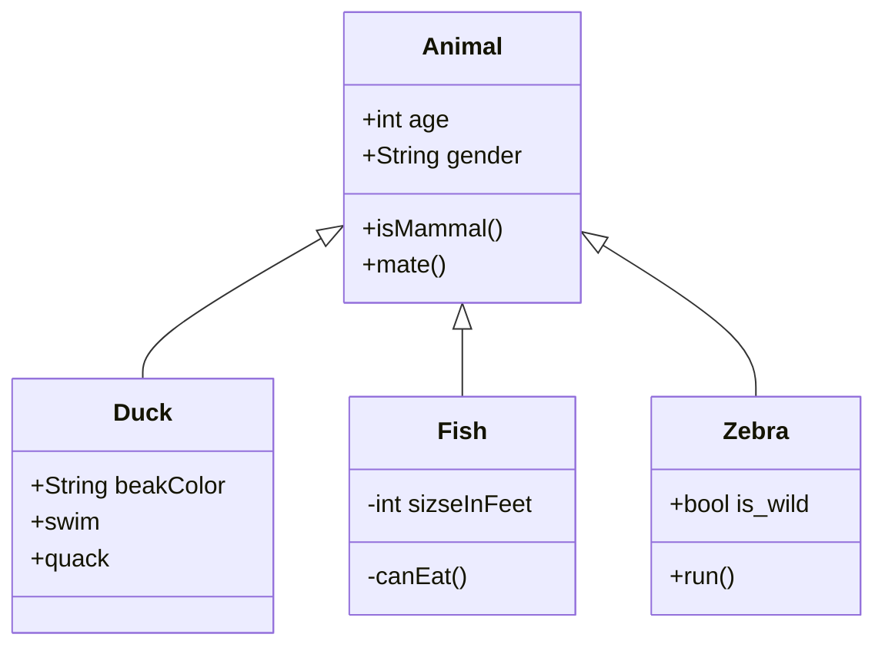

# Typora Markdown Guide

[toc]

---

> :information_source: **NOTE:** For your conveinence, I've included the possible *regular expressions* (RE) which trigger markdown changes.

## Headers

Headers are defined when a series of octothorpes ("pound signs") are the first characters of a line, followed by space and the string of characters. (RE: `^#{1-6} .+`) 

## Lists

**Lists** are a special type of block element that can be broken down into items. Some lists can be enumerated while others can be converted into task-action lists. In this section we'll go over the various types of list. Lists can be nested.

* **Unordred lists** ("bulleted lists") are made when the first character is an asterisk or hyphen followed by a space. 
* In HTML, unordered lists are created with the `<ul>` element with list items created using the `<li>` elements.
*  (RE: `^[-\*] .+`)

1. **Ordered Lists** ("numbered lists") are made when the first character(s) are numbers, followed by a period. 
2. In HTML, ordered lists are created with the `<ol>` element with list items created using the `<li>` elements.
3. Orderd lists are automatically number starting with `1.`, but you can start number in typoria with other numbers so as long as the number is an integer.
4. (RE: `^[1-9][0-9]*. .+`)

- [ ] **Task List** (Checkboxes) are made when a bulleted list followed by a set of square brackets (`[]`) or square brackets with an `x` inside.
- [ ] There is no HTML element that creates a task list. (Though fingers crossed if it becomes something if the W3C comes out with HTML6.)
- [ ] The closes thing to mkaing a task list in HTML would be an Unordered list with an `<input type="checkbox">` which to check the check box add `checked` as an attribute to the `<input>` element. CSS could probably hide the bullet icon.
- [x]  (RE: `^[-\*] \[x?\] .+`)

Currently, Typoria doesn't support **defintion lists** via the [extended markdown syntax](https://www.markdownguide.org/extended-syntax/). (Probably should let the deveopers know.)

If it did, this is what the syntax to use it would look like

```md
First Term
: This is the defintion of the first term.

Second Term
: This is one defintion of the second term.
: This is another defintion.
```

More than likely, you'll need to use the HTML syntax which looks like this.

```html
<dl>
    <dt>First Term</dt>
    <dd>This is the defintion of the first term.</dd>
    <dt>Second Term</dt>
    <dd>This is one defintion of the second term.</dd>
    <dd>This is another defintion.</dd>
</dl>
```

The output should be

<dl>
    <dt>First Term</dt>
    <dd>This is the defintion of the first term.</dd>
    <dt>Second Term</dt>
    <dd>This is one defintion of the second term.</dd>
    <dd>This is another defintion.</dd>
</dl>

> :information_source: **NOTE:** As you can see from the example, this creates an embedded code block! We'll talk more about code blocks later!

### Outlining

You'll need to *manually* number your outline lists with headers. You can't indent your headers in Markdown. If you want indented headers, consider using Microsoft Word and have fun removing all your indentations afterwards.

### Nesting

Lists can be nested. You'll see this throughout this document so there is no need to demonstrate.  Nesting can be done by using a `Tab` to  increase the indentation and `Shift+Tab` to decrease the indentation.

## Inline Styles

**Inline Styles** (or "span elements") are styles that can be embedded into text.

* *Italic Text* starts and ends with one asterisk on each side of a string. (RE: `*.+*`) You can also use `Ctrl+I` on selected text.
  * _Italic text_ can also be triggered with a single set of underscores. (RE: `_.+_`) but I like using the asterisks.
* **Bold Text** starts and ends with two asterisks on each side of a string. (RE: `**.+**`) You can also use `Ctrl+B` on selected text.
  * __Bold text__ can also be triggered with a double set of underscores. (RE: `__.+__`). Again, I prefere asterisks.
* ***Bold and Italic Text*** starts and ends with three asterisks. (RE: `***.+***`)
  * Bold and Italic working together is interesting. Here are a few examples.
    * *Italic outside of **Bold*** (`*Italic outside of **Bold***`)
    * **Bold outside of *Italic*** (`**Bold outside of *Italic***`)
    * *Italic then***Bold** (`*Italic then***Bold**`)
  * Triple underscore
* `monospace`, which is used for code, starts and ends with a backtick (RE: `\x60.+\x60`)
* ~~Strike-through~~ starts and end with two tildes (RE: `~~.+~~`) 
* :smile: Emojis are supported. Most start and end with colons (RE: `:.+:`)
* [Hyperlinks](https://www.jrcharney.com/) can also be used to link to other documents and websites. (RE: `\[.+\](.+)`) ( :reminder_ribbon: **TODO:**​ Probably should have a separate section for this.)
  * You can easly create hyperlinks by copying a URL in your browser. selecting text, then use `Ctrl+K` to paste the URL while putting the text and the URL into Hyperlink syntax.
  * If you just paste the URL without selecting any text, the URL will be pasted and be clickable.
  * You can also add a **title attribute** by adding a space and a string in double quotes.
    * `[I'm *entitled* to an example](https://www.example.com/ "No You aren't!")`
    * [I'm *entitled* to an example](https://www.example.com/ "No you aren't!") 
  * Internal links can be set setting the link to a header.
    * `[Jump up to Inline Styles header](##Inline Styles)` (Don't forget the octothorpes!)
    * [Jump up to Inline Styles header](##Inline Styles)
  * **Reference links** use a second set of square brackets, inside which you place a label to identify the link.
    * `[Here is an example][test-ref]`
    * [Here is an example][test-ref] (Don't forget to add the protocol if it is an external link!)
    * Meanwhile, elsewhere in the document there should be a line starting with `[test-ref]: https://www.example/ "Optional Title String"`. Putting that near the Works Cited would be ideal, but maybe in a secondary section.
    * Think of reference links as links where you can stick the link and optional title string somewhere else, sort of like an alias.
    * **Implicit link names**, can have the double brackets, but the second set is empty because the first set acts as both the link text and the label. Such as `[Google][]` can point to a reference starting with `[Google]: https://www.google.com/`.
    * **Implicit links** can be useful if you are trying to wikify your markdown documents to other documents. You just need to omit the protocol in the reference link or define the protocol you want to use with the *YAML Front Mater* in the reference link.
  * **Explict URLs** are automatically parsed, but some folks will still encapsulate them in *angle braces* (a.k.a. less than and greater than) `<https://www.google.com/>` still shows up as https://www.google.com/. You'll probably figure this out when creating reference links or [footnotes](###Footnotes).
* Images - If you want to add images, you probably should create an image directory.
  * ``
  * ``
* Some features will need to be enabled by going to the `Preference` Panel then scroll down the the `Markdown` Tab.
  * $\text{Inline LaTeX}$, which is used for science and math formulas, start and end with dollar signs (RE: `\$.+\$`)
    * :information_source: NOTE: If you enable inline Latex, be sure to escape your dollar signs if you are using currency in an object where you don't want LaTeX to parse. You can do this by adding a backslash before the dollar sign `\$` like so.
  * Super^script^ should work by enclosing text in carots.
  * Sub~script~ should work by enclusing text in a single pair of tidles.
  * ==Highlighted text== start and end with two equal signs (RE: `==.+==`)

### Things that need HTML to happen

* <u>Underline</u> - `<u>Underline</u>`
* Super<sup>script</sup> - `<sup>script</sup>` (Ideal if the `^carot^` pairs don't work.)
* Sub<sub>script</sub> - `<sub>script</sub>` (Idea if the `~tilde~` pairs don't work.)

## Block Elements

### Paragraphs and Line Breaks

The most frequent text you may generator without even noticing it are **paragraphs**. Generally, these go into a `<p>` element in HTML, but most markdown generators make them on their own.

One thing you may notice is that gap between this paragraph and the previous one. That because the previous paragraph has closed and a new one was created. Whatsmore, a **line break** (`<br>` in HTML) has also been inserted.
We can avoid inserting the line break by using `Shift + Enter`, like what I just did to between the previous paragraph and this new one that I just created.

However, I prefer to have my paragraphs spaced.

Some people don't like it when people do that. They call such spacing "Reddit Spacing" because it's how the website Reddit formats paragraphs. However, it is much more logical to have such spacing such that your readers can take in the paragraphs one at a time rather than having all your text look like one big paragraph and have people call something you want to write long about "a rant".

### Table of Contents (`[toc]`)

More than likely a Typoria feature, if you add `[toc]` to your document, a Table of Contents outline will be generated from the headers. However, the headers will not be automatically numbered. You still have to do that manually.

I recommend using it after the first `<h1>` header which is often used as the title of the document.

### Horizontal Rule (`---`)

A **Horizontal Rule** (`<hr>` in HTML) is a lot like a line break (`<br>`) except visually. There is a horizontal line separating parts of a document.

There is a time an a place to use a Horizontal Rule in a document. The three more than likely places I can think of are following the `[toc]`, before the hash tags (which should be at the bottom of the document like Wikipedia does), and before a Works Cited/Sources section.

Horizontal rules can be generated with three consecutive asterisks or dashes. I prefere to use the dashes. (RE: `^---$`)

### Blockquotes

> Blockquotes start with a greater-than symbol followed by a space, much like how email uses them. 
>
> (RE: `> .+`)
>
> > Blockquotes can be nested, but it can get frustrating doing this. It's better to use them for notices.

### Code Blocks

**Code Blocks** (or "fenced code") is a block of `monospaced` code with formatting. In HTML, they are generally put into a `<pre>` element. But unlike straight HTML, the markdown editor offers features like code formatting and line numbering as well as creating diagrams from certain coding languages.

```python
"""
Code blocks generally start and end with three backticks.
In some markdown editors, you can tell the editor how to highlight 
by telling what language you are writing in at the starting
three backticks.
"""
```

```js
console.log("You can use plenty of languages and in the same document if you like.");
/**
 * Block Comments can be used in code examples.
 */
```

```bash
#!/bin/bash
string="You can also use" # Inline comments depening on the language
```

#### Code Block Diagrams

> :reminder_ribbon: **TODO**: Create a mermaid.js Guide and probably a Graphviz guide or Mermaid guide.

Some codeblocks can be used to generate diagrams. To enable this feature you need to go to the `Preference` Panel, the scroll down the the `Markdown` Tab/Section.

* [js-sequence](https://bramp.github.io/js-sequence-diagrams/) can be used to generate Sequence Diagrams.
* [flowchart.js](http://flowchart.js.org/) can be used to generate Flowcharts, and is probably the closest you will get to using something similar to [Graphviz](https://www.graphviz.org/). A guide should be developed for this later.
* [mermaid.js](https://mermaid-js.github.io/) can be used to generate Flowcharts, Sequence Diagrams, Class Diagrams, State Diagrams, Gantt Charts, and Pie Charts. The only downside is that it relies on [d3.js](https://d3js.org/) which is just one more dependency. Also I'm not a fan of some of their long-winded syntax. Still a guide should be developed for this later. It's also the most effective.




### LaTeX Blocks

> :information_source: For more info on what LaTeX code you can use in Typora, see my [LaTeX Guide][].

**LaTeX Blocks** (or "math blocks") are a special kind of code block. Much like how we showed how we can generate diagrams from some code block languages, LaTeX blocks allows us to generate mathematical and scientific forumulas in a language called LaTeX (pronounce "LAY-TECH").
$$
\begin{aligned}
y &= mx + b & & \text{LaTeX blocks allow you to use LaTeX for math formulas.} \\
\bold{I} &= \begin{bmatrix}1 & 0 \\ 0 & 1\end{bmatrix} & & \text{A LaTeX guide is provided for your covenience.} \\
(\bold{A}|\bold{I}) &= \left[\begin{array}{ccc|ccc}
a_{0,0} & a_{0,1} & a_{0,2} & 1 & 0 & 0 \\
a_{1,0} & a_{1,1} & a_{1,2} & 0 & 1 & 0 \\
a_{2,0} & a_{2,1} & a_{2,2} & 0 & 0 & 1
\end{array}\right] & & \boxed{\text{LaTeX is a powerful tool to have to demonstrate math}}
\end{aligned}
$$

#### Chemical Expressions

Because Typora uses [MathJax](https://www.mathjax.org/) for LaTeX support, it has built in **[mhchem](https://mhchem.org/) extension** support which allow for **chemical expressions**.[^ce]

#### Custom TeX Commands

Typora does support custom TeX commands using `\def` or `\newcommand`. `\newenvironment` is also supported. I forget what I did with the link to Stack Exchange that had some example for it.

I *was* going to use the MathJax documentation to generate a list of supported LaTeX command, but that link is 404. On the other hand, you should probably read my [LaTeX Gude][] for all the LaTeX stuff.

#### TeX Reference Support

Typora supports TeX style refereces using `\label` and `\ref` macros.

```md
$$
x+1\over\sqrt{1-x^2}\label{ref1}
$$

This is a reference $\ref{ref1}$
```

I haven't really found a use for that yet, but I'm sure it will be by someone. Try using it like a reference or footnote.

#### Auto Numbering Math Equations

Some professors will likely want you to number your equations, but since I'm a casual math nerd, I usually leave this feature off. But if you need it, go to the Preferences panel and under the "Markdown" section, enable "Auto Numbering Math Equations".

### Footnotes

**Footnotes** are internal hyperlinks to works cited throughout your document.[^test]

Footnotes work slightly different from [references](##Inline Styles). Namely because footnotes allow you to create those super scripts with `[^label]`, which must have a corresponding line, prefereibly in a [Sources](##Sources) section that starts with `[^label]: Cited Source Information`, while a reference must have a corresponding line that starts with `[label]: some.url "and optional title text"`.

One thing you will still need to do, if you are going to submit a report is cite your references. That's the one thing Footnotes can't do.

> :reminder_ribbon: **TODO**: Provide links to citation resources.

### Tables

**Tables** are probably the most frustrating parts about markdown. In that they have to be spaced just right in some editors or they will become a convoluted mess.

```md
| Show | Tenure | Creator | Network |
| ---- | ------ | ------- | ------- |
| Steven Universe | 2013-2019 | Rebecca Sugar | Cartoon Network |
| Gravity Falls | 2012-2016 | Alex Hirsch | Disney Channel |
```

| Show            | Tenure    | Creator       | Network         |
| --------------- | --------- | ------------- | --------------- |
| Steven Universe | 2013-2019 | Rebecca Sugar | Cartoon Network |
| Gravity Falls   | 2012-2016 | Alex Hirsch   | Disney Channel  |

That doesn't look so bad, right?

Oh sure, maybe in this example. Of which the ouput from the markdown table generator produces a resonable set of source code.

```md
| Show            | Tenure    | Creator       | Network         |
| --------------- | --------- | ------------- | --------------- |
| Steven Universe | 2013-2019 | Rebecca Sugar | Cartoon Network |
| Gravity Falls   | 2012-2016 | Alex Hirsch   | Disney Channel  |
```

The problem is when things get more complicated, or if you add inline markdown to items, espcially if you want to use LaTeX.

| Symbol                          | Meaning                         |                                                        Notes |                       Find your center                       |
| ------------------------------- | :------------------------------ | -----------------------------------------------------------: | :----------------------------------------------------------: |
| $\pi$                           | 3.14159                         |                                                              |                   What if I don't want to?                   |
| *Steven Universe: Future*       | Epilogue to *Steven Universe*   | Creator Rebecca Sugar shows what life is like for Steven as a teenager. | This entire column is center aligned, whether you like certain cells to be or not. |
| $\int \frac{dx}{x} = \ln x + C$ | `\int \frac{dx}{x} = \ln x + C` |                                                              |                                                              |
| $3.50                           | The Lochness Monster            | **I ain't giving you no *three-fiddy*! <u>Go away</u>, you Lochness Monster!** |                                                              |

Here we see the source code looks a little more janky.

```md
| Symbol                          | Meaning                         |                                                        Notes |                       Find your center                       |
| ------------------------------- | :------------------------------ | -----------------------------------------------------------: | :----------------------------------------------------------: |
| $\pi$                           | 3.14159                         |                                                              |                   What if I don't want to?                   |
| *Steven Universe: Future*       | Epilogue to *Steven Universe*   | Creator Rebecca Sugar shows what life is like for Steven as a teenager. | This entire column is center aligned, whether you like certain cells to be or not. |
| $\int \frac{dx}{x} = \ln x + C$ | `\int \frac{dx}{x} = \ln x + C` |                                                              |                                                              |
| $3.50                           | The Lochness Monster            | **I ain't giving you no *three-fiddy*! <u>Go away</u>, you Lochness Monster!** |                                                              |
```

There are spaced added even if we leave cells blank!

> :information_source: **NOTE:** If you use the Markdown table generator to create tables, every cell in that column will be aligned in that format.  Another thing you may notice is that some themes in some editors will also alternate the background colors for rows.

My suggestion: **Create tables with HTML.** Because sometimes What You See Is What You DON'T WANT.

```html
<table>
    <tr>
        <th>Show</th>
        <th>Tenure</th>
        <th>Creator</th>
        <th>Network</th>
    </tr>
    <tr>
        <td>Steven Universe</td>
        <td>2013-2019</td>
        <td>Rebecca Sugar</td>
        <td>Cartoon Network</td>
    </tr>
    <tr>
        <td>Gravity Falls</td>
        <td>2012-2016</td>
        <td>Alex Hirsch</td>
        <td>Disney Channel</td>
    </tr>
</table>
```

<table>
        <tr>
        <th>Show</th>
        <th>Tenure</th>
        <th>Creator</th>
        <th>Network</th>
    </tr>
    <tr>
        <td>Steven Universe</td>
        <td>2013-2019</td>
        <td>Rebecca Sugar</td>
        <td>Cartoon Network</td>
    </tr>
    <tr>
        <td>Gravity Falls</td>
        <td>2012-2016</td>
        <td>Alex Hirsch</td>
        <td>Disney Channel</td>
    </tr>
</table>

### YAML Front Matter

A feature used by Typora borrowed from [Jekyll](https://jekyllrb.com/) and used on sites like [Dev.to](https://dev.to/) is **YAML Front Matter**.[^jfm]

In Jekyll, any files that contains a YAML Front Matter block is processed by Jekyll as a special file. The Front matter must be the first thing in the file and must take the form of valid [YAML](https://yaml.org/ "YAML Ain't Markup Language") set between triple-dashed lines.

Basically, YAML Front Matter is like adding Meta tags to an HTML file header. (BTW: you should use Meta tags in your HTML code, no matter what some people think. That is how search engines find your website!)

Alternatively, you can insert a metadata block from the top menu of Typora.

## HTML for everything else

You can use HTML to style content when there are things that Markdown doesn't support, or if you just want to be more literal when you write things.

For instance, you can use `==double equals for highlighting==` to get ==double equals for highlighting==, but if you don't want to use the default (yellow) for the default highlighting color, you could always use `<span style="background-color:magenta;color:black;">magenta as a hightlighter</span>` and get <span style="background-color:magenta;color:black;">magenta as a hightlighter</span> instead.

For video elements (where you have a local video file), you can use `<video src="keyboard_cat.mp4">` to embed a video.

Embedded content with `<iframe>` can be hit or miss especially if [cross-site scripting](https://developer.mozilla.org/en-US/docs/Glossary/Cross-site_scripting) (XSS) or [Cross-Origin Resource Sharing](https://developer.mozilla.org/en-US/docs/Web/HTTP/CORS) (CORS) are disabled.  Still, if you want to know more about `<iframe>`, consider reading up about it on [W3Schools.com](https://www.w3schools.com/tags/tag_iframe.asp) or [Mozilla Developer Network (MDN) Web Docs](https://developer.mozilla.org/en-US/docs/Web/HTML/Element/iframe).

## Things that are not available

* #HashTags They typically are used for keyword searches. (RE: `#[A-Za-z][0-9A-Za-z]*`) 
  * Acutually, some mark down editors don't support the hashtag feature. :cry:
  * Also the use of Mentions using @SomeBody is also not available in some Markdown Editors.
  * Even though this feature is not available in some editors, you should use them anyway for organization. YMMV

## Things I haven't tried yet

There are a few things in this documentation that I haven't done yet and I have a feeling they might not work. Still, I should try later.

* Making drawing with HTML5 Canvas (Probably not likely)
* Making drawing with SVG (Probably not likely)
* Making drawing with ghostscript/postscript (Defintely unlikely)

---

## Sources

> Note: I've included some resources that may be useful.

[^test]: Here's an example of a footnote!

[test-ref]: https://www.example.com "Here's an example of a reference link."

[^typora-math]: Typora.io - [Math and Academic Functions](https://support.typora.io/Math/).
[^ typora-draw ]: Typora.io - [Draw Diagrams with Markdown](https://support.typora.io/Draw-Diagrams-With-Markdown/).
[^ typora-md ]: Typora.io - [Markdown Reference](https://support.typora.io/Markdown-Reference/).
[^ ce ]: [mhchem for MathJax](https://mhchem.github.io/MathJax-mhchem/).

[^ jfm ] : Jekyll - [Front Matter](https://jekyllrb.com/docs/front-matter/).

[^ md ]: Daring Fireball - Markdown - [Syntax](https://daringfireball.net/projects/markdown/syntax).
[^ gfs ]: GitHub Help - [Basic Writing and formatting syntax](https://help.github.com/en/github/writing-on-github/basic-writing-and-formatting-syntax) - GitHub Flavored Syntax.
[^ mdg ]: Markdown Guide - [Extended Syntax](https://www.markdownguide.org/extended-syntax/).
[^ tg ]: [Tables Generator](https://www.tablesgenerator.com/) - use this site to generate tables in LaTeX, HTML, Text, Markdown, or MediaWiki.
[^ ascii ]: ASCII-Table.com - [ASCI Character Set](http://ascii-table.com/ascii.php) - provides a list of ascii characters. (Note: You can also get this information on Linux using `man ascii`).
[^ mdn ]: [Mozilla Developer Network (MDN) Web Docs](https://developer.mozilla.org/).
[^ w3s ]: [W3Schools.com](https://www.w3schools.com/).
[^ csst ]: [CSS-Tricks](https://css-tricks.com/).
[^ ciu ]: [CanIUse.com](https://caniuse.com/).

[LaTeX Guide]: LaTeX%20Guide.md "LaTeX Guide"

---

#Markdown #Guides

