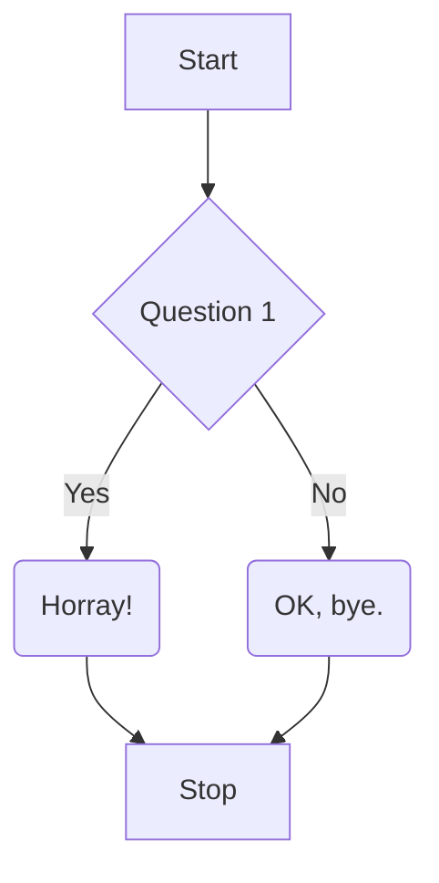
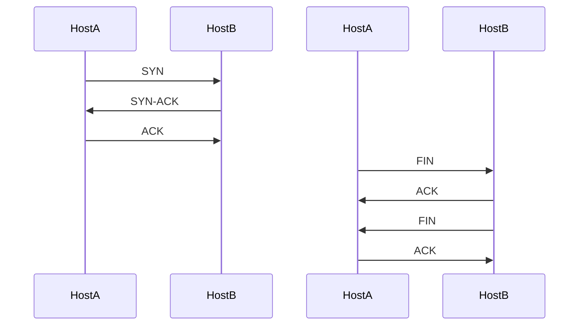

# 🧜‍♀️ Mermaid

[toc]

---

## What is Mermaid?

Mermaid is a way to render diagrams including Flowcharts, Sequence Diagrams, State Diagrams, Class Diagrams, Gantt Charts, and Pie Charts in Markdown editors like Typora and Zettlr. In all honestly, this should be part of Github Flavored Markdown.

## What is UML?

**UML** or **Unified Modeling Language** is a standard for rendering Flowcharts, Sequence Diagrams, State Diagrams, Class Diagrams, and Gantt Charts used as part of software development. Generally, these are used organize data and how a program should be planned.

### Flow Charts

A **flow chart** shows the logical sequence of steps that a process follows. You'll see a lot of these in my notes. They are useful for describing logical structures as well as for decision making.

> :large_orange_diamond: **DECISIONS** : One of the biggest problems with Flow Charts is how programs processs them. If you write a long question, there will be a rediculously large diamon occuping the diagram. So It might be better to make your flow charts with a list decribing the questions outside of the flow chart.


* Question 1 = "Do you want to build a snowman?"




See this [link](https://mermaid-js.github.io/mermaid/#/flowchart).

### Sequence Diagram

A **sequence diagram** is an interaction diagram that shows how processes operate with one another and in what order.




See this [link](https://mermaid-js.github.io/mermaid/#/sequenceDiagram).

### Class Diagram

Probably the most important type of diagram you will see throughout my documentation, a **class diagram**, describes the structure of a system by showing the system's classes, their attributes, operations (or methods), and their relationships among objects.

Class diagrams are the main building blocks of object-oriented mondeling. It is used for general conceptual modeling of the structure of the application, and for the detailed modeling translating the models into programming code. Class diagrams can also be used for data modeling. (For example, class diagrams can be used for modeling SQL databases as an alternative to Entity-Relationship diagrams). The classes in a class diagram represent both the main elements, interactions in the application, and the classes to be programmed.

> :reminder_ribbon: **TODO**: Put an example diagram here.


> 🧜‍♀️ **Mermaid Quirk**: Some of the property attributes that are in Mermaid are not in Typora. There's been a push to get Typora as well as the developer of Zettlr to implement mermaid and with these standard features which are part of the UML standard.

See this [link](https://mermaid-js.github.io/mermaid/#/classDiagram) for futher developments.

### State Diagram

> :reminder_ribbon: **TODO**: This section is missing a lot of things.

See this [link](https://mermaid-js.github.io/mermaid/#/stateDiagram).

### Gantt Chart

A **Gantt Chart** is a type of bar chart first developed in 1896 by Karo Adamiecki in 1896, and independently by Henry Gantt in the 1910s, that illustrate a project schedule. Gantt charts illustrate the start and finish dates of the terminal elements and summary elements of a project.

#### Example

> :reminder_ribbon: **TODO**: OK, I think I worked too hard on this  example. Perhaps I should try this on another page. 🤪

```mermaid
gantt
	title Launch Code LC101
	dateFormat YYYY-MM-DD
	section Classes
		Class 1					:done des1, 2020-01-23,2020-01-23
	section Reading
		Chapters 1 through 3	:done des2, 2020-01-16
	section Exercises
	section Quizes
	section Studios
	section Assignments
```


#### Syntax

[Read this](https://mermaid-js.github.io/mermaid/#/gantt), try to better organzie it.

---

## References

[^ mjs ]: [Mermaid.js](https://mermaidjs.github.io/)
[^ mjs-le ]: Mermaid.js [LIve Editor](https://mermaidjs.github.io/mermaid-live-editor/)

