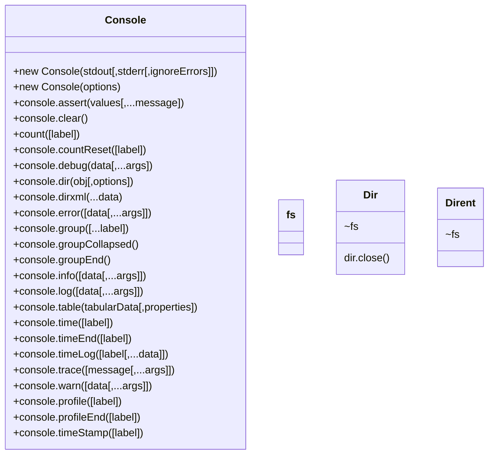

# Node.js Reference

[toc]

---

> :construction: **UNDER CONSTRUCTION**: This page is a work in progress.

## Introduction

Node.js is a [insert description here]

> :reminder_ribbon: **TODO**: Datatypes will be added TypeScript style.

## Packages and Classes

---

## :reminder_ribbon: TODO

* [ ] Assertion Testing
* [ ] Async Hooks
* [ ] Buffer
* [ ] C++ Addons
* [ ] C/C++ Addons with N-API
* [ ] Child Processes
* [ ] Cluster
* [ ] Command Line Options
* [ ] Console
  * [x] Diagrammed
  * [ ] Documented
* [ ] Crypto
* [ ] Debugger
* [ ] Depricated APIs (probably should exclude this)
* [ ] DNS
* [ ] Domain
* [ ] ECMAScript Modules
* [ ] Errors
* [ ] Events
* [ ] File System
* [ ] HTTP
* [ ] HTTP/2
* [ ] HTTPS
* [ ] Inspector
* [ ] Internationalization
* [ ] Modules
* [ ] Net
* [ ] OS
* [ ] Path
* [ ] Performance Hooks
* [ ] Policies
* [ ] Process
* [ ] Punycode
* [ ] Query Strings
* [ ] Readline (VERY IMPORTANT!)
* [ ] REPL
* [ ] Report
* [ ] Stream
* [ ] String Decoder
* [ ] Timers
* [ ] TLS/SSL
* [ ] Trace Events
* [ ] TTY
* [ ] UDP/Datagram
* [ ] URL
* [ ] Utilities
* [ ] V8
* [ ] VM
* [ ] Worker Threads
* [ ] Zlib

---

## References

> :reminder_ribbon: **TODO**: Add references. Reference lines start with `[^ initials ]: `

[^ njs-api ]: Node.js Documentation. [v12.15.0](https://nodejs.org/dist/latest-v12.x/docs/api/)

---

#NodeJS #References