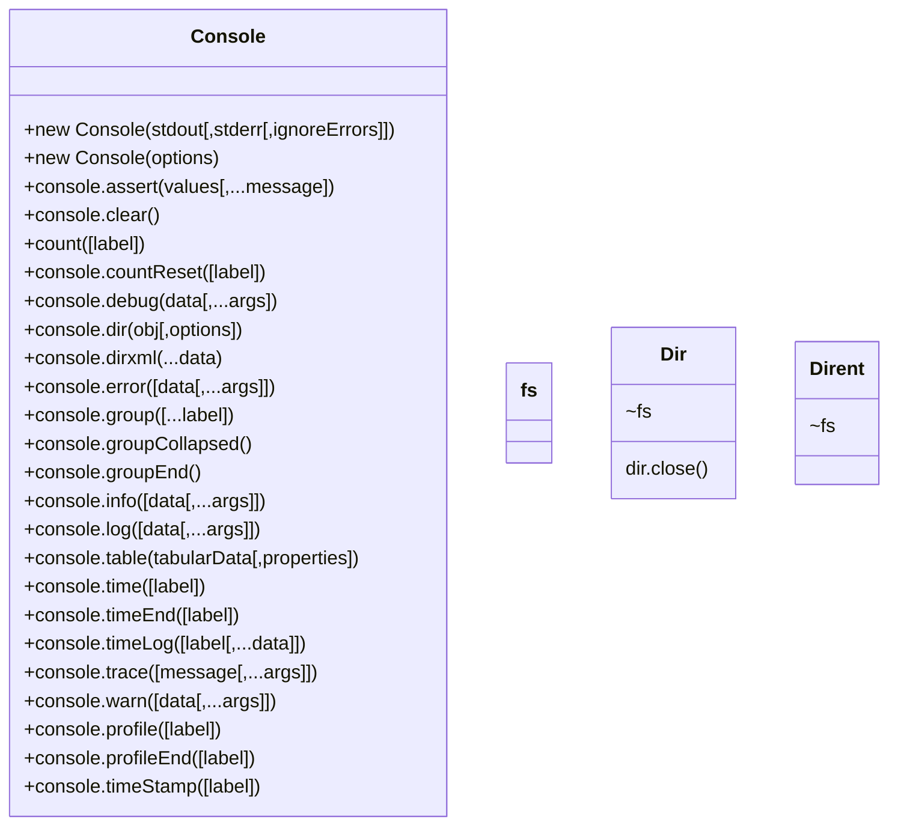

# Node.js Reference

> :construction: **UNDER CONSTRUCTION**: This page is a work in progress.

[toc]

---

## Introduction

Node.js is a JavaScript runtime environment built on Chrome's V8 JavaScript engine.

> :reminder_ribbon: **TODO**: Datatypes will be added TypeScript style.

---

## :reminder_ribbon: TODO

> :information_source: **NOTE**: This list is not part of the documentation. It is a check list for things to take care of to complete it. Eventually this will be removed.

* [ ] Assertion Testing
* [ ] Async Hooks
* [ ] Buffer
* [ ] C++ Addons
* [ ] C/C++ Addons with N-API
* [ ] Child Processes
* [ ] Cluster
* [ ] Command Line Options
* [ ] Console
  * [x] Diagrammed
  * [ ] Documented
* [ ] Crypto
* [ ] Debugger
* [ ] Depricated APIs (probably should exclude this)
* [ ] DNS
* [ ] ~~Domain~~ (deprecated)
* [ ] ECMAScript Modules
* [ ] Errors
* [ ] Events
* [ ] File System
* [ ] HTTP
* [ ] HTTP/2
* [ ] HTTPS
* [ ] Inspector
* [ ] Internationalization
* [ ] Modules
* [ ] Net
* [ ] OS
* [ ] Path
* [ ] Performance Hooks
* [ ] Policies
* [ ] Process
* [ ] Punycode
* [ ] Query Strings
* [ ] Readline (VERY IMPORTANT!)
* [ ] REPL
* [ ] Report
* [ ] Stream
* [ ] String Decoder
* [ ] Timers
* [ ] TLS/SSL
* [ ] Trace Events
* [ ] TTY
* [ ] UDP/Datagram
* [ ] URL
* [ ] Utilities
* [ ] V8
* [ ] VM
* [ ] Worker Threads
* [ ] Zlib

---
## Modules

> :information_source: **NOTE**: Depricated functions are not listed.
>
> :warning: **WARNING!** W3Schools didn't list ALL the modules!
>
> :fuelpump: **YMMV**: This document ists the built-in modules for Node version 6.10.3.
>
> :reminder_ribbon: **TODO**: Still need to get the mermaid diagram composed. This one was a good first atempt. It might be replaced later.

### `assert`

**`assert`** provides a set of assertion tests.

### `buffer`

**`buffer`** is used to handle binary data.

### `child_process`

**`child_process`** is used to run a child process.

### `cluster`

**`cluster`** is used to split a single Node process into multiple processes.

### `crypto`

**`crypto`** handles OpenSSL cryptography functions.

### `dgram`

**`dgram`** provides implementation of UDP datagram sockets.

### `dns`

**`dns`** is used to do DNS lookups and name resolution functions.

### `events`

**`events`** are used to handle events.

### `fs`

**`fs`** is used to handle the file system.

### `http`

**`http`** is used to make Node.js act as an HTTP server.

> :information_source: **NOTE**: You should really use `https` instead.

### `https`

**`https`** is used to make Node.js act as an HTTPS server. The only difference between this and `http` is better security.

### `net`

**`net`** is used to create servers and clients.

### `os`

**`os`** provides information about the operating system.

### `path`

**`path`** is used to handle file paths.

### `querystring`

**`querystring`** is used to handle URL query strings. Often people will call this `qs` for short in the when the import it.

> :warning: **querystring is NOT qs!** There is [a package called `qs`](https://www.npmjs.com/package/qs) that is available on NPM, but it is NOT the same as our provided `querystring` module!

### `readline`

**`readline`** is used to handle readable streams one line at the time.

#### `readline-sync`?

### `stream`

**`stream`** is used to handle streaming data.

### `string_decoder`

**`string_decoder`** is used to decode buffer objects into strings.

### `timers`

**`timer`** is used to execute a function after a given number of milliseconds.

### `tls`

**`tls`** is used to implement TLS and SSL protocols.

### `tty`

> :dizzy_face: **No info?!** W3School's doesn't have nay info on this class?

**`tty`** provides classes used by a text terminal.

### `url`

**`url`** is used to parse URL strings. Compare this to `querystring`.

### `util`

**`util`** is used to access utility functions.

### `v8`

**`v8`** is used to access information about V8 (the JavaScript engine)

### `vm`

**`vm`** is used to complement JavaScript code into a virtual machine.

### `zlib`

**`zlib`** is used to compress or decompress files.

---

## Depricated Modules

* **`domain`** - To handle and unhandle errors
* **`punycode`** - A character encoding scheme

---

## References

> :reminder_ribbon: **TODO**: Add references. Reference lines start with `[^ initials ]: `

[^ njs-api ]: Node.js Documentation. [v12.15.0](https://nodejs.org/dist/latest-v12.x/docs/api/)
[^ v8 ]: [v8.dev](https://v8.dev/).
[^ w3s-node ]: W3Schools.com. [Node.js Built-in Modules](https://www.w3schools.com/nodejs/ref_modules.asp).

---

#NodeJS #References