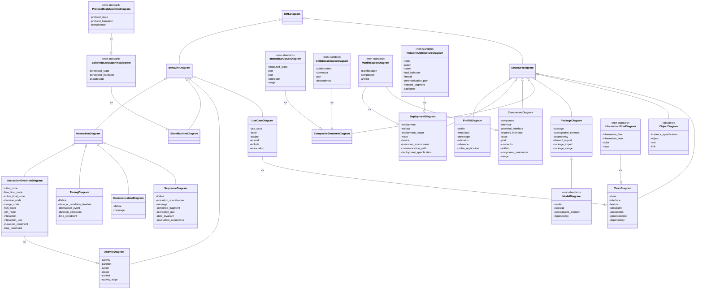

# UML Guide

[toc]

---

> :construction: **UNDER CONSTRUCTION** This page is a work in progress!

## Outline

Home

* :star: **[UML Diagrams](##UML 2.5 Diagrams Overview)** (as "UML 2.5 Diagrams Overview") -
* :star: **[Class Diagrams](####Class Diagrams)** (overview) (as UML Class and Object Diagrams Overview) -
  * **Class** -
  * **Interface** -
  * **Data type** -
  * **Property** ("context=class-diagrams") -
  * **Operation** -
  * **Multiplicity** ("context=class-diagrams") - 
  * **Visibility** ("context=class-diagrams") -
  * **Constraint** ("context=class-diagrams") -
  * **Object** - 
  * **Association** ("context=class-diagrams") -
  * **Aggregation** ("context=class-diagrams") -
  * **Composition** ("context=class-diagrams") -
  * **Generalization** ("context=class-diagrams") -
  * **Dependency** ("context=class-diagrams") -
  * **Abstraction** ("context=class-diagrams") -
  * **Nested classifiers** (as "Nested classifier") -
  * *References*
  * *Examples*
* **[Composite Structures](Composite Structures Diagrams)** (as "Composite Structures Diagrams")
  * **Structured classifier** -
  * **Encapsulation classifier** -
  * **Part** -
  * **Connector** -
  * **Port** -
  * **Collaboration** -
  * **Collaboration use** -
  * **Collaboration template** -
  * *References*
  * *Examples*
* **[Packages](####Package Diagrams)** (as "Package Diagrams Overview") -
  * Package (self)
  * Package template (self)
  * Packageable element (self)
  * **Element Import** -
  * **Package Import** -
  * **Package merge** -
  * **Model** -
  * *Reference*
  * *Examples*
* **[Components](Component Diagrams)** (as "Componet Diagrams") -
  * **Component** -
  * ~~Port ("context=component")~~ (see `Composite Structure > Port`)
  * ~~Part ("context=component")~~ (See `Composite Structure > Part`)
  * ~~Connector ("context=componet")~~  (See `Composite Structure > Connector`)
  * **Component realization** -
  * *Reference*
  * *Examples*
* **[Deployments](Deployment Diagrams)** (as "Deployment Diagrams Overview") -
  * **Network architecture** (as "Network architecture diagrams") - 
  * **Deployment notation** (as "Deployment diagrams") -
    * Manifestation (self) -
    * Deployment target (self) -
    * Communication path (self) -
    * Deployment (self) -
  * **Artifact** -
  * ~~Manifestation (Part of "Deployment diagrams")~~
  * ~~Deployment target (Part of "Deployment diagrams")~~
  * ~~Communication path (Part of "Deployment diagrams")~~
  * ~~Deployment (Part of "Deployment diagrams")~~
  * *Reference*
  * *Examples*
* **[Use Case Diagrams](Use Case Diagrams)** -
  * **Subject** (as "use case subject") -
  * **Actor** (as "use case actor")-
  * **Use Case** -
  * **Association** (as "use case actor association") -
  * **Extend** (as "use case extend") -
  * **Include** (as "use case include") -
  * How to draw
  * *Examples*
  * *Reference*
  * FAQ
* **[Information Flows](#####Information Flows Diagrams)** (overview) (as "Information Flow Diagrams") -
  * **Elements** (as "Information Flow Elements") - 
  * Scheduled workflow example ("context=ifl-examples")
* **[Activities](####Activity Diagrams)** (as "activity diagrams") -
  * **Actions** (as "activity diagrams actions") -
  * **Controls** (as "activity diagrams controls") -
  * **Objects** (as "activity diagrams objects") - 
  * *Reference*
  * *Examples*
* **[State Machines](####State Machine Diagrams)** (as "state machine diagrams") -
  * **Protocol state machines** (as "protocol state machines") -
  * *Reference*
  * *Examples*
* **[Sequence Diagrams](#####Sequence Diagrams)** -
  * **Interaction** -
  * **Message** (as "Interaction message") -
  * **Combined fragment** (as "sequence diagrams combined fragment") -
  * *Reference*
  * *Examples*
  * Q&As
* **[Communications](#####Communication Diagrams)** (as "Communication Diagrams") (formerly "collaboration diagrams") -
  * ~~Interaction~~ (See `Sequence Diagrams > Interaction`)
  * *Reference*
  * *Examples*
* **[Timing Diagrams](#####Timing Diagrams)** -
  * ~~Interaction ("context=timing-diagrams")~~ (See `Sequence Diagrams > Interaction`)
  * *Reference*
  * *Examples*
    * Stages of Alzheimer's disease
    * Website latency
* **[Interaction Overviews](#####Interaction Overview Diagrams)** (as "Interaction Overview Diagrams") -
  * ~~Interaction ("context=interaction-overview")~~ (See `Seqeunce Diagrams > Interaction`)
  * ~~Message ("context=interaction-overview")~~ (See `Sequence Diagrams > Message`)
  * ~~Activity diagram controls ("context=interaction-overview")~~ (See `Activites > Controls` )
  * *Reference*
  * *Examples*
    * Online Shopping ("context=iov-examples")
    * Submit comments
* **[Profiles](####Profile Diagrams)** (as "Profile diagrams") -
  * **Profile** -
  * **Stereotype** -
  * **Metaclass** (as "profile metaclass") -
  * **Extension** (as "profile extension")
  * **Reference** (as "profile reference")
  * **Application** (as "profile application")
  * *References*
  * *Examples*
  * UML meta modeling (as "UML meta models") (consider look at) -
* UML Index
* Examples
* About

---

## The Unified Modeling Language

The **Unified Modeling Language** (**UML**) is a standard visual modeling language intended to be used for:

* Modeling business and similar processes
* Analysis, design, and implementation of software-based systems

UML is a common language for business analysts, software architects, and developers used to decribe, specify, desgin, and document existing or new business processes, structure and behavior of artifiacts of software systems.

UML is can be applied to diverse *application domains* (e.g. banking, finance, internet, aerospace, healthcare, etc.) It can be used with all major object and component *software development methods* and for various *implementation platforms* (e.g. J2EE, .NET).

UML is a standard modeling **language**, not a *software development process*. A process:

* provides gudiance as to the order of the teams activities
* specifies what artifacts should be developed
* directs the tasks of individual developers and the team as a whole
* offers criteria to monitoring and measuring a project's products and activies.

UML is intentionally *process independent* and could be applied in the context of different processes. Still, it is most suitable for use case driven, iterative, and incremental development processes, like *Rational Unified Process* (RUP).

UML is not complete and it is not completely visiual. Given some UML diagram, we can't be sure to understand a depicted part of behavior of the system from the diagram alone. Some infomration could be intentionally omitted from teh diagram; some information represented on the diagram could hae different interpretation; and some concepts of UML have no graphical notation at all; so there is no way to depict those on diagrams.

For example, semantics of *multiplicity of actors* and *multiplicity of use case* on *use case diagrams* is not define precisesly in the UML specification and could mean either concurrent or successive usage of use cases.  Another example, the name of an *abstract classifier* could be shown in italics while *final classifier* has not specific graphical notation, so there is no way to determine whether classifier is final or not from the diagram.

**The current version of the UML Specification is version 2.5 as of June 2015.**

## Object-Oriented Design Concepts in UML

UML is inherently an **object-oriented modeling language** and was designed for use in object-oriented software applications. The applications could be based on the *object-oriented technologies* recommended by the **Object Management Group** (OMG), which owns UML.

UML doesn't care to support *database modeling*, which is still mostly based on *relational models* to describe relational databases. It does not explain why UML ignores modeling of object relational databases or modeling of Graphical User Interfaces (GUI). GUI designs were, and still are, prominent examples of object-oriented design and programming, while completely neglected by UML.

To understand and use UML as intended by its authors, software architects and develoers should be familar with general concepts and methods of **object-oriented analysis and design** (OOAD) and/or of **object-oriented development** (OOD), and how those were applied to UML itself. There is one program with this requirement: though OOAD/OOD has been used for several decades, there is still no concensus on what OOAD is and even what are the fundamental concepts of OOAD.

### Object-Oriented Design

==**Object-Oriented Design** (OOD) is a software development approach to design and implement software systems as a collection of interacting stateful object with specific structure and behavior.==

There are several fundamental concepts defining OOD but there is no agreement on the exact list of the concepts, their definition, and taxonomy (classification). However, the most relevant to UML are:

* class and object
* message, operation, and method
* encapsulation
* abstraction
* inheritance
* polymorphism

### Class and Object

UML **class** is a *classifier* which describes a set of object and share the same features, constraints, and semantics (meaning).  Class may be model as being **active**, meaning that an *instance of the class* (an "object") has some autonomous *behavior*.

An **object** is an *instance* of a *class*. 

An object is an individual "thing" with a state and relationship to other objects. The state of an object identifies the values for that object of properties of the classifier of the object.

### Message

A **message** are intrinsic elements of UML [interaction diagrams](####Interaction Diagrams). A message defines a specific kind of communication between *lifelines* of an interaction. A communication can be, for example, invoking an operator, replying back, createing or destroying an instance, or raising a signal. It also specifies the sender and the receiver of the message.

> 🧜‍♀️ **Mermaid Issue**: There doesn't seem to be a way to demonstrate lifelines using Mermade like on [this page](https://www.uml-diagrams.org/uml-object-oriented-concepts.html).
>
> :reminder_ribbon: **TODO**: Find a way to recreate the image in the "Message in UML" section.

### Operation and Method

An **operation** is defined in UML 1.4.2 as a service that can be requested from an object to effect behavioer. An operation has a **signature**, which may restrict the actual parameters that are possible.

A **method** is defined as the implementation of an operation. It specifies the algorith or procedure associated with an operation.

### Encapsulation

**Encapsulation** is a development technique which includes

* creating new data types (*classes*) by combining both information (*structure*) and behaviors, and
* restricting access to implementation details.

### Abstraction

An *abstraction* isolates us from implementation: as abstraction can be used without knowledge of its implementation and implemented without knowlege of its use.

**Abstraction** is a *dependency relationship* that relates two elements or sets of elements (called **supplier** and **client**) representing the *same concept* at *different levels* of abstraction or from *different viewpoints*.

**Realization** is a specialzied abstraction relationship between two sets of model elements, one representing a **specification** (the *supplier*) and the other represents an **implementation** of the latter (the *client*).

### Inheritance

==**Inheritance** is defined as a mechanism by which more specific classes (called **subclasses** or **derived classes**) incorporate structure and behavior of the more general classes (called **superclasses** or **base classes**).==

Inheritance supplements *generalization* relationships.

**Generalization** is defined as a taxonomic relationship btween a more general element and a more specific element. The more specific element is fully consistent with the more general element and contains some additional information. An instance of the more specific element may be used where the more general element is allowed.

Inheritance was explained in UML 1.4.2 using the concepts of a *full descriptor* and a *segment descriptor*. A **full descriptor** contains a description of all of the attributes, associations, operations, and constraints that the object contains, and is ususally implicit because it is built out of incremental segments combined together using inheritance.

If a generalizable element has more than one parent (**multiple inheritance**), the its full descriptor contains the union of the features from its own segment descriptors and the segment descriptors of all its ancestors.

Attributes in UML 1.4 could not be *redefined* but a method may be declared in more than one subclass. A method declared in any segument supersedes and replaces a method with the same signature declared in any ancestor. 

### Polymorphism

==**Polymorphism** is the ability to apply different meaing (semantics, implementation) to the same symbol (message, operation) in different context.==

When context is defined at compile time, it is called **static** or **compile-time polymorphism**. When context is defined during program execution, it is **dynamic** or **runtime-polymorphism**.

A common occurence of polymorphism happens with operators in programming languags such that the operators are often **polymorphic operations** which could be used with different types of operands. Specific static context--types of the operands--will determine at compile time which implementation of the operator is to be used.

This kind of static polymorphis is usually called **overloading** and means suing the same operation symbol or function name on different types. Note that overloading also allows different number of parameters and sometimes (depending on the programming language) even different priorities

Another kind of static polymorphism is **parametric polymorphism** as in based on *templates* like the ones used in C++.

In OOAD, *polymorphism* means *dynamic polymorphism* and is commonly related to as *late binding* or *dynamic binding*. It could be defined as: ==(Dynamic) Polymorphism is the ability of objects of different classes to respond to the same message in a different way.==

Dynamic binding menchanism in C++, Java, and C# allows to determine behavior (implementation) to be invoked in response to the messages received by a specific object. To get this kind of polymorphic behavior in C++, the member functions must be **`virtual`** and objects must be manipulated through pointers or references.

---

## UML Core Elements

> :bookmark: **CHECKPOINT** We'll need to get back to working on this documentation later. See [this page](https://www.uml-diagrams.org/uml-core.html).

### Element

### Named Element

### Redefinable Element

### Type

### Feature

### Instance and Instance Specification

### Relationship

### Directed Relationship

### Comment

---

## UML 2.5 Diagrams Overview

A **UML diagram** is a partial graphical representation (view) of a model of a system under design, implementation, or already in existance. UML diagrams consis of **graphical elements** (symbols)--UML nodes connected with edges (also known as *paths* or *flows*)--that represent elements in the UML model of the designed system. The UML model of the system might also contain other documentation such as *use cases* written as templated texts.

The *kind* of diagram is defined by the primary graphical symbols shown on the diagram. For example, a diagram where the primary symbols in the contents area are classes is a **class diagram**. A diagram which shows *use cases* and *actors* is a **use case diagram**. A **sequence diagram** shows sequences of message exchanges between *lifelines*.

UML specification does not preclue *mixing* of different kinds of diagrams. So it's OK, for example, to combine structural and behavior elements to show a state machine nested inside of a use case. Consequently, the boundaries between the various kinds of diagrams are not strictly enforced. At the same time, some *UML Tools* do restrc the set available graphical elements which could be used when working on a specific type of diagrams.

UML specification speficially defines two major kinds of UML diagrams: *structure diagram* and *behavior diagrams*.

UML 2.5 diagrams could be categorized hierarchically as shown below.

> :information_source: **NOTE**: Items shown with the `<<nonstandard>>` stereotype are not part of the official UML 2.5 taxonomy of diagrams.
>

Clearly this diagram above is hard to see, and it was not the full diagram I wanted to recreate. So let's start each section with a diagram describing the heirarchy. 😉

### Structure Diagrams

==**Structure diagrams** show the *static structure* of the system and its part on different abstraction and implementation *levels* and how they are related to each other.== The elements in a structure diagram represent the meaningful concepts of a system, and may include abstract, real world, and implementation concepts.

Structure diagrams are not utilizing *time* related concepts, thus they do not show the details of dynamic behavior. However, they may show relationships to behaviors of the classifiers exhibited in the structure diagrams.

#### Class Diagrams

##### Purpose

A **class diagram** shows the structure of the designed system, subsystem, or component as related *classes* and *interfaces*, with their *features*, *constraints*, and *relationships* --*associations*, *generalizations*, *dependencies*, etc.

Some common types of class diagrams are:

* **domain model diagram** -
* **diagram of implementation classes** -

##### Elements

* **class** -
* **interface** -
* **feature** -
* **constraint** -
* **relationship** -
  * **association** -
  * **generalization** -
  * **dependency** -

#### ~~Object Diagrams~~

> :x: **Obsolete!** : Object diagram was defined in UML v1.4.2. Specification.
>
> As of UML 2.5, there is no defintion of object diagram.
>
> I'm not going to talk about it here.

##### Purpose

An **object diagram** could be considered an instance level [class diagram](####Class Diagrams) which shows *instance specifications* of classes and interfaces (*objects*), *slots* with value specifications, and *links* (instances of *association*).  As of UML 2.5, this sort of diagram is obsolete, especially since it can be represented with a class diagram.

##### Elements

* **instance specification** -
* **object** -
* **slot** -
* **link** -

#### Package Diagrams

##### Purpose

A **package diagram** shows *packages* and relationships between packages.

##### Elements

* **package** -
* **packageable element** -
* **dependency** -
* **element import** -
* **package import** -
* **package merge** -

##### Non-Standard Subtype: Model Diagrams

###### Purpose

A **model diagram** is a UML auxiliary structure diagram which shows some abstraction or specific view of a system, to describe architectural, logical, or behavioral aspects of the system.

It could show, for example, architecture of a multi-layer (a.k.a. multi-tiered) application. (See ==*multi-layered application model*==)

###### Elements

* **model** -
* **package** -
* **packageable element** -
* **dependency** -

#### Composite Structure Diagrams

##### Purpose

A **composite structure diagram** can be used to show:

* Internal structure of a classifier
* A behavior of a collaboration

##### Elements

> :reminder_ribbon: **TODO**: Are their any inherited or common elements?

##### Non-Standard Subtype: Internal Structure Diagram

###### Purpose

An **internal structure diagram** (ISD) shows the internal structure of a classifier - a decomposition of the classifier into its properties, parts, and relationships.

###### Elements

* **structured class** -
* **part** -
* **port** -
* **connector** -
* **usage** -

##### Non-Standard Subtype: Collaboration Use Diagram

###### Purpose

A **colaboration use diagram** (CUD) shows objects in a system cooperating with each other to produce some behavior of the system.

###### Elements

* **collaboration** -
* **connector** -
* **part** -
* **dependency** -

#### Component Diagrams

##### Purpose

A **component diagram** shows components and the dependencies between them. This type of diagram is used for **Component-Based Development** (CBD) to describe systems with **Service-Oriented Architecture** (SOA).

##### Elements

* **component** -
* **interface** -
  * **provided interface** - 
  * **required interface** -
* **class** -
* **port** -
* **connector** - 
* **artifact** -
* **component realization** -
* **usage** -

#### Deployment Diagrams

##### Purpose

A **deployment diagram** shows architecture of the system as *deployment* (distribution) of software *artifacts* to *deployment targets*.

> :information_source: **NOTE**: *Components* were directly deployed to nodes in UML 1.x deployment diagrams. In UML 2.x, *artifacts* are deployed to nodes, and artifacts could *manifest* (implement) components. Components are deployed to nodes indirectly through artifacts.

###### Specification Level Deployment Diagram

A **specification level deployment diagram** (SLDD) (a.k.a. **type level**) shows some overview of *deployment* of *artifacts* to *deployment targets*, without referencing specific instance of artifacts or nodes.

###### Instance Level Deployment Diagram

An **instance level deployment diagram** (ILDD) shows *deployment* of instances of *artifacts* to specific instances of *deployment targets*. It could be used, for example, to show differences in deployments to development, staging, or production environments with the names/IDs of specific build or deployment servers or devices.

##### Elements

* **deployment** -
  * **deployment target** -
  * **deployment specification** -
* **artifact** -
* **node** -
* **device** -
* **execution environment** -
* **communication path** -

##### Non-Standard Subtype: Network Architecture Diagrams

###### Purpose

Deployment diagrams could be used to show logical or physical *network architecture* of the system. This kind of deployment diagram--not formally defined in UML 2.5--could be called **network architecture diagrams**.

###### Elements

> 🤔 **Hmm...** This seems more like the field of network management. (Think Cisco Certified Networking Academy or GNS3 Academy for Juniper folks.)
>
> This is beyond the scope of this guide. Maybe someday I'll get into it.

* **node** -
* **switch** -
* **router** -
* **load balancer** - 
* **firewall** -
* **communication path** -
* **network segment** -
* **backbone** -

#### Profile Diagrams

##### Purpose

A **profile diagram** is an auxiliary UML diagram which allows to define custom *stereotypes*, tagged values, and constraints as a *lightweight extension mechanism* to the UML standard. Profiles allow to addapt the UML metamodel for different *platforms* (such as J2EE or .NET) or *domains* (such as real-time business process modeling).

Profile diagrams were first introduced in UML 2.0.

##### Elements

* **profile** -
* **metaclass** - 
* **stereotype** -
* **extension** -
* **reference** -
* **profile application** -

#### Other Non-Standard Structure Diagrams

##### Manifestation Diagrams

###### Purpose

While [component diagrams](###component diagrams) show components and relationships between components and classifiers, and [deployment diagrams](###deployment diagrams) --*deployments* of artifacts to *deployment targets*, some missing intermediate diagram is **manifestation diagram** to be used to show *mainifestation* (implementation) of *components* by *artifacts* and internal structures of artifacts.

Because manifestation diagrams are not defined by UML 2.5, manifestation of components by artifacts could be shown using either component diagrams or deployment diagrams.

###### Elements

* **manifestation** -
* **component** -
* **artifact** -

### Behavior Diagrams

==**Behavior diagrams** show the *dynamic behavior* of the objects in a system, which can be described as a series of changes to the system over *time*.==

#### Use Case Diagrams

##### Purpose

A **use case diagram** describes a set of actions (*use cases*) that some system or systems (*subject*) should or can perform in collaboration with one or more external users of the system (*actors*) to provide some observable and valuable results to the actors or other stakeholders of the system or systems.

> :information_source: **NOTE**: In UML 2.4.1. specification (see "16.4 Diagrams") stated that 
>
> > *"Use Case Diagrams are a specializations of Class Diagrams such that the classifiers shown are restricted to being either Actors or Use Cases."*
>
> ==**[Class diagrams](###Class Diagrams) are [structure diagrams](##Structure Diagrams).**==

##### Elements

* **use case** -
* **actor** -
* **subject** -
* **extend** -
* **include** -
* **association** -

#### Activity Diagrams

##### Purpose

An **activity diagram** shows sequence and conditions for coordinating lower-level behaviors, rather than which classifiers own those behaviors. These are commonly called **control flow** and **object flow** models.

##### Elements

* **activity** -
* **partition** -
* **action** -
* **object** -
* **control** -
* **activity edge** -

#### State Machine Diagrams

##### Purpose

A **state machine diagram** is used for modeling discrete behavior thorugh finite state transitions. In addition to expressing the *behavior* of a part of the system, state machines can also be used to express the *usage protocol* of part of a system. These two kinds of state machines are referred to as **behavioral state machines** and **protocol state machines**.

> 🤔 **Hmm...** Could this section be built upon with the subject of *finite state automata*?

##### Common Elements

* **state** -
  * **pseudostate** -
* **transition** -

##### Non-Standard Subtype: Behavior State Machine Diagram

###### Purpose

A **behaviorial state machine diagram** shows discrete **behavior** of a part of designed system through finite state transitions.

###### Elements

* **behavioral state** -
  * **pseudostate** -
* **behavioral transition** -

##### Non-Standard Sub-Subtype: Protocol State Machine Diagram

> 😵 **There's no`<h7>` or `<h8>` in HTML!** - I ran out of headers!

###### Purpose

A **protocol state machine diagram** shows **usage protocol** or a **lifecycle** of some **classifier**, e.g. which operations of the classifier may be called in each state of the classifier, under which special conditions, and satisifying some optional postconditions after the classifier transitions to a target state.

###### Elements

* **protocol state** -
  * **pseudostate** -
* **protocol transition** -

#### Interaction Diagrams

**Interaction diagrams** include several different types of diagrams:

* **[sequence diagrams](#####Sequence Diagrams)**
* **[communication diagrams](#####Communication Diagrams)** (formerly known as *collaboration diagrams* in UML 1.x)
* **[timing diagrams](#####Timing Diagrams)**
* **[interaction overview diagrams](#####interaction overview diagrams)**

##### Sequence Diagrams

###### Purpose

**Sequence diagrams** are the most common kind of interaction diagrams. A sequence diagram focuses on the message intercahnge between *lifelines* (objects).

###### Elements

* **lifeline** -
* **execution specification** -
* **message** -
* **combined fragment** -
* **interaction use** -
* **state invariant** -
* **destruction occurrence** -

##### Communication Diagrams

###### Purpose

A **communication diagram** focuses on the interaction between *lifelines* where the architecture of the internal structure and how this corresponds with the *message* passing is central. The sequencing of messages is given trhough a *sequence numbering* scheme.

###### Elements

* **lifeline** -
* **message** -

##### Timing Diagrams

###### Purpose

A **timing diagram** shows interaction when a primary purpose of the diagram is to reason about time. Timing diagrams focus on condtions chaning within an amoung lifelines along a linear time axis.

> 🤔 **Hmm...** How does this compare to a [Gantt Chart](https://www.gantt.com/) or other methods of time management?

###### Elements

* **lifeline** -
* **state or condition timeline** -
* **destruction event** -
* constraints
  * **duration constraint** -
  * **time constraint** -

##### Interaction Overview Diagrams

###### Purpose

A **interaction overview diagram** defines interactions through a viariant of [activity diagrams](####Activity Diagrams) in a way that promotes overview of the control flow. Interaction overview diagrams focus on the overfiew of the flow of control where the nodes are interaction or *interaction uses*. The lifelines and the messages do not appear at this overview level.

###### Elements

* nodes
  * **initial node** -
  * **flow final node** -
  * **activity final node** -
  * **decision node** -
  * **merge node** -
  * **fork node** -
  * **join node** -
* **interaction** -
  * **interaction use** -
* constraints
  * **duration constraint** -
  * **time constraint** -

#### Non-Standard Behavior Diagrams

##### Information Flow Diagrams

###### Purpose

An **information flow diagram** shows the exchange of information between system entities at some high levels of abstraction. Information flows may be useful to describe circulation of information through a system by representing aspects of models not yet fully specified or with less details.

###### Elements

* **information flow** -
* **information item** -
* **actor** -
* **class** -

### Other Non-Standard Diagrams

[might remove this part later]

---

## Vocabulary

> :abc: **NOTE**: This section is sorted in the order of primary topics

---

## (Old)

> This stuff is old, but see if it needs to be finished or can be integrated later.

### Classifier

**Classifier** is an abstract metaclass which describes ("classifies") set of instances having common *features*. A **feature** declares a structural or behavioral characteristic of instances of classifiers.

More formally, *classifier* is (extends):

* **type**
* **templateable element**
* **redefinable element**
* **namespace**

**Namespace** is a named element that can own (contain) other named elements. As a namespace, classifier can have features.

**Type** represents a set of values. A typed element that has this type is constrained to represent values within this set. As a type, classifier can own ==*generalizations*==, thereby maining it possible to define generalization relationships to other classifiers.

A **redefinable element** is an element that, when defined in the context of a classifier, can be redefined more specifically or differently in the context of another classifier that specializes (directly or indirectly) the context classifier. As a redefinable element, it is possible for classifier to redefine nested classifiers.

### Inheritiance

**Inheritance** is some mechanism by which more *specific classes* (also called *subclasses*, *derived classes*, or *child classes*) incorporate structure and behavior of the more *general class* (also called *superclasses*, *base classes*, or *parent classes*).

UML is inherently object-oriented modeling language and uses inheritance as one of its fundamental concepts while no UML specification provides appropriate details of how they actually define or interpret inheritance in UML.

**Inherited members** (`^`) are sometimes member of a parent ==*classifier*== which were defined in the parent class but behave as if they were defined in the inheriting classifier itself. An inherited member that is an **attribute** (or *property* in general) may have a value or collection of values in any instance of the inheriting classifier.

### Visibility

**Visibility** allows the to constrain the usage of a *named elements*, either in *namespaces* in h access to the element. It is used with *classes*, *packages*, *generalizations*, *element import*, *package import*.

UML has the following types of visibility for elements:

* **`public`** elements (`+`) are visible to all elements that can access the contents of the namespace that owns it. In the class than owns them, they are public and in any derived classes they are also public.
* **`protected`** elements (`#`) are visible to all elements that have a generalization relationship to the namespace that owns it. Protected elements can be described as public in their base class even though they are considered protected, but in any derived classes they are treated as private elements. ( :reminder_ribbon: **TODO:** When they mean "namespace", do they mean "class". (possibly, might also mean "interface" as well.))
* **`private`** elements (`-`) are visible only inside the namespace that owns it. They are not accessible outside of any other class except their own. You won't get access to these elements in derived classes. In other words, any inherited members are members that do not have private visibility.
* **`package`** elements (`~`) are owned by a namespace that is not a package, and is visible to elements that are in the same package as its owning namespace. Only named elements that are not owned by packages can be marked as having package visiblity

Note that if a *named element* is not owned by any *namespace*, then it does not have a visibility.

---

## References

[^ uml ]: [UML Diagrams](https://www.uml-diagrams.org/). **The Unified Modeling Language**.
[^ omg ]: [Object Management Group](https://www.omg.org/spec/UML/2.5/PDF). **OMG Unified Modling Language (OMG UML)**. PDF!
[^ gantt ]: [Gantt.com](https://www.gantt.com/). Gantt Charts.
[^ jsdoc ]: [JSDoc](https://jsdoc.app/). JavaScript Documentation.
[^ semver ]: [Semantic Versioning](https://semver.org/).
[^ gv ]: [Graphviz](https://www.graphviz.org/documentation/). Documentation.

[ ^ mermaid ]: Mermaid.js(https://mermaid-js.github.io/).

---

#UML #Guide

