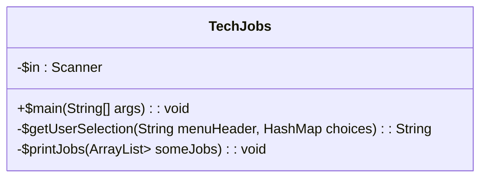
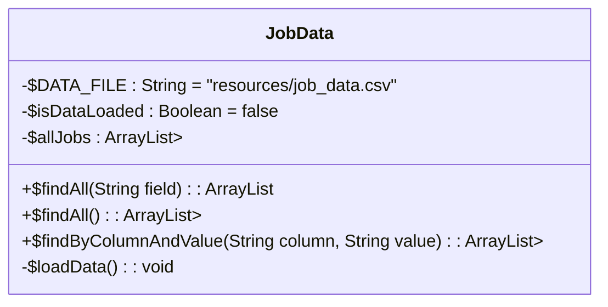

# Assignment #1: Tech Jobs (Console Editon)

[toc]

---

> :construction: **This isn't complete**, but I'll worry about that later.

## Introduction

## Learning Objectives

In this project, you will show that you can:

1. Read and understand code written by others.
2. Use core Java syntax (methods, variables, loops, conditionals).
3. Utilize `ArrayList` and `HashMap` collection types.
4. Work with console I/O via the `Scanner` class.
5. Work with data types and arrays.

## TechJobs (Console Edition)

## Your Assignment

## Getting Started

1. ~~Set up a local copy of the project: Visit the [repository page](https://github.com/LaunchCodeEducation/techjobs-console-java) for this project and fork the repository to create a copy under your own GitHub account.~~
2. ~~Open IntelliJ. If IntelliJ is currently open, save your work, close the program, and then reopen it.~~
3. ~~If the app opens up to an existing project, select *IntelliJ > Preferences > Appearance & Behavior > System Settings* and uncheck *Reopen last project on startup*. Close and reopen IntelliJ.~~
4. ~~From the *Welcome to IntelliJ* dialog box, select *Check out from Version Control > GitHub*.~~
5. ~~Choose your fork from the repository dropdown, select the parent directory where you’d like to store your project, and hit *Clone*.~~
6. ~~When asked *Would you like to create an IDEA project…* select *Yes*, and then accept all of the default options presented.~~
7. ~~In the screens that follow, be sure to choose *Create Project From Existing Sources* on the first pane, and select the default values of all following panes.~~

Before diving in and starting to code, make sure you understand what the code you’ve been given does. Since you’re starting with a functioning—albeit unfinished—program, go ahead and run it to get an idea of how it works. To do this, right-click on the `main` method in the `TechJobs` class and select *Run TechJobs.main()*.

> :warning: **WARNING!** The application will run until you force it to quit, re-prompting time after time. To kill it, press the red “stop” icon in the Run pane. We’ll learn precisely how the program manages to work this way below.

Let’s explore the code by starting with the source of the data our program is providing access to.

## The Data File: `jobs_data.csv`

## The `TechJobs` Class

### The `main` Method

### The `getUserSelection` Method

## The `JobData` Class

## Your Tasks

### Implement `printJobs`

### Create Method `findByValue`

### Make Search Method Case-Insensitive

## Sanity Check

## Solution Demo

## How to Submit

## Bonus Missions :rocket:

---

#Java #Assignments

