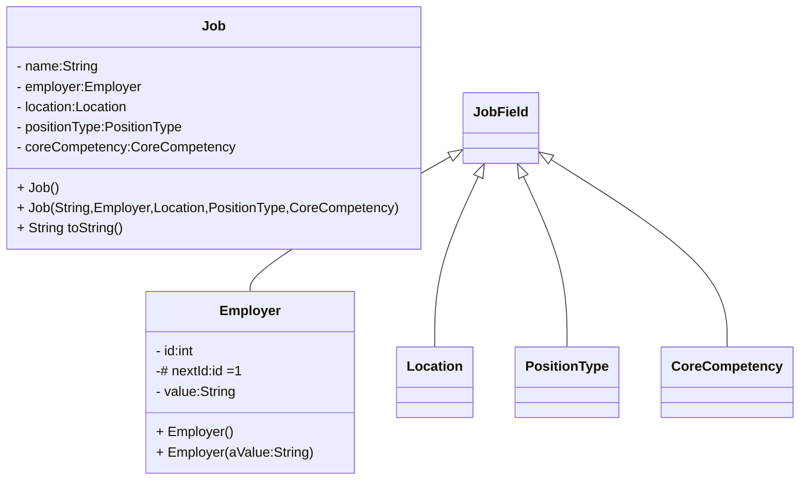

# Assignment #2: Tech Jobs (Object-Oriented Editon)

[toc]

---

## Introduction

## Learning Objects

## Get the Starter Code

## TechJobs (Object-Oriented Edition)

## Why Change to Object-Oriented?

### Job Fields

#### Eliminating Duplication of Data

#### Enable Extensions

## Your Assignment

### 1. Explore the `Employer` Class

#### Assign a Unique ID

### 2. Complete the Support Classes

#### The `Location` Class

#### The `CoreCompetency` Class

#### The `PositionType` Class

### 3. Complete the `Job` Class

### 4. Use Unit Testing to Verify Parts of the `Job` Class

#### Test the Empty Constructor

#### Test the Full Constructor

#### Test the `equals` Method

### 5. Use TDD to Build the `toString` Method

#### Create First Test for `toString`

#### Code `toString` to Pass the First Test

#### Finish the TDD for `toString`

### 6. Refactor to DRY the Support Class

#### Create a Base Class

#### Extend `JobField` into `Employer`

#### Finish DRYing Your Code

## Sanity Check

## How to Submit

---

#Java #Assignments

