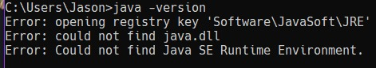
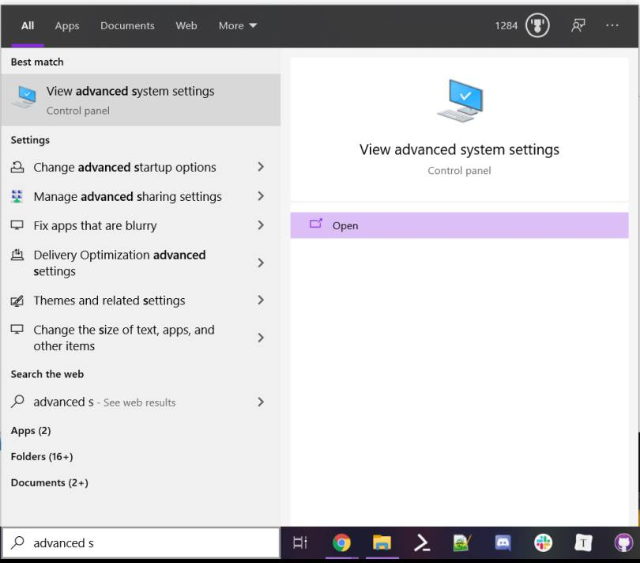
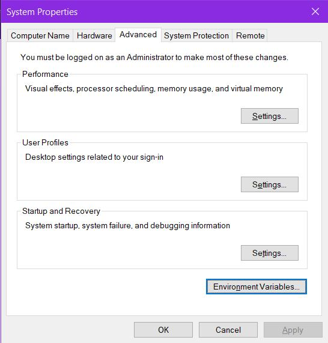
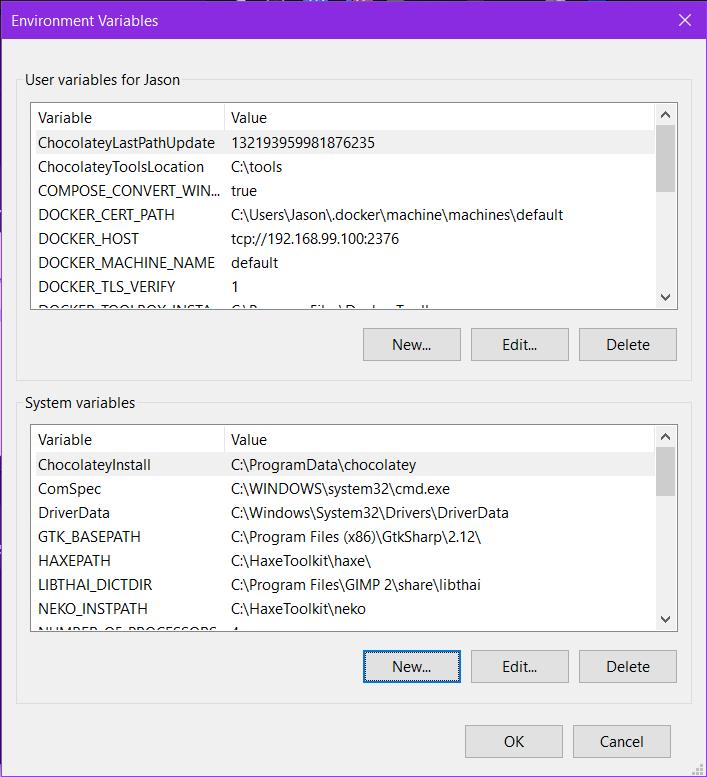
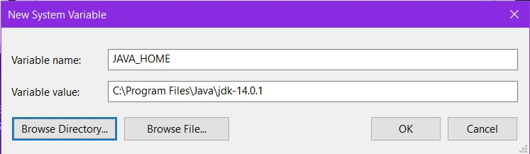
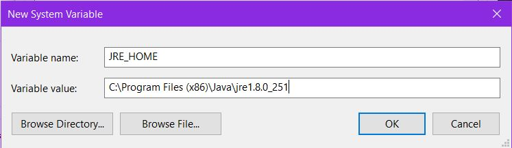
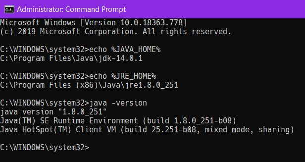

# How to Install Java

> Hello, I added this because
>
> 1. You need the JRE
> 2. You need the JDK
> 3. Both update more regularly than the author of the book realizes.
>
> This document should fix that.

## If you've installed Java before...

Chances are you have a not version of Java, and if you have you might have seen this before...

Sure you have `C:\ProgramData\Oracle\Java\javapath` in your `%PATH%` somewhere, but what that is saying is that don't have your JRE.  

Basically, you just need to reinstall the Java Runtime Environment (JRE). But you're a Java Developer (or at least you want to be.)  So you definitely want to get both the JRE and JDK installed.

## Install Java

Normally, you install software like this all in one package. But Java is a <abbr title="Pain in the Ass">P.I.T.A.</abbr> with this. You need to install more than one thing.

These instructions are for Windows. 

1. Download and Install the JDK and the JRE.

   | Software                       | URL to find the Software                                     | Software Executable              |
   | ------------------------------ | ------------------------------------------------------------ | -------------------------------- |
   | Java Development Kit (JDK)     | https://www.oracle.com/java/technologies/javase-jdk-downloads.html | `jdk-14.0.1.windows-x64_bin.exe` |
   | Java Runtime Environment (JRE) | https://www.java.com/en/download/win10.jsp                   | `JavaSetup8u251.exe`             |

   I don't have screen shots for this, but honestly, you just need to install them where they usually belong. Installing these should add the "javapath" (`C:\ProgramData\Oracle\Java\javapath`) to your `%PATH%` in the Command Prompt (`cmd.exe`)  You can find out if you type `echo %PATH%`.

2. Find the advanced system settings.

   

3. Click on the `Environment Variables...` button.

   

4. Brows through the `System Variables`. If `JAVA_HOME` and `JRE_HOME` are not in the list, click the `New...` button below the list.

   

5. For each of these variables, fill the `Variable name` and `Variable value` fields. Use the `Browse Directory...` button to find the path for the JDK and the JRE. Press OK afterwards. Be sure to do this twice if you don't have BOTH variables set up.

   | Software | Variable name | Variable value                             |
   | -------- | ------------- | ------------------------------------------ |
   | JDK      | `JAVA_HOME`   | `C:\Program Files\Java\jdk-14.0.1`         |
   | JRE      | `JRE_HOME`    | `C:\Program Files (x86)\Java\jre1.8.0_251` |

   

   

6. In the Environment Variables, Click OK.

7. In the System Properties, Click OK again.

8. Open a Command Prompt (`cmd.exe`). I had opened an administrative one, but it doesn't matter.

   

   If it looks like that above, you should be ready. This should also work in Power Shell, Git Bash shell (which is good if you want to try to get [VSCode](https://code.visualstudio.com/) to use Java), or the Command Prompt in the terminal of [IntelliJ IDEA](https://www.jetbrains.com/idea/).

## Bonus: Color Themes

Just as Vim and VSCode has a website for downloadable themes, so does IntellJ's projects, this includes themes from IDEA.

* **[Color-Themes.com](http://color-themes.com/)** - for IntelliJ Projects
* [VSCode Themes](https://vscodethemes.com/)
* [Vim Colors](http://vimcolors.com/)

