# How to Install PlantUML

[toc]

---

## Introduction

### What is UML?

**UML** or the **Unified Modeling Language** is a general-purpose, developmental, modeling language used in software engineering intended to provide a standard way to visualize system design.

During the mid-1990s, a group of gentlemen at Rational Software wanted to standardize the various notational systems and approaches to software design. In 1997, UML was adopted as a standard by the Object Managment Group (OMG), which was a good decision considering in 2003, IBM snatched up Rational Software for a couple of billion dollars, and I never got a chance to play around with Rational Rose.

OMG still manages the UML standard. In 2005, UML was published by the International Organization for Standardization (ISO) as an approved standard: [ISO/IEC 19501:2005](ISO/IEC 19501:2005). The most recent specification, [UML 2.5](https://www.omg.org/spec/UML/2.5) was published in May 2015.

### So what else did you use for UML?

Microsoft has a piece of software called [Visio](https://www.microsoft.com/en-us/microsoft-365/visio/flowchart-software), which would be great to use, if it didn't [cost $280](https://www.microsoft.com/en-us/microsoft-365/p/visio-standard-2019/cfq7ttc0k7cf?activetab=pivot:overviewtab).  Oh, but they have pretty much the Adobe model for their software where you can pay them $5 per user per month.  Of course, the only Microsoft software I am willing to pay for a monthly commit ment is ~~Microsoft Office~~ *Microsoft 365*. I'd use Libre Office, but Word and Excel are pretty much universally accepted.

So what are my other options? For a while I used [Dia Diagram Editor](http://dia-installer.de/). Then I discovered [Typora](https://www.typora.io/) had [Mermaid.js](https://mermaidjs.github.io/) integrated into.  Mermaid is currently an active project. And since I was already having a good time using  [Github Flavored Markdown](https://github.github.com/gfm/) and [MathJax](https://www.mathjax.org/) for [LaTeX](https://www.latextemplates.com/) support for mathematical notation, things were working out pretty well.

But Mermaid still has a ways to go before it includes EVERYTHING that UML has to offer.

[**PlantUML**](https://plantuml.com/) still appears to be the king of FOSS UML despite it still using Java for a backend.

### Why PlantUML?

I am a big fan of using UML. Ever since I first saw one used to describe an Object-Oriented Program, I wanted to replicate those same diagrams on the computer. Books published by [Deitel](https://deitel.com/books/) and [Murach](https://www.murach.com/shop/murach-s-java-programming-5th-edition-detail) used them to constantly illustrate object oriented concepts. (There's probably a few other books but these two publishers made some books I highly recommend.)

## Instructions

### Windows

#### Pre-Setup

Before you install an IDE, there are a few things you should really install first.

##### Chocolatey

Windows doesn't really have a software package manager.  If you haven't installed [**Chocolatey**](https://chocolatey.org/), you should. Chocolatey provides a list of Free and Open-Source Software (FOSS) that you can download free of charge.

Microsoft has pretty much infiltrated the FOSS scene with VSCode, more so since they have bought GitHub and NPM over the past few years.

##### JetBrains Toolbox

JetBrains also has a software package manager for its many products called [**JetBrains Toolbox**](https://www.jetbrains.com/toolbox-app/). Download and install that to get **IntelliJ IDEA Community Edition**.

#### IntelliJ IDEA

[**Intellij IDEA**](https://www.jetbrains.com/idea/) has proven itself to be the best IDE for Java Development. Throughout LC101 (or whatever LaunchCode thing you are doing, or even if you stumbled upon this repo looking to learn how to be an awesome programmer), you will encounter many of the great features it has packed into it.

##### Install PlantUML Integration

One of the greatest features it has isn't part of IntelliJ by default but in their plugin marketplace.

This part of the document assumes you have already installed IntelliJ IDEA.

> **Note**: If you have a project open in IntelliJ IDEA open, you may want to close it. Go to `File > Close Project`.

First we want to be at the Welcome Screen.

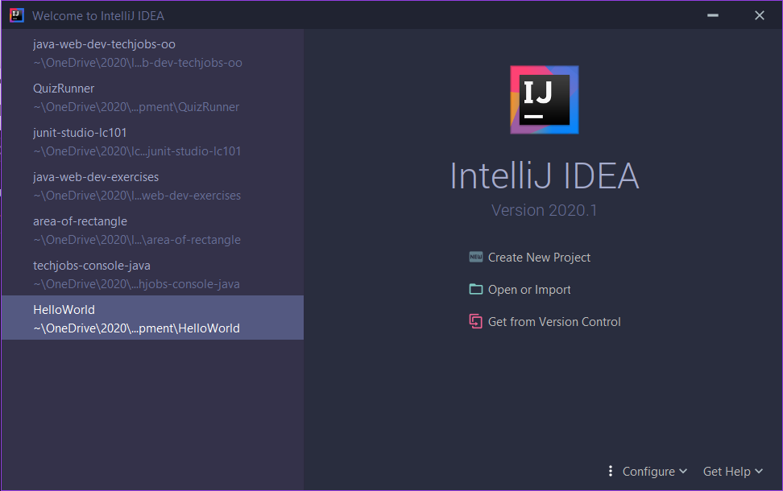

On the bottom edge, click the `Configure` menu and select `Plugins`.

In the `Marketplace` tab, search for `UML` in the search box. You should see a plugin called `PlantUML integration` by Eugene Steinberg.

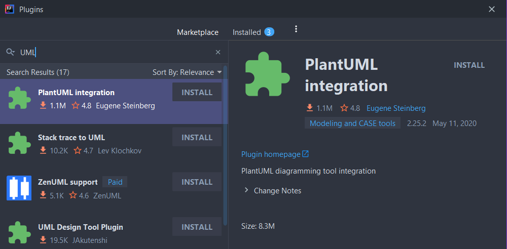

The Plugin pages in the Marketplace aren't as descriptive as VSCode's, so I recommend reading up on the details about any plugin before downloading it. Case in point, read up about the [PlantUML intengration plugin](https://plugins.jetbrains.com/plugin/7017-plantuml-integration) first.  Once you've done that, go ahead and click the "Install" button.

You will be asked to restart the IDE. Now would be a good time to update any other plugins, then you can click "Restart IDE".

When you restart IDEA, you should go into the settings and search for "PlantUML". In the `Language & Frameworks > Markdown` section, there's a setting that says "PlantUML Framework isn't installed". Click "Install" to install it.

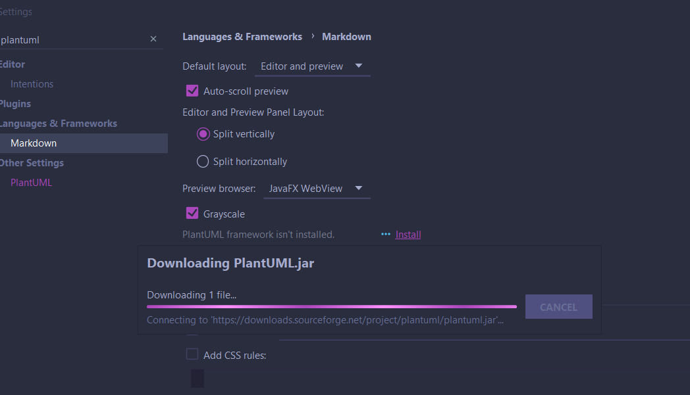

Also, if you want you can uncheck that "Grayscale" box. I'm not sure what it grayscales, but making anything colorful is helpful. (It's kind of why I installed the [Intent Rainbow](https://plugins.jetbrains.com/plugin/13308-indent-rainbow) and [Rainbow Brackets](https://plugins.jetbrains.com/plugin/10080-rainbow-brackets) plugins. (Thanks for suggesting it, Domonique!))

##### Let's try it out!

To demonstrate how PlantUML works, I added a UML file to another project. PlantUML files are generally `.puml` files. They can be stored anywhere in your project but I recommend putting it somewhere assets (like images) are stored or more ideally with your `README.md` file.

First, I'll open my Project. This one is called QuizRunner.


I'll right click on the QuizRunner folder and to go `New > PlantUML File`.

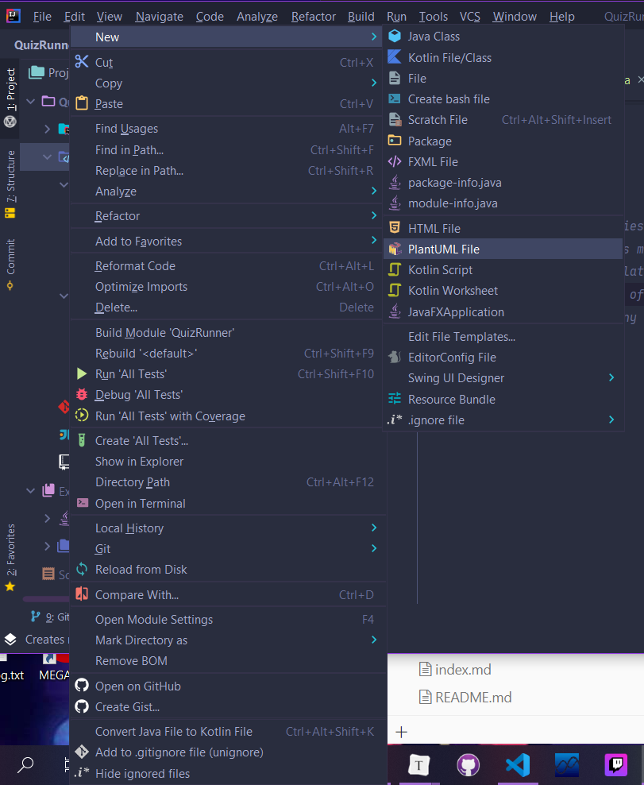

A new prompt appears asking us to name our file and what type of diagram it should be. We select `Class` for [Class Diagram](https://www.uml-diagrams.org/class-diagrams-overview.html) and in the text field, I will type `QuizRunner` and press Enter which will create the file `QuizRunner.puml`.

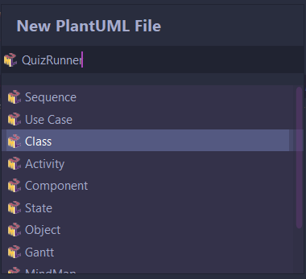

When `QuizRunner.puml` is opened, a pane on the right side will open showing a preview of our file. Generally when you create a new file, there is some text to show how a class diagram would look if you used it.  The contents of the `.puml` file should be between the `@startuml` and `@enduml` lines.

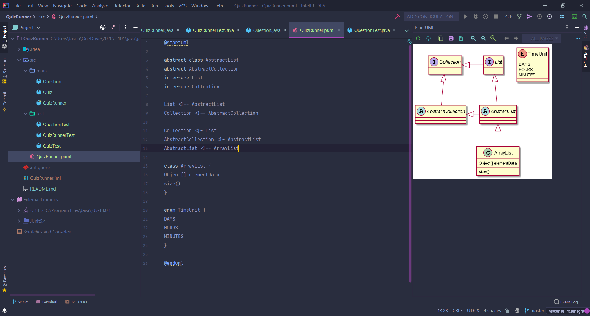

> :warning: **WARNING!** `@startuml` and `@enduml` are the boundaries of the file. `@startuml` will always be the first line and `@enduml` will always be the last line. So here are a few rules to keep in mind:
>
> 1. Do not put any other text on the same lines as `@startuml` or `@enduml`
> 2. Do not put text before the `@startuml` line. `@startuml` is always the first line.
> 3. Do not put text after the `@enduml` line. `@enduml` is always the last line.
> 4. Comments don't seem to be supported in `.puml` files. Until I figure out what is the proper syntax for them, everything is literal, like trying to write a `.json` file.

>  :tired_face: **Did Not Want**: You may have noticed in the above screen shot some of the arrows were converted from `<|--` to `◀--`. Apparently, the color scheme I was using was using those Fira Font Litgatures. 
>
> In the settings, search for `font` and in the `Editor > Color Scheme > Color Scheme Font` section, Uncheck the "Enable font litgatures". The click "Apply" and "OK". These will not be featured in my notes, henceforth.
>
> 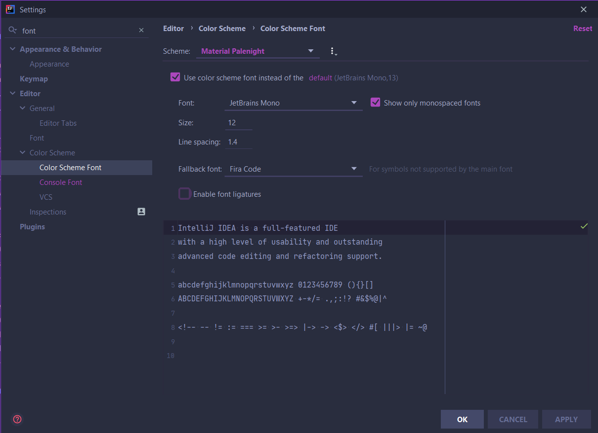

At any rate, the default code inserted into the file looks like this:

```
@startuml

abstract class AbstractList
abstract AbstractCollection
interface List
interface Collection

List <|-- AbstractList
Collection <|-- AbstractCollection

Collection <|- List
AbstractCollection <|- AbstractList
AbstractList <|-- ArrayList

class ArrayList {
Object[] elementData
size()
}

enum TimeUnit {
DAYS
HOURS
MINUTES
}

@enduml
```

You can clear out all the stuff in between `@startuml` and `@enduml`.

Initially, I wanted to show what it would look like with two packages that had three classes each in them. This was the result.

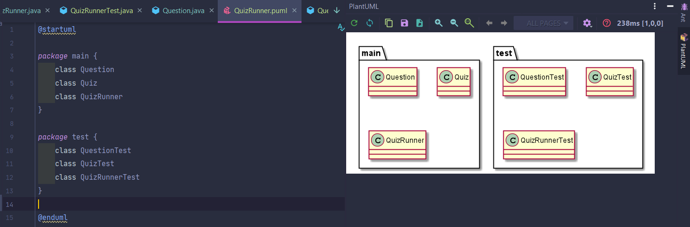

Super easy!

##### Class Diagrams and Relationships

The PlantUML website offers some quick tips on how to get started. Their page on [Class Diagrams](https://plantuml.com/class-diagram) has a plethora of information.

One of the concepts I want to cover here (which probably should be moved somewhere else in my notes later) are *relationships*. 

According th the UML Diagrams website a "Relationship is an abstract element which represents the concept of some kind of relationship between UML elements". We mostly deal with *directed relationships*. A directed relationship is "an abstract relationship between a collection of source elements and a collection of target elements".

Directed relationships include several subclasses of relationships but the three most important ones to understand are:

* Generalization ("Y extends X" or "Y is a X")
* Realization/Implementation ("Y implements Xable" or "Y realizes Xable")
* Aggregation/Dependency ("X requires (depends on) Y" or "Y uses X" or "Y has a X" or "Y needs a X")

If you understand the concept of *class inheritance* (a.k.a. *generalization*), you should understand that  a child class extends a parent class. "ArrayList *is an* Object". This example on the PlantUML Class Diagrams page provides a simple example of generalization. Generalizations use the arrow connector where the pointer points to the Parent class. The parent class is also commonly place above the child class.

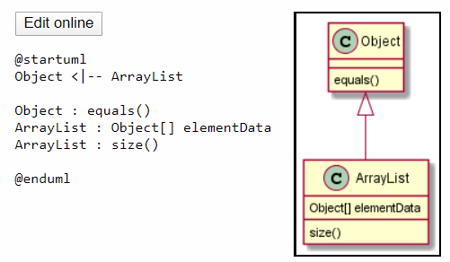

In Java the code that represents this relationship  on the line where the class defintion begins would look like this:

```java
public class ArrayList extends Object {
    //...
}
```

*Interfaces* (a.k.a. *realizations*) have a slightly different appearance. It is denoted much like a generlization, but instead of a solid line, a dashed line is used. To use a dashed arrow, use `<|..` (tw dots following the pipe).  In Java, most interfaces generally end with the `-able` or `-ible` suffix. An interface also features text inbetween double guillemets `«interface»`  (which would be `&laquo;interface&raquo;` in HTML). This is called a *stereotype*, and it is required to distingush between a class and an interface.

The thrid kind of common relationship is called an *aggregation* which uses a diamond for an arrowhead. Aggregation represents a "whole/part relationship" indicating that one thing is part of another thing, which differes from how generalizations and realizations have a "parent/child relationship".  An example of aggregation would be how a folder contains files.  A form uses fields.

The two most notable types of aggregation are:

* Shared aggregation (which is simply called *aggregation*) which has "weak" aggregation. Sort of like how you use an object from another class in the `main()` function. It exists to run the program, but other than that the object you created to use in the main program really doesn't contribute to the functionality of `main()`.
* Composite aggregation (a.k.a. *composition*) have "strong" aggregation. Y is used in X. X needs Y to work. There is no X without Y.

When using aggregation, compositions (`*--`) have a filled in diamond, where Shared aggregations (`o--`) have a white or empty diamond.

Often, I will use an composition whenever one thing depends on another but doesn't have any properties inherited from it.  A Quiz has Questions.

That brings me to another issue: *class abstraction*.

In C++ whenever an abstract method was used, [it was declared `virtual`](https://www.geeksforgeeks.org/pure-virtual-functions-and-abstract-classes/).  ~~Abstract Classes in C++  [need to be delcared `virtual` when they are inherited](https://www.geeksforgeeks.org/virtual-base-class-in-c/).~~ *(no that wasn't right, but it is still something to think about.)* Java on the otherhand [declares `abstract` class before being inherited](https://www.geeksforgeeks.org/abstract-classes-in-java/). Abstract class names are *italicized*.

One other thing you can do with the PlantUML diagram is export your diagrams to `.png` and `.svg` files. You can also copy the images to clipboard. Which is how this image was made.

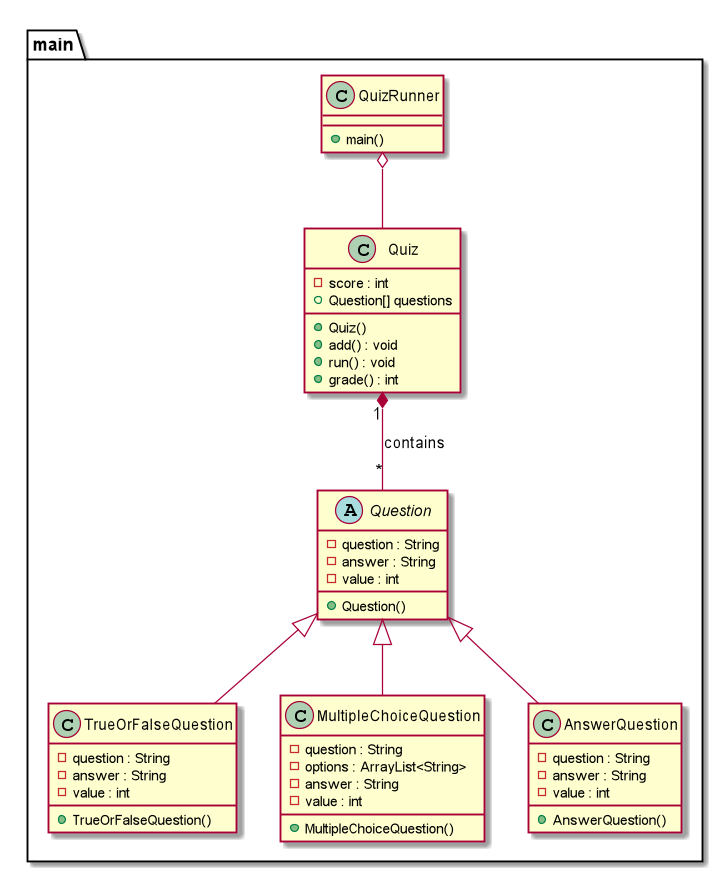

The code for that diagram looks like this.

```
@startuml

package main {
    abstract class Question {
        -question : String
        -answer : String
        -value : int
        +Question()
    }

    class TrueOrFalseQuestion {
        -question : String
        -answer : String
        -value : int
        +TrueOrFalseQuestion()
    }
    class MultipleChoiceQuestion {
        -question : String
        -options : ArrayList<String>
        -answer : String
        -value : int
        +MultipleChoiceQuestion()
    }
    class AnswerQuestion {
        -question : String
        -answer : String
        -value : int
        +AnswerQuestion()
    }

    Question <|-- TrueOrFalseQuestion
    Question <|-- MultipleChoiceQuestion
    Question <|-- AnswerQuestion

    class Quiz {
        -score : int
        +Quiz()
        +Question[] questions
        +add() : void
        +run() : void
        +grade() : int
    }

    Quiz "1" *-- "*" Question : contains

    class QuizRunner{
        +main()
    }
    
    QuizRunner o-- Quiz
}
@enduml
```

There are a couple of things that I don't really like about PlantUML's default scheme, like those circles in the class name and how classes and interfaces don't appear in **bold text**. Fortunately, PlantUML makes it easy to modify the apperance of shapes.

The `skinparam` feature can be used to modify some text appareances. To make our class names bold, add this.

```
skinparam {
    classFontStyle bold
}
```

The circles aren't exactly part of the UML 2.5 spec. We can get rid of them using this.

```
hide circle
```

Another thing you can do is hide any empty sections. In the QuizRunner class, it would be ideal to hide the attributes section of the class object since we didn't use any.

```
hide empty attributes
```

We can add these items anywhere inside the PlantUML syntax so as long as they aren't in any other objects.

```
skinparam {
    classFontStyle bold
}
hide circle
hide empty attributes
```

The modified results look more professional.

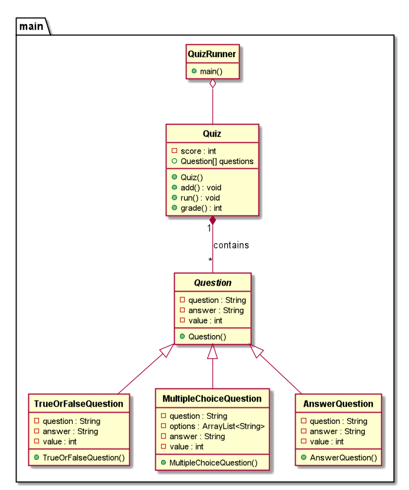

There's a ton of ways you can modify a UML Class Diagram. Keep in mind, PlantUML is not limited to just class diagrams.

#### VSCode

[**Microsoft Visual Studio Code**](https://code.visualstudio.com/), or VSCode is Microsoft's breakout hit of an IDE. If you were using [GitHub's Atom](https://atom.io/) before, kick it to the curb!

🤪 "But Jason, isn't Microsoft an evil corporation trying to take my blood as part of some global conspiracy theory?" ~~WHO TOLD YOU THA~~--I mean *NO*. :wink:

Sure, Microsoft has made some questionable decisions in the past and they still do. But once in a while, they manage to capture lightning in a bottle. (Word, Excel, ~~Coronavi~~--er, XBOX.)

I've been having a good time using this app. And if you are into Node.js, Angular, React, or Vue development, VSCode is the IDE for you.

I wrote a document on [how to Install VSCode back in Unit 1](../Textbook/C.%20Appendices/C10.Software%20Setup.md).  This document is meant for getting PlantUML setup (which probably would have been useful back in Unit 1.)

##### Installation

Installing a PlantUML plugin for VSCode is a little more complicated.

I'm going to assume you have Chocolatey installed. Open an Adminstrative PowerShell (`Window Key + X` then select `Windows PowerShell (Admin)`)

We will need to install two things: [Graphviz](https://www.graphviz.org/) and [PlantUML](http://plantuml.com/).  PlantUML is going want to install [AdoptOpenJDKjre](https://adoptopenjdk.net/) as a dependency even though you should still use the Oracle Java we installed in [How to install Java](./How%20to%20install%20Java.md).

```powershell
choco install -y graphviz plantuml
```

In VSCode, in the Extensions (`Ctrl+Shift+X`) and search "PlantUML" and select the [**PlantUML** extension created by **jebbs**](https://marketplace.visualstudio.com/items?itemName=jebbs.plantuml).

##### Let's try it out!

Create a new file (`Ctrl+N`). The file should end with `.puml`.

To view the PlantUML preview pane, type `Alt+D`.

Try out the code we used for QuizRunner in the IntelliJ instructions.

> :hammer_and_wrench: **TROUBLESHOOTING**: So you did all that, but you see this red circle with an exclamation point inside with this message:
>
> ```
> Error found in diagram {filename}
> WARNING: An illegal reflective access operation has occurred 
> WARNING: Illegal reflective access by net.sourceforge.plantuml.svg.SvgGraphics (file:/C:/Users/{username}/.vscode/extensions/jebbs.plantuml-2.13.9/plantuml.jar) to constructor com.sun.org.apache.xalan.internal.xsltc.trax.TransformerFactoryImpl() 
> WARNING: Please consider reporting this to the maintainers of net.sourceforge.plantuml.svg.SvgGraphics 
> WARNING: Use --illegal-access=warn to enable warnings of further illegal reflective access operations 
> WARNING: All illegal access operations will be denied in a future release 
> ```
>
> :question: What should you do about this?
>
> :exclamation: Replace the `plantuml.jar` file with [this one](http://beta.plantuml.net/plantuml.jar). The link is a beta version.
>
> 1.  Close VSCode first.
> 2. Download that beta `plantuml.jar`
> 3. Replace the `C:/Users/{username}/.vscode/extensions/jebbs.plantuml-2.13.9/plantuml.jar` with the beta `plantuml.jar`
> 4. Reopen VSCode.
> 5. Open a UML file.
> 6. Preview the file with `Alt+D`.
>
> It may take a couple of times for the preview to show up, but it should work. You might need to close the preview frame.
>
> Hopefully the next release will be based on wherever the beta is located or from GitHub.
>
> The only downside with the VSCode version is that you can't save the image or copy the image to the clip board. On the other hand, the VSCode version should allow for `plantuml` to be used as part of a Markdown code block.

And that it! You now have a powerful tool at your disposal to create UML diagrams to display a visual blueprint of your code!

### Mac

> :reminder_ribbon: **TODO**: If anyone has any experience with Macs installing this software, please share!

#### IntelliJ IDEA

#### VSCode

### Linux

> :construction: **UNDER CONSTRUCTION**: It's been a while since I fiddled with some Linux. Chances are, if you want to try it out, I recommend using it through a Virtual Machine like [VirtualBox](https://www.virtualbox.org/) before installing it on a full machine

#### Distribution

> :reminder_ribbon: **TODO**: Eventually I will get around to doing this.

##### Ubuntu and other Debian-Based Linux

##### Fedora and other RedHat-Based Linux

##### Manjaro and other Arch-Based Linux

##### Source (if possible)

#### IntelliJ IDEA

#### VSCode

## Sources

[^ choco ]: [Chocolatey](https://chocolatey.org/).
[^jbt]: [JetBrains Toolbox](https://www.jetbrains.com/toolbox-app/).
[^ idea ]: [JetBrains IntelliJ IDEA](https://www.jetbrains.com/idea/).
[^ puml ]: [PlantUML](https://plantuml.com/).
[^ puml-cd ]: PlantUML. [Class Diagram](https://plantuml.com/class-diagram).
[^ puml-pdf ]: **PlantUML. [*Drawing UML with Plant UML*](http://pdf.plantuml.net/PlantUML_Language_Reference_Guide_en.pdf).**
[^ puml-creole ]: PlantUML. [Creole](https://plantuml.com/creole).
[^ pumli ]: JetBrains Plugin Marketplace. [PlantUML Integration](https://plugins.jetbrains.com/plugin/7017-plantuml-integration). Eugene Steinberg.
[^ pumli-gh ]: Github. [PlantUML Integration](https://github.com/esteinberg/plantuml4idea/). Eugene Steinberg.
[^ umld ]: [UML Diagrams](https://www.uml-diagrams.org/).
[^ umld-cd ]: UML Diagrams. [Class Diagrams Overview](https://www.uml-diagrams.org/class-diagrams-overview.html).
[^ omg-uml ]: Object Management Group. [About the Unified Modeling Language Specification Version 2.5](https://www.omg.org/spec/UML/2.5). May 2015.
[^ gvdot ]: [Graphviz](https://www.graphviz.org/).
[^ vsc ]: [Microsoft Visual Studio Code](https://code.visualstudio.com/).
[^ vsc-puml ]: Microsoft Visual Studio Code Marketplace. [PlantUML](https://marketplace.visualstudio.com/items?itemName=jebbs.plantuml). jebbs.
[^ vsc-puml-gh ]: Github. [VSCode PlantUML](https://github.com/qjebbs/vscode-plantuml). Jebbs.
[^ vbox ]: [Oracle VirtualBox](https://www.virtualbox.org).
[^ cp-fh ]: Code Project. [UML Made Easy with PlantUML & VS Code](https://www.codeproject.com/Articles/1278703/UML-Made-Easy-with-PlantUML-VS-Code). Fiyaz Hasan. March 1, 2019.
[^ puml-forum ]: PlantUML Forum. [Illegal reflective access by net.sourceforge.plantuml.svg.SvgGraphics](https://forum.plantuml.net/10650/illegal-reflective-access-sourceforge-plantuml-svggraphics). Jan 13, 2020.

