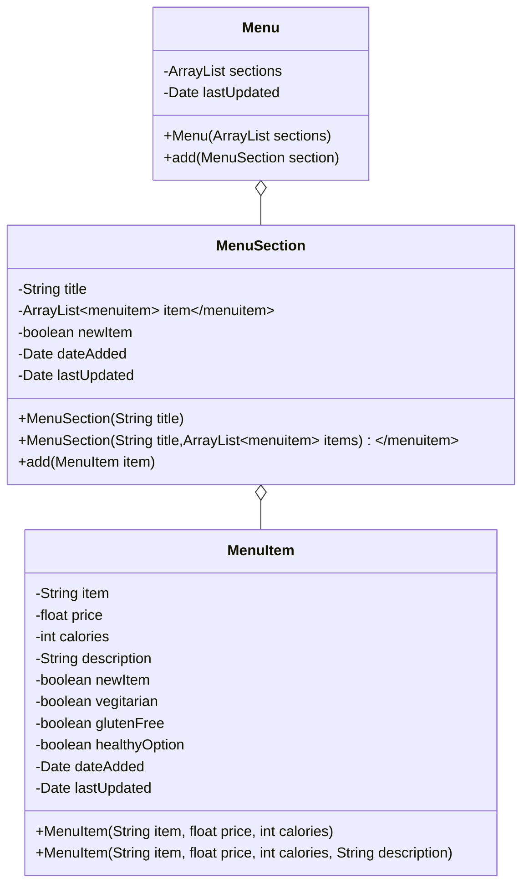

# Studio 4.8

> TODO: Continue with the studio in chapter 5
>
> TODO: Replace this Mermaid generated UML diagram with one made by PlantUML

## Questions

* What properties did you give your classes?
  * name of the items
  * how much those items cost
  * description of the item
* Why did you use the types you chose for those properties?
  * Basic stuff to ask.
* Was there a specific restaurant you were thinking of when designing this?
  * Any restaruant
* One thing I liked about your design was ...
* One thing I did differently in my design was ...
  * Added a MenuSection class to group MenuItems together.
* One suggestion I have for your design is ...
  * Add a MenuSection class

---

Stand-up closer

What did you accomplish today?
What do you hope to accomplish between today and next class?
What is preventing you from completing your goal?

---

What's going on here? A `MenuItem` is part of a `Menu` . 

## Associations

The line between the two classes indicates **association**. However, there are many kinds of association, but the two I want to explain here are **aggregation** and **composition**.

**Aggregation** implies a relationship between a parent class and a child class can exist independetly of each other.

**Composition** implies a relationship between a parent class and a child class can not exist independently of each other.

Associations are not the same as generalizations because a generalization is used to describe inheritance. The parent class of a set of subclasses is more generalizes than the subclass that inherits properties from it.

Specialization is the reverse process of generalization. Think of this as how interfaces work in that the subclasses are a specialization of the parent class.

## Meanwhile...

In our case, the diamond indicates that the instance of a class (`MenuItem`) is part of the instance of another class (`Menu`).

