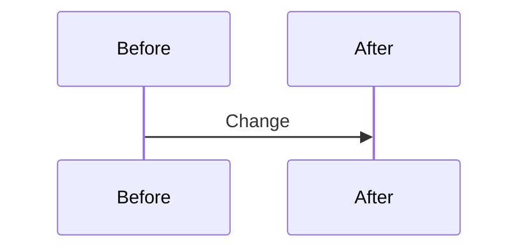
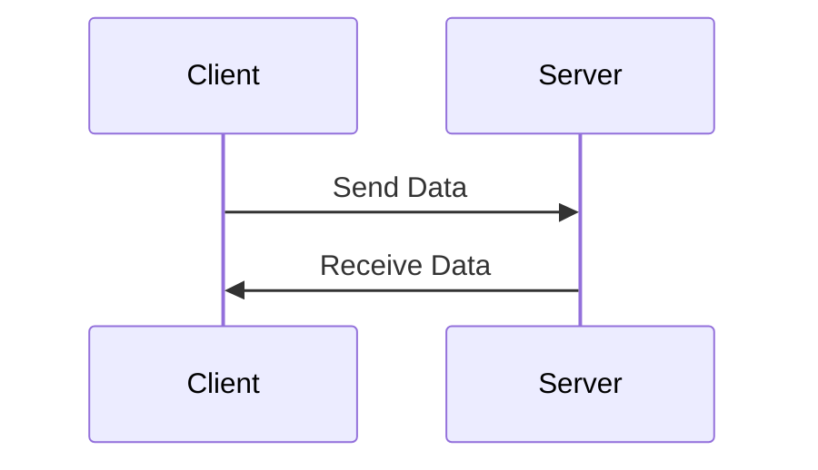

# 2. How Programs Work

[toc]

---

## 2.1. Introduction

At the most basic level, a **program**, is a set of instructions that tells a computer or other machine what to do. These instructions consist of a set of commands, calculations, and manipulations that achieve a specific result.

A **programmer** has to figure out a series of steps for the computer to follow and in a way that the computer can understand.

### 2.1.1. Algorithms

An **algorithm** is a systematic series of steps that, when followed, produce a specific result to help solve a problem. Programmers design algorithms to solve these small steps in a carefully planned way. The results then get combined to produce a final answer or action.

### 2.1.2. Check Your Understanding :white_check_mark:

> :question: **Question**: Select all of the following problems that can be solved by using an algorithm.
>
> * [x] a. Answering a math problem.
> * [x] b. Sorting numbers in decreasing order.
> * [x] c. Making a peanut butter and jelly sandwich.
> * [x] d. Assigning guests to tables at a wedding reception.
> * [x] e. Creating a grocery list.
> * [x] f. Suggesting new music for a playlist.
> * [x] g. Making cars self-driving.
>
> :exclamation: **Answer**: All of the above!

## 2.2. Programming Languages

Computer operate using **binary code**, which consists of only zeros and ones. Those zeros and ones are called **bits**!

Bits are often bundled in groups of 8 called a **byte**. Each byte can be better represented in **hexadecimal** values. A hexadecimal is a number represented by the numbers 0 through 9 plus the letters A through F representing the values 10 through 15.

> 🧪 **Experiment: Count in Binary and Hexadecimal!** Read my notes in the [Counting.md](../../My%20LC%20Notes/Computer%20Science/Counting.md) file in the Computer Science folder!
>

If you read my Counting notes, it provides insight as to how `Hello World` in ASCII, translates into `48 65 6c 6c 6f 20 57 6f 72 6c 64` in hexadecimal and into `01001000 01100101 01101100 01101100 01101111 00100000 01010111 01101111 01110010 01101100 01100100` in binary.

> :information_source: **NOTE**: I like to take a lot of mathematical notes. You'll likely see a lot of this later when we start using math formulas.

### 2.2.1. Languages

Writing code in binary is impractical, so years ago computer scientists designed a way to convert between text readable by humans and the hexadecimal and binary forms needed by machines.

A **programming language** is a set of specific word and rules for teaching a computer how to perform a desired task.  JavaScript is the programming language we are learning in this course.

JavaScript is considered a **high-level language**. High-level languages can be written and understood by humans and each one has its own characteristic vocabulary, style, and syntax.

A **low-level language** is understood by machines. Generally this is assembly language or machine code.

#### 2.2.1.1. How Computers Run Programs

Some languages like C, C++, and Java need a program called a **compiler** to convert code into a low-level language called **assembly language** which another program called an **assembler** can convert assembly language into the binary **machine code**.

### 2.2.2. How Many Programming Languages Are There?

A lot. Thousands probably.

## 2.3. The JavaScript Language

**JavaScript** is one of many programming languages, each of which serves different purposes. Programmers mainly use JavaScript for web development, and it is currently the most popular language that ==runs inside a web browser==. This means that the code loads at the same time as a web page can modify the content. JavaScript add or remove text, change colors, produce animations, and react to mouse and keyboard clicks. This makes the web page *dynamic*--it respond to user actions in real time, and changes occur without having to refresh the browser.

Because JavaScript is dynamic, this allows immediate updates to your profile when you change post a status update on social media, change the color of the `Submit` button after you complete a form, generate a map when you request directions, or create a sparkly trail that follows the mouse cursor.  These are all examples of **front end** development. They are present on your computer.

The other side of development is called **back end** development and it involves passing data between web pages and servers. JavaScript can be used for backend development but other languages like Java, C#, and PHP are industry standards. When you fill out a form online and click `Submit`, the back end code transfers the information you entered to the company that posted the form. Your information now exists on the company's server.

The ins and outs of how the internet works won't be covered here. Also, I took a most of Cisco Certified Networking Academy, and what I learned from that was it's way more complicated than the sequence diagrams in the next section imply.

### 2.3.1. Front End vs. Back End Changes

> :information_source: **NOTE**: I added 2.3.1.1. and 2.3.1.2.

#### 2.3.1.1. Front End Development

> *Corporal stops the tape, then Dark Helmet and Sandurz come across an image of themselves viewing the screen. As they react, the screen mimics what they are doing]*
> **Dark Helmet**: What the Hell am I looking at?! When does *this* happen in the movie?!
> **Colonel Sandurz**: "Now." You're looking at "now," sir. Everything that happens now *[indicates himself and Helmet]* is happening "now." *[Indicates the screen]*
> **Dark Helmet**: What happened to "then"?
> **Colonel Sandurz**: We passed "then."
> **Dark Helmet**: When?
> **Colonel Sandurz**: Just now. We're at "now," now.
> **Dark Helmet**: Go back to "then"!
> **Colonel Sandurz**: When?
> **Dark Helmet**: Now!
> **Colonel Sandurz**: *Now?*
> **Dark Helmet**: Now!
> **Colonel Sandurz**: I can't.
> **Dark Helmet**: Why?!
> **Colonel Sandurz**: We missed it.
> **Dark Helmet**: When?!
> **Colonel Sandurz**: Just now.
> **Dark Helmet**: ... When will "then" be "now"?
> **Colonel Sandurz**: *Soon*.
>
> --*SpaceBalls: The Movie* (1987)

Here's an unusual example of a **sequence diagram** illustrating the initial state of the Web Browser (`Before`) and the final state after a change (`After`).  Generally, a sequence diagram like the one below, we would show the transfer of data between two devices. But since Front End development is the transfer of data between the computer's initial state and the final state, let's pretend the computer we have now and the computer we have later are two different devices



> :kiss: **K.I.S.S.**: Maybe I put way too much effort into this section?

#### 2.3.1.2. Back End Development

Here is a more common form of the sequence diagram where we actually have two devices this time. Data is generally transferred between devices in units called in **packets**. Packet transfer is a lot more complicated than this especially since the path between the Client computer where the web browser is and the Server computer where the program that processes the data, sometimes between a database which may or may not be on the same device.

The straightforward answer is that the Cliint sends data to the Server to process and the Server returns data to the Client to display.



## 2.4. Your First Program

In this section, we will write the first program that just about everyone writes when they start programming in a new programming language: "Hello World".

This exercise asks you to create and run small amounts of code, and it reinforces the LaunchCode principle of learning by doing. 

### 2.4.1. Create a Repl.it Account

First, we need to create a Repl.it account. If you already have one, good. If not this section is for you.

I recommend signing up for one with a Github account rather than Google or Facebook. Alternatively, you can create an account with a new user name and password, but the advantage of using a Github account as your login is that you can transfer coding projects you make on Repl.it to Github later.

While we don't really work with Git until about [Chapter 22](22.Git.md), signing up for [Github](https://github.com/) now, will be extremely helpful now since we can use the same login for sites Repl.it or [CodePen.io](https://codepen.io).

Throughout this book you wil need to access a code editor to complete practice problems, exercises, studios, and assignments.

If you haven't done so already, create a new account with [Repl.it](https://repl.it/signup). This site provides a free space to practice coding.

> :information_source: **NOTE**: As I said eariler, it will be better if you sign up for Github, then use your Github credentials to create your Repl.it account.

After you sign in, you will see your *dashboard*, which displays any saved folders or projects. If you just started, the dashboard will be empty. If you aren't new to the site, now would be a good time to organize your older projects and put them in a folder somewhere.

> :information_source: **NOTE**: These examples are for *standard repl.it* use. We covered instructions for using *Repl.it Classroom* back in [Chapter 1](01.Introduction.md "1.4.2.3. Repl.it Classroom").

Click on **`New repl`** to begin a new project. Scroll through the options and select "Node.js". This will be the platform we will use for most of the examples in this course.

Next, name your project and click **`Create Repl`**.

> :warning: **CAUTION**: Don't fill out the Github address. There's nothing wrong with it, it's just that in most of these exercises we won't need to use one. Also, this is just a reminder for the few folks who aren't paying attention as to which field is for naming your Repl.it project.

#### 2.4.1.1. The Repl.it Workspace

Let's take a look at what's part of the **Repl.it Workspace**. This site is basically what programmers like to call a *"sandbox"*, because like a sandbox it is a place to play around, try out new things, make messes, and learn from mistakes.

Here are some features of the sandbox.

> :scream: **UH OH!** Some things have moved around!
> :reminder_ribbon: **TODO**: Update the descriptions of the things that appear in this list!

1. **File panel and menus**: On the left hand side, we have the file panel and the menus that allow you to add extension, udate setting, and add, open, or delete files.
2. **Editor Panel**: Next to the File Panel is the editor. Code goes here. Click a file in the File Panel and it will open in the eidotr. For most new porjects, an `index` file will be created and openned by default. (:reminder_ribbon: **TODO**: Do they mean `index.js`?)
3. **Console Panel**: On the right side is the console panel. Any output produced by your code will appear in this panel. The console also displays error messages, test results, and other information.
4. **`Fork` Button**: The button just left of center in the header is the `Fork` Button. If you are viewing someone else's project, you can *fork* the content and sotre a copy of it to your own account. I spoke about how `Fork` works back in Chapter 1. Use caution when forking.
5. **`Run` Button**: The button in the center of the header is the the `Run` Button. It will execute any code written in the `index` file.
6. **`Share` Button** and **`New Repl` Button**
   * The `Share` Button, just right of center in the header, can be used to share your projects
   * The leftmost button in the right column of the header is the `New Repl` Button, which is used to create a new Repl. This differs from the functions of the File Panel where you can create a new file or folder for the Repl that is currently open.

> :dark_sunglasses: **Apagando las luces!**
> By default the workspace uses the "light" theme, but if you would like to use the "dark" theme, click the ​g​ea​r​ ​i​co​n:gear: on the far left next to the File Panel and select the "dark" theme.  I wish they had a [Synthwave '84](https://github.com/robb0wen/synthwave-vscode) theme.

### 2.4.2. Begin Your Coding Journey

Are you all set up? Logged in? Then let's get started!

1. Follow this [Hello World link](https://repl.it/@launchcode/HelloWorldJS) to open a prepared workspace for your first program.

2. If there is a Fork button, click on it to fork this project. If there isn't one, start typing. The a fork should auto-generate. Remember: You may need to enter any text that didn't make it into the Repl if it didn't make it in there.

3. On line 2 of the editor type:

   ```js
   console.log("Hello, World!");
   ```

4. When you are finished typing click the `Run` button.

> :warning::x::ramen: **WARNING! NO COPYPASTA!**
> *Copypasta* is slang for ""Copy and Paste".
> **DO NOT** just "copy and paste the code from the book or these notes into an editor or console.
> **DO** type, try, change, and fix stuff.
> You wouldn't copypasta the tests on [TypingTest.com](https://www.typingtest.com/). So why do that here?

If you typed correctly, you should have seen `Hello, World!`. If you opmitted or mistyped any character, then you either saw a misspelled output or an error message with some hints as to what went wrong.

> :hotdog: **If every porkchop were perfect, we wouldn't have hotdogs!**
> Don't worry if you don't get it right the first time around. Making mistakes are common and the many failing experiences we have allow us to learn how to do it right. (Just dont't fail the class! :wink:)  Fix any error and try again.

#### 2.4.2.1. Now Play

Once you print `Hello, World!` successfully, go back and play around with the code. Make a change, click `Run`, and see what happens.

Try doing something like:

1. Change the message that was printed.
2. Are parenthesis necessary? (Hint: YES!)
3. Are the quotation marks necessary? (Hint: Also, YES!)
   1. Can I just use one? (Hint: NO! You need a pair.)
   2. Can I used single quotes instead of double quotes? (Yes.)
   3. Can I mix quotes? (Hint: NO!)
   4. Are there any significant differences between using single and double quotes?
4. Do I need the semi-colon? (Hint: Not really, at least not in this case.)
5. Print a number. (Bonus: Print two numbers added together).
6. Print multiple messages one after the other.
7. Print two messages on the same line.
8. Print a message that contains quotation marks, e.g. `Quote the Raven "Nevermore"`.
9. Whatever else!

Spend a few minute trying out stuff including the stuff in the list. Don't worry if yu miss some of the targets or don't do them all. What you should still do is try out stuff. Learning comes through experience, and you will learn all the details being `console.log` soon.

Once you finished practicing (and making some mistakes along the way), you'll have a pretty good idea of how the `console.log` function in JavaScript works.

> 🧩**Try It**
> On paper or in a document on you computer, write one or two sentences about the `console.log`.
> (Hint: Provide more detail than "It prints things".)

> :reminder_ribbon: **TODO**: Backtick examples.
> Backtick features were added in ES6. So far there's no examples of it!

### 2.4.3. Check Your Understanding :white_check_mark:

> :question: **Question**: Which of the following corretly prints `Coding Rocks`? (There may be more than one valid answer.)
> a. `console.log(Coding Rocks)` :x: (String not in quotes)
> b. `console.log(Coding Rocks);` :x: (String not in quotes)
> c. `console.log('Coding Rocks')` :heavy_check_mark: (It should have a semicolon at the end, but it's acceptable.)
> d. `console.log("Coding Rocks');` :x: (Mixed quotes!)
> e. `console.log("Coding Rocks");` :heavy_check_mark: (PERFECT!)

:checkered_flag: That chapter was a lot longer that it looked! **Up next: [How to Write Code](03.How%20to%20Write%Code.md)**

---

#LaunchCode

