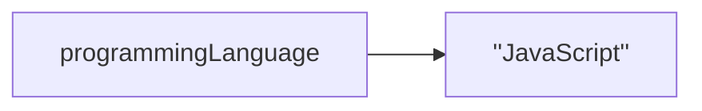
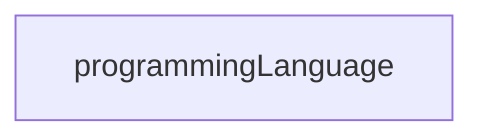

# 4. Data and Variables

[toc]

---

## 4.1. Values and Data Types

Programs may be though of as being made up of two things:

1. Data
2. Operations that manipulate data

This chapter will focust on the Data point.

Data can be stored in a program in various ways. The most basic unit of data is a **value**, a specific piece of data such as a word or number. Each value belongs to a category called a **data type**. We'll see many different data types throughout this course. The first two to become familiar with are **number** and **string** types.

Numeric values such as `4` and `3.3` are `Number` type. Sequences of characters inclused in quotes, such as `Hello, World!`, are `String` type. Strings must be enclosed in single or double quotes. (**NOTE:** You can now use back tick quotes! More on this later!)

If you are not sure what data type a value has, you can use the **`typeof`** operator.  An **operator** is an entity similar to a function that carries out some kind of action, though the syntax is different from that of functions.

> :page_facing_up: **SYNTAX**: Although you can use `typeof` without parenthesis following it, it is recommended that you do so.
>
> ```js
> typeof "Hello, World";		// ✅ (Acceptable)
> typeof("Hello, World");		// ✅ (Recommended)
> ```
>
> Both of those examples will return `string`.

Let's try out the `typeof` operator.

```js
console.log(typeof "Hello, World!");	// string
console.log(typeof 17);				   // number
console.log(typeof 3.14);			   // number
```

### 4.1.1. More on Strings

If you quote numbers, they are no longer number but strings.

```js
console.log(typeof "17");		// string
console.log(typeof "3.2");		// string
```

Strings can be single or double quoted.

```js
console.log(typeof 'This is a string');		// string
console.log(typeof "And so is this");		// string
```

Double quoted strings can have single quotes inside them and single quote string can have double quotes inside them.  JavaScript won't care if ouuse single or double quotes to surroind your string. Once it has parsed the text of your program or command, the way it stores the value is identical in call cases, and the surrounding quotes are not part of the value.

```js
console.log('We are the Knights Who Say "Ni!"');		// ✅
console.log("No! Not the the Knights who say 'Ni!'");	// ✅
console.log("Oh my Lord! It's Them!");					// ✅
console.log('Don't Say that word!');					// ❌ (Odd numer of quotes)
```

### 4.1.2. More on Numbers

When you type large integer values, you might be tempted to use commans between three groups of digits as in `42,000`. But this is NOT a legal integer in JavaScript, but it does mean something else in the `console.log` which is legal.

```js
console.log(42000);			// 42000		// ✅ (Proper)
console.log(42,000);		// 42 0			// ✅ (Outputs 42 and 0)
```

JavaScript chose to treat `42,000` as a *pair* of values. In fact, the `console.log` function can print any number of values as long as you separate them by commas. Notice that the values are separated by spaces when they are displayed.

```js
console.log(42, 17, 56, 34, 11, 4.35, 32);	 // 42 17 56 34 11 4.35 32
console.log(3.4, "hello", 45);				// 3.4 'hello' 45
```

> :information_source: **NOTE**: Remember not to put commas or spaces in your integers, no matter how big they are.  Also, revisit what we said in [How Programs Work](02.How%20Programs%20Work.md): formal languages are *strict*, the notation is *concise*, and even the smallest chage might mean something quite different from what you intended (*literal*!)

### 4.1.3. Type Systems

Every programming langauge has a **type system**, which is the set of rules that determine how the languages deal with data of different types. Namly, how values are divided up into different data types is one characteristic of a type system.

In many programming laugnages, **integers** (*whole numbers*) and **floats** (short for *floating-point numbers*, or decimals) are considered to be different data types. For example, in Python `42` is of the `int` (integer) data type, while `42.0` (with that decimal and zero at the end) is of the `float` data type.

> :information_source: **NOTE**: While JavaScript does not distinguish between flaots and integers, at times you may wish to do so. For examples, an inventory-tracking program stores items and the number of each number in stock. Since a store can't have 3.5 shirts in stock, the programmer makes the quantity of each item integer values as opposed to floats.

When discussing the difference between programming languages, the detail of the type systems are one of the many factors that programmers consider. There are other aspects of type systems beyound just how values are categoriezed. We'll explore these later.

### 4.1.4. Check Your Understanding :white_check_mark:

> :question: **Question**: Which of these is not a data type in Javascript?
> a. `number`
> b. `string`
> c. `letter` :arrow_left:
> d. `object`
>
> :exclamation: **Answer**: c. `letter` is not a data type!

## 4.2. Type Conversion

Sometimes it's necessary to convert values from one type to another. JavaScript provides a few simple functions that will allow us to convert values to different data types. The function **`Number`** and **`String`** will attempt to covert their arguments into types `number` and `string`, respectively. These are called **type conversion** functions.

### 4.2.0. Type Conversion Functions

> :information_source: **NOTE**: I added these subsections.

#### 4.2.0.1. Number

The `Number` function can take a string and convert it into an integer.

```js
console.log(Number("2345"));			// 2345
console.log(typeof Number("2345"));		 // 'number'
console.log(typeof(Number("2345")));	 // 'number'
console.log(Number(17));				// 17
console.log(Number("23bottles"));		// NaN
```

Whoops! Loop like that last one didn't convert into a number. Instead it returned **`NaN`** or "not a number".  `NaN` is a **special value** that represents that state of not being a number.  The example on line 5 shows that a string has to be a syntactically legal number for conversion to go as expected. Values like `"34"` and `"-2.5"` will convert into number `34` and `-2.5`, but `"Alexander Hamilton"` will return `NaN`.  If the value cannot be cleanly converted to a number then `NaN` will be returned.

#### 4.2.0.2. String

The type conversion function **`String`** turns its argument into a string. Remember, that when we print a string, the quotes may be removed. However, if we print the type, we see that it is definitely `'string'`.

```js
console.log(String(17));			// '17'
console.log(String(123.45));		// '123.45'
console.log(typeof String(123.45));	// 'string'
console.log(String("23bottles"));	// '23bottles'
```

This time the `"23bottles"` example returns a string!

### 4.2.1. Check Your Understanding :white_check_mark:

> :question: **Question**: Which of the following strings result in `NaN` when passed to `Number`? (Feel free to try running each of the conversions).
> a. `'3'`
> b. `'three'` :arrow_left:
> c. `'3 3'` :arrow_left:
> d. `'33'`
>
> :exclamation: **Answer**: b and c.
>
> ```js
> console.log(Number('3'));		// 3
> console.log(Number('three'));	// NaN
> console.log(Number('3 3'));		// NaN
> console.log(Number('33'));		// 33
> ```

## 4.3. Variables

One of the most powerful features of a programming language is the ability to manipulate variables. A **variable** is a name that refers to a value. Recall that a **value** is a single, specific piece of data, such as a specific number or string. Variables allow us to store values for later.

A useful visual analogy for how a variable works is that a label *points* to a piece of data.

> :dolphin: **Mermaid Note**: We can't seem to insert double quotes, so in the below figure, let's fake it with two sets of single quotes on each side for now. (:reminder_ribbon: **TODO**: Find out why we can't use double quotes later. ) This note isn't important to the lesson. It's something for me to fix later.



In the above figure, the name `programmingLanguage` points to the string value `"JavaScript"`. This is more of an analogy, since it also represents how a variable and its value are stored in a computer's memory.  With this analogy in mind, let's look at how we can formally create variables in JavaScript.

### 4.3.1. Declaring and Initializing Variables with `let`

To create a variable in JavaScript, create a new name for the variable and precede it with the keyword `let`:

```js
let programmingLanguage;
```

This creates a variable named `programmingLanguage`. The act of creating a variable is referred to as **variable declaration** or simply **declaration**.

Once a variable has been declared, it may be given ("assigned") a value using an **assignment statement**, which uses the equal operator (`=`) to give an variable a value.

```js
let programmingLanguage;
programmingLanguage = "JavaScript";
```

The act of assigning a variable a value for the first time is called **initialization**.  Often when we do this, we say we "set the *intial* value" or "we *initialize* a variable." 

Let's look at those two lines in the previous code example in detail.

The first line creates a variable that does not yet have a value. The variable is a label that does not point to any data. The result of `let programmingLanguage;`.



The second line assigns the variable as a value, which connects the name to the given piece of data. The result of `programmingLanguage = "JavaScript";`.


It is possible to declare *and* initialize a variable with a single line of code. This is the most common way to create a variable.

```js
let programmingLanguage = "JavaScript";
```

> :black_flag: **Old and Busted, New Hotness**: "What about `var`?"
> You will see some programmers use `var` to create a variable in JavaScript, like this:
>
> ```js
> var programmingLanguage = "JavaScript";
> ```
>
> While this is valid syntax, it is recommended to use the new `let` keyword instead of the old `var`. Using `var` is old JavaScript syntax, and it differs from `let` in important ways that we will learn about later. When you see examples using `var`, use `let` instead. (It might be a good idea to replace the `var`s with `let`s. We'll find out later if that's a good idea.) (:reminder_ribbon: **TODO**: ASK!)
>
> If you are curious about the differences, read about [the differences between `var` and `let`](https://developer.mozilla.org/en-US/docs/Learn/JavaScript/First_steps/Variables#The_difference_between_var_and_let) .

To give a variable a value, use the **assignment operator** (`=`). This operator should not be confused with the concept of *equality**, which expresses whether two things are the "same". (We will see later that equality uses the `===` operator.) The assignment statement is a *name*, on the left-hand side of the operator, with a *value*, on the right-hand side. This is why you will get an error if you try to run the following example:

```js
"JavaScript" = programmingLanguage;		// ❌
```

An assignment statement must have the name on the left and the value on the right.

> :information_source: **NOTE**: When you thing of assignment think of this:
> :white_check_mark: `programmingLanguage` *is assigned* `'JavaScript'`.
> :white_check_mark: `programmingLanguage` *gets/has the value* `'JavaScript'`.
> Don't think of the word "equals" or "is equal to" as it implies *equality*.
> :x: `programmingLanguage` *equals* `'JavaScript'`.
>
> OK, this aside is bunk. But let's roll with it for now.

> :warning: **Warning**: What if you leave off `let` when declaring a variable?
>
> ```js
> programmingLanguage = "JavaScript";
> ```
>
> JavaScript won't complain or throw an error. In fact, creating a variable without `let` is valid syntax, but it results in very different behavior. Such a variable will be treated as a **global variable**, which we will discuss later.
>
> The main point to keep in mind for now is that you should *always* use `let` unless you have a specific reason not to do so.

### 4.3.2. Evaluating Variables

After a variable is created, it may be used later in a program anywhere a value may be used. For example, `console.log` prints a value, but we can also give `console.log` a variable. In the following example, line 1 will return the same results as line three because of line 2.

```js
console.log("Hello, World!");		// 'Hello, World!'
let message = "Hello, World!";
console.log(message);				// 'Hello, World!'
```

When we refer to a variable name, we are **evaluating** the variable. The effect is just as if the value of the variable is substituted for the variable name in the code when executed.

```js
let message = "What's up, Doc?";
let n = 17;
let pi = 3.14159;

console.log(message);		// "What's up, Doc?"
console.log(n);				// 17
console.log(pi);			// 3.14159
```

In each case, the printed result is the value of the variable.

Like values, variables also have types. We determine the types of a variable the same way we determine the type of a value using `typeof`.

```js
// continuing from the previous code example
console.log(message);		// 'string'
console.log(n);				// 'number'
console.log(pi);			// 'number'
```

The type of a variable is the type of the data it currently refers to.

### 4.3.3. Reassigning Variables

We use variables in a program to "remember" things, like the current score at the football game. As their name implies, variables can change over time, just like the scoreboard at a football game.  You can assign a value to a variable, and later assign it to a different value.

```js
let day = "Thursday";
console.log(day);			// "Thursday"

day = "Friday";
console.log(day);			// "Friday"

day = 21;
console.log(day);			// 21
```

Notice, that we changed the value of day three times, and in the third assignment, we even give it a value that is of a different data type.

A great deal of programming involves asking the computer to remember things. For example, we might want to keep track of the number of missed calls on you phone. Each time another call is missed, we can arrange to update a variable so that it will always reflect the correct total of missed calls.

> :information_source: **NOTE**: We only use `let` when *declaring* a variable, that is, when we created. We do NOT use `let` when reassigning the variable to a different value. In fact, doing so will result in a error.

### 4.3.4. Check Your Understanding :white_check_mark:

> :question: **Question**: What is printed when the following code executes?
>
> ```js
> let day = "Thursday";
> day = 32.5;
> day = 19;
> console.log(day);
> ```
>
> a. Nothing is printed. A runtime error occurs.
> b. `Thursday`
> c. `32.5`
> d. `19` :arrow_left:
>
> :exclamation: **Answer**: d.

> :question: **Question**: How can you determine the type of a variable?
> a. Print out the value and determine the data type based on the value printed.
> b. Use `typeof`. :arrow_left:
> c. Use it in a known equation and print the result.
> d. Look at the declaration of the variable.
>
> :exclamation: **Answer**: b.

> :question: **Question**: Which line is an example of variable initialization? (Note: only one line is such an example.)
>
> ```js
> let a;
> a = 42;
> a = a + 3;
> ```
>
> :exclamation: **Answer**: Line 1.

## 4.4. More on Variables

The previous section coverd creating, evaluating, and reassigning variables. This section will cover some additional, more nuanced topics relating to variables.

### 4.4.1. Creating Constants with `const`

One of the key featueres of variables we've discussed so far is their ability to change value. WE can create a variable with one value then reassign it to another value.

```js
let programmingLanguage = "JavaScript";		// ✅
programmingLanguage = "Python";			    // ✅
```

In some situation, we want to create variables that CANNOT change value

### 4.4.2. Naming Variables

#### 4.4.2.1. Valid Variable Names

#### 4.4.2.2. Good Variable Names

#### 4.4.2.3. Camel Case Variable Names

### 4.4.3. Keywords

### 4.4.4. Check Your Understanding :white_check_mark:

## 4.5. Expressions and Evaluation

## 4.6. Operations

### 4.6.1. Operators and Operands

### 4.6.2. Arithmetic Operators

### 4.6.3. Order of Operations

### 4.6.4. Check Your Understanding :white_check_mark:

## 4.7. Other Operators

### 4.7.1. The String Operator `+`

### 4.7.2. Compound Assignment Operators

## 4.8. Input with `readline-sync`

### 4.8.1. Requesting Data

### 4.8.2. Syntax

#### 4.8.2.1. Load the Module

#### 4.8.2.2. How to Prompt the User

### 4.8.3. Critical Input Detail

### 4.8.4. Check Your Understanding :white_check_mark:

## 4.9. Exercises: Data and Variables :runner:

### 4.9.1. The Data

### 4.9.2. The Exercise 

## 4.10. Studio: Data and Variables :studio_microphone:

### 4.10.1. Before You Start

### 4.10.2. Declare and Initialize Variables

### 4.10.3. Generate the LC04 Form

#### 4.10.3.1. Example Output

### 4.10.4. Show Off Your Code

### 4.10.5. Bonus Mission :rocket:


---

#LaunchCode