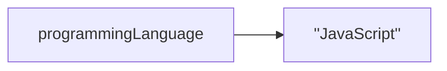
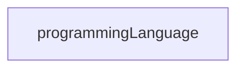

# 4. Data and Variables

[toc]

---

## 4.1. Values and Data Types

Programs may be though of as being made up of two things:

1. Data
2. Operations that manipulate data

This chapter will focust on the Data point.

Data can be stored in a program in various ways. The most basic unit of data is a **value**, a specific piece of data such as a word or number. Each value belongs to a category called a **data type**. We'll see many different data types throughout this course. The first two to become familiar with are **number** and **string** types.

Numeric values such as `4` and `3.3` are `Number` type. Sequences of characters inclused in quotes, such as `Hello, World!`, are `String` type. Strings must be enclosed in single or double quotes. (**NOTE:** You can now use back tick quotes! More on this later!)

If you are not sure what data type a value has, you can use the **`typeof`** operator.  An **operator** is an entity similar to a function that carries out some kind of action, though the syntax is different from that of functions.

> :page_facing_up: **SYNTAX**: Although you can use `typeof` without parenthesis following it, it is recommended that you do so.
>
> ```js
> typeof "Hello, World";		// ✅ (Acceptable)
> typeof("Hello, World");		// ✅ (Recommended)
> ```
>
> Both of those examples will return `string`.

Let's try out the `typeof` operator.

```js
console.log(typeof "Hello, World!");	// string
console.log(typeof 17);				   // number
console.log(typeof 3.14);			   // number
```

### 4.1.1. More on Strings

If you quote numbers, they are no longer number but strings.

```js
console.log(typeof "17");		// string
console.log(typeof "3.2");		// string
```

Strings can be single or double quoted.

```js
console.log(typeof 'This is a string');		// string
console.log(typeof "And so is this");		// string
```

Double quoted strings can have single quotes inside them and single quote string can have double quotes inside them.  JavaScript won't care if ouuse single or double quotes to surroind your string. Once it has parsed the text of your program or command, the way it stores the value is identical in call cases, and the surrounding quotes are not part of the value.

```js
console.log('We are the Knights Who Say "Ni!"');		// ✅
console.log("No! Not the the Knights who say 'Ni!'");	// ✅
console.log("Oh my Lord! It's Them!");					// ✅
console.log('Don't Say that word!');					// ❌ (Odd numer of quotes)
```

### 4.1.2. More on Numbers

When you type large integer values, you might be tempted to use commans between three groups of digits as in `42,000`. But this is NOT a legal integer in JavaScript, but it does mean something else in the `console.log` which is legal.

```js
console.log(42000);			// 42000		// ✅ (Proper)
console.log(42,000);		// 42 0			// ✅ (Outputs 42 and 0)
```

JavaScript chose to treat `42,000` as a *pair* of values. In fact, the `console.log` function can print any number of values as long as you separate them by commas. Notice that the values are separated by spaces when they are displayed.

```js
console.log(42, 17, 56, 34, 11, 4.35, 32);	 // 42 17 56 34 11 4.35 32
console.log(3.4, "hello", 45);				// 3.4 'hello' 45
```

> :information_source: **NOTE**: Remember not to put commas or spaces in your integers, no matter how big they are.  Also, revisit what we said in [How Programs Work](02.How%20Programs%20Work.md): formal languages are *strict*, the notation is *concise*, and even the smallest chage might mean something quite different from what you intended (*literal*!)

### 4.1.3. Type Systems

Every programming langauge has a **type system**, which is the set of rules that determine how the languages deal with data of different types. Namly, how values are divided up into different data types is one characteristic of a type system.

In many programming laugnages, **integers** (*whole numbers*) and **floats** (short for *floating-point numbers*, or decimals) are considered to be different data types. For example, in Python `42` is of the `int` (integer) data type, while `42.0` (with that decimal and zero at the end) is of the `float` data type.

> :information_source: **NOTE**: While JavaScript does not distinguish between flaots and integers, at times you may wish to do so. For examples, an inventory-tracking program stores items and the number of each number in stock. Since a store can't have 3.5 shirts in stock, the programmer makes the quantity of each item integer values as opposed to floats.

When discussing the difference between programming languages, the detail of the type systems are one of the many factors that programmers consider. There are other aspects of type systems beyound just how values are categoriezed. We'll explore these later.

### 4.1.4. Check Your Understanding :white_check_mark:

> :question: **Question**: Which of these is not a data type in Javascript?
> a. `number`
> b. `string`
> c. `letter` :arrow_left:
> d. `object`
>
> :exclamation: **Answer**: c. `letter` is not a data type!

## 4.2. Type Conversion

Sometimes it's necessary to convert values from one type to another. JavaScript provides a few simple functions that will allow us to convert values to different data types. The function **`Number`** and **`String`** will attempt to covert their arguments into types `number` and `string`, respectively. These are called **type conversion** functions.

### 4.2.0. Type Conversion Functions

> :information_source: **NOTE**: I added these subsections.

#### 4.2.0.1. Number

The `Number` function can take a string and convert it into an integer.

```js
console.log(Number("2345"));			// 2345
console.log(typeof Number("2345"));		 // 'number'
console.log(typeof(Number("2345")));	 // 'number'
console.log(Number(17));				// 17
console.log(Number("23bottles"));		// NaN
```

Whoops! Loop like that last one didn't convert into a number. Instead it returned **`NaN`** or "not a number".  `NaN` is a **special value** that represents that state of not being a number.  The example on line 5 shows that a string has to be a syntactically legal number for conversion to go as expected. Values like `"34"` and `"-2.5"` will convert into number `34` and `-2.5`, but `"Alexander Hamilton"` will return `NaN`.  If the value cannot be cleanly converted to a number then `NaN` will be returned.

#### 4.2.0.2. String

The type conversion function **`String`** turns its argument into a string. Remember, that when we print a string, the quotes may be removed. However, if we print the type, we see that it is definitely `'string'`.

```js
console.log(String(17));			// '17'
console.log(String(123.45));		// '123.45'
console.log(typeof String(123.45));	// 'string'
console.log(String("23bottles"));	// '23bottles'
```

This time the `"23bottles"` example returns a string!

### 4.2.1. Check Your Understanding :white_check_mark:

> :question: **Question**: Which of the following strings result in `NaN` when passed to `Number`? (Feel free to try running each of the conversions).
> a. `'3'`
> b. `'three'` :arrow_left:
> c. `'3 3'` :arrow_left:
> d. `'33'`
>
> :exclamation: **Answer**: b and c.
>
> ```js
> console.log(Number('3'));		// 3
> console.log(Number('three'));	// NaN
> console.log(Number('3 3'));		// NaN
> console.log(Number('33'));		// 33
> ```

## 4.3. Variables

One of the most powerful features of a programming language is the ability to manipulate variables. A **variable** is a name that refers to a value. Recall that a **value** is a single, specific piece of data, such as a specific number or string. Variables allow us to store values for later.

A useful visual analogy for how a variable works is that a label *points* to a piece of data.

> :dolphin: **Mermaid Note**: We can't seem to insert double quotes, so in the below figure, let's fake it with two sets of single quotes on each side for now. (:reminder_ribbon: **TODO**: Find out why we can't use double quotes later. ) This note isn't important to the lesson. It's something for me to fix later.



In the above figure, the name `programmingLanguage` points to the string value `"JavaScript"`. This is more of an analogy, since it also represents how a variable and its value are stored in a computer's memory.  With this analogy in mind, let's look at how we can formally create variables in JavaScript.

### 4.3.1. Declaring and Initializing Variables with `let`

To create a variable in JavaScript, create a new name for the variable and precede it with the keyword `let`:

```js
let programmingLanguage;
```

This creates a variable named `programmingLanguage`. The act of creating a variable is referred to as **variable declaration** or simply **declaration**.

Once a variable has been declared, it may be given ("assigned") a value using an **assignment statement**, which uses the equal operator (`=`) to give an variable a value.

```js
let programmingLanguage;
programmingLanguage = "JavaScript";
```

The act of assigning a variable a value for the first time is called **initialization**.  Often when we do this, we say we "set the *intial* value" or "we *initialize* a variable." 

Let's look at those two lines in the previous code example in detail.

The first line creates a variable that does not yet have a value. The variable is a label that does not point to any data. The result of `let programmingLanguage;`.



The second line assigns the variable as a value, which connects the name to the given piece of data. The result of `programmingLanguage = "JavaScript";`.


It is possible to declare *and* initialize a variable with a single line of code. This is the most common way to create a variable.

```js
let programmingLanguage = "JavaScript";
```

> :black_flag: **Old and Busted, New Hotness**: "What about `var`?"
> You will see some programmers use `var` to create a variable in JavaScript, like this:
>
> ```js
> var programmingLanguage = "JavaScript";
> ```
>
> While this is valid syntax, it is recommended to use the new `let` keyword instead of the old `var`. Using `var` is old JavaScript syntax, and it differs from `let` in important ways that we will learn about later. When you see examples using `var`, use `let` instead. (It might be a good idea to replace the `var`s with `let`s. We'll find out later if that's a good idea.) (:reminder_ribbon: **TODO**: ASK!)
>
> If you are curious about the differences, read about [the differences between `var` and `let`](https://developer.mozilla.org/en-US/docs/Learn/JavaScript/First_steps/Variables#The_difference_between_var_and_let) .

To give a variable a value, use the **assignment operator** (`=`). This operator should not be confused with the concept of *equality**, which expresses whether two things are the "same". (We will see later that equality uses the `===` operator.) The assignment statement is a *name*, on the left-hand side of the operator, with a *value*, on the right-hand side. This is why you will get an error if you try to run the following example:

```js
"JavaScript" = programmingLanguage;		// ❌
```

An assignment statement must have the name on the left and the value on the right.

> :information_source: **NOTE**: When you thing of assignment think of this:
> :white_check_mark: `programmingLanguage` *is assigned* `'JavaScript'`.
> :white_check_mark: `programmingLanguage` *gets/has the value* `'JavaScript'`.
> Don't think of the word "equals" or "is equal to" as it implies *equality*.
> :x: `programmingLanguage` *equals* `'JavaScript'`.
>
> OK, this aside is bunk. But let's roll with it for now.

> :warning: **Warning**: What if you leave off `let` when declaring a variable?
>
> ```js
> programmingLanguage = "JavaScript";
> ```
>
> JavaScript won't complain or throw an error. In fact, creating a variable without `let` is valid syntax, but it results in very different behavior. Such a variable will be treated as a **global variable**, which we will discuss later.
>
> The main point to keep in mind for now is that you should *always* use `let` unless you have a specific reason not to do so.

### 4.3.2. Evaluating Variables

After a variable is created, it may be used later in a program anywhere a value may be used. For example, `console.log` prints a value, but we can also give `console.log` a variable. In the following example, line 1 will return the same results as line three because of line 2.

```js
console.log("Hello, World!");		// 'Hello, World!'
let message = "Hello, World!";
console.log(message);				// 'Hello, World!'
```

When we refer to a variable name, we are **evaluating** the variable. The effect is just as if the value of the variable is substituted for the variable name in the code when executed.

```js
let message = "What's up, Doc?";
let n = 17;
let pi = 3.14159;

console.log(message);		// "What's up, Doc?"
console.log(n);				// 17
console.log(pi);			// 3.14159
```

In each case, the printed result is the value of the variable.

Like values, variables also have types. We determine the types of a variable the same way we determine the type of a value using `typeof`.

```js
// continuing from the previous code example
console.log(message);		// 'string'
console.log(n);				// 'number'
console.log(pi);			// 'number'
```

The type of a variable is the type of the data it currently refers to.

### 4.3.3. Reassigning Variables

We use variables in a program to "remember" things, like the current score at the football game. As their name implies, variables can change over time, just like the scoreboard at a football game.  You can assign a value to a variable, and later assign it to a different value.

```js
let day = "Thursday";
console.log(day);			// "Thursday"

day = "Friday";
console.log(day);			// "Friday"

day = 21;
console.log(day);			// 21
```

Notice, that we changed the value of day three times, and in the third assignment, we even give it a value that is of a different data type.

A great deal of programming involves asking the computer to remember things. For example, we might want to keep track of the number of missed calls on you phone. Each time another call is missed, we can arrange to update a variable so that it will always reflect the correct total of missed calls.

> :information_source: **NOTE**: We only use `let` when *declaring* a variable, that is, when we created. We do NOT use `let` when reassigning the variable to a different value. In fact, doing so will result in a error.

### 4.3.4. Check Your Understanding :white_check_mark:

> :question: **Question**: What is printed when the following code executes?
>
> ```js
> let day = "Thursday";
> day = 32.5;
> day = 19;
> console.log(day);
> ```
>
> a. Nothing is printed. A runtime error occurs.
> b. `Thursday`
> c. `32.5`
> d. `19` :arrow_left:
>
> :exclamation: **Answer**: d.

> :question: **Question**: How can you determine the type of a variable?
> a. Print out the value and determine the data type based on the value printed.
> b. Use `typeof`. :arrow_left:
> c. Use it in a known equation and print the result.
> d. Look at the declaration of the variable.
>
> :exclamation: **Answer**: b.

> :question: **Question**: Which line is an example of variable initialization? (Note: only one line is such an example.)
>
> ```js
> let a;
> a = 42;
> a = a + 3;
> ```
>
> :exclamation: **Answer**: Line 2.
>
> Line 1 is where the variable is *declared*, line 2 is where the variable is *initialized*. Line 3 is where the variable is *updated*.

## 4.4. More on Variables

The previous section coverd creating, evaluating, and reassigning variables. This section will cover some additional, more nuanced topics relating to variables.

### 4.4.1. Creating Constants with `const`

One of the key featueres of variables we've discussed so far is their ability to change value. WE can create a variable with one value then reassign it to another value.

```js
let programmingLanguage = "JavaScript";		// ✅
programmingLanguage = "Python";			    // ✅
```

In some situation, we want to create variables that CANNOT change value. Many programming languages, including JavaScript, provide mechanisms for programmers to make variables that are constant.  A variable which you cannot change the value once it is set is called a **constant** and it is declared with the **`const`** keyword instead of `let`.

```js
const appName = "Get It Done";		// ✅
appName = "Git'er done!";			// ❌ TypeError: Assignment to constant variable.
```

As we've seen in other examples--such as tyrping to declare a variable twice, using incorrect syntax, or failing to enclose strings in quotes--JavaScript prevents undesired code from executing by throwing an error.

### 4.4.2. Naming Variables

#### 4.4.2.1. Valid Variable Names

As you may have discovered already, not just any sequence of characters is a valid variable name. For example, we can't declare variables with spaces in them. First, that would make it two variables. Secondly, if you wanted to create two variables on the same line, you would need to separate them with a comma.

```js
let application name;	// ❌ SyntaxError: Unexpected identifier.
```

In this case, "**identifier**" is a nother term for a variable name. So this error message means that the variable name is not valid or "unexpected".

JavaScript provides a broad set of rules for naming variables, but there is no reason to go beyond a few easy-to-remember guidelines:

1. **No Whitespaces or special characters**. Use only number (`0-9`), lowercase letters (`a-z`), uppercase letters (`A-Z`) and underscore (`_`). Do not use special characters, emojis, or whitespaces (spaces, tabs, etc.)
2. **Do not start a variable name with a number.** An addendum to rule 1, variables may have numbers in them, just not as th first character of a variable name.
3. **Avoid starting variable names with a underscore.** Doing so is a convention used by some JavaScript developers to mean something very specific about the variable and it should be avoided.
4. **Do not use keywords.** Javascript has a list of reserved words that are used by the language itself. These are called **keywords**. We'll discuss them later in this chapter.

By following these guidlines, you will prevent creating illegal variable names. You should strive to create good variable names, which we'll touch on this next section.

> 🤪 **Rule 3 says "don't start variables with underscores, but what about Lodash?"**
> [Lodash](https://lodash.com/) is a JavaScript library much like [jQuery](https://jquery.com/), that adds extensible functionality to JavaScript. More than likely the Lodash people (who couldn't use the dollar sign that jQuery uses), decided to ignore rule 3 when they wanted to make their own library.  To my knowledge, this course won't be using either library. Besides, you should learn how to make JavaScript do things these "libraries" do on your own, and more importantly take advantage of learning how some of the standard and new features JavaScript has does what libraries like those do.

#### 4.4.2.2. Good Variable Names

Writing good code is about more than writing code that simply workd and accomplishes the task at-hand. It's also about writing code that can be read, updated, and maintained as easily as possible. How to write code that achieves these goals is a theme we will constantly visit.

One of the primary ways writing bad code happens is by using bad variable names. For example, consider the following program. While we havn't introduced each of the components used here, you should be able to come to a general understanding of the new components.

```js
let x = 5;
const y = 3.14;
let z = y * x ** 2;
console.log(z);
```

Understanding what this program is trying to do is not obvious, to say the least. (Well, at least not to anyone who is a math geek and can see that they were trying to compute the area of a circle.) The main problem is that the variable names `x`, `y`, and `z` are not descriptive. They don't tell us anythng about what they represent, or how they will be used.

Let's add a fifth rule to the list in the previous section:

5. **Variable names should be descriptive**. Variables names should describe what they are for, providing context about the data they contain and how they will be used.

Let's try writing that program again, this time with better variable names.

```js
let radiusOfCircle = 5;		// a simple 'r' would have also sufficed.
const pi = 3.14;			// I have a couple of things to say about this after this example.
let areaOfCircle = pi * radiusOfCircle ** 2;
console.log(areaOfCircle);
```

With improved variable names, now it becomes clear that the program is calculating the area of a circle of radius 5.

> :bulb: **Tip**: When considering program readability, think about whether or not your code will make sense to another programmer. It is not enough for code to be readable by only the programmer that originally wrote it.

#### 4.4.2.3. Camel Case Variable Names

There is one more aspect of naming variables that you should be aware of, and that is conventions used by professiona programmers. Conventions are not formal rules, but are informal practices adoped by a group.

There are a variety of types of conventions used by different groups of programmers. One common type of convention is that programmers that specialize in a specific language will adopt certain variable naming practices.

In Javascript, most programmers use the **camel case** style, which stipulate the variable names consist of names or phrases that:

1. Are joined together to omit spaces.
2. Start with a lowercase letter.
3. Capitalize each internal word.

In the example from the privious section, the descriptor "area of circle" became the variable name `areaOfCircle`. This convention is called **camel case** because the capitalization of internal words is reminiscent of a camel's humps. 🐫 Another common name for this convention is **lower camel case**, since names start with a lowercase letter.

> :information_source: **NOTE**: Different programming languages often have different variable-naming conventions. For example, in Python, the convention is to use all lowercase letters and separate words with underscores, as in `area_of_circle`.

WE will use the lower camel case convention throughout this course, and strongly encourage you to do so as well.

#### 4.4.2.4. Capital Case Constant Variable Names

> :information_source: **NOTE**: I added this section. It's not part of the original LC outline.

One thing this course overlooked is something that probably should be practiced with constant variables that many languages, including JavaScript do: `CAPITALIZE_CONSTANT_VARIABLES`.

As you will find out later when we tinker with the `Math` object, some built-in variables are written in all caps and have underscorse in them. This case should be used for constants.


> * **Camel Case:** `let firstNameInitial = "S"; `l`
> * **Pascal Case** (a.k.a. Class Case): `let FirstNameInitial = "S";`
> * **Snake Case**: `let first_name_last_initial = "Shawn";` (What we just talked about, but for let.)
> * ~~**Kebab-Case**: `let first-name-first-initial = "Shawn"`;`~~ 🙅‍♂️ **DON'T DO THIS!**

### 4.4.3. Keywords

Our last note on naming variables has to do with a collection of words that are reserved for by the Javascript langauge itself. Such word are called **keywords**, or **reserved words**.

Any word that is formally paort of the JavaScript language syntax is a keyword. So far, we have seen only four keywords: `let`, `const`, `var`, and `typeof`.

> :warning: **WARNING**: While `console` and `console.log` may seem like keywords, they are actually slighly different things. They are *entities* (an object and a function, respectively) that are available by default in most JavaScript environments.

Attempting to use a keyword for anything other than it's intended use will result in an error.

```js
let const;	// ❌	SyntaxError: Unexpected token const
```

> :information_source: **NOTE**: Most code editors will highlight keywords in a different color than variables or other parts of your code. This should serve as a visual cue that a given word is a keyword, and can help prevent mistakes.

The following table provides a list of keywords as well as a few other words you should avoid using as variable names.

<table>
    <tr>
        <td>
            <ul>
                <li><code>abstract</code><sup>4</sup></li>
                <li><code>and</code><sup>6</sup></li>
                <li><code>arguments</code><sup>7</sup></li>
                <li><code>await</code><sup>3</sup></li>
                <li><code>boolean</code><sup>4</sup></li>
                <li><code>break</code></li>
                <li><code>byte</code><sup>4</sup></li>
                <li><code>case</code></li>
                <li><code>catch</code></li>
                <li><code>char</code><sup>4</sup></li>
                <li><code>class</code></li>
                <li><code>const</code></li>
                <li><code>continue</code></li>
                <li><code>double</code><sup>4</sup></li>
                <li><code>debugger</code></li>
                <li><code>default</code></li>
                <li><code>delete</code></li>
                <li><code>do</code></li>
                <li><code>else</code></li>
                <li><code>enum</code><sup>1</sup></li>
                <li><code>export</code></li>
                <li><code>extends</code></li>
                <li><code>false</code><sup>5</sup></li>
                <li><code>final</code><sup>4</sup></li>
                <li><code>finally</code></li>
                <li><code>float</code><sup>4</sup></li>
            </ul>
        </td>
        <td>
            <ul>
                <li><code>for</code></li>
                <li><code>from</code><sup>6</sup></li>
                <li><code>function</code></li>
                <li><code>get</code><sup>7</sup></li>
                <li><code>goto</code><sup>4</sup></li>
                <li><code>if</code></li>
                <li><code>implements</code><sup>2</sup></li>
                <li><code>import</code></li>
                <li><code>in</code></li>
                <li><code>instanceof</code></li>
                <li><code>int</code><sup>4</sup></li>
                <li><code>interface</code><sup>2</sup></li>
                <li><code>is</code><sup>6</sup></li>
                <li><code>let</code><sup>2</sup></li>
                <li><code>long</code><sup>4</sup></li>
                <li><code>nand</code><sup>6</sup></li>
                <li><code>native</code><sup>4</sup></li>
                <li><code>new</code></li>
                <li><code>nor</code><sup>6</sup></li>
                <li><code>not</code><sup>6</sup></li>
                <li><code>null</code><sup>5</sup></li>
                <li><code>of</code><sup>6</sup></li>
                <li><code>or</code><sup>6</sup></li>
                <li><code>package</code><sup>2</sup></li>
                <li><code>private</code><sup>2</sup></li>
                <li><code>protected</code><sup>2</sup></li>
            </ul>
        </td>
        <td>
            <ul>
                <li><code>public</code><sup>2</sup></li>
                <li><code>return</code></li>
                <li><code>set</code><sup>7</sup></li>
                <li><code>short</code><sup>4</sup></li>
                <li><code>static</code><sup>2</sup></li>
                <li><code>super</code></li>
                <li><code>switch</code></li>
                <li><code>synchronized</code><sup>4</sup></li>
                <li><code>this</code></li>
                <li><code>throw</code></li>
                <li><code>throws</code><sup>4</sup></li>
                <li><code>to</code><sup>6</sup></li>
                <li><code>transient</code><sup>4</sup></li>
                <li><code>true</code><sup>5</sup></li>
                <li><code>try</code></li>
                <li><code>typeof</code></li>
                <li><code>until</code><sup>6</sup></li>
                <li><code>var</code></li>
                <li><code>virtual</code><sup>6</sup></li>
                <li><code>void</code></li>
                <li><code>volatile</code><sup>4</sup></li>
                <li><code>while</code></li>
                <li><code>with</code></li>
                <li><code>xnor</code><sup>6</sup></li>
                <li><code>xor</code><sup>6</sup></li>
                <li><code>yield</code></li>
            </ul>
        </td>
    </tr>
</table>

The following list indicates what each of the superscript numbers mean in the table above. Most of the items that have a superscript number next to them are reserved either as future reserved keywords or they are traditionally reserved in other languanges.

1. Always reserved
2. Only reserved when they are found in strict mode code.
3. Only reserved when they are found in module code.
4. Reserved as ture keywords by older ECMAScript specifications (ECMAScript 1 thorugh 3.)
5. Literals `null`, `true`, and `false` cannot be used as identifiers in ECMAScript.
6. A few other words that probably should be in this list because some languages use them. (I added these.)
7. Identifiers with special meaning.

For more info about keywords, read [this page](https://developer.mozilla.org/en-US/docs/Web/JavaScript/Reference/Lexical_grammar#Reserved_keywords_as_of_ECMAScript_2015).

### 4.4.4. Check Your Understanding :white_check_mark:

> :question: **Question**: Which is the best keyword for declaring a variable in most situations?
> a. `var`
> b. `let` :arrow_left: 
> c. `const` 
> d. (no keyword)
>
> :exclamation: **Answer**: b. while `var` is still use in most places, `let` is the new standard.

## 4.5. Expressions and Evaluation

An **expression** is a combination of values, variable, operators, and calls to functions. An expression can be thought of as a formula that is made of multiple pieces.

The *evaluation* of an expression produces a value, known as the **return value**. We say that an expression *returns* a value.

Expressions need to be evaluated when the code executes in order to determine the return value, or specific piece of data that should be used. **Evaluation** is the process of computing the return value.

If you ask JavaScript to print an expression using `console.log`, the interpretor *evaluates* the expression and displays the result.

```js
console.log(1 + 1);		// 2
```

This code prints not `1 + 1` but rather the *result* of calculating `1 + 1`. In other words, `console.log(1 + 1)` prints the value `2`. This is what we would expect.

Since evaluating an expression produces a value, expressions can appear on the right-hand side of an assignment statement.

```js
let sum = 1 + 2;
console.log(sum);	// 3
```

The value of the variable `sum` is the result of evaluating the expression `1 + 2`, so the value `3` is printed.

A value all by itself is a simple expression, and so is a variable. Evalulating a variable gives the value that the variable refers to. This means that line 2 of the example above also contains the simple expression `sum`.

## 4.6. Operations

### 4.6.1. Operators and Operands

Now that we cna store data in variables, let's explore how we can generate new data from existing data.

An **operator** is one of more characters that represents a computation, like addition, subtraction, multiplication, or division. The values an operator wors on are called **operands**.

For example, in the calculation `20 + 32`, the operator is the plus sign (`+`) and the operands are `20` and `32`.

We'll list what the various symbols mean later as well as the order of which they are processed in.

```js
console.log(2 + 3);		// 5
console.log(2 - 3);		// -1
console.log(2 * 3);		// 6
console.log(2 ** 3);	// 8
console.log(3 ** 2);	// 9
```

We use the same terminology as beofre, stating that `2 + 3` *returns* the value `5`.  Arthmetic symbols mean in Javascript what they mean in mathematics. The asterisk (`*`) and the double asterisk (`**`) are the symbols of multiplication and exponentiation respectively. Division uses the slash `/` as an operator.

When a variable name appears in the place of an operand, it is replaced with the value it refers to before the operation is performed. 

```js
let minutes = 645;
let hours = minutes / 60;
console.log(hours);			// 10.75
```

Ins summary, operators and operands can be combined to create expressions that are evaluated upon execution.

### 4.6.2. Arithmetic Operators

Some of the most commonly-used operators are the **arthmetic operators**, which carry out basic mathematical operations. These may behave exactly as you are used to, thorugh the **modulus operator** (`%`) may be new to you.

Modulus is the remainder of integer division. The division operator (`/`) produces a number called the *quotient*. Let's look at it more visually.
$$
\begin{aligned}
\frac{dividend}{divisor} &= quotient + \frac{remainder}{divisor}
\end{aligned}
$$
The quotient should be the whole number of the number of what you get when you divide something. That is if we multiplied the quotient by the divisor (the number we divide by) the result should be the dividend minus the remainder.
$$
quotient \times divisor = dividend - remaninder 
$$
Let's use a simple example: 6 divided by 2 is 3. Let's add something extra to that expression and say "6 divided by 2 is 3 remainder 0". Thus, 7 divided by 2 is 3 remainder 1 because 2 times 3 plus 1 is 7.
$$
\begin{aligned}
6 \div 2 &= 3 \mod 0 \\
7 \div 2 &= 3 \mod 1
\end{aligned}
$$
The modulous value will alway be an integer between 0 and one less than the divisor.
$$
\begin{aligned}
6 \div 3 &= 2 \mod 0 \\
7 \div 3 &= 2 \mod 1 \\
8 \div 3 &= 2 \mod 2 \\
9 \div 3 &= 3 \mod 0
\end{aligned}
$$

### 4.6.3. Order of Operations

> :information_source: **NOTE**: I subdivided this section.

#### 4.6.3.1. PEMDAS

For arthmetic operators, the same rules of PEMDAS/BODMAS apply in JavaScript.

* **P**arthethesis/**B**rackets
* **E**xponents/**O**rder
* **M**ultiplication
* **D**ivision (and Modulus)
* **A**ddition
* **S**ubtraction

> :information_source: **NOTE**: The exponet operator (`**`) operates from right-to-left rather than left-to-right like all the other arithmetic operators work. This direction of how an operator works is called **associativity**. This means that the right-most `**` operator will be applied first. 
>
> In the following example, `2**3**2` is the same as saying `2**(3**2)` which produces `2**8` which will produce `512` as the answer. In order to have the left-most `**` to take precedence, the `2**3` part needs to be encapsulated in parenthesis, which has a higher precedence than exponentation.
>
> ```js
> console.log(2 ** 3 ** 2);	// 512
> console.log((2 ** 3) ** 2);	// 64
> ```

#### 4.6.3.2. :star: All the operators! :star:

> :reminder_ribbon: **TODO**: Add a Notes column later, or better yet add some superscripts and list out stuff after the table is complete.

The following table is ordered from highest (21) to lowest (1) precedence.

<table>
    <tr>
    	<th>Precedence</th>
        <th>Operator Type</th>
        <th>Associativity<sup>1</sup></th>
        <th>Individual operators</th>
    </tr>
    <tr>
    	<td>21</td>
        <td>Grouping</td>
        <td>n/a</td>
        <td><code>( <var>&hellip;</var> )</code></td>
    </tr>
    <tr>
    	<td>20</td>
        <td>Member Access</td>
        <td>LTR</td>
        <td><code><var>&hellip;</var> . <var>&hellip;</var></code></td>
    </tr>
    <tr>
    	<td>20</td>
        <td>Computed Member Access</td>
        <td>LTR</td>
        <td><code><var>&hellip;</var> [ <var>&hellip;</var> ]</code></td>
    </tr>
    <tr>
    	<td>20</td>
        <td><code>new</code> (with argument list)</td>
        <td>N/A</td>
        <td><code>new <var>&hellip;</var> ( <var>&hellip;</var> )</code></td>
    </tr>
    <tr>
    	<td>20</td>
        <td>Function Call</td>
        <td>LTR</td>
        <td><code><var>&hellip;</var> ( <var>&hellip;</var> )</code></td>
    </tr>
    <tr>
    	<td>20</td>
        <td>Optional chaining</td>
        <td>LTR</td>
        <td><code>?.</code></td>
    </tr>
    <tr>
    	<td>19</td>
        <td><code>new</code> (without argument list)</td>
        <td>RTL</td>
        <td><code>new <var>&hellip;</var></code></td>
    </tr>
    <tr>
    	<td>18</td>
        <td>Postfix Increment</td>
        <td>N/A</td>
        <td><code><var>&hellip;</var> ++</code></td>
    </tr>
    <tr>
    	<td>18</td>
        <td>Postfix Decrement</td>
        <td>N/A</td>
        <td><code><var>&hellip;</var> --</code></td>
    </tr>
    <tr>
    	<td>17</td>
        <td>Logical NOT</td>
        <td>RTL</td>
        <td><code>! <var>&hellip;</var></code></td>
    </tr>
    <tr>
    	<td>17</td>
        <td>Bitwise NOT</td>
        <td>RTL</td>
        <td><code>~ <var>&hellip;</var></code></td>
    </tr>
    <tr>
    	<td>17</td>
        <td>Unary Plus</td>
        <td>RTL</td>
        <td><code>+ <var>&hellip;</var></code></td>
    </tr>
    <tr>
    	<td>17</td>
        <td>Unary Negation</td>
        <td>RTL</td>
        <td><code>- <var>&hellip;</var></code></td>
    </tr>
    <tr>
    	<td>17</td>
        <td>Prefix Increment</td>
        <td>RTL</td>
        <td><code>++ <var>&hellip;</var></code></td>
    </tr>
    <tr>
    	<td>17</td>
        <td>Prefix Decrement</td>
        <td>RTL</td>
        <td><code>-- <var>&hellip;</var></code></td>
    </tr>
    <tr>
    	<td>17</td>
        <td><code>typeof</code></td>
        <td>RTL</td>
        <td><code>typeof <var>&hellip;</var></code></td>
    </tr>
    <tr>
    	<td>17</td>
        <td><code>void</code></td>
        <td>RTL</td>
        <td><code>void <var>&hellip;</var></code></td>
    </tr>
    <tr>
    	<td>17</td>
        <td><code>delete</code></td>
        <td>RTL</td>
        <td><code>delete <var>&hellip;</var></code></td>
    </tr>
    <tr>
    	<td>17</td>
        <td><code>await</code></td>
        <td>RTL</td>
        <td><code>await <var>&hellip;</var></code></td>
    </tr>
    <tr>
    	<td>16</td>
        <td>Exponentiation</td>
        <td>RTL</td>
        <td><code><var>&hellip;</var> ** <var>&hellip;</var></code></td>
    </tr>
    <tr>
    	<td>15</td>
        <td>Multiplication</td>
        <td>LTR</td>
        <td><code><var>&hellip;</var> * <var>&hellip;</var></code></td>
    </tr>
    <tr>
    	<td>15</td>
        <td>Division</td>
        <td>LTR</td>
        <td><code><var>&hellip;</var> / <var>&hellip;</var></code></td>
    </tr>
    <tr>
    	<td>15</td>
        <td>Remainder (Modulus)</td>
        <td>LTR</td>
        <td><code><var>&hellip;</var> % <var>&hellip;</var></code></td>
    </tr>
    <tr>
    	<td>14</td>
        <td>Addition</td>
        <td>LTR</td>
        <td><code><var>&hellip;</var> + <var>&hellip;</var></code></td>
    </tr>
    <tr>
    	<td>14</td>
        <td>Subtraction</td>
        <td>LTR</td>
        <td><code><var>&hellip;</var> - <var>&hellip;</var></code></td>
    </tr>
    <tr>
    	<td>13</td>
        <td>Bitwise Left Shift</td>
        <td>LTR</td>
        <td><code><var>&hellip;</var> &lt;&lt; <var>&hellip;</var></code></td>
    </tr>
    <tr>
    	<td>13</td>
        <td>Bitwise Right Shift</td>
        <td>LTR</td>
        <td><code><var>&hellip;</var> &gt;&gt; <var>&hellip;</var></code></td>
    </tr>
    <tr>
    	<td>13</td>
        <td>Bitwise Unsigned Right Shift</td>
        <td>LTR</td>
        <td><code><var>&hellip;</var> &gt;&gt;&gt; <var>&hellip;</var></code></td>
    </tr>
    <tr>
    	<td>12</td>
        <td>Less Than</td>
        <td>LTR</td>
        <td><code><var>&hellip;</var> &lt; <var>&hellip;</var></code></td>
    </tr>
    <tr>
    	<td>12</td>
        <td>Less Than or Equal</td>
        <td>LTR</td>
        <td><code><var>&hellip;</var> &lt;= <var>&hellip;</var></code></td>
    </tr>
    <tr>
    	<td>12</td>
        <td>Greater than</td>
        <td>LTR</td>
        <td><code><var>&hellip;</var> &gt; <var>&hellip;</var></code></td>
    </tr>
    <tr>
    	<td>12</td>
        <td>Greater Than or Equal</td>
        <td>LTR</td>
        <td><code><var>&hellip;</var> &gt;= <var>&hellip;</var></code></td>
    </tr>
    <tr>
    	<td>12</td>
        <td><code>in</code></td>
        <td>LTR</td>
        <td><code><var>&hellip;</var> in <var>&hellip;</var></code></td>
    </tr>
    <tr>
    	<td>12</td>
        <td><code>instanceof</code></td>
        <td>LTR</td>
        <td><code><var>&hellip;</var> instanceof <var>&hellip;</var></code></td>
    </tr>
    <tr>
    	<td>11</td>
        <td>Equality</td>
        <td>LTR</td>
        <td><code><var>&hellip;</var> == <var>&hellip;</var></code></td>
    </tr>
    <tr>
    	<td>11</td>
        <td>Inequality</td>
        <td>LTR</td>
        <td><code><var>&hellip;</var> != <var>&hellip;</var></code></td>
    </tr>
    <tr>
    	<td>11</td>
        <td>Strict Equality</td>
        <td>LTR</td>
        <td><code><var>&hellip;</var> === <var>&hellip;</var></code></td>
    </tr>
    <tr>
    	<td>11</td>
        <td>Strict Inequality</td>
        <td>LTR</td>
        <td><code><var>&hellip;</var> !== <var>&hellip;</var></code></td>
    </tr>
    <tr>
    	<td>10</td>
        <td>Bitwise AND</td>
        <td>LTR</td>
        <td><code><var>&hellip;</var> &amp; <var>&hellip;</var></code></td>
    </tr>
    <tr>
    	<td>9</td>
        <td>Bitwise XOR</td>
        <td>LTR</td>
        <td><code><var>&hellip;</var> ^ <var>&hellip;</var></code></td>
    </tr>
    <tr>
    	<td>8</td>
        <td>Bitwise OR</td>
        <td>LTR</td>
        <td><code><var>&hellip;</var> | <var>&hellip;</var></code></td>
    </tr>
    <tr>
    	<td>7</td>
        <td>Nullish coalescing operator</td>
        <td>LTR</td>
        <td><code><var>&hellip;</var> ?? <var>&hellip;</var></code></td>
    </tr>
    <tr>
    	<td>6</td>
        <td>Logical AND</td>
        <td>LTR</td>
        <td><code><var>&hellip;</var> &amp;&amp; <var>&hellip;</var></code></td>
    </tr>
    <tr>
    	<td>5</td>
        <td>Logical OR</td>
        <td>LTR</td>
        <td><code><var>&hellip;</var> || <var>&hellip;</var></code></td>
    </tr>
    <tr>
    	<td>4</td>
        <td>Conditional</td>
        <td>RTL</td>
        <td><code><var>&hellip;</var> ? <var>&hellip;</var> : <var>&hellip;</var></code></td>
    </tr>
    <tr>
    	<td>3</td>
        <td>Assignemnt</td>
        <td>RTL</td>
        <td><code><var>&hellip;</var> = <var>&hellip;</var></code></td>
    </tr>
    <tr>
    	<td>3</td>
        <td>Assignemnt</td>
        <td>RTL</td>
        <td><code><var>&hellip;</var> += <var>&hellip;</var></code></td>
    </tr>
    <tr>
    	<td>3</td>
        <td>Assignemnt</td>
        <td>RTL</td>
        <td><code><var>&hellip;</var> -= <var>&hellip;</var></code></td>
    </tr>
    <tr>
    	<td>3</td>
        <td>Assignemnt</td>
        <td>RTL</td>
        <td><code><var>&hellip;</var> **= <var>&hellip;</var></code></td>
    </tr>
    <tr>
    	<td>3</td>
        <td>Assignemnt</td>
        <td>RTL</td>
        <td><code><var>&hellip;</var> *= <var>&hellip;</var></code></td>
    </tr>
    <tr>
    	<td>3</td>
        <td>Assignemnt</td>
        <td>RTL</td>
        <td><code><var>&hellip;</var> /= <var>&hellip;</var></code></td>
    </tr>
    <tr>
    	<td>3</td>
        <td>Assignemnt</td>
        <td>RTL</td>
        <td><code><var>&hellip;</var> %= <var>&hellip;</var></code></td>
    </tr>
    <tr>
    	<td>3</td>
        <td>Assignemnt</td>
        <td>RTL</td>
        <td><code><var>&hellip;</var> &lt;&lt;= <var>&hellip;</var></code></td>
    </tr>
    <tr>
    	<td>3</td>
        <td>Assignemnt</td>
        <td>RTL</td>
        <td><code><var>&hellip;</var> &gt;&gt;= <var>&hellip;</var></code></td>
    </tr>
    <tr>
    	<td>3</td>
        <td>Assignemnt</td>
        <td>RTL</td>
        <td><code><var>&hellip;</var> &gt;&gt;&gt;= <var>&hellip;</var></code></td>
    </tr>
    <tr>
    	<td>3</td>
        <td>Assignemnt</td>
        <td>RTL</td>
        <td><code><var>&hellip;</var> &amp;= <var>&hellip;</var></code></td>
    </tr>
    <tr>
    	<td>3</td>
        <td>Assignemnt</td>
        <td>RTL</td>
        <td><code><var>&hellip;</var> ^= <var>&hellip;</var></code></td>
    </tr>
    <tr>
    	<td>3</td>
        <td>Assignemnt</td>
        <td>RTL</td>
        <td><code><var>&hellip;</var> |= <var>&hellip;</var></code></td>
    </tr>
    <tr>
    	<td>2</td>
        <td>yield</td>
        <td>RTL</td>
        <td><code>yield <var>&hellip;</var></code></td>
    </tr>
    <tr>
    	<td>2</td>
        <td>yield*</td>
        <td>RTL</td>
        <td><code>yield* <var>&hellip;</var></code></td>
    </tr>
    <tr>
    	<td>1</td>
        <td>Comma/Sequence</td>
        <td>LTR</td>
        <td><code><var>&hellip;</var> , <var>&hellip;</var></code></td>
    </tr>
</table>

A few notes about the above table:

1. The **Associativity** column indicate how this operation will operate, from Left-to-right (LTR) or Right-to-left (RTL).

For more details, read [this page](https://developer.mozilla.org/en-US/docs/Web/JavaScript/Reference/Operators/Operator_Precedence).

### 4.6.4. Check Your Understanding :white_check_mark:

> :question: **Question**: What is the value of the following expression?
>
> ```js
> 16 - 2 * 5 / 3 + 1
> ```
>
> a. 14
> b. 24
> c. 3
> d. 13.666666666666666666666 :arrow_left:
>
> :exclamation: **Answer**: d.
> $$
> \begin{aligned}
> 16 - \underline{2 * 5} \div 3 + 1 && \text{Given} \\
> 16 - \underline{10 \div 3} + 1 \\
> \underline{16 - 3.\overline{3} + 1} && 3.\overline{3} = 3.3333\ldots \\
> 13.\overline{6} && \blacksquare
> \end{aligned}
> $$

> :question: **Question**: What is the output of the code below?
>
> ```js
> console.log(1 + 5 % 3);
> ```
>
> :exclamation: **Answer**: 3
> $$
> \begin{aligned}
> 1 + \underline{5 \% 3} && \text{Given} \\
> \underline{1 + 2} && \because 5 \div3 = 1 \mod 2 \\
> 3 && \blacksquare
> \end{aligned}
> $$

> :question: **Question**: What is the value of the following expression?
>
> ```js
> 2 ** 2 ** 3 * 3
> ```
>
> a. 768
> b. 128
> c. 12
> d. 256
>
> :exclamation: **Answer**: a.
> $$
> \begin{aligned}
> 2^{2^3} \cdot 3 && \text{Given} \\
> 2^8 \cdot 3 \\
> 256 \cdot 3 \\
> 768 && \blacksquare
> \end{aligned}
> $$
> 


## 4.7. Other Operators

> **Mays Gilliam**: I asked my niece the other day what 4 plus 4 was. She said 44.
> **Crowd Member**: It is!
>
> --*Head of State* (2003)

### 4.7.1. The String Operator `+`

So far we have only seen operators that work on operands which are of type `number`, bu there are operators that work on other data types as well. In particular the `+` operator that can be used with `string` operands to **concatentate**, or join together two strings.

```js
console.log("Launch" + "Code");		// "LaunchCode"
console.log(1 + 1);					// 2
console.log("1" + "1");				// "11"
```

This example demonstrate that the the operator `+` behaves differently based on the data type of its operands.

So far we've only seen examples of operators working with data of like types. For example `1 + 1` and `"1" + "1"`, both operands are of type `number` and `string`, respectively. We'll deal with "mixed" operation later.

### 4.7.2. Compound Assignment Operators

Back in 4.6.3.2., there were a list of operators whose precedence was third from the bottom. These are the **assignment operators**. The one you already know is the `=` sign which we used to assign values to variables.

```js
let x = 1;
x = x + 1;
console.log(x);		// 2
```

**Compound assignment operators** are similar to the assignment operator, but it's more like a shorthand for specific operators.

```js
let x = 1;
x += 1;				// same as x = x + 1
console.log(x);		// 2
```

<table>
    <tr>
        <th>Shorthand</th>
        <th>Meaning</th>
    </tr>
    <tr>
    	<td><code><var>x</var> = <var>y</var></code></td>
    	<td><code><var>x</var> = <var>y</var></code></td>
    </tr>
    <tr>
    	<td><code><var>x</var> += <var>y</var></code></td>
    	<td><code><var>x</var> = <var>x</var> + <var>y</var></code></td>
    </tr>
    <tr>
        <td><code><var>x</var> -= <var>y</var></code></td>
    	<td><code><var>x</var> = <var>x</var> - <var>y</var></code></td>
    </tr>
    <tr>
        <td><code><var>x</var> **= <var>y</var></code></td>
    	<td><code><var>x</var> = <var>x</var> ** <var>y</var></code></td>
    </tr>
    <tr>
		<td><code><var>x</var> *= <var>y</var></code></td>
    	<td><code><var>x</var> = <var>x</var> * <var>y</var></code></td>
    </tr>
    <tr>
		<td><code><var>x</var> /= <var>y</var></code></td>
    	<td><code><var>x</var> = <var>x</var> / <var>y</var></code></td>
    </tr>
    <tr>
		<td><code><var>x</var> %= <var>y</var></code></td>
    	<td><code><var>x</var> = <var>x</var> % <var>y</var></code></td>
    </tr>
    <tr>
        <td><code><var>x</var> &lt;&lt;= <var>y</var></code></td>
    	<td><code><var>x</var> = <var>x</var> &lt;&lt; <var>y</var></code></td>
    </tr>
    <tr>
		<td><code><var>x</var> &gt;&gt;= <var>y</var></code></td>
    	<td><code><var>x</var> = <var>x</var> &gt;&gt; <var>y</var></code></td>
    </tr>
    <tr>
        <td><code><var>x</var> &gt;&gt;&gt;= <var>y</var></code></td>
    	<td><code><var>x</var> = <var>x</var> &gt;&gt;&gt; <var>y</var></code></td>
    </tr>
    <tr>
        <td><code><var>x</var> &amp;= <var>y</var></code></td>
    	<td><code><var>x</var> = <var>x</var> &amp; <var>y</var></code></td>
    </tr>
    <tr>
        <td><code><var>x</var> ^= <var>y</var></code></td>
    	<td><code><var>x</var> = <var>x</var> ^ <var>y</var></code></td>
    </tr>
    <tr>
        <td><code><var>x</var> |= <var>y</var></code></td>
    	<td><code><var>x</var> = <var>x</var> | <var>y</var></code></td>
    </tr>
</table>

## 4.8. Input with `readline-sync` :new:

`console.log` works for printing static (unchanging) messages to the screen. If we wanted to print a phrase greeting a specific user, then `console.log("Hello, Dave.");` would be OK as long as Dave is the actual user.

What if we wanted to great someone else. We could change the string inside the parethesis to be `'Hello, Jerry'` or `'Hello, Newman'` or any other name we need. But this is inefficient. Also, what ifw we don't know the name of the user beforehand? We need to make our code more general and able to respond to different condition.

It would be great if we could ask the user to enter a name (as a string), store that string into a variable, and then print a personalized greeting using `console.log`. ***Variables to the rescue!***

### 4.8.1. Requesting Data

To personalize the greeting, we have to get **input** from the user. This involves displaying a **prompt** on the screen (e.g. "Please enter a number: "), then waitin for the user to respond. Whatever information the user enters gets stored for later.

As we saw earlier, each programming laugnage has its own way of accomplishing the same task. For example, in Python we say `input("Pleas enter your name: ")`. In C# we use `Console.ReadLine();`

JavaScript also has a built-in mode for collecting data from the user, called **`readline-sync`**. Unfortunately, using this module requires more than a single line of code.

### 4.8.2. Syntax

Gathering input from the user requires the following setup:

```js
const input = require('readline-sync');

let info = input.question("Question text... ");
```

#### 4.8.2.1. Load the Module

In line 1, `const input = require('readline-sync')` pulls in all the functions that allow us to get data from the user and assigns them to the variable `input`.

Recall that `const` ensure that `input` cannot change.

> :bulb: **TIP**: Ideally, you should probably put any `require`s near the top when importing stuff.

#### 4.8.2.2. How to Prompt the User

This section was about what was on line 3.

To display a prompt and wiat for a response, we use the following syntax:

```js
let info = input.question("Question text... ");
```

When JavaScript evaluates the expression, it followis these instructions:

1. Display `Question text` on the scree.
2. Wait for the user to respond.
3. Store the data in the variable `info`.

For our greeting program, we would code `let name = input.question("Enter your name: ");`. The user enters a name and presses `Enter`. When this happens, any text entered is collected by the input function and stored in the name.

> :information_source: **NOTE**: There's a Repl.it [here](https://repl.it/@launchcode/InputExamples01) to create! Do it!

```js
const input = require('readline-sync');

let name = input question("Enter your name: ");

console.log("Greetings, " + name + "!");
```

Note that after entering the name, the program doesn't actually do anything with the info. If we want to print the data as part of a message, we need to put `name` in a `console.log` statement.

By storing the user's name inside `name`, we gain the ability to hold onto data and use it when and where we see fit.

### 4.8.3. Critical Input Detail

There is one very important quirk about the input function that we need to remember. Given `console.log(7 + 2);`, the output would be `9`. But here's what happens when we run this program:

```js
const input = require('readline-sync');

let num1 = input.question("Enter a number: ");	// 3
let num2 = input.question("Enter another number: "); // 8

console.log(num1 + num2);	// 38 ❌
```

See the problem? Our two inputs concatenated instead of added. So how do we fix that? [Type coversion](##4.2.%20Type%20Conversion).

```js
const input = require('readline-sync');

let num1 = input.question("Enter a number: ");	// 3
let num2 = input.question("Enter another number: "); // 8

num1 = Number(num1);
num2 = Number(num2);

console.log(num1 + num2);	// 11 ✅
```

Nice...but let's try something better. I think Python and Java do this.

```js
const input = require('readline-sync');

// COMBO!
let num1 = Number(input.question("Enter a number: "));	// 3
let num2 = Number(input.question("Enter another number: ")); // 8

console.log(num1 + num2);	// 11 ✅
```

Huh, whadayaknow. That what that "Try It" 🧩 section was. Good to know.

### 4.8.4. Check Your Understanding :white_check_mark:

> :question: **Question**: What is printed when the following program is run?
>
> ```js
> const input = require('readline-sync');
> 
> let info = input.question("Please enter your age: ");
> //The user enters 25
> 
> console.log(typeof info);
> ```
>
> a. `string` :arrow_left:
> b. `number`
> c. `info`
> d. `25`
>
> :exclamation: **Answer**: a.

## 4.9. Exercises: Data and Variables :runner:

> :x: **CENSORED!** Sorry, I'm not going to rewrite these things verbatum. I figure this one is good enough for now.

> "Now, this is the plan. Get your a\*\* to Mars."
> --Carl Hauser, *Total Recall* (1990)

Exercises appear regularly in this book. Just like the concept check, these exercises will check your understanding of the topics in this chapter. They also provide a good practice for the new skills.

Unlike the concept checks, you will need a code edotr to complete this exercise.  Hopefully, you makde your Repl.it account as part of the prep work.

If you are enrolled in a LaunchCode program, access to the studio (4.10.) by floowing the Repl.it classroom links posted in your class at https://learn.launchcode.org/.

If you are working through this material on your own, use this [repl.it link](https://repl.it/@launchcode/Exercises-Data-and-Variables).

### 4.9.1. The Data

Use the information given below about your space shuttle to complete the exerciess:

<table>
    <tr>
        <th>Data</th>
        <th>Value</th>
    </tr>
    <tr>
        <td>Name of the space shuttle</td>
        <td>Determination</td>
    </tr>
    <tr>
        <td>Shuttle Speed (mph)</td>
        <td>17,500</td>
    </tr>
    <tr>
        <td>Distance to Mars (km)</td>
        <td>225,000,000</td>
    </tr>
    <tr>
        <td>Distance to the Moon (km)</td>
        <td>384,400</td>
    </tr>
    <tr>
        <td>Miles per kilometer</td>
        <td>0.621</td>
    </tr>
</table>

### 4.9.2. The Exercise 

<ol style="list-style-type: upper-alpha;"><!-- yes this does work! -->
    <li><b>Declare and assign variables</b><br>
        <p>Delcare and assign a variable for each item in the list above.</p>
        <p><i>Hint</i>: When declaring and assigning your variables, remember that you will need to use that variable throughout the rest of this exercise. Make sure that you are using the correct data type!</p>
    </li>
    <li><b>Print out the type of each variable</b><br>
    	<p>For each variable you declare in part A, use the <code>typeof</code> operator to print its type to the console, one item per line.</p>
        <p>Click "Run" (in repl.it) and verify that your code works before moving to part C.</p>
    </li>
    <li><b>Calculate a space mission!</b><br>
        <p>We need to determine how many days it will take us to reach Mars.</p>
        <ul style="list-style-type: lower-alpha;">
            <li>Create and assign a mile to Mars variable. You can get the miles to Mars by multiplying the distance to Mars in kilometers by the miles per kilometer.</li>
            <li>Next, we need to create a variable to hold the hours it would take to get to Mars. To get the hourse, you need to divide the miles to Mars by the shuttle's speed.</li>
            <li>Finally, declare a variable and assign it the value of the days to Mars. In order to get the days it will take to reach Mars, you need to divide the hours it will take to reach Mars by 24.</li>
        </ul>
    </li>
    <li><b>Print out the results of your calculations</b><br>
    	<p>Using variables from above, print to the screen a sentance that says <code>"_____ will take ___ days to reach Mars."</code> Fill in the blanks with the shuttle name and the calculated time.</p>
        <p>Click "Run" (in repl.it) and verify that your code works before moving on.</p>
    </li>
    <li><b>Now calculate a trip to the Moon</b><br>
    	<p>Repeat the calculations, but this time determine the number od days it would take to travel to the Moon and print to the screen a sentence that says <code>"_____ will take ___ days to reach the Moon."</code></p>
    </li>
</ol>

## 4.10. Studio: Data and Variables :studio_microphone:

> :x: **CENSORED!** Sorry, I'm not going to rewrite these things verbatum.

### 4.10.1. Before You Start

> :x: **CENSORED!** Nope.

### 4.10.2. Declare and Initialize Variables

> :x: **CENSORED!** Nuh-uh.

### 4.10.3. Generate the LC04 Form

> :x: **CENSORED!** Sorry.

#### 4.10.3.1. Example Output

> :x: **CENSORED!** Can't do that.

### 4.10.4. Show Off Your Code

> :x: **CENSORED!** Nyet.

### 4.10.5. Bonus Mission :rocket:

> :x: **CENSORED!** No way, José.

:checkered_flag: Finally! That was a TON of work. **Up Next: [Conditionals](05.%20Conditionals.md).**

---

#LaunchCode