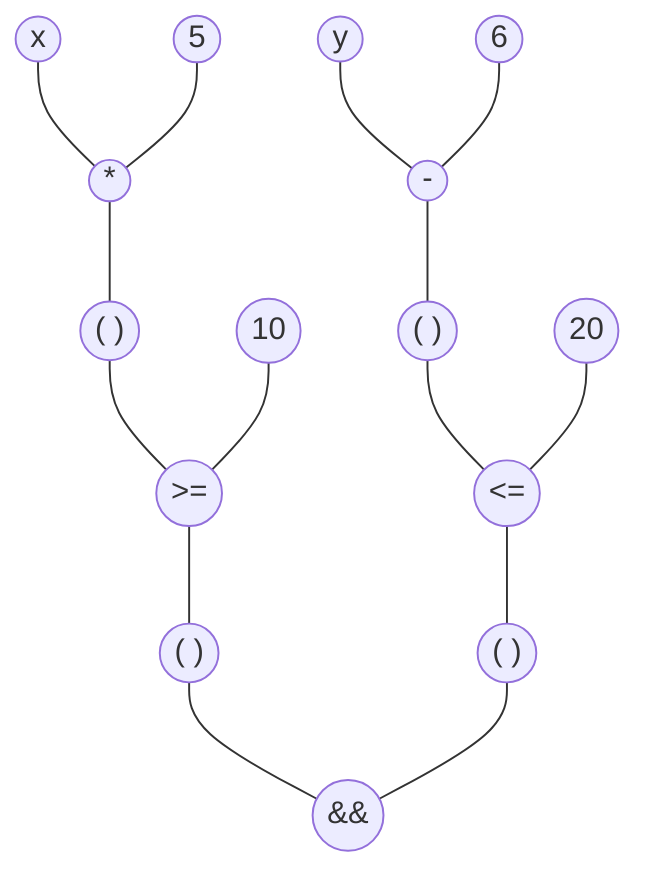
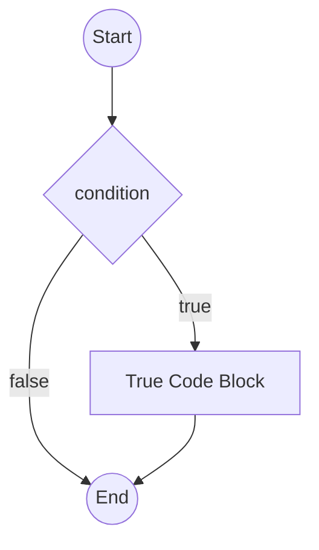
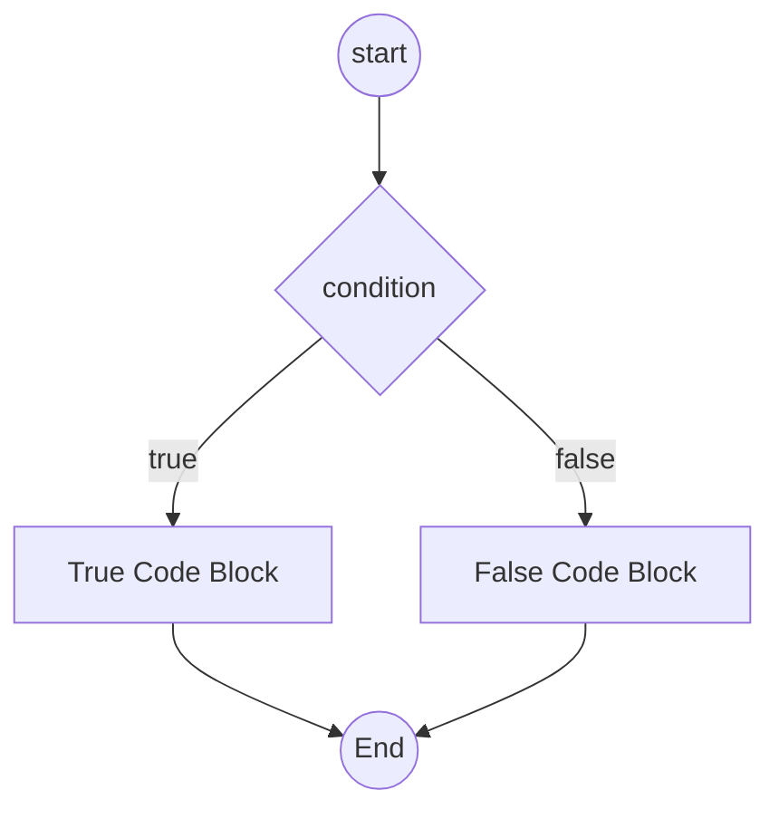
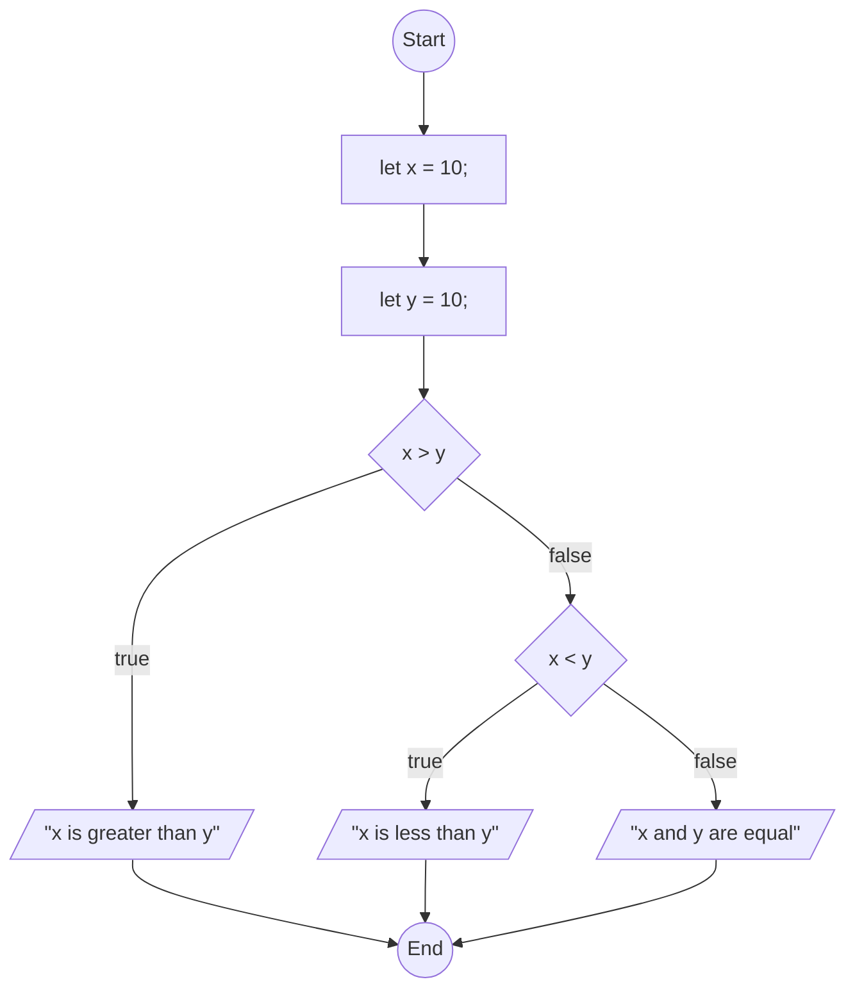
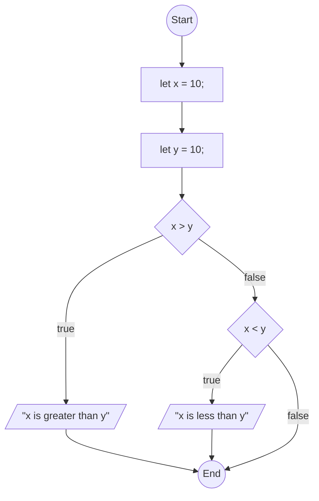

# 5. Making Decisions with Conditionals

[toc]

---

## 5.1. Booleans

> "There are 10 kinds of people in the world. Those who know binary and those who don't."
> --Unknown

One of the core featueres of any programming language is the ability to conditionally execute a segment of code. This means that a program will run a segment of code *only if* a given condition is met.

### 5.1.1. Boolean Values

The JavaScript data type for storing true and false values is **`boolean`**, named after the British mathematician George Boole. Boole is credit with creating **Boolean Algebra**, which is the basis of all modern computer arithmetic. There are only two **boolean values**--`true` and `false`.

> :warning: **Javascript is case-sensitive!** If you type `True` or `FALSE`, these values won't be accepted. `true` and `false` MUST be in lower case or they won't be accepted as valid boolean values.

Boolean values are NOT Strings either. You'll see that in this next exampe.

```js
console.log(true);			// true
console.log(false);			// false
console.log(typeof true);	// boolean
console.log(typeof false);	// boolean
console.log(typeof "true");	// string
```

> 🧪 **Learn more about Boolean Algebra**: See [Boolean Algebra](../../My%20LC%20Notes/Computer%20Science/Boolean%20Algebra.md) in my Computer Science directory! 

### 5.1.2. Boolean Conversion

As with the number and string data types, the boolean type also has a coversion function,**`Boolean`**. It works similarly to the `Number` and `String` functions, attempting to convert a non-boolean to a boolean.

> 🧩 **Try It** ([link](https://repl.it/@launchcode/Boolean-Type-Conversion))
>
> ```js
> console.log(Boolean("true"));		// true
> console.log(Boolean("TRUE"));		// true
> console.log(Boolean(0));			// false
> console.log(Boolean(1));			// true
> console.log(Boolean(''));			// false
> console.log(Boolean('LaunchCode'));	 // true
> console.log(Boolean('false'));		// true
> console.log(' ');				   // true
> ```

> :question: **Question**: Under which conditions does `Boolean` convert a string to `true`?
> a. Only when the string is `"true"`.
> b. Whenever the string contains any non-whitepsace characters.
> c. Whenver the string is non-empty.
> d. Never. It converts all strings to `false`.
>
> :exclamation: **Answer**: c.
>
> ```js
> // We know the answer is clearly not D, but let's test
> // the other options.
> console.log(Boolean("true"));		// true
> console.log(Boolean("false"));		// true, so not A.
> console.log(Boolean(""));			// false
> console.log(Boolean(" "));			// true, so not B.
> // The above line also proves that the correct answer is C.
> ```

### 5.1.3. Boolean Expressions

A **boolean expression** is an expression that evaluates to either `true` or `false`. The **equality operator**, `==`, compares two values and returns true or false depending on whether the values are equal.

```js
console.log(5 == 5);	// true
console.log(5 == 6);	// false
```

In the first statement, the two operands are equal, so the expression evaluates to `true`. In th esecond statement, the operands are not equal, so the expression evaluates to `false`.

We can also use `==` to show that `true` (a boolean) and `"true"` (a string) are not equal.

```js
console.log(true == "true");	// false
```

> :information_source: **NOTE**: Don't get too comfy using `==` for equality. Later in this chapter, we will show why using `===` is the superior operator and that you shouldn't use `==` in modern JavaScript.

#### 5.1.3.1. Comparison Operators

The `==` operator is one of six common **comparison operators**.

<table>
    <tr>
        <th>Operator</th>
        <th>Description</th>
        <th>Examples<br>Returning<br><code>true</code></th>
        <th>Examples<br>Returning<br><code>false</code></th>
    </tr>
    <!-- NOTE: nowrap is not supported in HTML5. Use CSS "white-space: nowrap;" instead. -->
    <tr>
        <td><b>Equal</b> (<code>==</code>)</td>
        <td>Returns <code>true</code> if the two operands are equal, and <code>false</code> otherwise</td>
        <td style="white-space: nowrap;"><code>7 == 7</code><br><code>"dog" == "dog"</code></td>
        <td style="white-space: nowrap;"><code>7 == 5</code><br><code>"dog" == "cat"</code></td>
    </tr>
    <tr>
        <td><b>Not equal</b> (<code>!=</code>)</td>
        <td>Returns <code>true</code> if the two operands are not equal, and <code>false</code> otherwise</td>
        <td style="white-space: nowrap;"><code>7 != 5</code><br><code>"dog" != "cat"</code></td>
        <td style="white-space: nowrap;"><code>7 != 7</code><br><code>"dog" != "dog"</code></td>
    </tr>
    <tr>
        <td><b>Less than</b> (<code>&lt;</code>)</td>
        <td>Returns <code>true</code> if the left-hand operand is less than the right-hand operand, and <code>false</code> otherwise</td>
        <td style="white-space: nowrap;"><code>5 &lt; 7</code><br><code>'a' &lt; 'b'</code></td>
        <td style="white-space: nowrap;"><code>7 &lt; 5</code><br><code>'b' &lt; 'a'</code></td>
    </tr>
    <tr>
        <td><b>Greater than</b> (<code>&gt;</code>)</td>
        <td>Returns <code>true</code> if the left-hand operand is greater than the right-hand operand, and <code>false</code> otherwise</td>
        <td style="white-space: nowrap;"><code>7 &gt; 5</code><br><code>'b' &gt; 'a'</code></td>
        <td style="white-space: nowrap;"><code>5 &gt; 7</code><br><code>'a' &gt; 'b'</code></td>
    </tr>
    <tr>
        <td><b>Less than or equal</b> (<code>&lt;=</code>)</td>
        <td>Returns <code>true</code> if the left-hand operand is less than or equal to the right-hand operand, and <code>false</code> otherwise</td>
        <td style="white-space: nowrap;"><code>5 &lt;= 7</code><br><code>5 &lt;= 5</code><br><code>'a' &lt;= 'b'</code><br><code>'a' &lt;= 'a'</code></td>
        <td style="white-space: nowrap;"><code>7 &lt;= 5</code><br><code>'b' &lt;= 'a'</code></td>
    </tr>
    <tr>
        <td><b>Greater than or equal</b> (<code>&gt;=</code>)</td>
        <td>Returns <code>true</code> if the left-hand operand is greater than or equal to the right-hand operand, and <code>false</code> otherwise</td>
        <td style="white-space: nowrap;"><code>7 &gt;= 5</code><br><code>7 &gt;= 7</code><br><code>'b' &gt;= 'a'</code><br><code>'b' &gt;= 'b'</code></td>
        <td style="white-space: nowrap;"><code>5 &gt;= 7</code><br><code>'a' &gt;= 'b'</code></td>
    </tr>
</table>

> :reminder_ribbon: **TODO**: Show equivalent operation of the comparison operator, especially when they are negated.

> :information_source: **NOTE: Comparision operators do work on strings!**
>  You may have seen in the above table that things like `'a' < 'b'` can be comparible. This is because character are reprensented by their ASCII value. Recall back in Chapter 2 where I stuck in that ASCII table showing the hexadecimal values of characters and how hexadecimal can be converted into decimal. So if `'a'` is equal to `0x61` in hexadecimal or `97` in decimal, and `'b'` is equal to `0x62` or `98`, then `'a' < 'b'` is equivalent to saying `97 < 98`. We will find this useful later when we give functions instructions on how to sort strings.

Although these operations are probably familiar, the JavaScript symbols are different from the mathematical symbols. A common error is using the singl equal sign used for *assignments* (`=`) insted of the double equal sign used for *comparison* (`==`).

Also note that `=<` and `=>` ae not recognized operators.

> :nerd_face: **Acutually...** `=>` is now use as the *arrow operator* which is used for functional programming, but we're not going to go into that right now.

An equality test is *symmetric*, meaning that we can swap the places of the operands and the reslut would be the same. For a variable `x`, if `x == 7` is `true` then `7 == x` is also `true`. However, an assignment statment is not symmetric: `x = 7` is legal while `7 = x` is not.

> :abc: **Expand your vocabulary**: associative, commutative, distributive.
> In mathematics there are three properties of a binary operation.
>
> * A binary operation is said to be **associative** if within an expression cointaining two or more occurrences in a row of the same associative operatior, the order of which the operations are performed does not matter as long as the sequence of the operands is not changed. Addition and multiplication are said to be associative, but subtraction, exponentiation, and vector cross product are non-associative.
> * A binary operation is said to be **communtative** if the order of the operands do not change the result. A special case of commutativity known as **symmetry** is applied to binary relations if the relation applies regardless or the order of its operands. Equality is said to be **symmetric** because we can switch the left and right sides of an equality (or inequality) operator and the statement is still valid.
> * A binary operation is said to be **distributive** if two statements with like factors can be grouped together by a common factor.
>
> $$
> \text{Associative Property} \\
> \begin{aligned}
> (x \cdot y) \cdot z &=& x \cdot (y \cdot z) &=& x \cdot y \cdot z &&\forall\{x,y,z\} \in S \\
> (x + y) + z &=& x + (y + z) &=& x + y + z &&\forall\{x,y,z\} \in S \\
> f(f(x,y),z) &=& f(x, f(y,z))
> \end{aligned} \\
> \text{Commutative Property} \\
> \begin{aligned}
> x \cdot y &=& y \cdot x &&\forall\{x,y\} \in S \\
> x + y &=& y + x &&\forall\{x,y\} \in S \\
> f(x, y) &=& f(y, x) &&\forall\{x,y\} \in A \and f: A \times A \to B\\
> 
> \end{aligned} \\
> \text{Distributive Property} \\
> \begin{aligned}
> x \cdot (y + z) &=& (x \cdot y) + (x \cdot z) && \forall \{x,y,z\} \in S \\
> (y + z) \cdot x &=& (y \cdot x) + (z \cdot x) && \forall \{x,y,z\} \in S \\
> 
> \end{aligned}
> $$
>
> :reminder_ribbon: **TODO**: What would be the *functional notation* equivalent of the distributive property. 

> :warning: **Warning: Here is why we've stopped using `==` and started using `===`.**
>
> ```js
> 7 == "7";	// true 🤪
> 0 == false;	// true 🤪
> 0 == '';	// true 🤪
> ```
>
> You should know that `7` (number) should not be equal to `"7"` (string, equivalent to `0x37` in hex or `55` in decimal). But JavaScript goofed up the `==` and `!=` operators. So now we use `===` and `!==` instead.
>
> ```js
> 7 === "7";		// false
> 0 === false;	// false
> 0 === '';		// false
> ```
>
> We'll have plenty of examples to look forward to in the next section (5.2) going over that issue.

### 5.1.4. Check Your Understanding :white_check_mark:

> :question: **Question**: Which of the following is a Boolean expression? Select all that apply.
> a. `3 == 4`
> b. `3 + 4`
> c. `3 + 4 === 7`
> d. `"false"`
>
> :exclamation: **Answer**: a. and c.
>
> ```js
> // Let's process each of these values with the typeof operator.
> // This example will also demonstrate why you should use parenthesis when using the typeof operator.
> // Remember the table back in 4.6.3.2.!
> typeof 3 == 4;			// false
> typeof(3 == 4);			// 'boolean'
> typeof 3 + 4;			// 'number4'
> typeof(3 + 4);			// 'number'
> typeof 3 + 4 === 7;		// false
> typeof(3 + 4 === 7);	// 'boolean'
> typeof "false";			// 'string'
> typeof("false");		// 'string'
> ```

## 5.2. Equality

### 5.2.1. Loose Equality With `==` 🤪

Recall back in the previous section there was a warning along with these derpy-looking faces 🤪 indicating how the computer got it wrong.

```js
console.log(7 == "7");		// true 🤪
console.log(0 == false);	// true 🤪
console.log(0 == '');		// true 🤪
```

So what happened? Apparently there is some quirks with using the `==` operator, and since the `x != y` is basically equivalent to `!( x == y)`, that means that the `!=` operator has the same problem. One of the inststances where this occurs is where the operands on each side are of different data types. In the first line it was a number compared to a string; in the second line, a number compared to a boolean; and on the third line, a number compared to a string, even though it was the empty string.

In order to properly make a comparison, the two operands must have the same data type, otherwise JavaScript will implicitly convert the operands so that the values are of the same data type before comparig the two operands.  It's for this reason, the `==` operator is often said to measure **loose equality**.

Type conversion wth `==` are carried out according to [a complex set of rules](https://developer.mozilla.org/en-US/docs/Web/JavaScript/Equality_comparisons_and_sameness#Loose_equality_using), and while many of these conversions make some sens, others do not.

> 🪓 **Urge to explain...rising...** Once again, in order to conserve time, I must remind myself NOT to insert the full table of rules here. Most of them involve objects that we haven't covered yet which may pollute our understanding of how things work so far.

For example, recall `Number("7")` converts a string `"7"` and returns a number `7`. So it would make sense for `7 == "7"` to return `true` because  `==` converted the right-hand side to a number first.

However, the following examples will leave some people confused.

```js
console.log('0' == 0);	// true
console.log(0 == '');	// true
console.log('0' == '');	// false
```

On the first line, left-hand side `'0'` was converted to a number, then compared with right-hand side `0` with strict equality, making that `true`. On the second line, right-hand `''` was converted to a number using a hack where `+''` converts the empty string to the number `0`, making this statement return `true`. However, on line three both left and right operands are strings, so there are no conversions. Since the left-hand string `'0'` is not the same as the right-hand string `''`, the operator returns `false`.

Another thing we need to understand is that the `==` operator is **non-transitive**. We think of equality as being transitive such that if A and B are equal and B and C are equal, then A and C are also equal. However, the example above demonstrates that is *not* the case fo the `==` operator.

Since `==` does not follow rules that we typically associate with equality, unexpected results may occur if `==` is used in a program. Thankfully, JavaScript provides a coule of newer operators that return more predictable results.

> :abc: **Expand your vocabulary**: transitive.
> In mathematics there is a rare property called the **transitive property** which applies to *homogeneous relation* $R$ over a set $X$ is **transitive** if for all elements `$a$, $b$, and $c$ in $X$, whenever $R$ relates $a$ to $b$ and $b$ to $c$, then $R$ also relates $a$ to $c$.  In first-order logic notation, it looks more like this:
> $$
> \forall \{ a,b,c \} \in X : (aRb \and bRc) \implies aRc
> $$
> where $aRb$ is the infix notation for $(a,b) \in R$, so the above statement could also be written
> $$
> \forall \{ a,b,c \} \in X : ((a,b) \in R \and (b,c) \in R) \implies (a,c) \in R
> $$
> Let's take anothe look at another binary relationship which defines the Cartesian product that yields those ordered pairs we are familar with.
> $$
> X \times Y = \{(x,y) | x \in X \and y \in Y \}
> $$
> This states that the product of two sets $X$ and $Y$ is then ordered pair $(x,y)$ when a value $x$ is in set $X$ and value $y$ is in set $Y$.
>
> When $X = Y$ (that is, when the values in set $X$ are the same as the values in set $Y$), a binary relation is called a *homogenous relation*. To emphasize that $X$ and $Y$ are allowed to be different, a binary relation is also allowed to be called a *heterogenous relation*.

### 5.2.2. Strict Equality With `===` 😎

The operator `===` compares two operands *without* converting their data types. In other words, if `a` and `b` are of different data types, then `a === b` will always be false.

```js
console.log(7 === "7");		// false 😎
console.log(0 === false);	// false 😎
console.log(0 === '');		// false 😎
```

For this reason, the `===` operator is often said to measure **strict equality**.

Jus as the equality operator `==` has the inequality operator `!=`, there is also a strict inequality operator, `!==`. The boolean expression `a !== b` returns `true` when the two operands are of different types, or if they are of the same type and have different values.

**Use the *strict* operators whenever possible!** Henceforth, we will use the strict operators over the loose operators.

### 5.2.3. Check Your Understanding :white_check_mark:

> :question: **Question**: What is the result of the following boolean expression?
>
> ```js
> 4 == "4"
> ```
>
> a. `true`
> b. `false`
> c. `"true"`
> d. `"false"`
>
> :exclamation: **Answer**: a. 
> `==` takes right-hand string `"4"`, converted into a number `4`, then compares it with left-hand `4` making it `true`.

> :question: **Question**: What is the difference between `==` and `===`?
> a. There is no difference, they work exactly the same.
> b. Only `===` throws an error if its arguments are of different types.
> c. `==` converts values of different types to be the same type, while `===` does not.
> d. `==` works with all data types, while `===` does not.
>
> :exclamation: **Answer**: c.
> a. is clearly wrong.
> b. is incorrect because `==` and `===` will always return a boolean.
> c. is likely the answer because `==` does data type conversion before comparision while `===` does not.
> d. is incorrect because these operators are designed to work with all the primative data types.

## 5.3. Logical Operators

> **:reminder_ribbon:** **REMEMBER**: The list of operators from 4.6.3.2.!

Recall that an operator is one or more characters that carries out an action on its operand(s). In Chapter 4, we learned about three types of operators:

* Arithmetic operators (`+`, `-`, `*`, `/`, `%`, etc.)
* The string operator (`+`).
* The compound assignement operators (`+=`, `-=`, etc.)

Arithmetic and string operators take numbers and string operands, respectively, returning values of the same type. Compound assigment operators work similarly with number or strings while also reassigning the value of the first variable operand.

### 5.3.1. Boolean Operators

> :information_source: **NOTE:** I may want to consider consolidation this section.

In addition to these operators, in this chapter, we learned about comparision operators like `===`, `<`, etc.  These operators are part of a larger class of operators known as **boolean operators**, aptly named because they return a boolean value (`true` or `false`).

Three additional boolean operators allwo us to create more complex expressions.

#### 5.3.1.1. Logical AND (`&&`)

A **compound boolean expression** is a boolean expression built out of smaller boolean expressions. JavaScript allows us to create a compound bollean expression using the **logical AND operator**, **`&&`**.

This operator takes two operand, and the resulting expression is `true` if *both* operands are `true` individually. If either operand is `false`, the overall expression is `false`.

> 🕵️‍♂️ **Truth Table:** Logical AND operator.
>
> In math, the logical AND operator, `&&`, is represtend by the $\and$ operator. In this table below, $F$ represents `false` and $T$ represents `true`.
> $$
> \begin{array}{|c c|c|}
> p & q & p \and q \\
> \hline 
> F & F & F \\
> F & T & F \\
> T & F & F \\
> T & T & T \\
> \end{array}
> $$

```js
console.log(7 > 5 && 5 > 3);			// true
console.log(7 > 5 && 2 > 3);			// false
console.log(2 > 3 && 'dog' === 'cat');	// false
```

In line 1, `7 > 5 && 5 > 3` evaluates to `true` because both `7 > 5` and `5 > 3` are `true` individually. This isn't the case on line 2, because `7 > 5` is `true` but `2 > 3` is `false`, therefore the entire expression evaluates to `false`.  We can mix and match data types however we like as long as both side s of the `&&` expression are themselves boolean expressions.

#### 5.3.1.2. Logical OR (`||`)

JavaScript's **logical OR operator**, **`||`**, also creates compound bollean expressions. This operator take two operands, and the resulting expression is `true` if *either* of the operans are `true` individually. Of both operands are `false`, the overall expression is `false`.

> 🕵️‍♂️ **Truth Table:** Logical OR operator.
>
> In math, the logical OR operator, `||`, is represtend by the $\or$ operator. In this table below, $F$ represents `false` and $T$ represents `true`.
> $$
> \begin{array}{|c c|c|}
> p & q & p \or q \\
> \hline 
> F & F & F \\
> F & T & T \\
> T & F & T \\
> T & T & T \\
> \end{array}
> $$

Let's try it out!

```js
console.log(7 > 5 || 5 > 3);			// true
console.log(7 > 5 || 2 > 3);			// true
console.log(2 > 3 || 'dog' === 'cat');	// false
```

Lines 1 and 2 return `true` because at least one of the comparison expressions joined by `||` is `true`. Line 3 returns `false` because both sub expressions return `false`. 

> :warning: **WARNING!: Watch how many `&`s and `|`s you use!**
>  Single `&` and `|` are [bitwise operators](https://developer.mozilla.org/en-US/docs/Web/JavaScript/Reference/Operators/Bitwise_Operators) which do something completely different and are beyone the scope of this course.  So be sure to use each symbol TWICE to indicate you mean the *logical* operators!

#### 5.3.1.3. Logical NOT (`!`)

The **logical NOT operator**, **`!`**, takes only a single operand and reverses its boolean value.

```js
console.log(! true);	// false
console.log(! false);	// true
```


> 🕵️‍♂️ **Truth Table:** Logical NOT operator.
>
> In math, the logical NOT operator, `!`, is represtend by the $\neg$ operator. In this table below, $F$ represents `false` and $T$ represents `true`.
> $$
> \begin{array}{|c|c|}
> p & \neg p \\
> \hline 
> F & T \\
> T & F \\
> \end{array}
> $$

```js
console.log( !(5 > 7) );			// true
console.log( !('dog' === 'cat') );	// true
```

### 5.3.2. Operator Precedence

We now have a number of operators in our toolkit. It's important to understand how these operators relate to each other with respect to **operator precedence**. Operator precedence is the set of rules that dictate in which the order the operators are applied. The table below shows a partial list of the operators, the order of which they will be appied, and in which direction they will be applied.

> :information_source: **NOTE**: The full table of operators is located at ~~4.6.3.2.~~ Operators file in the Computer Science directory.

The following table is ordered from highest (21) to lowest (1) precedence.

<table>
    <tr>
    	<th>Precedence</th>
        <th>Operator Type</th>
        <th>Associativity</th>
        <th>Individual operators</th>
    </tr>
    <tr>
    	<td>21</td>
        <td>Grouping</td>
        <td>n/a</td>
        <td><code>( <var>&hellip;</var> )</code></td>
    </tr>
    <tr>
    	<td>17</td>
        <td>Logical NOT</td>
        <td>RTL</td>
        <td><code>! <var>&hellip;</var></code></td>
    </tr>
    <tr>
    	<td>17</td>
        <td><code>typeof</code></td>
        <td>RTL</td>
        <td><code>typeof <var>&hellip;</var></code></td>
    </tr>
    <tr>
    	<td>16</td>
        <td>Exponentiation</td>
        <td>RTL</td>
        <td><code><var>&hellip;</var> ** <var>&hellip;</var></code></td>
    </tr>
    <tr>
    	<td>15</td>
        <td>Multiplication, Division, Modulus</td>
        <td>LTR</td>
        <td><code><var>&hellip;</var> * <var>&hellip;</var></code>, <code><var>&hellip;</var> / <var>&hellip;</var></code>, <code><var>&hellip;</var> % <var>&hellip;</var></code></td>
    </tr>
    <tr>
    	<td>14</td>
        <td>Addition, Subtraction</td>
        <td>LTR</td>
        <td><code><var>&hellip;</var> + <var>&hellip;</var></code>, <code><var>&hellip;</var> - <var>&hellip;</var></code></td>
    </tr>
    <tr>
    	<td>12</td>
        <td>Less Than, Less Than or Equal, Greater than, Greater than or Equal</td>
        <td>LTR</td>
        <td><code><var>&hellip;</var> &lt; <var>&hellip;</var></code>, <code><var>&hellip;</var> &lt;= <var>&hellip;</var></code>, <code><var>&hellip;</var> &gt; <var>&hellip;</var></code>, <code><var>&hellip;</var> &gt;= <var>&hellip;</var></code></td>
    </tr>
    <tr>
    	<td>11</td>
        <td>(loose) Equality, (loose) Inquality, Strict Equality, Strict Inequality</td>
        <td>LTR</td>
        <td><code><var>&hellip;</var> == <var>&hellip;</var></code>, <code><var>&hellip;</var> != <var>&hellip;</var></code>, <code><var>&hellip;</var> === <var>&hellip;</var></code>, <code><var>&hellip;</var> !== <var>&hellip;</var></code></td>
    </tr>
    <tr>
    	<td>6</td>
        <td>Logical AND</td>
        <td>LTR</td>
        <td><code><var>&hellip;</var> &amp;&amp; <var>&hellip;</var></code></td>
    </tr>
    <tr>
    	<td>5</td>
        <td>Logical OR</td>
        <td>LTR</td>
        <td><code><var>&hellip;</var> || <var>&hellip;</var></code></td>
    </tr>
    <tr>
    	<td>3</td>
        <td>Assignemnts</td>
        <td>RTL</td>
        <td><code><var>&hellip;</var> = <var>&hellip;</var></code>, <code><var>&hellip;</var> += <var>&hellip;</var></code>, <code><var>&hellip;</var> -= <var>&hellip;</var></code>, <code><var>&hellip;</var> **= <var>&hellip;</var></code>, <code><var>&hellip;</var> *= <var>&hellip;</var></code>, <code><var>&hellip;</var> /= <var>&hellip;</var></code>, <code><var>&hellip;</var> %= <var>&hellip;</var></code></td>
    </tr>
    <tr>
    	<td>1</td>
        <td>Comma/Sequence</td>
        <td>LTR</td>
        <td><code><var>&hellip;</var> , <var>&hellip;</var></code></td>
    </tr>
</table>

As the table implies, logical NOT will happen after grouping followed by the arithmetic operators, then the comparrison operators, followed by logical AND and logical OR.

Parentheses are necessary, but they do clarify what you mean. Let's try an example equation.

```js
((x * 5) >= 10) && ((y - 6) <= 20)
```

If you need need help understanding this expression, let's diagram it out.



Normallly people will diagram this from top to bottom, but thanks to this program I'm using I can just quickly change the direction the other way.

### 5.3.3. Truth Tables 🕵️‍♂️

Turns out I already did this part, but let do one big one.
$$
\begin{array}{|c c|c c|c|c|}
p & q & \neg p & \neg q & p \and q & p \or q\\
\hline 
F & F & T & T & F & F \\
F & T & T & F & F & T \\
T & F & F & T & F & T \\
T & T & F & F & T & T \\
\end{array}
$$

### 5.3.4. Check Your Understanding :white_check_mark:

> :question: **Question: Complete the table below.
>
> > :information_source: I decided to just repost the table I posted eariler.
>
> $$
> \begin{array}{|c c|c|}
> p & q & p \or q \\
> \hline 
> F & F & F \\
> F & T & T \\
> T & F & T \\
> T & T & T \\
> \end{array}
> $$

> :question: **Question**: Which of the following properly express the order of operations (using parentheses) in the following expression?
>
> ```js
> 5*3 > 10 && 4 + 6 === 11
> ```
>
> a. `((5*3) > 10) && ((4+6) === 11)`
> b. `(5*(3 > 10)) && (4 + (6 === 11))`
> c. `((((5*3) > 10) && 4)+6) === 11`
> d. `((5*3) > (10 && (4+6))) === 11`
>
> :exclamation: **Answer**: a. `((5*3) > 10) && ((4 + 6) === 11)`

> :question: **Question**: What is returned by the following boolean expression?
>
> ```js
> 4 < 3 || 2 < 3
> ```
>
> a. `true`
> b. `false`
> c. `"true"`
> d. `"false"`
>
> :exclamation: **Answer**: a.
> $$
> \begin{aligned}
> \underline{4 < 3} \or \underline{2 < 3} && \text{Given}\\
> \underline{\text{false} \or \text{true}} \\
> \text{true} && \blacksquare
> \end{aligned}
> $$

## 5.4. Conditionals

At the beginning of the chapter, we decided that we wanted to be able to write code that only executed when a given condition is `true`.

### 5.4.1. `if` Statement

The most masic form of a conditional is an **`if` statement**.

```js
if (condition) {		// The condition we want to check
    // some code		// The code we want to execute 
    				   // if the condition is true.
}
```

Let's look at each component of this new syntax.

* The `if` statement consist of a header line and a body. The header line begins with the keyword **`if`** followed by a boolean expression enclosed in parentheses.
* `condition` is a boolean expression.
* The statement that follows the condition, within `{ }`, makes up a **code block**. The code within the brackets `{ }` will be executed if the condition evaluates to `true`. If the condition evaluates to `false`, the code within the brackets is ignored.

We could also diagram it:



Here's an example of using the `if` statement:

```js
let billHasBeenPaid = false;

if(!billHasBeenPaid){		// !false = true
    console.log("Your bill is due soon!");
}
```

which will produce

```
Your bill is due soon!
```

Here's another example

```js
if(num % 2 === 0 && num > 3) {
    console.log(num, "is even");
    console.log(num, "is greater than 3");
}
```

> 🎨 **Style**: Curly braces.
>
> While it is recommended to do curly braces like this:
>
> ```js
> if(condition){
>     console.log("Zeeky Boogie Doog!");
>     console.log("KABOOM!");
> }
> ```
>
> This way is also acceptable:
>
> ```js
> if(condtion)
>     {console.log("Zeeky Boogie Doog!");
>     console.log("KABOOM!");}
> ```
>
> So as long as there is a matching pair things should work.
>
> One method that the LC textbook seems to say "not" to do, is not use curly braces if your potential code block is just one line.
>
> ```js
> if(condition)
>     console.log("This is fine.");
> ```
>
> You can do that, in fact it's quite comon with condtional statements and loops (which seems like a long way from now in chapter 9. I really got to speed this note taking up!)

### 5.4.2. `else` Clauses

An **`else` clause** can be paired with an `if` statement to specify code that should be executed when the condition is false.

```js
if(condition) {
    // code block if true
} else {
    // code block if false
}
```

Let's try it with an example.

```js
let billHasBeenPaid = true;

if(!billHasBeenPaid){		// !false = true
    console.log("Your bill is due soon!");
} else {
    console.log("Your payments are up to date.");
}
```

This will produce

```
Your payments are up to date.
```

This structure is known as and **`if-else` statement**, and provides a mechanism for **branching**. The flow of the program take one of two paths, when it reaches a conditional, depending on wether the condition is `true` or `false`.

Old school computer programming diagrams  such control structures like this.



### 5.4.3. `else if` Statements

If-else statements allow us to construct two alternative paths. A single condition determines which path will be followed will be followed. We can buld more complex conditionals using an **`else if` clause**. These alow us to add additional condtions and code blocks, which facilitate more complex branching.

```js
let x = 10;
let y = 20;

if (x > y) {
    console.log("x is greater than y");
} else if (x < y) {
    console.log("x is less than y");
} else {
    console.log("x and y are equal");
}
```

This will produce

```js
x is less than y
```

So what's happening here? Let's diagram it.



We could also not use `else` at all and just make our program an `if-else-if` statement.

```js
let x = 10;
let y = 10;

if (x > y) {
    console.log("x is greater than y");
} else if (x < y) {
    console.log("x is less than y");
}
```

This will output nothing since `x` and `y` are equal.

Our flowchart reflects that.



Regardless of the complexity of a conditional, *no more than one* of the code blocks will be executed.

```js
let x = 10;
let y = 20;

if (x > y) {
    console.log("x is greater than y");
} else if (x < y) {
    console.log("x is less than y");
} else if (x % 5 === 0) {
    console.log("x is divisible by 5");
} else if (x % 2 === 0) {
    console.log("x is even");
}
```

Console Output:

```
x is less than y
```

Even though the conditions of `x%5 === 0` and `x % 2 === 0` evaluate `true`, neither of the associated code blocks is executed. When a condtion is satisified, the rest of the conditional is skipped. Think of how a train runs in a rail yard with the switches set. Once you go down one path, you have to go through it to the end. Our flowcharts reflect that.

### 5.4.4. Check Your Understanding :white_check_mark:

> :question: **Question**: What does the following code print?
>
> ```js
> let a = 7;
> if (a % 2 === 1) {
>     console.log("Launch");
> } else if (a > 5) {
>     console.log("Code");
> } else {
>     console.log("LaunchCode");
> }
> ```
>
> a. `"Launch"`
> b. `"Code"`
> c. `"Launch"`
> 	`"Code"`
> d. `"LaunchCode"`
>
> :exclamation: **Answer**: a. $7 \% 2 = 1$ which satisifies the first test.

## 5.5. Nested Conditionals

We can write code with more complex branching behavior by combining conditionals and, in particular, by nesting conditionals. Let's see how this works.

🧩**Try It** ([Link](https://repl.it/@launchcode/Positive-and-Even))

```js
let number 7;

if (number %2 === 0) {
    console.log("EVEN");
    
    if (num > 0) {
        console.log("POSITIVE");
    }
}
```

This example returns nothing, but if we change the value to an even number, it will return `EVEN`. And if that number is positive, it will also return `POSITIVE`.

### 5.5.1. Check Your Understanding :white_check_mark:

> :question: **Question**: What is printed when the following code runs?
>
> ```js
> let num = 7;
> 
> if (num % 2 === 0) {
>     if (num % 2 === 1){
>         console.log("odd");
>     }
> }
> ```
>
> a. The code won't run due to invalid syntax.
> b. `odd`
> c. `even`
> d. The code runs but doesn't print anything.
>
> :exclamation: **Answer**: d. Because 7 is an odd number, and $7 \% 2 = 1$, the code pretty much is done once it hits line 3.

> :question: **Question**: Considering the same conditional used in the previous question, which values of `num` would result in `"odd"` being printed?
>
> ```js
> if (num % 2 === 0) {
>     if (num % 2 === 1){
>         console.log("odd");
>     }
> }
> ```
>
> a. Even values of `num`.
> b. Odd values of `num`.
> c. No values. It is impossible to the call to `console.log` to ever run, given the two condtions.
> d. `num` is 0.
>
> :exclamation: **Answer**: c. 

## 5.6. Exercises: Booleans and Conditionals :runner:

> :x: **CENSORED!** Do the homework! Follow this [link](https://repl.it/@launchcode/ConditionalsExercises01) and this [link](https://repl.it/@launchcode/ConditionalsExercises02).

> :nerd_face: **Actually...** [Go here!](https://repl.it/student/classrooms/167827) otherwise they won't get submitted! There's also THREE of them.

## 5.7. Studio: Goal Setting and Getting into the Right Mindset :studio_microphone:

During this studio, we will ask you to think about your mindset when it comes to facing challenges: Do challenges deter you to delight you? If challenges are something you delight in, you might have a growth mindset.

A **growth mindset** can be powered by one word, "yet". The word "yet" allows us to acknowledge that we don't know something AND that we are capable of learning it. With "yet", the sentence "I don't understand booleans" becomes "I don't understand booleans *yet*."

Growth must occur over an entire career. As technology evolves, even the most senior developers have to learn new skills. Creating a framework for learning, which includes setting achievable goals, is important for being a developer. Technology will change and adapt, and we should learn to do the same!

When setting goals, those goals should be SMART:

* **Specific**
* **Measurable**
* **Attainable**
* **Relevant**
* **Time Bound**

We will be discussion your goals for this class and your career. While you don't have to do any prior goal setting or preparation to make the most of this activity, please take the time to write down some goals before glass if it would make you feel more comfortable.

> :notebook: **NOTE**: If you have a place where you like to write down your goals and inspiration, such as a journal, feel free to bring it to class!

### 5.7.1. Activity

After your TA reviews the relevant topics, we will have a discussion covering the following:

1. **Your goals for this class.**
   You probably have many reasons why this class is something you want to complete. Please share 1 to 2 of your goals and keep them SMART!

   * Refresh my understanding of JavaScript
   * Learn about TypeScript and Angular
   * Put 110% effort into this class so I don't fall behind or miss a beat.
   
2. **Your goals for your career.**
   How does this class assist you in your career and where do you want to go? Please share 1 to 2 goals for your career.

   * To prove to employers that I will not be ignored and that I'm always relevant as long as I'm learning.
   * Assist others with learning mathematics, science, and technology.
   * Promote the community of developers.

3. **Your inspirational statements.**
   This can be anything that motivates you from stories to quotes to ideas. Please share 1 to 2.
   Here's one of my favorites:

   > "Sucking at something is the first step at being sorta good at something."
   >
   > --Jake the Dog, *Adventure Time* (2010)

After the studio, make sure to write your goals and inspirational statements somewhere where you will regularly see them!

### 5.7.2. Resources

1. [Best Pracitices: Learning to Code](https://education.launchcode.org/intro-to-professional-web-dev/chapters/booster-rockets/bestpractices.html#best-practices)
2. [The Power of Believing that You can Improve](https://www.ted.com/talks/carol_dweck_the_power_of_believing_that_you_can_improve/)
3. [What having a "Growth Mindset" Actually Means](https://hbr.org/2016/01/what-having-a-growth-mindset-actually-means/)
4. [Golden Rules of Goal Setting](https://www.mindtools.com/pages/article/newHTE_90.htm)

:checkered_flag: A lot of new ground was covered this chapter! **Up Next: [Errors and Debugging](06.%20Errors%20and%20Debugging.md)!**

---

#LaunchCode