# 6. Errors and Debugging

[toc]

---

## 6.1. What is Debugging?

Programming is a complex process. Since it is being done by human beings, errors often occur. Programming errors are called **bugs** and the process of tracking them down and correcting them is called **debugging**. 

Three kinds of errors can occur in a program:

* **syntax errors**
* **runtime errors**
* **logical errors**

### 6.1.1. Beginning Tips for Debugging

* Think of yourself as a detective. 🕵️‍♂️ Look for clues
* Think critically about the code you have written.

## 6.2. Categories of Errors

It is useful to distinguish between categories of errors in order to quickly identify and fix them. Each category manifests itself in a different way, and some strategeies may be more useful for certain types of errors.

### 6.2.1. Stages of JavaScript Execution

In order to understand programming errors, it is useful to understand the two stages of code execution.

#### 6.2.1.1. Parsing

Before code can run, it must first be *parsed*, or validated and prepared for execution. This is known as the **parsing stage**.

A lot of detailed, low-level tasks are carried out during this process, but it is enough for us to understand that parsing verifies the syntax and the structure of the code.

#### 6.2.1.2. Execution

Once our code has been parsed, its syntax has been verified and the program is ready to run. The **execution stage** is when the actions write into our program---printing to the console, prompting the user for input, making calculations, etc.---are actually carried out. 

### 6.2.2. Syntax Errors

JavaScript can only execute a program if the program is *syntactically correct*. **Syntax** refers to the structure of a language (spoken, programming, or otherwise) and the rules about that structure.

A **syntax error** is a violation of the formal rules for a given language.

For most readers of the English language, a few syntax errors are not a significant problem. Our brains are often flexible enough to determine the intended meaning of a sentence even if it contains one more syntax errors.

Programming languages are not so forgiving. If there is a single syntax error anywhere in your program, JavaScript will display an error message and quit immediately. Since syntax is valid during the parsing stage, syntax errors are the first we see when running a program.

During the first few weeks of your programming career, you will probably spend a lot of time tracking down syntax errors. However, as you gain experience, you will make fewer errors, and you will find errors faster.

> 🧩 **Try It!** Find the syntax errors in the program. ([link](https://repl.it/@launchcode/Syntax-Errors))
>
> ```js
> let day = Wednesday;
> console.log(day;
> ```

> :question: **Question**: What syntax errors did you find? What was the specific error message provided by JavaScript in each case?
>
> :exclamation: **Answer**:
>
> 1. On line 1, `Wednesday` is not quoted. However, that is a reference error.
>
> 2. ==On line 2, there is an unmatched set of parenthesis just before `day`. This is a syntax error.==
>
>    ```
>    /home/runner/Syntax-Errors/index.js:2
>    console.log(day;
>                ^^^
>    
>    SyntaxError: missing ) after argument list
>    ```

### 6.2.3. Runtime Errors

The second category consists of **runtime errors**, so called because they do not appear until you run the program. These errors are also called **exceptions** because they usually indicate that something exceptional (and bad) has happened.

Runtime errors occur during the execution phase of a program, so we will only encounter them after the syntax of our program is completely correct.

A common runtime error occurs when we try to use a variable that hasn't ben created yet. This can happen if you misspell the name of a variable.

```js
let firstName = "Jack";
console.log(firstname);
```

```
ReferenceError: firstname is not defined
   at evalmachine.<anonymous>:2:13
   at Script.runInContext (vm.js:107:20)
   at Object.runInContext (vm.js:285:6)
   at evaluate (/run_dir/repl.js:133:14)
   at ReadStream.<anonymous> (/run_dir/repl.js:116:5)
   at ReadStream.emit (events.js:189:13)
   at addChunk (_stream_readable.js:284:12)
   at readableAddChunk (_stream_readable.js:265:11)
   at ReadStream.Readable.push (_stream_readable.js:220:10)
   at lazyFs.read (internal/fs/streams.js:181:12)
```

In the above example, the syntax of our program is correct, but when the program executes, an error occurs at line 2. We attempt to print the value of the variable `firstname`, but such a variable does not exist.

### 6.2.4. Logic Errors

The third type of error is the **logic error**. If there is an logic error in your program, it will run successfully and not generate any error messages. However, the program will not work as intended.

The characteristic of logic error is that the program you wrote is not the program you want. 

```js
let weeklyPay = 600;

let dailyEarnings = weeklyPay / 7;
console.log(dailyEarnings);		// 85.71428571428571	❌
```

If you were working 7 days per week, about \$85 would be correct. But if you work 5 days per week, this answer is wrong. This is because on line 3, you should have entered `weeklyPay / 5` instead of `weeklyPay / 7`. If it was set to 5 days, `dailyEarnings` would be \$125.

Basically in this example, it was the programmer who used the wrong information. This program is fine.

### 6.2.5. Check Your Understanding :white_check_mark:

> :question: **Question**: Label each of the following as either a syntax, runtime, or logic error.
> a. Trying to use a variable that has not been defined.
> b. Leaving off a closing parenthesis, `)`, when calling `console.log`.
> c. Forgetting to divide by 100 when printing a percentage amount.
>
> :exclamation: **Answer**:
> a. Runtime
> b. Syntax
> c. Logic

## 6.3. Diagnosing Error Messages

Syntax and runtime errors *always* produce error messages. Reading and understanding error messages is a crucial first step in fixing these types of bugs.

Error messages are your friends. This idea may seem foreign to new programmers, because an error message is a signal that your program is broken. Don't feel frustrated when that happens. It may just mean we don't fully understand the concept at hand and probably need to look at it from a different perspective to find the solution.

All programmers make mistakes, no matter how experienced. How many spelling error do you think I've made in these notes because the programmer who wrote the program I typed this in hasn't tracked down the bug that keeps occurring where the spellchecker is turned off?  I suck. That guy sucks. We all suck.

> "Sucking is the first step at being sort of good at something."
>
> --Jake the Dog, *Adventure Time* (2010)

I've probably posted that before in these notes, but it's the truth!

Let's consider this example that has a couple of syntax errors in it.

```js
let name = Julie;
console.log("Hello, name);
```

In the next few sections, we will use this example to analyse what some of these errors mean.

### 6.3.1. A Syntax Error

We hit the run button on Repl.it and the first thing that happens is this.

```
/Users/chris/dev/sandbox/js/syntax.js:2
console.log("Hello, name);
            ^^^^^^^^^^^^^^

SyntaxError: Invalid or unexpected token
   at new Script (vm.js:85:7)
   at createScript (vm.js:266:10)
   at Object.runInThisContext (vm.js:314:10)
   at Module._compile (internal/modules/cjs/loader.js:698:28)
   at Object.Module._extensions..js (internal/modules/cjs/loader.js:749:10)
   at Module.load (internal/modules/cjs/loader.js:630:32)
   at tryModuleLoad (internal/modules/cjs/loader.js:570:12)
   at Function.Module._load (internal/modules/cjs/loader.js:562:3)
   at Function.Module.runMain (internal/modules/cjs/loader.js:801:12)
   at internal/main/run_main_module.js:21:11
```

> :information_source: **COPYPASTA**: Yea, I got lazy here. But I'm in a rush to finish this chapter.

While there is a lot of text in this message, the first few lines tell us everything we need to know.

The first part of the error identifies where in our code the error exists:

```
console.log("Hello, name);
            ^^^^^^^^^^^^^^
```

For many simple syntax errors, we will quickly be able to spot the mistake once JavaScript points out its location to us.  It is telling us that in the area of `"Hello, name);` it encountered an invalid token. A **token** is a symbol, variable, or other atomic element of a program.

The next line provides us with more information:

```
SyntaxError: Invalid or unexpected token
```

This line identifies that actual issue that JavaScript found, emphasizing that the error we are dealing with is a `SyntaxError`, and it provides a message describing the issue.

In the case of this program, the invalid program is `"Hello, name);`. JavaScript sees the double-quote character and expects a string. However the string doesn't have a closing `"`, making it invalid.

Knowing what we know now, we can fix this error in the program with the correct syntax.

```js
let name = Julie;
console.log("Hello, name");
```

> :fuelpump: **YMMV**: Error messages may differ depending on where you run your code. The same program run on REPL.it and in Node.js on your computer will generate slightly different error messages. However, these differences are minor and generally trivial. The main cause of the error will be reported in the same way.

### 6.3.2. Syntax Errors and Code Highlighting

Most code editors provide a feature know as ==**syntax highlighting**==. Such editors highlight different types of tokens in different ways. For example, strings may be red, while variables may be green. This can also vary depending if you've applied a visual theme to your editor. Regardless, this useful feature gives you a quick, visual way to identify sytanx errors.

### 6.3.3. A Runtime Error

OK! Now that we fixed that one error, let's try running our program again...and there's another error.

```
/Users/chris/dev/sandbox/js/syntax.js:1
let name = Julie;
         ^

ReferenceError: Julie is not defined
   at Object.<anonymous> (/Users/chris/dev/sandbox/js/syntax.js:1:74)
   at Module._compile (internal/modules/cjs/loader.js:738:30)
   at Object.Module._extensions..js (internal/modules/cjs/loader.js:749:10)
   at Module.load (internal/modules/cjs/loader.js:630:32)
   at tryModuleLoad (internal/modules/cjs/loader.js:570:12)
   at Function.Module._load (internal/modules/cjs/loader.js:562:3)
   at Function.Module.runMain (internal/modules/cjs/loader.js:801:12)
   at internal/main/run_main_module.js:21:11
```

We have anew error message, this time involving line 1 or our code. We didn't see this before because it is a runtime error.  So I guess you can say that JavaScript will check for Syntax errors first then runtime errors leaving you, the programmer, to watch out for logic errors.

Let's look at what we got:

```
let name = Julie;
         ^
```

There appears to be an issue with the assignment statement. You might be able to see what it is, but let's look at it anyway.

The error message this time is a `ReferenceError`:

```
ReferenceError: Julie is not defined
```

We can look up what a `ReferenceError` is on [MDN](https://developer.mozilla.org/en-US/docs/Web/JavaScript/Reference/Global_Objects/ReferenceError), where it says "The `ReferenceError` object represents an error when a non-existent variable is referenced", but that's all we need to know from this article. We can read the rest of that later.

This information, along with the rest of the message "`Julie is not defined`", make it clear that the variable `Julie` does not exist. And from the looks of things, we probably wanted `Julie` to be a string, which means `Julie` should actually be `"Julie"`. Correcting the error by putting quotes around `Julie` should fix our `ReferenceError`.

## 6.4. Error Types

An **error type** is the classification that JavaScript uses to group errors based on their cause. In future lessons, we will learn that an error type is actually something called a **built-in object**. For now, understanding the different types of errors will help us become better and faster at debugging.

Each error that JavaScript reports has an error type, and the type includes the error message. For example, the `SyntaxError` back in 6.3.1. 

We have seen two error types, `ReferenceError` and `SyntaxError`, but there are a few other error types.

```mermaid
classDiagram
	class Error {
	 - Error: constructor 
	 - String: name
	 - String: message
	 - String: fileName ⚠
	 - Number: lineNumber ⚠
	 - Number: columnNumber ⚠
	 - String: stack  ⚠
	 + Error([message[, filename[, lineNumber]]])
	 + String: toString()
	}
	class EvalError
	class RangeError
	class ReferenceError
	class SyntaxError
	class TypeError
	class URIError
	Error <|-- EvalError
	Error <|-- RangeError
	Error <|-- ReferenceError
	Error <|-- SyntaxError
	Error <|-- TypeError
	Error <|-- URIError
```



> :warning: **WARNING**: Some of the features with a :warning: emoji mentioned in that class diagram have not been standard. YMMV :fuelpump:

There are seven common JavaScript errors. The features in six of the classes inherit properties from the `Error` class. We'll go over inheritance when we get to the part in this program about Object Oriented Programming. For now, just know that inheritance means that the child classes inherit features from their parent class.

<table>
    <tr>
        <th>Error Type</th>
        <th>Description</th>
        <th>Code Example</th>
        <th>Example description</th>
    </tr>
    <tr>
        <td><b><code>SyntaxError</code></b></td>
        <td>Occurs when trying to parse syntactically invalid code.</td>
        <td><pre>console.log("hello";</pre></td>
        <td>The call to <code>console.log</code> does not have a required closing parethesis.</td>
    </tr>
    <tr>
        <td><b><code>ReferenceError</code></b></td>
        <td>Occurs when a non-existent value is used/referenced.</td>
        <td><pre>let firstName = "Jack";<br>console.log(firstname);</pre></td>
        <td>The variable <code>firstname</code> does not exist; it is a misspelling of <code>firstName</code>.</td>
    </tr>
    <tr>
        <td><b><code>TypeError</code></b></td>
        <td>Occurs when trying to use a value in an invalid way.</td>
        <td><pre>1();</pre></td>
        <td>The numeric value <code>1</code> is not a function, so trying to use it as one results in <code>TypeError: 1 is not a function.</code></td>
    </tr>
    <tr>
        <td><b><code>RangeError</code></b></td>
        <td>Occurs when passing an invalid value to a function.</td>
        <td><pre>let nums = Array(-1);</pre></td>
        <td>The constructor function <code>Array(n)</code> creates an empty array of length <code>n</code>. It is not possible to create an array with negative length, so the code results in <code>RangeError: Invalid array length</code>.</td>
    </tr>
    <tr>
        <td><b><code>URIError</code></b></td>
        <td>Occurs when improperly using a global <abbr title="URI: Uniform Resource Identifier">URI</abbr>-handling function.</td>
        <td><pre>decodeURL('%');</pre></td>
        <td>The character <code>%</code> is used to encode character not otherwise allowed in URIs, such as spaces (<code>%20</code>). If an invalid character encoding is given, a <code>URIError</code> results.</td>
    </tr>
    <tr>
        <td><b><code>Error</code></b></td>
        <td>The type from which all other errors are built. It can be used to generate programmer-triggered and programmer-defined errors.</td>
        <td><pre>throw Error("Something bad happend!");</pre></td>
        <td>Manually triggers and error with the given message.</td>
    </tr>
</table>

Each time you encounter a new error type, take the time to understand what it is, and what JavaScript is trying to tell you.

For more information about the errors in the above table, check out [MDN](https://developer.mozilla.org/en-US/docs/Web/JavaScript/Reference/Global_Objects/Error).

## 6.5. Debugging Logic Errors

We can debug runtime and syntax errors using the error messages produced. Logic errors, however, do not generally produce error messages, making them harder to debug.

There are a couple of strategies to debug logic errors, that will be covered in future lessons:

* Using debugger tools
* Writing tests
* Printing values

We'll be doing the third thing.

### 6.5.1. Printing Values

When code runs but doesn't produce the expected results, it is important to check the values of the variables being used.

Let's try using this one. ([Link](https://repl.it/@launchcode/Degrees-C-to-K-Logic-Error))

```js
const input = require('readline-sync');

let degreesC = input.question('Temp in degrees C:');
let degreesK = degreesC + 273.15;

console.log('Degrees K:', degreesK);
```

This program asked the user for a temperature in degrees celsius and attempt to convert it into degees Kelvin.

> :nerd_face: **Actually...** It's not "degrees Kelvin", it's just "Kelvin".

There's like a whole bunch of steps about adding a bunch of `console.log` messages in this section, but you should probably know by now where things went wrong because the input `degreesC` wasn't converted to a `Number` first.

```js
const input = require('readline-sync');

let degreesC = Number(input.question('Temp in degrees C:'));
let degreesK = degreesC + 273.15;

console.log('Degrees K:', degreesK);
```

And we're done. On to the next section!

## 6.6. How to Avoid Debugging

While debugging is an unavoidable part of programming, you can reduce the number of bugs you encounter by working carefully.

### 6.6.1. Start Small

> "How do you eat an elephant?"
> "One bite at a time!"
> --Anonymous

The above quotation is supposed to be a corny joke, but it makes sense. If you want to tackle something big, you start small, break it down into smaller part. Organize things into smaller manageable tasks.

Complete just a small part and you will be one step closer to your goal!

### 6.6.2. Keep It Working

> "We evolve, beyond the person that we were a minute before. Little by little, we advance with each turn. That's how a drill works!"
> --Simon, *Tengen Toppa Gurren Lagann* (2007)

Once you have finished that small part, go on to the next part!

> Get something working and keep working on it!

There's some [actual research](https://news.umich.edu/dopamine-new-theory-integrates-its-role-in-learning-motivation/) behind this. With every little victory, one step closer to the goal!

## 6.7. Asking Good Questions 

If you still can't find the bug in our code after using the strategies outlined in this chapter, do not hesitate to reach out to other programmers. (We ~~should~~ *do* have a Slack community set up.)

You should first be able to answer these first three questions below which will help not just someone else but yourself find the answer.

### 6.7.1. What is the problem with your code?

Describe the error with as much detail as possible.

> :x: *"My program is broken."*
> :x: *"I'm getting this error..."*
> :heavy_check_mark: ***"There's a ReferenceError on line 23, but I don't know what is causing it."***

### 6.7.2. What have to done to try to address the problem?

Another programmer can glean a lot of information by hearing what you have already tried.

> :x: Asking for help immediately. (That can get kind of annoying!)
> :x: Using trial and error without any specific direction. (We don't have all day!)
> :heavy_check_mark: ***"I added user input validation, but I'm still getting this problem."***

### 6.7.3. Where have you looked for an answer?

> :x: *"I haven't looked online at all."* (There's your first problem! Google it!)
> :x: *"I Googled 'js range error' and didn't see anything."* (You didn't click on anything or read to see if it might be what you're looking for!)
> :heavy_check_mark: ***"I Googled 'js range error boolean expression' and found a question on Stack Overflow that seemed relevant, but when I tired the recommended solution, it didn't fix my problem!"***

## 6.8. Exercises: Debugging :runner:

> :skull_and_crossbones: "Avast! Space pirates!"

> :x: **CENSORED**: Read it or walk the plank!

### 6.8.1. Debugging Practice

1. Fix a syntax error.
2. Debug two syntax errors.
3. Fix any runtime errors.
4. Find and fix another runtime error.
5. Solve a logic error.

:checkered_flag: Today is the day that they almost caught Captain Jack Sparrow...wait, wrong place. We should debug that. **For now on to the next chapter: [Stringing Characters Together](Strings.md)!**

---

#LaunchCode

