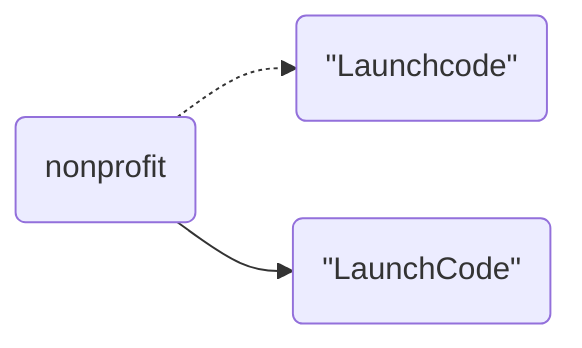

# 7. Stringing Characters Together

[toc]

---

## 7.1. Strings as Collections

A **string** is a sequence of characters inside quotes.

### 7.1.1. Collection Data Types

Data types that are comprised of smaller pieces are called **collected data types** (CDTs) or **collection types**. Depending on what we are doing, we may want to treat a value of a CDT as a single entity (the whole collection), or we may want to access its parts.

A **character** is a string that contains exactly one element. (See the ASCII table!)

> :nerd_face: **Actually...** in JavaScript a character is a string that contains exactly one element, but if Java or C, a character is its own data type (`char`) and a collection of characters makes up a string.

We can think of strings as being built out of characters, such that in this way strings can be broken down in to smaller pieces (characters). Other data types like `number` and `boolean`, are not composed of any smaller parts.

### 7.1.2. Ordered Collections

We defined strings as *sequential* collections of characters. This means that individual characters that make up the string are assumed to be in a particular order from left to right. The string `"LaunchCode"` is different from the string `"CodeLaunch"`, even though they contain the exact same characters.

Collection types that allow their elements to be ordered are known as **ordered collections**, for reasons we will delve into shortly.

## 7.2. Bracket Notation

> :information_source: **NOTE**: This is why arrays are taught before strings!

Understanding strings as sequential collections of characters gives us more than just a mental model of how they are structured. JavaScript provides a rich collection of tools---including special syntax and operators---that allow us to work with strings.

**Bracket notation** is the special syntax that allows us to access the individual characters that make up a string. To access a character, we use the syntax `someString[i]` where `i` is the **index** of the character we want to access. String indices are integers representing the position of a character within a given string, and they start at `0`. Thus the first character of a string has an index `0`, the second has index `1`, etc. An expression of the form `someString[i]` gives the character at index `i`.
$$
\begin{array}{|c|}
\hline
\text{J}&\text{a}&\text{v}&\text{a}&\text{S}&\text{c}&\text{r}&\text{i}&\text{p}&\text{t}
\\
\hline
0 & 1 & 2 & 3 & 4 & 5 & 6 & 7 & 8 & 9 \\
\hline
\end{array}
$$
The figure above shows the index of each character in the string `"JavaScript"`.

> **Example**: This program prints out the initials of the person's name.
>
> ```js
> let jsCreator = "Brendan Eich";
> let firstInitial = jsCreator[0];
> let lastInitial = jsCreator[8];
> 
> let outputStr = "JavaScript was created by somebody with initials " +
>    firstInitial + "." +
>    lastInitial + ".";
> 
> console.log(outputStr);
> ```
>
> ```
> JavaScript was created by somebody with initials B.E.
> ```

What happens if we try to access an index that does not exist, for example `-1` or a index larger than the length of the string?

> 🧩**Try It!** ([link](https://repl.it/@launchcode/Invalid-String-Indices))
>
> ```js
> let jsCreator = "Brendan Eich";
> 
> console.log(jsCreator[-1]);		// undefined
> console.log(jsCreator[42]);		// undefined
> ```

> :question: **Question**: What does an expression using bracket notation evaluate when the index is invalid (the index does not correspond to a character in the string)?
>
> :exclamation: **Answer**: `undefined`

### 7.2.1. Check Your Understanding :white_check_mark:

> :question: **Question**: If `phrase = 'Code for fun'`, then `phrase[2]` evaluates to:
> a. `"o"`
> b. `"d"`
> c. `"for"`
> d. `"fun"`
>
> :exclamation: **Answer**: b. `phrase[2]="d";`

> :question: **Question**: Which of the following returns `true` given `myStr = 'Index'`? Choose all correct answers.
> a. `myStr[2] === 'n';`
> b. `myStr[4] === 'x';`
> c. `myStr[6] === ' ';`
> d. `myStr[0] === 'I';`
>
> :exclamation: **Answer**: b. and d.

> :question: **Question**: What is printed by the following code?
>
> ```js
> let phrase = "JavaScript rocks!";
> console.log(phrase[phrase.length - 8]);
> ```
>
> a. `"p"`
> b. `"i"`
> c. `"r"`
> d. `"t"`
>
> :exclamation: **Answer**: d.	`phrase.length` is 17, the character printed is at index 9 which is `t`.

## 7.3. Strings as Objects

Beyond bracket notation, there are many other tools we can use to work with strings. Talking about these tools requires some new terminology.

### 7.3.1. Object Terminology

In JavaScript, strings are objects, so to understand how we can use them in our programs, we must first understand some basics about objects.

An **object** is a collection of related data and operations. Any operation that can be carried out on an object is known as a **method**. A piece of data associated with an object is know as a **property**.

You can think of methods and properties as functions and variables, respectively, that "belong to" an object. Properties and methods are accessed using **dot notation**, which dictates that we use the object name, followed by a `.`, followed by the property or method name. When using a method, we must also use parentheses as we do when regular functions.

It does not make sense to refer to a property or method without also referring to the associated object.

We have already encountered one object, the built-in object `console`, which we use to output messages.

```js
console.log(typeof console);		// object
```

JavaScript reports that the type of `console` is indeed `object`.

When calling `console.log` we are calling the `log` method of the `console` object.

We will learn quite a bit more about objects in this course, including how to use objects to create your own custom data types. The powerful JavaScript feature allows us to build up data and functionality in useful, modular ways.

### 7.3.2. Strings Are Objects

> :reminder_ribbon: **TODO**: Probably should add more arguments and classes to this class diagram and move it to its own file later.
>
> 🧜‍♀️**Mermaid NOTE**: Typora hasn't upgraded to the version of mermaid yet that recognizes *static* variables and methods with the `$`, which has been part of UML since forever. Until it is recognized, a `$` will be used to indicate static properties and methods. All other properties and methods are considered *instance* properties and methods. We'll learn about static and instance properties and values during this course.

```mermaid
classDiagram
	class Object {
		+ Number : length = 1
		+ Object()
		+ Object : prototype$
		+ Object : assign$()
		+ Object : create$()
		+ Object : defineProperty$()
		+ Array : entires$()
		+ Object : freeze$()
		+ Object : fromEntries$()
		+ Object : getOwnPropertyDescriptor$()
		+ Object : getOwnPropertyDescriptors$()
		+ Array : getOwnPropertyNames$()
		+ Object : getOwnPropertySymbols$()
		+ Object : getPrototypeOf$()
		+ Boolean : is$()
		+ Boolean : isExtensible$()
		+ Boolean : isFrozen$()
		+ Boolean : isSealed$()
		+ Array : keys$()
		+ Object : preventExtensions$()
		+ Object : seal$()
		+ Object : setPrototype$()
		+ Array : values$()
		+ Function : constructor
		+ Boolean : hasOwnProperty()
		+ Boolean : isPrototypeOf()
		+ Boolean : propertyIsEnumerable()
		+ String : toLocaleString()
		+ String : toString()
		- String : valueOf()
	}
	class Function {
		+ Function()
		+ Number : length
		+ Number : name
		+ Function : constructor
		+ Function : prototype$
		+ Function : apply(thisArg[,argsArray])
		+ Function : bind(thisARg[,arg1[, #8230; [,argN]]])
		+ Function : call()
		+ String : toString()
	}
	class String {
		+ String()
		+ String : fromCharCode$(num1 [, #8230; [, numN]])
		+ String : fromCodePoint$(num1 [, #8230; [, numN]])
		+ String : raw()
		+ Function : constructor
		+ Number : length
		+ String : prototype$
		+ String : char(index)
		+ String : charCodeAt(index)
		+ String : concat(str1 [, #8230; , strN])
		+ Boolean : includes(searchString [, position])
		+ Boolean : endsWith(searchString [, length])
		+ Number : indexOf(searchValue [, fromIndex])
		+ Number : lastIndexOf(searchValue [, fromIndex])
		+ Number : localeCompare(compareString [, locales [, options]])
		+ String : match(regexp)
		+ Array : matchAll(regexp)
		+ String : normalize([form])
		+ String : padEnd(targetLength [,padString])
		+ String : padStart(targetLength [,padString])
		+ String : repeat(count)
		+ String : replace(searchFor, replaceWith)
		+ String : search(regexp)
		+ String : slice(beginIndex [, endIndex])
		+ Array : split([sep [, limit]])
		+ Boolean : startsWith(searchString [, length])
		+ String : substring(indexStart [, indexEnd])
		+ String : toLocaleLowerCase([locale [, #8230;locales]])
		+ String : toLocaleUpperCase([locale [, #8230;locales]])
		+ String : toLowerCase()
		+ String : toString()
		+ String : toUpperCase()
		+ String : trim()
		+ String : trimStart()
		+ String : trimLeft()
		+ String : trimEnd()
		+ String : trimRight()
		+ String : valueOf()
		+ Iterator : @@iterator()
	}
	class Array {
		+ Array()
		+ Number : length$
		+ Array : prototype$
		+ Array : get[@@species]
		+ Array : from(arrayLike[, mapFn[, thisArg]])
		+ Array : of(element0 [ element1[ #8230; [elementN]]])
		+ Function : constructor
		+ Array : length
		+ Array : prototype[@@unscopables]
		+ Array : flat([depth])
		+ Array : flatMap(callbackFn(currentValue[,index[,array]])[,thisArg])
		%% Mutator Methods
		+ Array : copywith(target [, start [, end]])
		+ Array : fill(value [, start [, end]])
		+ varies : pop()
		+ Array : push(element1[ #8230; [elementN]])
		+ Array : reverse()
		+ Array : shift()
		+ Array : sort()
		+ Array : splice(start [, deleteCount [, item1 [, item2 [, #8230;]]]])
		+ Array : unshift(element1[ #8230; [elementN]])
		%% Accessor methods
		+ Array : concat([value1, [ value2 [, #8230; [, valueN]]]])
		+ Array : filter(callbackFn(element[ ,index [, array]])[, thisArg])
		+ Boolean : includes(valueToFind[, fromIndex])
		+ Number : indexOf(searchElement[, fromIndex])
		+ String ; join([sep])
		+ Number : lastIndexOf(searchElement[, fromIndex])
		+ Array : slice([begin[, end]])
		+ String : toLocaleString()
		+ String : toString()
		%% Interation methods
		+ Array : entries()
		+ Boolean : every(callbackFn(element[,index[, array]])[, thisArg])
		+ varies : find(callbackFn(element[, index[, array]])[, thisArg])
		+ Number : findIndex(callbackFn(element[, index[, array]])[, thisArg])
		+ Array : forEach(callbackFn(currentValue[, index[, array]])[, thisArg])
		+ Array : keys()
		+ Array : map(callbackFn(currentValue[, index[, array]])[, thisArg])
		+ Array : reduce(callbackFn(accumulator, currentValue[, index [, array]])[, initialValue])
		+ Array : reduceRight(callbackFn(accumulator, currentValue[, index [, array]])[, initialValue])
		+ Boolean : some(callbackFn(element[,index[, array]])[, thisArg])
		+ Array : values()
		+ Array : prototype[@@interator]()
	}
	class Boolean {
		+ Boolean()
		+ Number : length$ = 1
		+ Boolean : prototype$
		+ Function : constructor
		+ String : toString()
		+ Object : valueOf()
	}
	class Number {
		+ Number()
		+ Number : EPSILON$
		+ Number : MAX_SAFE_INTEGER$
		+ Number : MAX_VALUE$
		+ Number : MIN_SAFE_INTEGER$
		+ Number : MIN_VALUE$
		+ Number : NaN$
		+ Number : NEGATIVE_INFINITY$
		+ Number : POSITIVE_INFINITY$
		+ Number : prototype$
		+ Boolean : isNaN$()
		+ Boolean : isInteger$()
		+ Boolean : isSafeInteger$()
		+ Number : parseFloat$(string)
		+ Number : parseInt$(string[,radix])
		+ Function : constructor
		+ String : toExponential(fractionDigits)
		+ String : toFixed(digits)
		+ String : toLocaleString([locales[,options]])
		+ String : toPrecision(precision)
		+ String : toString([radix])
		+ String : valueOf() 
	}
	class Math {
		+ Number : E$
         + Number : LN2$
         + Number : LN10$
         + Number : LOG2E$
         + Number : LOG10E$
         + Number : PI$
         + Number : SQRT1_2$
         + Number : SQRT2$
         + Number : abs$(x)
         + Number : acos$(x)
         + Number : acosh$(x)
         + Number : asin$(x)
         + Number : asinh$(x)
         + Number : atan$(x)
         + Number : atanh$(x)
         + Number : atan2$(y,x)
         + Number : cbrt$(x)
         + Number : ceil$(x)
         + Number : clz32$(x)
         + Number : cos$(x)
         + Number : cosh$(x)
         + Number : exp$(x)
         + Number : expm1$(x)
         + Number : floor$(x)
         + Number : fround$(x)
         + Number : hypot$([x[, y [, #8230;]]])
         + Number : imul$(x,y)
         + Number : log$(x)
         + Number : log1p$(x)
         + Number : log10$(x)
         + Number : log2$(x)
         + Number : max$([x[, y [, #8230;]]])
         + Number : min$([x[, y [, #8230;]]])
         + Number : pow$(x,y)
         + Number : random$()
         + Number : round$(x)
         + Number : sign$(x)
         + Number : sin$(x)
         + Number : sinh$(x)
         + Number : sqrt$(x)
         + Number : tan$(x)
         + Number : tanh$(x)
         + Number : trunc$(x)
	}
	class Date {
		+ Date()
		+ Date : prototype$
		+ Number : length$ = 7
		+ Number : now$()
		+ String : parse$()
		+ String : UTC$()
		+ Function : constructor
		%% Getters
		+ Number : getDate()
		+ Number : getDay()
		+ Number : getFullYear()
		+ Number : getHours()
		+ Number : getMilliseconds()
		+ Number : getMinutes()
		+ Number : getMonth()
		+ Number : getSeconds()
		+ Number : getTime()
		+ Number : getTimeZoneOffset()
		+ Number : getUTCDay()
		+ Number : getUTCFullYear()
		+ Number : getUTCHours()
		+ Number : getUTCMilliseconds()
		+ Number : getUTCMinutes()
		+ Number : getUTCMonth()
		+ Number : getUTCSeconds()
		%% Setters
		+ Date : setDate(dayOfMonth)
		+ Date : setFullYear(year)
		+ Date : setHours(hour)
		+ Date : setMilliseconds(ms)
		+ Date : setMinutes(minute)
		+ Date : setMonth(month)
		+ Date : setSeconds(second)
		+ Date : setTime(ms)
		+ Date : setUTCDate(dayOfMonth)
		+ Date : setUTCFullYear(year)
		+ Date : setUTCHours(hour)
		+ Date : setUTCMilliseconds(ms)
		+ Date : setUTCMinutes(minute)
		+ Date : setUTCMonth(month)
		+ Date : setUTCSeconds(second)
		%% Conversion getters
		+ String : toDateString()
		+ String : toISOString()
		+ String : toJSON()
		+ String : toLocaleDateString()
		+ String : toLocaleString()
		+ String : toLocaleTimeString()
		+ String : toString()
		+ String : toTimeString()
		+ String : ToUTCString()
		+ Date : valueOf()
	}
	class RegExp {
		+ Function : constructor
		+ String : flags
		+ Boolean : dotAll
		+ Boolean : global
		+ Boolean : ignoreCase
		+ Boolean : multiline
		+ String : source
		+ Boolean : sticky
		+ Boolean : unicode
		+ RegExp : exec()
		+ RegExp : test()
		+ RegExp : prototype[@@match]()
		+ RegExp : prototype[@@matchAll]()
		+ RegExp : prototype[@@replace]()
		+ RegExp : prototype[@@search]()
		+ RegExp : prototype[@@split]()
		+ String : toString()
	}
	class JSON {
		+ Object : parse(text[, reviver])
		+ String : stringify(value[, replacer[, space]])
	}
	Object <|-- Function
	Function <-- Object
	Object <|-- Boolean
	Object <|-- Number
	Object <|-- String
	Object <|-- Array
	Number <.. Math
	Object <|-- Math
	Number <.. Date
	Object <|-- Date
	String <.. RegExp
	Object <|-- RegExp
	Object <|-- JSON

```



The fact that strings are objects means that they have associated data and operations, or *properties* and *methods* as we will call them from now on.

Every string that we work with will have the same properties and methods. The most useful string property is named **`length`** and it tells us how many characters are in a string.

> **Example**
>
> ```js
> let firstName = "Grace";
> let lastName = "Hopper";
> 
> console.log(firstName, "has", firstName.length, "characters");
> console.log(lastName, "has", lastName.length, "characters");
> ```
>
> ```
> Grace has 5 characters
> Hopper has 6 characters
> ```

Every string has a `length` property which is an integer. The `length` property is the only string property that we will use, but there are many useful string methods. We will explore these in depth in the section String Methods (Section 7.5), but let's look at one now and give you the idea of what's ahead.

> :information_source: **NOTE**: See that class diagram earlier? That's pretty much the next couple of chapters. I couldn't figure out how to diagram the Function type in relation to the Object type since JavaScript kind of treats them equally. (Still trying to map out the relationship between `Object` and `Function` in UML. )

The **`toLowerCase()`** string method returns the value of a string in all owercase letters.  Since it is a method, we must precede it with a specific string in order to use it.

> **Example**
>
> ```js
> let nonprofit = "LaunchCode";
> 
> console.log(nonprofit.toLowerCase());	// launchcode
> console.log(nonprofit);				   // LaunchCode
> ```

Notice that `toLowerCase()` does not alter the string itself, but instead *returns* the result of the converting string to all lowercase characters. In fact, it is not possible to alter the characters within a string, as we will now see.

### 7.3.3. Check Your Understanding :white_check_mark:

> :question: **Question**: Given `word = 'Rutabaga'`, why does `word.length` return the integer 8, but `word[8]` is `undefined`?
>
> :exclamation: **Answer**: The index starts at 0 and must be less than the length of the word or else it will return `undefined`.
>
> 🤪 Their answer: "I spent sufficient time considering the question, and my mental response involved zer-based indexing and how it relates to the value returned by word.length." (So yeah, I got this right.)

## 7.4. String Immutability

An object is **immutable** if it can not be changed. Strings are immutable, which means we can't change the individual characters with a given string. While we can access individual characters using bracket notation, attempting to change individual characters simply does not work.

> **Example**
>
> ```js
> let nonprofit = "Launchcode";
> 
> console.log(nonprofit);	// Launchcode
> nonprofit[6] = "C";		// ❌
> console.log(nonprofit);	// Launchcode
> ```

We attempted to change the value of the character at index 6 from `c` to `C` by using an assignment statement along with bracket notation on line 4. However, this change did not take place.  In many programming languages, string are immutable, and while trying to change a string in some languages results in a error, JavaScript simply ignores are request to alter a string.

It is important to notice that immutability applies to string *values* and not string variables.

> **Example**
>
> ```js
> let nonprofit = "Launchcode";
> nonprofit = "LaunchCode";		// ✅
> conole.log(nonprofit);			// LaunchCode
> ```

In this example, the change made on line 2 is carried out. The difference between this example and the previous example is that here we are modifying the value that the variable is storing, and not the string itself. Using our visual analogy of a variable as a label that "points at" a value, the second example has the following effect:



*When the value of a variable storing a string is changed, the variable then points to a new value, with the old value remaining unchanged*

### 7.4.1. Check Your Understanding :white_check_mark:

> :question: **Question**: Given `pet = 'cat'`, why do the statements `console.log(pet + 's');` and `pet += 's'` NOT violate the immutability of strings?
>
> :exclamation: **Answer**: in the `console` example, `pet` is not altered, but  a string is concatenated following it. In the `pet += 's';` example, another way of saying that is `pet = pet + 's';`, which means `pet` was not altered before the assignment but was replaced after assignment occured.
>
> :reminder_ribbon:**TODO**: There might be a better answer than the one I gave. We'll have to see later when we're quizzed.
>
> 🤪 Their answer: "Yes, I have though of an answer, and I would like to check my thinking after I submit this quiz."

## 7.5. String Methods

JavaScript provides many useful methods for string objects. Recall that a method is a function that "belongs to" a specific object. Methods will typically result in some operation being carried out on the data within an object. For strings, this means that our methods will typically transform the characters of a given string in some way.

==As we have learned, strings are immutable. Thus, string methods will not change the value of a string itself, but instead will *return* a new string that is the result of the given operation.==

> :information_source: **Note**: This is likely the answer to the question in the previous section's CYA Question.

### 7.5.1. Common String Methods

> :information_source: **NOTE**: I'm not going to recreate the table here. There are way more methods than the table in the textbook has listed here. I will list the string methods in another document in my notes repository. In the mean time, take a look at
>
> * [W3Schools](https://www.w3schools.com/jsref/jsref_obj_string.asp)
> * [MDN](https://developer.mozilla.org/en-US/docs/Web/JavaScript/Reference/Global_Objects/String) :star:

### 7.5.2. Check Your Understanding :white_check_mark:

> :question: **Question**: What is printed by the following code?
>
> ```js
> let language = "JavaScript";
> language.replace('J', 'Q');
> language.slice(0,5);
> console.log(language);
> ```
>
> a. `"JavaScript"`
> b. `"QavaScript"`
> c. `"QavaSc"`
> d. `"QavaS"`
>
> :exclamation: **Answer**: a. Because we didn't re-assign `language` after we made changes with `.replace` and `.slice`.

> :question: **Question**: Given `language = 'JavaScript';`, what does `language.slice(1,6)` return?
> a. `"avaScr"`
> b. `"JavaSc"`
> c. `"avaSc"`
> d. `"JavaS"`
>
> :exclamation: **Answer**:  c., we started at index 1 (`a`) and selected through index 6 (`c`).

> :question: **Question**: What is the value of the string printed by the following program?
>
> ```js
> let org = "  The LaunchCode Foundation ";
> let trimmed = org.trim();
> 
> console.log(trimmed);
> ```
>
> a. `"  The LaunchCode Foundation"`
> b. `"The LaunchCode Foundation"`
> c. `"TheLaunchCodeFoundation"`
> d. `" The LaunchCode Foundation"`
>
> :exclamation: **Answer**: b. `.trim` removes all white spaces before and after non-whitespace characters.
>
> > :information_source: **NOTE**: To verify that the answer is b. (because there are some answers with spaces after it), we need to use another feature that is not getting enough attention in this course: **template strings**. Template strings are surrounded by backticks. Because of how markdown is encoded in Typora and other markdown editors, we can only demonstrate this in a code block and can not do this with inline code.  Escaping a backtick gets really messy in inline examples!
>
> ```js
> console.log(`"${trimmed}"`);	// "The LaunchCode Foundation"
> ```
>
> > :nerd_face: **Actually...** We do cover template strings in Section 7.8, but we call them **template literals**.

## 7.6. Encoding Characters

> :cactus: **D.R.Y.**: Just about everything in Section 7.6 I wrote something about in my Computer Science notes. I don't feel like repeating everything here.

A **bit** is a unit of measurement of data made of 0s and 1s.

### 7.6.1. Representing Numbers

A **byte** is a set of 8 bits and they are represented by a **binary number** (base-2 number). The numbers we are used to, which are built out of the integers 0 through 9, are **decimal numbers** (base-10 numbers).

Since each bit can have one of two values (0 or 1), each byte can have one of 2^8^=256 different values (0 through 255).

### 7.6.2. Representing Strings

**Strings** are collections of characters, so if we can represent each character as a number, then we'll have a way to go from a string to a collection of bits, and back again.

#### 7.6.2.1. Character Encodings

The translations between characters and integers are called **character encodings**. There are many different encodings, some of which continue to evolve as our use of data evolves. For example, the most recent version of the Unicode character encoding includes emoji characters. 

#### 7.6.2.2. The ASCII Encoding

Most of the characters that you are using--including letters, numbers, whitespace, punctuation, and symbols--are part of the **ASCII** character encoding. This standard has changed very little since the 1960s, and is the foundation of all other commonly-used encodings.

**ASCII** stands for **American Standard Code for Information Interchange**. The full table is in my Computer Science notes, but you can also look at [this table](http://ascii-table.com/ascii.php) called an **ASCII table**.

In summary, strings are stored in a computer using the following process:

1. Break a string into individual characters.
2. Use a character encoding, such as ASCII, to convert each of the characters to an integer.
3. Convert each integer to a series of bits using decimal-to-binary integer conversion.

> :information_source: **NOTE**: JavaScript uses the UTF-16 encoding, which includes ASCII as a subset. We will rarely need anything outside its ASCII subset, so we will usually talk about "ASCII codes" in JavaScript.

### 7.6.3. Character Encodings in JavaScript

JavaScript provides methods to covert any character into its ASCII code and back.

The string method `.charCodeAt()` takes an index and returns the ASCII code of the character at that index.

> **Example**
>
> ```js
> let nonprofit = "LaunchCode";
> 
> for(let i = 0; i < nonprofit.lenght; i++) {
>     console.log(nonprofit.charCodeAt(i));
> }
> ```
>
> > :information_source: **NOTE**: I'm not going to output the console output here. Save for the fact that the output is each character represented by their decimal ASCII value. (Honestly, hexadecimal would be better...and outputing it all on one line instead of one character per line would also be better.)
> >
> > :reminder_ribbon: **TODO**: Show these guys how it's really done...later.

To convert an ASCII code to an actually character, use `String.fromCharCode()`.

> **Example**
>
> ```js
> let codes = [76, 97, 117, 110, 99, 104, 67, 111, 100, 101];
> let characters = "";
> 
> for(let i = 0; i < codes.length; i++){
>     characters += String.fromCharCode(codes[i]);
> }
> 
> console.log(characters);	// LaunchCode
> ```
>
> > :reminder_ribbon: **TODO**: There's a better way to do this. I just don't have time to show it right now.


## 7.7. Special Characters

Aside from letters, number, and symbols, there are another class of characters that we will occasionally use in strings know as **special characters**. These characters consist of special character combinations that all begin with the backslash. They allow us to include characters in strings that would be difficult or impossible to include otherwise, such as Unicode characters that are not on our keyboards, control characters, and whitespace characters.

The most commonly-used special characters are `\n` and `\t`, which are the **newline** and **tab** characters, respectively.

> :information_source: **NOTE**: Here is the part of the book where there would be a table showing those characters, but I don't feel like putting it here and you an see them in the Computer Science notes. I should link to it later.

We can also represent Unicode characters (most which aren't on a normal keyboard) using special character combinations of the form `\uXXXX`, where the `X`s are combinations referenced by the [Unicode table](https://unicode-table.com/en/). The `X` values are hexadecimal values 0 through F.

We can also use the backslash to include quotes within a string. We've gone over this before. And when we do it, it's called **escaping** a character.

### 7.7.1. Check Your Understanding :white_check_mark:

> :question: **Question**: Which of the options below print `Launch` and `Code` on separate lines?
> a. `console.log('Launch\nCode');`
> b. `console.log('Launch/nCode');`
> c. `console.log('Launch', 'Code');`
> d. `console.log('Launch\tCode');`
>
> :exclamation: **Answer**: a. `\n` will put the two words on different lines.

## 7.8. Template Literals :new:

Earilier we used *concatenation* to combine strings and variables together in order to create a specific output. Unfortunately, this process quickly gets tedious for any output that depends on multiple variables. Often, concatenation requires multiple test runs for the code the code in order to check for syntax errors and proper spacing within the output. Fortunately, JavaScript offers us a better way to accomplish this process.

**Template literals** allow us for the automatic insertion of ==expressions (including variables)== into strings.

While normal strings are enclosed in single or double quotes, template literals are enclosed in backticks. Within a template literal, any expression is surrounded by `${ }` will be evaluated, with the resulting value included in the string.

Besides allowing us to include data in strings in a cleaner, more readable way, template literals also allow us to create multi-line strings without using string concatenation or special characters.

> **Example**
>
> ```js
> let intro = `In never wanted to be a computer programmer...
> I wanted to be...A LUMBERJACK!
> Leaping from tree to tree a they float down the mighty rivers of British Columbia.`;
> 
> let song =`I'm a lumberjack and I'm OK.
> I sleep all night and I work all day!`;
> 
> let changes = [[/I'm/g,'He\'s'],[/I sleep/,'He sleeps'],[/I work/,'He works']];
> 
> // .map function FTW!
> /*
> for(let i = 0; i < changes.length; i++){
> 	song = song.replace(changes[i][0],changes[i][1]);
> }
> */
> changes.map(([former,future]) => song = song.replace(former,future));
> 
> console.log(song);
> ```
>
> ```
> He's a lumberjack and He's OK.
> He sleeps all night and He works all day!
> ```

> :fuelpump: **YMMV**: The ECMAScript specifications define the standards for JavaScript. The 6th edition, known as ES2015, added template literals. Not only are template literals relatively new to JavaScript, but you may encounter environments (e.g. older web browser, Internet Explorer/Edge) where they are not supported. Check [CanIUse.com](https://caniuse.com/#search=template%20literals).

### 7.8.1. Check Your Understanding :white_check_mark:

> :question: **Question**: Mad Libs are games where one play asks the group to supply random words (e.g. "Give me a verb," or "I need a color"). The words are substituted into blanks within a story, which is then read for everyone's amusement. In elementary school classrooms, giggles and hilarity often ensue. Try it!
>
> Refactor the following code and replace the awkward string concatenation with template literals. Be sure to add your own choices for the variables. ([link](https://repl.it/@launchcode/String-Mad-Lib))
>
> ```js
> let pluralNoun = ;
> let name = ;
> let verb = ;
> let adjective = ;
> let color = ;
> 
> console.log("JavaScript provides a "+ color +" collection of tools — including " + adjective + " syntax and " + pluralNoun + " — that allows "+ name +" to "+ verb +" with strings.")
> 
> ```
>
> :exclamation: **Answer**:
>
> ```js
> let pluralNoun = ;
> let name = ;
> let verb = ;
> let adjective = ;
> let color = ;
> 
> console.log(`JavaScript provides a ${color} collection of tools — including ${adjective} syntax and ${pluralNoun} — that allows ${name} to ${verb} with strings.`);
> ```
>
> :exclamation: :exclamation: **BETTER ANSWER**:
>
> ```js
> const input = require('readline-sync');
> 
> console.log("Five questions to answer...");
> let pluralNoun = input.question("Give me a plural noun: ");
> let name       = input.question("Give me a name: ");
> let verb       = input.question("Give me a verb: ");
> let adjective  = input.question("Give me an adjective: ");
> let color      = input.question("Finally, give me a color: ");
> 
> console.log(`JavaScript provides a ${color} collection of tools — including ${adjective} syntax and ${pluralNoun} — that allows ${name} to ${verb} with strings.`);
> ```
>
> ```
> Five questions to answer...
> Give me a plural noun: trains
> Give me a name: Alexander Hamilton
> Give me a verb: skate
> Give me an adjective: fruity
> Finally, give me a color: purple
> JavaScript provides a purple collection of tools — including fruity syntax and trains — that allows Alexander Hamilton to skate with strings.
> ```

## 7.9. Exercises: Strings :runner:

> :x: **CENSORED**

### 7.9.1. Part One

### 7.9.2. Part Two

### 7.9.3. Part Three

:checkered_flag: Time for the other half of this important lesson! Up Next: [Arrays Keep Things in Order](Arrays.md).

---

#LaunchCode

