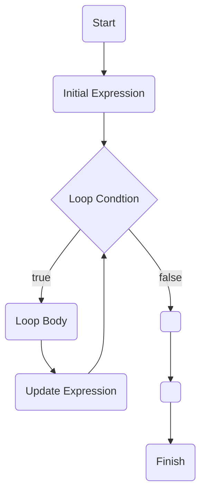
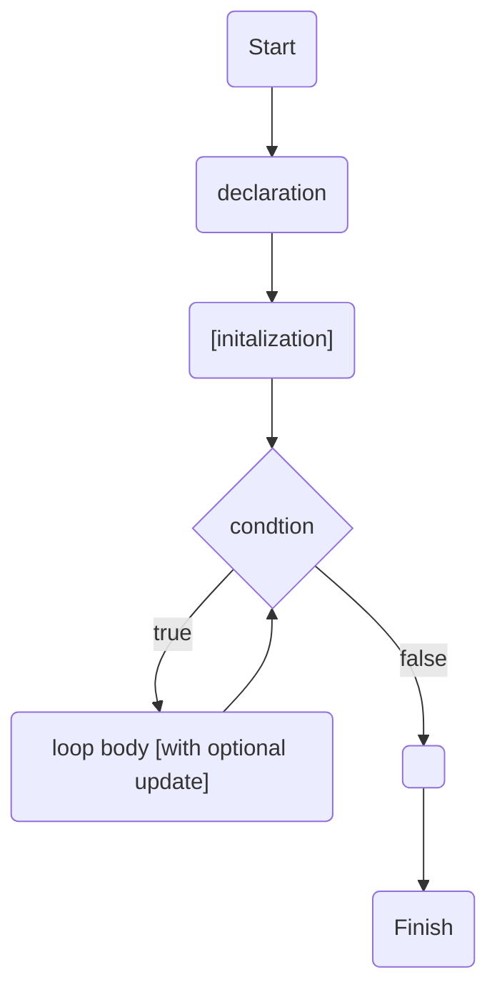
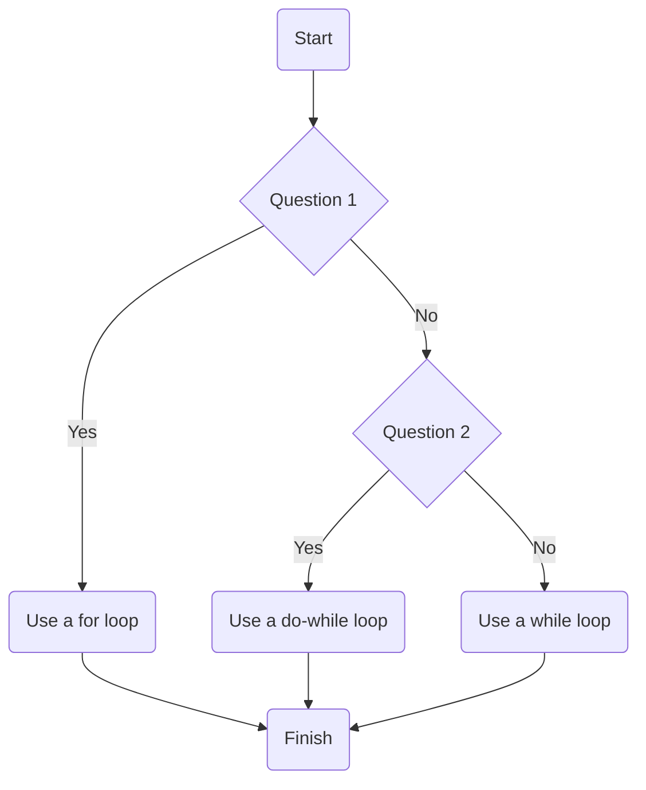

# 9. Repeating with Loops

[toc]

---

> :reminder_ribbon: **TODO**: This chapter doesn't touch on pre-increments/pre-decrements!
> :reminder_ribbon: **TODO**: Touch on `for-in` and show why using them is a BAD id:rea!
> :reminder_ribbon: **TODO**: Touch on `.map` and why you SHOULD use that. (Also some of the functional methods (`.filter`, etc.))
> :reminder_ribbon: **TODO**: **Add keywords to flow charts.**

> "The definition of insanity is doing the same thing over and over again and expecting a different result."
>
> --Unknown

## 9.1. Iteration

When repeating the same actions over and over again, a human is likely to make a mistake. Computers, however, possess the ability to care out repetitive taks without making mistakes.

Repeated execution of a sequence of statements is called **iteration**. This chapter explores ~~two~~ ***five*** mechanisms that JavaScript provides to make iteration simple and flexible--the `for` and `while` loops.

> :information_source: **NOTE**: I want to add three other things: `do-while`, recursive patterns, and the the functional programming functions like `.map`. I'll have to delve into the other three later.

Learning about iterations using loops is also an opportunity to introduce one of the most widely-known mnemonic decices in programming: **"Don't Repeat Yourself"** or **DRY**.

## 9.2. `for` Loops

A **`for` loop** is typically used for **definite iteration**. Definite iteration is the process of repeating a specific task with a specific data set. When a `for` loop begins, it can be determined usually exactly how many times it will execute: once for each item in the data set.

### 9.2.1. `for` Loop Syntax

```js
for(initial_expression; loop_condtion; update_expression){
    loop_body
}
```

Notice the first line within the parenthesis, the following components are separated by semicolons:

* initial expression
* loop condition
* update expression

> **Example**:
>
> ```js
> // Print the integers 0 through 50, one number per line.
> for(let i = 0; i < 51; i++){
>     console.log(i);
> }
> ```
>
> 1. The statement `let i = 0`, called the **initial expression**, is executed exactly once, at the *beginning* of loop execution. The variable `i` is the **loop variable**.
>
> 2. The boolean expression `i < 51` is the **loop condtion** that is evaluated before each loop iteration, or repetition.
>
> 3. The statement `i++` is the **update expression**. This expression is executed at the *end* of each loop iteration.
>
>    a. If the condtion is `true`, then the loop executes again.
>
>    b. If the condition is `false`, then the loop ceases exection, and the program moves on to the code after the loop.
>
> 4. The block of code surrounded with braces (`{...}`) is the **loop body**. The body is executed once for each iteration in the loop.

### 9.2.2. Flow of Execution of the `for` Loop

Here's how the loop in the previous example will execute:

1. When teh program reaches the `for` loop, the intial expression `let i = 0` is executed, declaring the variable `i` and initializing it to the value `0`.
2. The loop condition `i < 51` is evaluated, returning `true` because 0 is less than 51.
3. Since the condtion is true, the loop body executes, printing 0.
4. After the execution of the loop body, the update expression `i++` is executed, setting `i` to 1. This completes the first iteration of the group.
5. Steps 2 through 4 are repeated, suing the new value `i`. This continues until the loop condtion evaluates to `false` in step 2, ending the loop.

In this example, step 5 occurs when `i < 51` is `false` for the first time. Since our update expression adds 1 after each iteration, this occurs when `i` is 51 (that is `51 < 51` is `false`). At that point, the loop body will have executed exactly 51 times, with `i` having the values 0 through 50.

In general, we can visualize the flow of execution for a `for` loop as a flow chart.



> 🧜‍♀️ **Mermaide Bug**: Yeah, `Finish` should be on the outside of the `Loop Body-Update Expression` loop. To fix this, I added a couple of empty objects that do nothing but they do make sure `Finish` isn't on the inside. I'm sure there's a better way of doing this.

## 9.3. Iterating Over Collections

One of the most common uses for a `for` loop is to carry out a task once for each item in a collection. We have learned about two types of colelctions: strings and arrays. When using a loop with a collection in thi sway, we say that the loop *iterates over* the collection.

### 9.3.1. Iterating Over Strings

> **Example**: Print eah of the charactrs of the string `"LaunchCode"` on a separate line.
>
> ```js
> let name = "LaunchCode";
> 
> for(let i = 0; i < name.length; i++){
>     console.log(name[i]);
> }
> ```
>
> Since `name.length` is 10, the loop executes once each for the values of `i` from 0 to 9. The loop body, `console.log(name[i]);` will print `name[i]` each time. In each case, `name[i]` is one of the characters of `name`.

> 🧩 **Try It** out with your name! ([link](https://repl.it/@launchcode/for-Loop-Practice-With-Strings))

### 9.3.2. Iterating Over Arrays

> **Example**: Print each of the programming languages in the array `languages` on a separate line.
>
> ```js
> let languages = ["JS", "Java", "C#", "Python"];
> 
> for(let i = 0; i < languages.length; i++){
>     console.log(languages[i]);
> }
> ```
>
> Similar to the string example, the loop executes 4 times because `languages.length` is 4. For each iteration, `languages[i]` is one of the items in the array and the given language is printed.

> 🧩 **Try it** with a list of names. ([link](https://repl.it/@launchcode/for-Loop-Practice-With-Arrays))

## 9.4. Breaking Down the `for` Statement

### 9.4.1. `for` Loop Anatomy

The general form of a `for` loop is:

```js
for(initial_expression; loop_condition; update_expression){
    loop_body
}
```

#### 9.4.1.1. Initial Expression

The **initial expression** is excuted once, before any iterations of the loop. It can be any expression, even the **empty expression** (which contains no code). However, it almost always declares an initilized variable known as the **loop variable**.

The loop variable can be initialized to any value.

To avoid confusion and bugs, you should give your loop variable a unique name, one that you have not used elsewhere in your program. In cases where the loop variable is serving as a "counter" for iterations of a loop, it is conventional to use `i` for the variable names. In the case of nested `for` loops (loops inside loops), the variables `j`, `k`, etc. are often used.

The loop variable is typically used by the loop body but is not required. 

> **Example**: Here's a `for` loop that prints `"LaunchCode"` 42 times, but doesn't have the loop variable in the loop body.
>
> ```js
> for(let i = 0; i < 42; i++){
>     console.log("LaunchCode");	// no loop variable here!
> }
> ```

#### 9.4.1.2. Loop Condition

The **loop condition** is executed before each loop iteration. It  is *always* a boolean expression, evaluating to `true` or `false`. If the condition is true, the loop body executes. If the condition is false, loop execution stops and the program continues with the next line of code after the loop.

> **Example**: This loop does not iterate at all because its condtion is false to start with.
>
> ```js
> for(let i = 0; i < -1; i++){		// ❌ i < -1 is FALSE!
> 	console.log("Launch Code");
> }
> ```

It is critical that loop condtion *eventually* becomes false. A loop for which the condition is never false is known as an **infinite loop** because it never stops iterating. A program that contains an infinte loop will only stop after running out of memory or being manually stopped. (Use `CTRL+C` in a terminal to make it stop!)

> **Example**: This loop will not end because its condition will always be true.
>
> ```js
> for(let i = 0; i > -1; i++){	// ❌😱 i > -1 is TRUE! But that's not a good thing!
>     console.log("LaunchCode");
> }
> ```

> :warning: **CRITICAL WARNING! :scream: STOP INFINITE LOOPS AS SOON AS YOU DETECT THEM! :scream:**
> If you don't stop the loop, it will bog down your computer! Don't panic, but defintely know what to do to stop the program. Generally in the Node shell, use `CTRL+C`. If it is in web browser, hit the stop button or close the tab.

#### 9.4.1.3. Update Expression

The final component in a for loop definition is the **update expression**, which execution after *every* iteration of the loop. Whit this expression may not be anything, it most often updates the value of the loop.

In all the examples so far, the update expression has been `i++`, increment the loop by 1. However, we can update the loop variable in other ways.

>  **Example**: This loop prints *even* integers from 0 to 50.
>
> ```js
> for(let i = 0; i < 51; i += 2){		// alternatively we coud say i = i + 2, but i += 2 is better
>     console.log(i);
> }
> ```

A bad choice of update expression can also cause an infinite loop.

> **Example**: This loop repeates indefintely since i becomes smaller with each iteration, thus is never greater than or equal to 51.
>
> ```js
> for(let i = 0; i < 51; i--){	// ❌😱 infinite loop by way of update expression!
>     console.log(i);
> }
> ```

> 🧩 **Try It!** How does each of these three components affect the behavior of a `for` loop? Experiment by modifying each of them in our example: The variable initialization, the boolean condition, and the update expression.
>
> ```js
> for(let i = 0; i < 51; i++){
>     console.log(i);
> }
> ```
>
> 

### 9.4.2. Check Your Understanding :white_check_mark:

Consider the program:

```js
let phrase = "LaunchCode's LC101";

for(let i = 0; i < phrase.length - 1; i = i + 3) {
    console.log(phrase[i]);
}
```

> :question: **Question**: How many times does the loop body execute?
> a. 5
> b. 6
> c. 17
> d. 18
>
> :exclamation: **Answer**: b. If you add a line that counts the number of times that it runs, you will find that it runs 6 times.
>
> ```js
> let phrase = "LaunchCode's LC101";
> 
> for(let i = 0; i < phrase.length - 1; i = i + 3) {
>     console.log(phrase[i]);
>     count += 1;		// Add this line
> }
> console.log(count);	// Add this line
> ```
>
> ```
> L
> n
> C
> e
> 
> 1
> 6
> ```

> :question: **Question**: Which set of characters is printed by the loop? (WE have placed character for the choices below on the same line, but they would be on separate lines in an actual program output.)
> a. `'LaunchCode's LC101'`
> b. `'LaunchCode's LC10'`
> c. `'LnCe 1'`
> d. `'LnCe '`
>
> :exclamation: **Answer**: c.
>
> :bulb: **BTW**...to put them all on the same line, do this.
>
> ```js
> let phrase = "LaunchCode's LC101";
> let answer = [];		// This has to be an array. .push is not part of the String class.
> 
> for(let i = 0; i < phrase.length - 1; i = i + 3) {
>     //console.log(phrase[i]);	// remove this
>     answer.push(phrase[i]);		// add this
> }
> console.log(`'${answer.join("")}'`);	// add this line
> ```

## 9.5. The Accumulator Pattern

A **pattern** is a commonly-used approach to solve a group of similar programming problems.

### 9.5.1. Adding 1...n

Let's write a program that adds up the integers 1 through $n$, where $n$ is an integer value that we will create.

If you were to do this with pen and paper, you would write out a single formula and compute the answer. For example, for $n = 6$, you would write:
$$
1 + 2 + 3 + 4 + 5 + 6
$$
To get the result, you would first add 1 and 2 to get 3. Then add 3 to 3 to get 6. Then add 6 and 4 to get 10, an so on. The final result is 21.

We can carry out this same procedurer in code using a loop.

> **Example**: 
>
> ```js
> let n = 6;
> let total = 0;
> 
> for (let i = 1; i <= n; i++){
>     total += i;
> }
> console.log(total);		// 21
> ```

> :nerd_face: **Actually...** The mathematician [Carl Friedrich Gauss](https://en.wikipedia.org/wiki/Carl_Friedrich_Gauss), is credited to a legend that when he was young, a schoolteacher gave him some busy work to do to add all the numbers from 1 to 100. Gauss figured out how do do this without needing to write out all the numbers AND make it applicable to [arithmetic progression](https://en.wikipedia.org/wiki/Arithmetic_progression).
> $$
> \begin{aligned}
> S &= 1 + 2 + \dots + (n-1) + n & = \sum_{i = 1}^{n} i \\
> &= \frac{n(n+1)}{2}
> \end{aligned}
> $$
> So for the sum of 1 through 100, the answer would be 5050.
>
> How would that work? Add the first and last numbers from straight down the middle.
> $$
> \begin{aligned}
> 1 + 100 &= 101 \\
> 2 + 99 &= 101 \\
> 3 + 98 &= 101 \\
> \vdots \\
> 48 + 53 &= 101 \\
> 49 + 52 &= 101 \\
> 50 + 51 &= 101
> \end{aligned}
> $$
> This happens 50 times! And since 50 is half of 100, and all of the sum result in 101...
> $$
> \begin{aligned}
> S &= 50(100) = 5050 \\
> &= \frac{100}{2}(1 + 100)
> \end{aligned}
> $$
> So the program in the example loop should probably be
>
> ```js
> let n = 6;
> let total = (n/2)*(n+1);
> console.log(total);			// 21
> ```

The variable `total` is initialized to 0. The loop executes once each for values of `i` from 1 to 6. Each time the loop body executes, the next value of `i` is added to `total`.

The loop carries out the same basic algorithm that we used ot computer the sum `1 + 2 + 3 + 4 + 5 + 6` by hand. The only step that may seem different to us is the use of the variable `total` to keep track of the running total. When calculating the sum using pen and paper, we rarely write down this part, keeping track of the running total in our head. With programming, however, we must explicitly store such a value a s a variable.

The pattern of initializing a variable to some basic, or empty value, and updating it within a loop is commonly referred to as the **accumulator pattern**. We refer to the variable as the **accumulator**. In the example above, `total` is the accumulator, and it "accumulates" the individual integers one by one.

The accumulator pattern comes up regularly in programming. The key to using it successfully is to initialize the accumulator variable before you start the iteration. Once inside the loop, update the accumulator.

### 9.5.2. Reversing a String

While some programming languages have a string method that reverses a given string, JavaScript does not. Sure, the Array class has `.reverse` but the String class doesn't! Let's see how ew can write our own program that reverses a string using the accumulator pattern.

We'll start by initializing two variables: the string we want to reverse, and a variable that will eventually store the reversed  value of the given string.

```js
let str = "accumulator";
let reversed = "";
```

Here, `reversed` is our accumulator variable. Our approach to reversing the string will be to loop over `str`, adding each subsequent character to the *beginning* of `reversed`, so that the first character becomes the last, and the last character becomes the first.

> **Example**
>
> ```js
> let str = "blue";
> let reversed = "";
> 
> for(let i = 0; i < str.length; i++) {
>     reversed = str[i] + reversed;
> }
> 
> console.log(reversed);
> ```
>
> ```
> eulb
> ```

Notice that we don't use the `+=` operator within the loop since `reversed += str[i]` is the same as `reversed = reversed + str[i]`.

<table>
    <tr>
        <th>Loop iteration</th>
        <th><code>i</code></th>
        <th><code>str[i]</code></th>
        <th><code>reversed</code></th>
    </tr>
    <tr>
        <td>(before first iteration)</td>
        <td>Not defined</td>
        <td>Not defined</td>
        <td><code>""</code></td>
    </tr>
    <tr>
        <td>1</td>
        <td>0</td>
        <td><code>"b"</code></td>
        <td><code>"b"</code></td>
    </tr>
    <tr>
        <td>2</td>
        <td>1</td>
        <td><code>"l"</code></td>
        <td><code>"lb"</code></td>
    </tr>
    <tr>
        <td>3</td>
        <td>2</td>
        <td><code>"u"</code></td>
        <td><code>"ulb"</code></td>
    </tr>
    <tr>
        <td>4</td>
        <td>3</td>
        <td><code>"e"</code></td>
        <td><code>"eulb"</code></td>
    </tr>
</table>

> 🧩 **Try It!** What happens if you reverse the order of the assignment statement witin the `for` loop, so that `reversed = reversed + str[i];`? ([link](https://repl.it/@launchcode/Reversing-a-string))
>
> :exclamation: **Answer**: The string won't change direction. `reversed` will have the same value as `str`, `"blue"` instead of `"eulb"`.

### 9.5.3. Summing an Array

Another common use of the accumulator pattern is to computer sume value using each of the elements of an array. This is similar to adding 1 through $n$ as we did above, but the difference being we will use the *items* in an array rather than 1 through $n$. Basically...
$$
\begin{aligned}
S_n &= \underbrace{a_0 + a_1 + \cdots + a_{n-2} + a_{n-1}}_n &= \sum_{i=0}^{n-1} a_i
\end{aligned}
$$
The code equivalent would be

```js
// Note: the syntax on this next line is not valid. It's used as a generalization. So don't run it like this!
let a = [a_0, a_1, ..., a_nM2, a_nM1 ];		// where a.length = n;
let sum = 0;

for(let i = 0; i < a.length; i++){
    sum = a[i];
}
```

> **Example**
>
> ```js
> let numbers = [2, -5, 13, 42];
> let total = 0;
> 
> for(let i = 0; i < numbers.length; i++) {
>     total += numbers[i];
> }
> ```
>
> ```
> 52
> ```

## 9.6. `while` Loops

There is another JavaScript construct that can also be used for iteration, the **`while` loop**. The `while` loop provides a much more general mechanism for iterating. Like a `for` loop, it uses a condtion to determine whether the loop body will continue to execute. Unlike a `for` loop, it doesn't have initial or update expressions.

### 9.6.1. `while` Loop Syntax

The general syntax of a `while` loop looks like this:

```js
while (boolean_expression){
    loop_body
}
```

A `while` loop will continue to repeat as long as its boolean expression evaluates to `true`. The condition typically includes a value or variable that is updated within the loop, so that the expression eventually becomes false.

### 9.6.2. Flow of Execution of the `while` Loop



> :information_source: **NOTE**: In the above diagram, optional expressions are in square brackets. Remember, `while` loops do not have the manditory initialization or update requirements. In fact, you'll eventually learn how the initialization or the update can be snuck into the condition thanks to operator precedence. But these are complex to describe, so we won't go over them right now.

Here is the flow of execution for a `while` loop:

1. Evaluate the condtion, which yields a value of `true` or `false`.
2. If the condition is `false`, exit the `while` loop and continue execution at the next statement after the loop body.
3. If the condition is `true`, execute the loop body and then go back to step 1.

### 9.6.3. `for` Loops Rewritten as `while` Loops

So how are `for` and `while` loops equivalent to each other? A `for` loop is more of a specific type of `while` loop as the actions in a `while` loop are not in the strict order that a `for` loop presents us. Basically, a `for` loop is a `while` loop where declaration and initialization occurs before the `while` loop, and the update condition happens just before the end of the while loop.

> > :reminder_ribbon: **TODO** Elaborate a little bit more here
>
> 🏗 **Structure**: `for` loop
>
> ```js
> for(let i = 0; i < 51; i++){	// decl. & init. ; test ; update
>     console.log(i);				// loop body
> }
> ```
>
> 
>
> 🏗 **Structure**: `while` loop
>
> ```js
> let i = 0;					// declaration and initialization
> while (i < 51) {			// test
>     console.log(i);			// loop body
>     i++;					// update
> }
> ```
>
> 

Instead of relying on the initial and update expressions, as we do in a `for` loop, we must manage the state of our loop manually. To do this, *before* entering the `while` loop, we will create the variable `i` and initialize it to 0, the first number we want to print. This variable plays the same role as the loop variable in a `for` loop. Every iteration will print `i` and then increment `i` to the next value, until it reaches the value 51. The loop continues to iterate until the condition `i < 51` evaluates to false.

You can also read the `while` statement as if it were in a natural language: *while `i` is less than 51, continue executing the body of the loop.*

> 🧩 **Try It!** What happens if you forget to include `i++` at the end of the `while` loop above?
>
> :exclamation: **Answer**: INFINITE LOOP! 

### 9.6.4. Beyond `for` Loops

We started earlier that `while` loops are more flexible than `for` loops.

In this next program example, we demonstrate **input validation**. It prompts the user to enter a positive number, converting the input string to the number data type. If the number is not positive, the user will be prompted again wthin the body of the loop. As long as the user continues to input non-positive numbers, the loop will continue to iterate.

```js
const input = require('readline-sync');

let num = input.question('Please enter a postive number: ');
num = Number(num);

while (num <= 0) {
    num = input.question('Please enter a postive number: ');
	num = Number(num);
}
```

This example illustrates the additional flexibility provided by `while` loops. Whle we use `for` loops to iterate over fixed collections (strings, arrays, collections of integers), the `while` loop can be used to iterated in more general circumstances. For the input validation example, at runtime it cannot be determined how many times the loop will repeat.

> :cactus: **DRY! `do-while` loops**
>
> > :reminder_ribbon: **TODO**: Expand on this section.
>
> How on earth `do-while` loops are not part of LC101 is a travesty!  Do you like typing in the same question twice? Do you like self-torture? Hopefully the answer is NO to both questions.
>
> The **`do-while`** loop is just like the `while` loop, except testing occurs AFTER  the first iteration. Let's look at that example from earlier again as a `do-while` loop:
>
> ```js
> const input = require('readline-sync');
> 
> let num;
> 
>  do {
>     num = input.question('Please enter a postive number: ');
> 	num = Number(num);
> } while (num <= 0);
> ```
>
> This form is much better. (If it were any better, we would combine lines 6 and 7.)
>
> Here's what a `do-while` loop looks like in a flowchart.
>
> ```mermaid
> graph TB
> 	start("Start")
> 	decl("declare [and optionally initalize]")
> 	body("loop body")
> 	cond{"condition"}
> 	finish("Finish")
> 	
> 	start --> decl --> do(("&quot;do&quot;")) --> body --> cond
> 	cond --> |true| do
> 	cond --> |false| finish
> ```
>
> 

### 9.6.5. Infinite Loops, Revisited

It is easier to create an infinite `while` loop that an infinite `for` loop. To see this, consider what happens to our first `while` loop example if we forget to update the loop variable.

```js
let i = 0;

while(i < 51){
    console.log(i);
}		// ❌😱 Oh no! INFINTE LOOP! No step! Nothing to stop it! JANE! STOP THIS CRAZY THING!
```

This is an infinite loop, the variable `i` is initialized to 0 and never updated, so this condtion `i  < 51` will always be true. If you ran this program, you would see an never-ending list of zeros.

Even when we remember to update the counter we must be careful to make sure that the condition we eventually be `false`.

```js
let i = 0;

while(i < 51) {
    console.log(i);
    i--;			// ❌😱 Oh no! INFINITE LOOP! You're going backwards!
}
```

In this case, `i--` decreases the value of the counter. Since `i` starts at 0, `i < 51` will always be tru. If you ran this progra, you would see an ever-expanding list of negative numbers.

### 9.6.6. Check Your Understanding :white_check_mark:

> :question: **Question**: You can rewrite any `for` loop as a while loop.
> a. True
> b. False
>
> :exclamation: **Answer**: True. (See 9.3.6.)

> :question: **Question** The following code contains an infinite loop. Which is the best explaination for why the loop does not terminate?
>
> ```js
> let n = 10;
> let answer = 1;
> 
> while (n > 0) {
>     answer = answer + n;
>     n = n + 1;
> }
> console.log(answer);
> ```
>
> a. ==`n` starts at 10 and is incremented by 1 each time through the loop, so it will always be postive.==
> b. ~~`answer` starts at 1 and is incremented by `n` each time, so it will always be postive.~~
> c. ~~You cannot compare `n` to 0 in a `while` loop. You mut compare it to another variable.~~
> d. ~~In the while loop body, we must set `n` to `false`, and this code does not do that.~~
>
> :exclamation: **Answer**: a. All the other answers do not explain why the infinite loop happens.

## 9.7. Terminating a Loop With `break`

> :musical_note: *You've got to know when to hold 'em
> Know when to fold 'em
> Know when to walk away
> And know when to run
> You never count your money
> When you're sittin' at the table
> There'll be time enough for countin'
> When the dealin's done* :musical_note:
>
> --"The Gambler" by Kenny Rogers

> :reminder_ribbon: **TODO**: This course doesn't mention anything about `continue`!
> :reminder_ribbon: **TODO**: Also using labels...which is a rare but useful thing from old-school JS.

JavaScript, like most programming languages, provides a mechanism for terminating a loop before it would complete otherwise. The `break` keyword, when used within a loop, will immediately terminate the execution of any loop. Progra execution then continues at the next line of code below the loop.

> **Example**: This loop executes 12 times, for the values of `i` from 0 through 11. Durin the twelfth iteration, `i` is 11 and the condtion `i > 10` evaluates to `true` for the first time and execution reaches the `break` statement. The loop is immediately terminated at that point.
>
> ```js
> for (let i = 0; i < 42; i++) {
>     
>     // rest of th loop body
>     
>     if (i > 10) {
>         break;
>     }
>     
> }
> ```

The `break` statement can also be used within a `while` loop. Consider a situation where we are searching for a particular elements in an array. (WE haven't seen that JavaScript has array methods that can carry out array searches, but many programming languages do not.)

We can use a `while` loop to say *while we have not reached the end of the array, continue iterating.* We can then include a `break` within a conditional check to say *when we have found the element we are searching for , exit the loop.*

> **Example**: A `while` loop can be used with `break` to search for an element in an array.
>
> ```js
> let numbers = [ /* some numbers */ ];
> let searchVal = 42;
> let i = 0;
> 
> while (i < numbers.length) {
>     if (numbers[i] === searchVal) {
>         break;
>     }
>     i++;
> }
> 
> if (i < number.length) {
>     console.log("The value", searchVal, "was located at index", i);
> } else {
>     console.log("The value", searchVal, "is not in the array");
> }
> ```

Notice that we use a `while` loop in this example, rather than a `for` loop. This is because our loop variable, `i`, is used outside the loop. When we use a `for` loop in the way we have been, the loop variable exists only within the loop.

> :information_source: **NOTE**: In that above example, there's another function that does something like this. We'll deal with that later.

## 9.8. Choosing Which Loop to Use

The `for` loop is typically used to iterate through a fixed set of values that can be determined before the loop executes. This is why we say that a `for` loop exhibits **definite iteration**.

On the other hand, the `while` loop is more flexible, as we saw with the examples of validating user input. (Using a `do-while` would be better!) In that case, we could not determine in advance how many times the loop would iterate; it depends entirely on the values provided by the user during program execution. For this reason, a `while` loop is often described as **indefinite iteration**. We exepect that *eventually* the condition controlling the iteration will evaluate to `false` and the iteration will stop. (Unless we have an infinite loop, which is a problem we want to avoid.)

Whiel we saw that any `for` loop can be written as a `while` loop by manually creating and updating a loop variable, it is preferable to use a `for` loop when iterating over a collection or iterating a fixed number of times. Manually updating the variable in a `while` loop is more work for you, the programmer, and can lead to infinite loops if not handled properly.

If that wasn't enought for a conclusion to this chaper, let's go over that again:

* If you are iterating through a fixed set of values that can be determined before the loop executes, that is **definte iteration** and you should consider using a `for` loop.
* If you cannot deterime in advance how many times the loop iterates in advance, that is **indefinite iteration** and you should consider using a `while` loop.

Here's a better idea for making this decision: Let's use a flow chart.

> 🧜‍♀️ **Mermaid**: Flow chart decisions can never seem to keep condtion diamonds small, so a list is being used. Use the quesiton number where it applies.

1. Do you know how many times you will need to do something in a loop? ~~Are you iterating over an array, string, or set of numbers and don't need to do anything special?~~
2. Are you validating data?



### 9.8.1. Check Your Understanding :white_check_mark:

> :question: **Question**: You are asked to program a robot to move tennis balls form one box (Box #1) to another (Box #2), one-by-one. The robot should continue moving balls until Box #1 is empty, and balls may be added to the box after the robot begins its work.
>
> Which type of loop should you use to write the program?
> a. `while` loop
> b. `for` loop
>
> :exclamation: **Answer**: a.
>
> "Since we have no way of knowing how many times the robot needs to move from box #1 to box #2 ahead of time, using a **while** loop is a better choice. We would set the condition (box #1 is empty) and let the program run utnil that condtion evaluates as true."

> :question: **Question**: You are asked to write a program similar to the one above, with the modification that a user may give the robot a specific number of balls to move from Box #1 to Box #2. (You can assume there will always be more balls than the user has asked the robot to move.)
>
> Which type of loop should you use to write the program?
> a. `while` loop
> b. `for` loop
>
> :exclamation: **Answer**: b.
>
> "Since we hav a definite end point (the number of tennis balls to move), writing a for loop would be a better choice. Even though a while loop could accomplisht the same task, writing a **for** loop (in this case) is more straightforward."

## 9.9. Exercises: Loops :runner:

> :x: **CENSORED**

### 9.9.1. `for` Practice

### 9.9.2. `while` Practice

## 9.10. Studio: Loops :studio_microphone:

> :x: **CENSORED**

### 9.10.1. Before You Start

### 9.10.2. Part A (Put dinner together)

### 9.10.3. Part B (Self-destruct system)

### 9.10.4. Part C (Refinements)

### 9.10.5. Bonus Mission :rocket:


So much stuff was skipped in this chapter! I'll add it myself later because it is a lot more important that some people say it is. **Up Next: [Functions at Your Beck and Call](10.%20Functions%20(Part%201),md)**

---

#LaunchCode