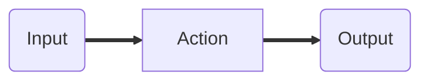

# 10. Functions Are at Your Beck and Call

[toc]

---

## 10.1. Introduction

A **function** is a reusable, callable piece of code. Like variables, functions often have names (though in Chapter 11, we'll learn how to create functions without names.)

> :information_source: **NOTE**: When learning about strings and arrays, we noted that a **method** is a function that "belongs to" and object. This distinction is important to keep in mind, and will be explored in depth in a later chapter. For now, think of a method as a *special type* of function.

You've already become familiar with several functions:

* `console.log`
* Type Conversion functions (`Number`, `String`, and `Boolean`)
* String and array methods (i.e. `indexOf`)

Each of the functions we've used works in the same way. By typing the function's name, followed by parenthesis, we can *call* the function, result in an action being carried out. Sometimes, as with `console.log`, we can provide input data between the parenthesis, which the function will use to carry out its action.

> **EXAMPLE**: The function `console.log` prints the provided value or values (the data input).
>
> ```js
> console.log("Hello, World!");
> ```
>
> ```
> Hello, World!
> ```

This is an example of a function receiving *input*. Functions may also provide *output*. For example, they type conversion functions give back the result of converting a value.

> **Example**: Type Conversion functions *return* a value, that can be used by the calling code. Often, we store the value of a function in a variable.
>
> ```js
> let num = Number("42");
> console.log("The variable num is of type", typeof num, "and has value", num);
> ```
>
> ```
> The variable num is of type numbr and has value 42
> ```

> **Example**: Many array and string methods also return values. This program uses the string method `split` to break strings into separate components.
>
> ```js
> let commaSeparatedValues = "Smith,Jane,100 Cherry Blossom Lane";
> let values = commonSeparatedValues.split(',');
> console.log(values);
> ```
>
> ```
> [ 'Smith', 'Jane', '100 Cherry Blossom Lane' ]
> ```

Functions are extremely powerful. They allow us to repeat actions without repeating each individual step of code that the actions are built from. By grouping actions together, functions allow us to be removed from the details of what they are actually doing.

When we want to print a message to the consume using `console.log`, we don't have to know what the console is, or how a string can be displayed on it. The behavior is wrapped up within the function itself. This is an example of a broader programming concept known as **encapsulation**. ==Encapsulation is the process of pakaging up code in a resuable way, without the programmer needing to be concerned with how it works.==

A commonly-used analogy for describing the concept of a function is that of a machine that takes input, carries out action, and gives back a result. This is known as the **function machine** analaogy.



If we want to use a function, we must provide it with some input.  It carries out an action on that input and returns a result. The action occurs within the function, or "inside the machine". If we know the purpose of a function, we simply provide it with input and receive the output. The rest is up to the machine itself.

> :information_source: **NOTE**: You may notice that a function like `console.log`, doesn't seem to return return anything. We will soon learn that *every* function returns a value, regardless of whether or not that value is used, or is even useful.

The programming concept of a function is very similar to the concept of a mathematical function. For example, in high school algebra you learned about functions like $y = 4x + 7$. These functions used a mathematical input ($x$) and carried out a procedure to return a numerical result ($y$).

> **Example**: Consider the following mathematical function:
> $$
> f(x) = x^2 + 4x - 2
> $$
> We can *call* the function by giving it a specific *input*:
> $$
> \begin{aligned}
> f(\underline{x}) &= \underline{x}^2 + 4\underline{x} - 2 && \text{Let } x = 3\\
> f(3) &= \underline{3^2} + \underline{4 \cdot 3} - 2 \\
> &= \underline{9 + 12 - 2} \\
> &= 19 && \blacksquare
> \end{aligned}
> $$
> The number 19 is the *output*.

Functions also allow us to keep our code <abbr title="Don't Repeat Yourself">DRY</abbr>. If we want to do all the same basic task 17 times acorss a program, we can reduce the code reptition by writing one function and calling it 17 times.

### 10.1.1. Check Your Understanding :white_check_mark:

> :question: **Question**: In your own words, explain what a function is.
>
> :exclamation: **Answer**: :reminder_ribbon: **TODO** Answer this later. (Subjective)

## 10.2. Using Functions

A **function call** is the act of using a function by referring to its name, followed by parenthesis. A synonymous term is **function invocation**, and we will sometimes say that we are "invoking a function."

Within parenthesis, a comma-separated list or **arguments** may be provided when calling a function. These are sometimes called **inputs**, and we say that the inputs are "passed to" the function.

A generic function call looks like this:

```js
funcName(arg1,arg2,...,argN);
```

Every function provides a **return value**, which can be used by the calling program--for example, a store in a variable or print to the console.

> **Example**: A return value may be stored in a variable.
>
> ```js
> let stringVal = String(42);
> ```
>
> It may also be used in other ways. For example, here we use the return value as the input argument to `console.log` without storing it.
>
> ```js
> console.log(String(42));	// 42
> ```

If a function does not provide an explicit return vaule, the special value **`undefined`** will be returned.

> **Example**
>
> ```js
> let returnVal = console.log("LaunchCode");	// LaunchCode
> console.log(returnVal);						// undefined
> ```

> :warning: **WARNING!** The special value `undefined` is built into JavaScript. As with booleans, it is not a string, so `undefined === "undefined"` returns `false`.

In some cases, calling a function results in an action that changes the state of a program outside of the function itself. Such a behavior is known as a **side effect**.

> **Example**: Calling `console.log` results in output to the console, which is a side effect.

> :nerd_face: **Actually...** There's lots of names for "side effects". "quirks", "bugs", "that thing that should or should not happen".

## 10.3. Creating Functions

While using the function built into JavaScript is useful, the most powerful aspect of functions is the ability of programmers to create their own.

There are several ways to define functions in JavaScript. We will introduce one technique in this chapter and a second techinque in chapter 11.

### 10.3.1. Function Syntax

To create a function, use the following syntax:

```js
function myFunc(parameter1, parameter2,..., parameterN){
    // function body
}
```

Here, `function` is a keyword that instructs JavaScript to create a new function using the definition that follows. Since `function` is a keyword, it may not be used elsewhere, for example as the name of a variable.

Following `function` is the **function name**, which is `myFunc` in the generic example above. The function name is determined by you, the programmer, and shuld therefore follow best practices. In particular, function names should use camel case and have descriptive names. We will nave more to say about naming function near the end of this chapter.

Following the function name, we define **parameters** within the parenthesis. Think of parameters as variables that can be used only within the function itself. The number and names of the parameters are determined by the programmer, based on what they want the function to do. ==A function may be defined with several parameters, or no parameters at all.==

> :information_source: **NOTE**: Many programming languages require you to state which data type each parameter should be (for example, string or number). In sunch languages, if you try to call a function with an parameter of incorrect type, an error results.

JavaScript does *not* allow you to specify the types of parameters, through the JavaScript extension TypeScript does. We'll learn more about TypeScript in Chapter 27.

After the parameters and closing parenthesis, within curly brackets (`{ }`), is the **function body**. This is where the actions that the function should carry out are defined. The function body can consist of any amount of code.

#### 10.3.1.1. An Example

Let's see function syntax in action. We first consider a program that prints an array of names.

```js
let names = ["Lena", "James", "Julio"];

for (let i = 0; i < names.length; i++) {
    console.log(names[i]);
}
```

Following this pattern we can create a function that prints any array of names

```js
function printNames(names) {
    for (let i = 0; i < names.length; i++) {
        console.log(names[i]);
    }
}
```

Breaking down the components of a function using our new terms gives us:

* **Function  name**: `printNames`
* **Parameter(s)**: `names`
* **Body**: (lines 2 through 4)

Notice that there is nothing about this function that forces `names` to actually contain names, or even strings. The function will work the same way for any array it is given. Therefore, a better anme for this function would be `printArray`.

Our function can be used the same way as each of the built-in functions, such as `console.log`, by calling it. Remember that calling a function triggers its action to be carried out.

```js
function printArrays(names) {
    for (let i = 0; i < names.length; i++) {
        console.log(names[i]);
    }
}

printArray(["Lena", "James", "Julio"]);
console.log("---");
printArray(["orange", "apple", "pear"]);
```

```
Lena
James
Julio
---
orange
apple
pear
```

This example illustrates how functions allow us to make our code **abstract**. ==Abstraction is the process of taking something specific and making it more general.== In this example, a loop that prints the contents of a specific array variable (something specific) is transformed into a function that prints the content of *any* array (something general).

### 10.3.2. Defining and Calling

==When we define a function, we are making it available for later use. The function does not execute when it is defined; it must be *called* in order to execute.== This is not only a common point of confusion for new programmers, but can also be the source of logic errors in programs.

> 🧩 **Try It!** What happens if we define a function without calling it? ([Link](https://repl.it/@launchcode/Function-Defnition))
>
> ```js
> function sayHello(){
>     console.log("Hello, World!"):
> }
> ```

> :question: **Question**: What is printed when this program runs?
>
> :exclamation: **Answer**: Nothing! It hasn't been called yet!

==In order for a function to run, it must be explicitly *called*.==

> **Example**
>
> ```js
> function sayHello(){
>     console.log("Hello, World!"):
> }
> ```
>
> ```
> Hello, World!
> ```

## 10.4. Function Input and Output

In the introduction of this chapter, we used the metaphor of the *function machine*, noting that the machine takes *input* and provides *output*. This section focuses on the details of these two aspects of function behavior.

### 10.4.1. `return` Statements

Some functions will return values that are useful. In particular, the type conversion functions convert input to the specified data type and return the result--calling `Number(3.14)` returns the value `3.14`.

#### 10.4.1.1. Returning a Value

To return a value from functions that *we* create, we can use a **`return` statement**. It has the form:

```js
return someVal;
```

where `someVal` is any value.

> **Example**: This function has a single parameter, `n`, which is expected to be a positive integer. It returns the sum $1+2+...+n$. (Recall back in 9.5.1., I had some thoughts about this sort of example.)
>
> ```js
> function sumToN(n) {
>     let sum = 0;
>     for (let i = 0; i <= n; i++) {
>         sum += i;
>     }
>     return sum;
> }
> 
> console.log(sumToN(3));		// 6
> ```

Notice that `sumToN` does not print anything. The output comes from the final line of the program, which prints the value *returned by* the function call `sumToN(3)`.

Now that we have return statements in our coding toolbox, we will rarely print anything *within* a function. If we want to see the value returned by a function, we must print it *after* calling the function.

> :question: **Question**: The function `sumToN` uses a pattern that we have seen previously. What is it called?
>
> :exclamation: **Answer**: accumulator pattern?
>
> :reminder_ribbon: **TODO**: Check this answer later.

#### 10.4.1.2. Using `return` is Optional

As we saw with our initial examples of function defintions, not every function explicity returns a value. At its simples, a function can even have an empty body.

```js
function doNothing() {};
```

As written, this function is completely valid, but useless. Athough the function doesn't have a `return` statement. JavaScript still implicitly returns a value.

> **Example**: A function without a `return` statement returns the special value `undefined`.
>
> ```js
> function doNothing() {};
> 
> let returnVal = doNothing();
> console.log(returnVal);
> ```
>
> ```
> undefined
> ```

> :information_source: **NOTE**: In other languages like C, C++, and Java, a function that doesn't have a `return` statement generally has the data type `void`. Just as the name implies, a `void` returns nothing.

#### 10.4.1.3. `return` Terminates Function Execution

When a return statement executes, the function terminates, regardless of whether or not there is any code following the `return` statement. This means that you must be careful to use `return` only when the work of the function has been completed.

> **Example**: This `console.log` statement in this function never executes, since the function returns before it is reached.
>
> ```js
> function pastThePointOfReturn() {
>     return "I'm done!";
>     console.log("This will not be printed");
> }
> 
> console.log(passThePointOfReturn());
> ```
>
> ```
> I'm done!
> ```

We can use the fact that `return` stops the execution of a function intentionally, to force a function to stop execution.

> **Example**: This function prints out the integers $1 \dots n$ using an infinite `while` loop, which nonetheless terminates when the `return` statement is executed.
>
> ```js
> function countToN(n) {
>     let count = 1;
>     while (true) {
>         if (count > n) {
>             return;
>         }
>         console.log(count);
>         count++;
>     }
> }
> ```

#### 10.4.1.4. Boolean Functions

A function that returns a boolean value is known as a **boolean function**. Perhaps the simplest such function is one that test an integer to determine if it is even.

> **Example**: 
>
> ```js
> function isEven(n) {
>     if (n % 2 === 0){
>         return true;
>     } else {
>         return false;
>     }
> }
> 
> console.log(isEven(4));
> console.log(isEven(7));
> ```
>
> ```
> true
> false
> ```

It is conventional to name boolean functions by starting either `is` or `has` which creates a nice semantic effect when reading the code. This is a convention so widely used by programmers that it extends to nearly every language.

Let's return to the `isEven` function above, to see how we cahn use the power of `return` statements to make it even better.

Since `return` terminates the function, we can leave out the `else` clause and have the same side effect. This is because if `n` is even, the return statement in the `if` block will execute and the function will end. If `n` is odd, the `if` statement will be skipped and the second return statement will execute.

```js
function isEven(n) {
    if (n % 2 === 0) {
        return true;
    }
    return false;
}
```

This updated version works exactly the same as our initial function.

> :newspaper: **Extra**: What if we used `? :` operator? 
>
> ```js
> function isEven(n) {
>     return (n % 2 === 0) ? true : false; // TODO: Is this an antipattern?
> }
> ```
>
> It works the same way, but this is redundant as this next example will point out.

Additionally, notice that the function returns `true` when `n % 2 === 0` returns `true` and it returns `false` when `n % 2 === 0` returns `false`.  In other words, the return value is *exactly the same* as the value of `n % 2 === 0`. This means we can simplify the function even further by returning the value of this expression.

```js
function isEven(n) {
    return n % 2 === 0;
}
```

This version of `isEven` is better than the first ~~two~~ *three*, not because it is shorter (shorter is not always better), but because it is simpler to read. We don't have to break down the conditional logic to see what is being returned.

Most boolean functions can be written so that they return the value of a boolean expression, rather than explicitly returning `true` or `false`.

> :reminder_ribbon: **TODO**: Here would have been an excellent place to talk about [arrow functions](https://developer.mozilla.org/en-US/docs/Web/JavaScript/Reference/Functions/Arrow_functions)...unless something in Chapter 11 would delay this.

### 10.4.2. Parameters and Arguments

Over the past few sections, we introduced two function-related concepts that are very similar, and are often confusing to distinguish: *arguments* and *parameters*. The difference between the two is subtle, so we will attempt to clear that up now.

> **Example**: The function `hello` takes a single value, which we expect to be a person's name, and returns a message that greets that person.
>
> ```js
> function hello(name) {
>     return `Hello, ${name}!`;
> }
> 
> console.log(hello("Jerry"));
> ```
>
> ```js
> Hello, Jerry!
> ```

In this example, `name` is a **parameter**. ==A parameter is part of the function definition, and *behaves like a variable* that exists only within the function.==

The ==value== `"Jerry"` ==that is used when we invoke the function== on line 5 ==is an **argument**. It is a *specific value* that is used during the function call.==

==The difference between a parameter and an argument is the same as that between a variable and a value. A variable *refers* to a specific value, just like a parameter *refers* to a specific argument when a function is called. Like a value, an argument is a concrete piece of data.==

### 10.4.3. Arguments Are Optional

==A function may be defined with several parameters, or no parameters at all. Even if a function is defined with parameters, JavaScript will not complain if the function is called *without* specifying the value of each parameter.==

> **Example**:
>
> ```js
> function hello(name) {
>     return `Hello, ${name}!`;
> }
> 
> console.log(hello());
> ```
>
> ```
> Hello, undefined!
> ```

We defined `hello` to have one parameter, `name`. When calling it, however, we did not provide any arguments. Regardless, the program ran without error.

==*Arguments are optional* when calling a function. When a function is called without specifying a full set of arguments, any parameters that are left without values will have the value `undefined`.==

If your function will not work properly without one or more of its parameters defined, you should then define a **default value** for these parameters. The default value can be provided next to the parameter name after `=`.

> **Example**: This example modifies the `hello` function to use a default value for `name`. If `name` is not defined when `hello` is called, it will use the default value.
>
> ```js
> function hello(name = "Jerry") {
>     return `Hello, ${name}!`;
> }
> 
> console.log(hello());
> console.log(hello("Newman"));
> ```
>
> ```
> Hello, Jerry!
> Hello, Newman!
> ```

While this may seen new, we have already seen a function that allows for some arguments to be omitted--the string method `slice`.

> **Example:** The string method `slice` allows the second argument to be left off. When this happens, the method behaves as if the value of the second argument is the length of the string.
>
> ```js
> "LaunchCode".slice(0,6);		// "Launch"
> "LaunchCode".slice(6);			// "Code"
> "LaunchCode".slice(6,10);		// "Code"
> ```

Just as it is possible to call a function with *fewer* argument than it has parameters, we can also call a function with *more* arguments than it has parameters. In this case, such parameters are not available as a named variable.

> **Example**: This example, calls `hello` with two arguments, even though it is defined with only one parameter.
>
> ```js
> function hello(name = "Jerry") {
>     return `Hello, ${name}!`;
> }
> 
> console.log("George", "Costanza");
> ```
>
> ```
> Hello, Geroge!
> ```

> :information_source: **NOTE**: These "extra" arguments can still be accessible using the special object named `arguments`, which is made available to every function. If you are curious, [read more at MDN](https://developer.mozilla.org/en-US/docs/Web/JavaScript/Reference/Functions/arguments). However, we will not need to use this advanced JavaScript feature in this course.

> :nerd_face: **Actually...** As of ES6, using [rest parameters](https://developer.mozilla.org/en-US/docs/Web/JavaScript/Reference/Functions/rest_parameters) is preferred over using `arguments`. Since I mentioned those, I may as well give a mention to [spread syntax](https://developer.mozilla.org/en-US/docs/Web/JavaScript/Reference/Operators/Spread_syntax), which applies to arguments. Again, advanced feature, not part of this course. (It took me a while to figure out how they work anyway.)

### 10.4.4. Check Your Understanding :white_check_mark:

> :question: **Question**: What does the following code output?
>
> ```js
> function plusTwo(num) {
>     return num + 2;
> }
> 
> let a = 2;
> 
> for (let i=0; i < 4; i++) {
>     a = plusTwo(a);
> }
> 
> console.log(a);
> ```
>
> :exclamation: **Answer**: 10.

> :question: **Question**: What does the following function *return*?
>
> ```js
> function repeater(str) {
>     let repeated = str + str;
>     console.log(repeated);
> }
> 
> repeater('Bob');
> ```
>
> a. `"BobBob"`
> b. Nothing (no return value)
> c. `undefined`.
> d. The value of `Bob`
>
> :exclamation: **Answer**: b.

> :question: **Question**: What does the following function *output*?
>
> ```js
> function repeater(str) {
>     let repeated = str + str;
>     console.log(repeated);
> }
> 
> repeater('Bob');
> ```
>
> a. `"BobBob"`
> b. Nothing (no return value)
> c. `undefined`.
> d. The value of `Bob`
>
> :exclamation: **Answer**: a.

> :cheese: :rat: **GOTCHA!** Watch out when encountering a question like this. When they ask what the function "returned", they mean what was returned following a `return` statement. Similarly, when they ask what was "output", they mean what was printed following a `console.log` function.

## 10.5. A Good Function-Writing Process

The function is the most complex JavaScript construct that we have seen. Functions have more components to their syntax than conditionals or loops, and can be used in more intricate ways than those constructs.

To avoid frustration and bugs, it's important to approach writing functions in an intentional, structured way. This is essential as you start to write more complex function.

In this section, we outline what we think is the best approach.

### 10.5.1. Step 1: Design Your Function

Before putting fingers to keyboard, it is important to have a clear idea of what you want your function to do. You should ask yourself the following questions:

* What data (that is, parameters) does my function need to do its job?
* Should my function return a value? (Hint: The answer is almost always "yes".)
* What should be the datatype of my function's return value?
* What is a good, descriptive name for my function?
* What data types do we expect the parameters to be?
* What are good names for my parameters?

> Fill in this table:
>
> <table>
>     <tr>
>         <th>Question</th>
>         <th>Answer</th>
>     </tr>
>     <tr>
>         <td><b>Parameters</b></td>
>         <td></td>
>     </tr>
>     <tr>
>         <td><b>Return Value</b></td>
>         <td></td>
>     </tr>
>     <tr>
>         <td><b>Return Type</b></td>
>         <td></td>
>     </tr>
>     <tr>
>         <td><b>Function name</b></td>
>         <td></td>
>     </tr>
>     <tr>
>         <td><b>Parameter names and types</b></td>
>         <td></td>
>     </tr>
> </table>

### 10.5.2. Step 2: Create the Basic Structure

Now is the time to start coding. Using the design decisions you just made, write the *minimal* syntax needed to create the functions. (Worry about fleshing out the details later.)

```js
function funcName(argName1, argName2, argName3) {
    // TODO: do something here. (Not literally, this is an example.)
}
```

Doing this step before writing the body will prevent silly mistakes like levaing off a closing bracket or forgetting to define a parameter.

> :kiss: ==**K.I.S.S.**: Keep It Simple, Stupid!==

### 10.5.3. Step 3: Write the Body

Write the basic structure in place, go a head and start writing the body. Be sure to alternate between sub-tasks and running your code. ==*Do not wait until you have written the entire function body before you test your code!*==

We can't emphasize this enough. Going long stretches of time without running the program is a good way to end up frustrated. Recall back in Chapter 6, we made the following recommendations to avoid bugs:

> ==**Get something working and keep it working.**==

This applies especially to writing functions. ==Every good professional programmer works in this way: write a few lines of code, run it, debug any errors, repeat.==

Following these steps won't prevent you from making mistakes, but it will certainly reduce the number of bugs you create. This helps you more quickly produce solid, working code.

## 10.6. Parameters and Variables

Eariler we said that a parameter "behaves like a variable that exists only within the function." While this is true, the relationship between variables and parameters is a bit more complicated.

### 10.6.1. Function Scope

The **scope** of a variable is the extent to which the variable is visible within a program. Scope consists of all locations within a program where a variable can be used or modified. Introducing functions gives up one of our first examples of limited variable scope---a situation in which a variable is not visible throughout an entire program.

In particular, *a variable defined using `let` within a function is not visible outside of that function.*

> **Example**: This function takes a string and returns the result of removing all hyphens (`-`) from a string.
>
> ```js
> function removeHyphens(str) {
>     let strWithoutHyphens = '';
>     
>     for (let i = 0l i < str.length; i++) {
>         if (str[i] !== '-') {
>             strWithoutHyphens += str[i];
>         }
>     }
>     
>     return strWithoutHyphens;
> }
> 
> let launchCodePhone = "314-254-0107";
> console.log(removeHyphens(launchCodePhone));	// 3142540107
> console.log(strWithoutHyphens);					// ❌ ReferenceError: strWithoutHyphens is not defined
> ```

The last line of this program tries to print the variable `strWithoutHyphens` to the console, resulting in an error. The previous line calls `removeHyphens`, at the end of which `strWithoutHyphens` has the value `"3142540107"`. However, once the function finishes execution, all variables and parameters within the function are destroyed. This is why the last line results in a `ReferenceError`; there is no variable named `strWithoutHyphens` in existence when that line executes.

This is what we mean when we refer to scope. A variable is not necessarily usable through an entire program. Where it can be used depend on the context in which it is defined. For variables *and* parameters within a function, their scope is known as **function scope**. This means that they are only visible within the function in which they are defined.

### 10.6.2. Variable Shadowing

We just learned that variables and parameters defined with a function are not visible outside of that function. The opposite scenario is more complicated; a variabled defined outside a function *may* be visible within the function, in certain circumstances.

> **Example**: In some cases, a variable defind outside of a function may be visible within the function.
>
> ```js
> let message = "Hello, World!";
> 
> function printMessage() {
>     console.log(message);
> }
> 
> printMessage();
> ```
>
> ```
> Hello, World!
> ```

Even though `message` is defined outside the function, it is still visible within the function. When `printMessage` is called and `console.log(message);` executes, `message` has the value `"Hello, World!"`, so that the value is printed to the console. This means that the scope of `message` extends to the function `printMessage`.

> :warning: **WARNING!** This is NOT the case that all variables defined outside of a function are visible withing *every* function. The reality is a bit more nuanced than this, and will be explored in depth in a later chapter.

> 🧩 **Try It!** What is the output of the following program? For a hypothesis for yourself before running it. Once you have answered that question, try relocating the declaring `message` to other locations to see how it affects the program. For example, you might try placing it within or after `printMessage`. ([Link](https://repl.it/@launchcode/Function-Scope))
>
> ```js
> let message = "Hello, World!";
> 
> function printMessage() {
>     console.log(message);
> }
> 
> printMessage();
> message = "Goodbye";
> printMessage();
> ```

An interesting thing happens when a function parameter has the same name as a variable that is in-scope.

> **Example**:
>
> ```js
> let message = "Hello, World!";
> 
> function printMessage(message) {
>     console.log(message);
> }
> 
> printMessage("Goodbye");
> ```
>
> ```
> Goodbye
> ```

While the variable `message` declared on line 1 is techincally visible within `printMessage` (that is, in-scope), it is hidden by the function parameter of the same name. When `printMessage("Goodbye")` is called and `console.log(message)` executes, `message` has the value `"Goodbye"`, which is the argument passed into the function. This phenomenon is known as **shadowing**, based on the metaphor that a function parameter "casts it's shadow over" a variable of the same name, effectively hiding it.

There is no good reason to intentionally use variable shadowing in your program. In fact, doing so can lead to confusion over which of the two variable is being used in a given situation. For this reason, *you should avoid naming variables and function parameters the same name.*

> :reminder_ribbon: **TODO**: Could the defintion for shadowing be better written?

### 10.6.3. Check Your Understanding :white_check_mark:

> :question: **Question**: What does the following code output?
>
> ```js
> let num = 42;
> 
> function isEven (num) {
>     return num % 2 === 0;
> }
> 
> console.log(isEven(43));
> ```
>
> :exclamation: **Answer**: `false`
>
> Reason: Shadowing. ( :reminder_ribbon: TODO: Be more specific.)

## 10.7. Naming Functions

### 10.7.1. Use Camel Case

### 10.7.2. Use Verb/Noun Pairs When Applicable

### 10.7.3. Use Descriptive Names

### 10.7.4. Check Your Understanding :white_check_mark:

## 10.8. Composing Functions

### 10.8.1. Palindrome Checker

#### 10.8.1.1. The `reverse` Function

#### 10.8.1.2. The `isPalindrome` Function

### 10.8.2. Functions Should Do Exactly One Thing

## 10.9. Why Create Functions?

### 10.9.1. Functions Reduce Repetition

### 10.9.2. Functions Make Your Code More Readable

### 10.9.3. Functions Reduce Complexity

### 10.9.4. Functions Enable Code Sharing

### 10.9.5. Functions Save Millions of Lives Every Day

> A little bit dramatic, isn't it?

## 10.10. Exercises: Functions :runner:

### 10.10.1. Rectangles

### 10.10.2. Triangles

### 10.10.3. Diamonds

### 10.10.4. Bonus Mission :rocket:

## 10.11. Studio: Functions :studio_microphone:

### 10.11.1. Before You Start

### 10.11.2. Reverse Characters

### 10.11.3. Reverse Digits

### 10.11.4. Complete Reversal

### 10.11.5. Bonus Missions :rocket:


:checkered_flag: We're a third of the way done with this book! Which this chapter was a big part of it. **You know what comes after Functions? [MORE FUNCTIONS](11.%20Functions%20(Part%202),md)!**

---

#LaunchCode