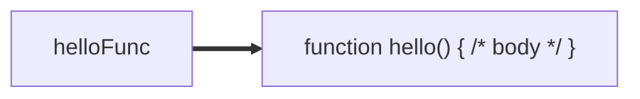
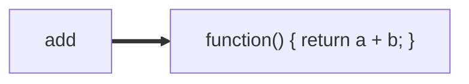
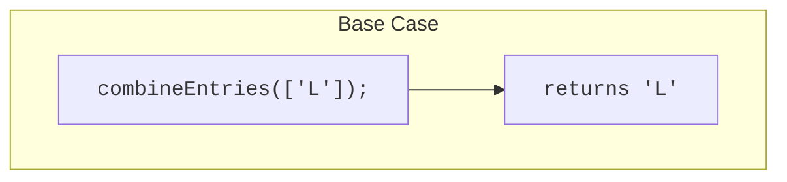
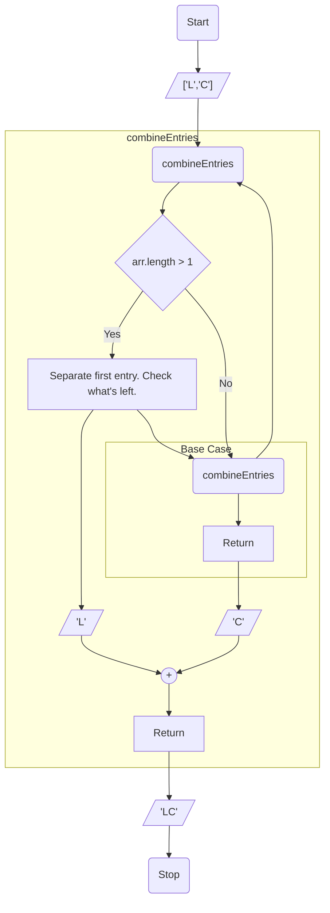

# 11. More Functions

[toc]

---

> :information_source: **NOTE**: If you though Chapter 10 was long, now we have to deal with some new concepts that we need to grasp in this chapter.

## 11.1. Functions as Values

Functions are power tools in any programming language, and JavaScript uses these tools in some flexible and creative way. This chapter will introduce a bit more of the power of functions.

### 11.1.1. Functions Are Data

In [Chapter 4](04.%20Data%20and%20Variables.md), we defined a value as "a specific piece of data". Some examples are the number `42`, the string `"LC101"`, and the array `["MO", "FL", "DC"]`. ==*Functions are also values*==, and while they appear to be very different from other values we have worked with, they share may core characteristics.

In particular, functions have a data type, just like all other values. Recall that a **data type** is a group of values that share characteristics, such as strings and numbers. String share the characteristics of having a length, while numbers do not. Numbers can be manipulated in ways that strings cannot, vial operaations like division and subtraction.

> **Example**: The data type of the conversion function `Number` is **`function`**. In fact, all functions are type `function`.
>
> ```js
> console.log(typeof 42);			// number
> console.log(typeof "LC101");	// string
> console.log(typeof Number);		// function
> ```

Like other data types, functions may be assigned to variables. If we create a function named `hello`, we can assign it to a variable with this syntax:

```js
function hello() {
    
    // function body
    
}

let helloFunc = hello;
```

==When a variable refers to a function, we can use the variable name to *call* the function:==

```js
helloFunc();
```

==The variable==, `helloFunc` ==can be thought of as an *alias* for the function== `hello`. When we call the function `helloFunc`, JavaScript sees that it refers to the function `hello` and calls that specific function.

> :thumbsup: **Bravo!** To the person who wrote that paragraph: That is a very good analogy!
>
> In the Linux operating system, you can create a list of aliases, called soft links, that are stored in a hidden file that can be used to call a program, or--and more importantly--call the program to invoke certain features! Hopefully, we'll discuss this in Chapter 19 when we talk about the Terminal.

==Whe we use a variable *name*, we are really using its value.== If the variable `course` is assigned the value `"LC101"`, then `console.log(course)` prints `"LC101"`. ==When a variable holds a function, it behaves the same way as when it holds a number or a string. **The variable *refers* to the function.**==



Again, ==*functions are values*==. They can be used just like general values. For example:

* Functions may be assigned to variables
* Functions may be used in expressions, such as comparisons.
* Functions may be converted to other data types.
* Functions may be printed using `console.log`.
* Functions may be passed as arguments to other functions.
* Functions may be returned from other functions.

Some of these function behaviors do not prove to be useful. You will probably never need to covert a function to a boolean, or ask wither a function is greater than 5. However, other behaviors, like passing functions as arguments ans assigining them to variables, turn out to be *extremely* usful.

## 11.2. Anonymous Functions :star:

> :sunglasses: **SERIOUS MODE**: Time to put your game face on in this section.

You already know one method of creating a function (Section 10.1.):

```js
function myFunction(parameter1, parameter2, ..., parameterN) {
    
    // function body
    
}
```

A function defined in this way is a **named function** (`myFunction` in the example above.)

May programming languages, including JavaScript, allow us to create **anonymous function** which *do not* have names. We can create anonymous function by simply leaving off the function name when defining it:

```js
function (parameter1, parameter2, ..., parameterN) { // no name!
    
    // function body
    
}
```

You might be asking yourself, *How do I call a function if it doesn't have a name?!*

### 11.2.1. Anonymous Function Variables

Anonymous functions are often assigned to variables when they are created, which allows them to be called using the variable's name.

> **Example**: Let's create and use a simple anonymous function that returns the sum of two numbers.
>
> ```js
> let add = function(a, b){
>     return a + b;
> };						// NOTICE THE SEMICOLON HERE!
> 
> console.log(add(1,1));		// 2
> ```

The variable `add` refers to the anonymous function created on lines 1 through 3. We call the function using the *variable* name, since the function doesn't have a name.

This visual analogy below is the same as that of a variable referring to a named function.



> :warning: **WARNING!** Like other variable declarations, an assignment statement using a anonymous function should be terminated by a semi-colon `;`. This is an easy overlook, since named functions do *not* end with a semi-colon.

### 11.2.2. Check Your Understanding :white_check_mark:

> :question: **Question**: Conver the following named function to an anonymous function that is stored in a variable. ([Link](https://repl.it/@launchcode/Refactor-to-make-anonymous))
>
> ```js
> function reverse(str) {
>     let lettersArray = str.split('');
>     let reversedLettersArray = lettersArray.reversed();
>     return reversedLettersArray.join('');
> }
> ```
>
> :exclamation: **Answer:** (:information_source: **NOTE**: It only ask you to refactor one line. It didn't say refactor anything else even though it's pretty obvious there should be. )
>
> ```js
> let reverse = function(str) {		// Just this line!
>     let lettersArray = str.split('');
>     let reversedLettersArray = lettersArray.reversed();
>     return reversedLettersArray.join('');
> };		//Don't forget the semi-colon!
> ```

> :question: **Question**: Consider the code sample below, which declares an anonymous function beginning on line 1.
>
> ```js
> let f1 = function(str) {
>     return str + str;
> };
> 
> let f2 = f1;
> ```
>
> Which of the following are valid ways of invoking the anonymous function with the argument `"abcd"`? (Chose all that apply)
> a. `f1("abcd");`
> b. `function("abcd");`
> c. `f2("abcd");`
> d. It is not possible to invoke the anonymous function since it does not have a name.
>
> :exclamation: **Answer**: The answer is a. and possibly c.
>
> :reminder_ribbon: **TODO**: Check the answer here later.

> :question: **Question**: Complete the following code snippet so that it logs an error message if `userInput` is negative. ([Link](https://repl.it/@launchcode/Check-Fill-in-the-Code))
>
> ```js
> const userInput = require('readline-sync');
> let logger = function(errorMsg) {
>    console.log("ERROR: " + errorMsg);
> };
> 
> if (userInput < 0) {
>    ______("Invalid input");
> }
> ```
>
> :exclamation: **Answer**:
>
> ```js
> const userInput = require('readline-sync');
> let logger = function(errorMsg) {
>    console.log("ERROR: " + errorMsg);
> };
> 
> if (userInput < 0) {
>    logger("Invalid input");		// The answer is "logger"!
> }
> 
> ```

## 11.3. Passing Functions as Arguments :star:

==*Functions are data*, an therefore can be passed around like other values. This means a function can be *passed to another function* as an argument. This allows the *function being called* to use the *function argument* to carry out its action.== This turns out to be extremely useful.

### 11.3.1. Example: `setTimeout` :star:

> :book: **Learn more!** Check out [the page for `setTimeout` on MDN](https://developer.mozilla.org/en-US/docs/Web/API/WindowOrWorkerGlobalScope/setTimeout).

The built-in function `setTimeout` allows a programmer to pass a function, specifiying that is should be called at a later point in time. Its basic syntax is:

```js
setTimeout(func,delayInMilliseconds);
```

> **Example**: Suppose we want to log a message with a 5 second delay. Since 5 seconds is 5000 milliseconds (because 1 second is 1000 miliseconds (ms)), we can do do like this ([Link](https://repl.it/@launchcode/setTimeout-Example)):
>
> ```js
> function printMessage() {
>     console.log("The future is now!");
> }
> 
> setTimeout(printMessage, 5000);
> ```
>
> ```
> "The future is now!"
> ```

> 🧩 **Try it!** Is the call to the `printMessage actually delayed?` Don't just take our word for it. Try this yourself. Play with the example to change the delay.

The function `printMessage` is *passed* to `setTimeout` the same as any other argument.

A common twist often used by JavaScript programmers is to use an *anonymous* function as an argument.

> **Example**: This program has the same behavior as the one above. Instead of creating a named function and passing it to `setTimeout`, it creates an anonymous function within `setTimeouts`'s argument list.
>
> ```js
> setTimeout(function (){
>     console.log("The future is now!");
> }, 5000);
> ```
>
> > :information_source: **Note**: Too bad we aren't covering [arrow functions](https://developer.mozilla.org/en-US/docs/Web/JavaScript/Reference/Functions/Arrow_functions). We could have written it to be more like this:
> >
> > ```js
> > setTimeout(() => {
> >     console.log("The future is now!");
> > }, 5000);
> > ```
> >
> > Or, because there's only one line, more like this:
> >
> > ```js
> > setTimeout(() => console.log("The future is now!"), 5000);
> > ```
> >
> > Now that I think about it, the first form of the arrow function looks much better. The next example with the `.map` function is more fitting of that second arrow function example.

Examples like this look odd at first. However, they become eaiser to read over time. Additionally, code that passes anonymous function is ubiquitous in JavaScript.

> :information_source: **PSA**: There is another function called `clearTimeout` that cancels a timeout set by `setTimeout`. You can [read more about it on MDN](https://developer.mozilla.org/en-US/docs/Web/API/WindowOrWorkerGlobalScope/clearTimeout).

### 11.3.2. Example: The `Array` method `map` :star:

> :information_source: **NOTE**: So much opportunity to talk about functional programming (FP) methods here, like `.filter`, `.reduce`, `.some`, and `.every`. But alas, we must :kiss: <abbr title="Keep It Simple, Stupid!">K.I.S.S.</abbr> this topic.

The array method `map` allows for every element in an array to be *mapped* or *translated* using a given function.

```js
let mappedArray = someArray.map(func);
```

The arugment `func` should take a single value from the array and return a new value. The returned array, `mappedArray` contains each of the individual return values from the mapping function, `func`.

> **Example**
>
> ```js
> let nums = [3.14, 42, 4811];
> 
> let timesTwo = function (n) {
>     return n*2;
> };
> 
> let doubled = nums.map(timesTwo);
> 
> console.log(nums);
> console.log(dobuled);
> ```
>
> ```
> [ 3.14, 42, 4811 ]
> [ 6.28, 84, 9622 ]
> ```

Notice that `map` does *not* alter the original array.

When using `map`, many programmers will defined the mapping function anonymously, in the same statement as the method call `map`.

> **Example**: This program has the same output as the previous one. The mapping function is defined anonymously within the call to `map`.
>
> ```js
> let nums = [3.14, 42, 4811];
> 
> let doubled = nums.map(function (n) {
>     return n*2;
> });
> 
> console.log(doubled);
> ```
>
> ```
> [ 6.28, 84, 9622 ]
> ```
>
> > :arrow_right: **ARROWED!**: Oh if only we could us arrow function, where return statments are implied, we could write the above code like this:
> >
> > ```js
> > let nums = [3.14, 42, 4811];
> > 
> > let doubled = nums.map( (n) => n*2 );
> > // Note the parthenthesis for (n) are optional when there's only one argument, 
> > // but you'll want to use them if you use more than one argument or if you use an array. 
> > // But that's way in the future.
> > 
> > console.log(doubled);
> > ```
> >
> > Now imagine if we could write everything on ONE line of code?
> >
> > ```
> > console.log([3.14, 42, 4811].map( n => n* 2));
> > ```

### 11.3.3. Check Your Understanding :white_check_mark:

> :question: **Question**: Similar to the `map` example above, finish the program below to half each number in an array. ([Link](https://repl.it/@launchcode/Arraymap-check))
>
> ```js
> let nums = [3.14, 42, 4811];
> 
> // TODO: Write a mapping function
> // and pass it to .map()
> let halved = nums.map();
> 
> console.log(halved);
> ```
>
> :exclamation: **Answer**:
>
> ```js
> let nums = [3.14, 42, 4811];
> 
> // TODO: Write a mapping function
> // and pass it to .map()
> let halved = nums.map(function(n){return n/2;});
> 
> console.log(halved);
> ```
>
> > :information_source: **NOTE**: Do see why if this was an arrow function, it would have been written more elegantly? I would have wrote line 5 more like this:
> >
> > ```js
> > let halved = nums.map(n => n/2);
> > ```

> :question: **Question**: Use the `map` method to map an array of strings. For each name in the array, map it to the first initial. ([Link](https://repl.it/@launchcode/Mapping-strings-check))
>
> ```js
> let names = ["Chris", "Jim", "Sally", "Blake"];
> 
> // TODO: Write a mapping function
> // and pass it to .map()
> let firstInitials = names.map();
> 
> console.log(firstInitials);
> ```
>
> :exclamation: **Answer**:
>
> ```js
> let names = ["Chris", "Jim", "Sally", "Blake"];
> 
> // TODO: Write a mapping function
> // and pass it to .map()
> let firstInitials = names.map(function(name){return name[0];});
> 
> console.log(firstInitials);
> ```
>
> > :information_source: **NOTE**: Again, if I had my way, line 5 would have looked more like this.
> >
> > ```js
> > let firstInitials = names.map(name => name[0]);
> > ```

## 11.4. Receiving Function Arguments :star:

The previous section illustrates how a function can be passed to another function as an argument. This section take the opposite perspective to *write* function that can take other functions as arguments.

### 11.4.1. Example: A Generic Input Validator

Our first example will be a generic input validator. It will prompt a user for input, using a parameter to the function to do the actual work of validating the input.

> **Example**
>
> ```js
> const input = require('readline-sync');
> 
> function getValidInput(prompt, isValid) {
>     
>     // Prompt the user, using the prompting string that was passed
>     let userInput = input.question(prompt);
>     
>     // Call the boolean function isValid to check the input
>     while(!isValid(userInput)) {
>         console.log("Invalid input. Try again.");
>         userInput = input.question(prompt);
>     }
>     
>     return userInput;
> }
> 
> // A boolean function for validating input
> let isEven = function(n) {
>     return Number(n) %2 === 0
> };
> 
> console.log(getValidInput('Enter an even number',isEven));
> ```
>
> ```
> Enter an even number: 3
> Invalid input. Try again.
> Enter an even number: 5
> Invalid input. Try again.
> Enter an even number: 4
> 4
> ```
>
> > :information_source: **NOTE**: For a second there, I was almost tempted to say "Use a `do-while` loop", until I realized there was a legitimate reason to use a regular `while` loop. And this example is it!

The function `getValidInput` handles the work of interacting with the user, while allowing the validation logic to be customized. This spearates the different concerns of validation and user interaction, sticking to the idea that a *function should do only one thing*. It also enables more reusable code. If we need to get different input from the user, we can simply call `getValidInput` with different arguments.

> **Example**: This example uses the same `getValidInput` function defined above with a different prompt and validator function. In this case, we check that a potential password has at least 8 characters.
>
> ```js
> const input = require('readline-sync');
> 
> function getValidInput(prompt, isValid) {
>     
>     let userInput = input.question(prompt);
>     
>     while (!isValid(userInput)) {
>         console.log("Invalid input. Try again.");
>         userInput = input.question(prompt);
>     }
>     
>     return userInput;
> }
> 
> let isValidPassword = function(password) {
>     
>     // Password should have at least 8 characters
>     if (password.length < 8) {
>         return false;
>     }
>     
>     return true;
> };
> 
> console.log(getValidInput('Create a password:', isValidPassword));
> ```
>
> ```
> Create a password: launch
> Invalid input. Try again.
> Create a password: code
> Invalid input. Try again.
> Create a password: launchcode
> launchcode
> ```

> 🧩**Try It!** ([Link](https://repl.it/@launchcode/Validator-check))
>
> 1. Use our `getValidInput` function to ensure user input starts with "a".
> 2. Create another validator that ensures user input is a vowel.

### 11.4.2. Example: A Logger

Another common example of a function using another function to customize its behavior is that of logging. Real-world applications are capable of logging messages such as errors, warnings, and statuses. (If you've ever used Linux, you'd probably seen what this looks like.) Such applications allow for log messages to be sent to one or more destinations. For example, the application may log message to both the console and to a file. (In Linux, the application that does this is called [`tee`](https://en.wikipedia.org/wiki/Tee_(command)).)

We can write a logging function that relies on a function parameter to determine the logging desitination.

#### 11.4.2.1. A Simple Logger

> **Example**: The `logError` function outputs a standardized error message to a location determined by the parameter `logger`.
>
> ```js
> let fileLogger = function(msg) {
>     
>     // PUt the message in a file
>     
> };
> 
> function logError(msg, logger) {
>     let errorMsg = 'ERROR: ' + msg;
>     logger(errorMsg);
> }
> 
> logError('Something broke!', fileLogger);
> ```

Let's exampine this example with more detail.

There are three main program components:

1. LInes 1-5 define `fileLogger`, which takes a string argument `msg`. We have not discussed writing to a file, but Node.js is capable of doing so.
2. Lines 7-10 define `logError`. The first parameter is the message to be logged. The second parameter is the logging function that will do the work of sending the message somewhere. `logError` doesn't know the details of how the message will be logged. It simply formats the message and calls logger.
3. LIne 12 logs an error using the `fileLogger`.

This is the flow of execution:

1. `logError` is called, with a message and the logging function `fileLogger` passes as arguments.
2. `logError` runs, passes the constructed message to `logger`, which refers to `fileLogger`.
3. `fileLogger` executes, sending the message to a file.

> 🧜‍♀️:reminder_ribbon: **Mermaid TODO:** Should we use Mermaid to diagram the flow of execution later?

#### 11.4.2.2. A More Complex Logger

This example can be made even more powerful by enabling multiple loggers.

> **Example**: The call to `logError` will log the message to both the console and a file.
>
> ```js
> let fileLogger = function(msg) {
>     
>     // Put the message in a file
>     
> }
> 
> let consoleLogger = function(msg) {
>     
>     console.log(msg);
>     
> };
> 
> function logError(msg, loggers) {
>     
>     let errorMsg = 'ERROR: ' + msg;
>     
>     for (let i = 0; i < loggers.length; i++) {
>         loggers[i](errorMsg);
>     }
> }
> 
> logError('Something broke!', [fileLogger, consoleLogger]);
> ```

The main change to the progrma is that `logError` now accepts an *array* of functions. It loops through the arra, calling each logger with the message string.

As with the validation example, these programs separate behaviors in a way that makes the code more flexible. To add or remove a logging destination, we can simply change the way we call `logError`. The code *inside* `logError` doesn't know how each logging function does its job. It is concerned only with creating the message string and passing it to the logger(s).

### 11.4.3. A Word of Caution :warning:

What happens if a function expects an argument to be a function, but isn't?

> 🧩**Try It!** ([Link](https://repl.it/@launchcode/TypeError-Example))
>
> ```js
> function callMe(func) {
>     func();
> }
> 
> callMe("Al");
> ```

> :question: **Question**: What type of error occurs when attempting to use a value that is NOT a function as if it were one?
>
> :exclamation: **Answer**: TypeError, more specifically
>
> ```
> TypeError: func is not a function
> ```

## 11.5. Why Use Anonymous Functions?

Anonymous finctions may see strange, and their utility may not be immediately obvious, there are two main reasons while we think anonymous functions are important to understand.

### 11.5.1. Anonymous Functions Can be Single-Use

There are many situations in which you will need to create a function that will be used once. Recall back in 11.3.1. where we had the `setTimeout` example.

> **Example**: The anonymous function created in this example cannot be used outside of `setTimeout`.
>
> ```js
> setTimeout(function () {
>     console.log("The future is now!");
> }, 5000);
> ```

Defining an anonymous function at the same time it is passed as an argument prevents it from being used elsewhere in the program.

Additionally, it programs that use lots of function--such as web applications, as you will soon learn--defining functions anonymously, and directly within a function call, can reduce the number of names you need to create.

### 11.5.2. Anonymous Functions Are Ubiquitous in JavaScript

> :book: "Ubiquitos" = found everywhere!

JavaScript programmer use anonymous functions *frequently*.

Just because an anonymous function isn't needed to solve a problem doesn't mean that it *shouldn't* be used to solve the problem. Avoiding JavaScript code that uses anonymous functions is impossible.

Any programming problem in JavaScript can e solved *without* using anonymous functions. Thus, the extent to whic you use them in your own code is somewhat a matter of taste. LaunchCode will take the middle road throughout the rest of the course, regularly using obth anonymous and named functions.

### 11.5.3. Check Your Understanding :white_check_mark:

> :question: **Question**: Explain the differences between named and anonymous functions, including an example of how an anonymous function can be used.
>
> :exclamation: **Answer**: (Subjective, but for the differences, between named and anonymous function, here would be a good place to write what an named and anonymous function are from section 11.2.)
>
> :reminder_ribbon: **TODO**: I'll do that later.

## 11.6. Recursion

### 11.6.1. Quick Review

In the previous chapter, we leanred how to define a function and its parameters.

> **Example**:
>
> ```js
> function addTwoToNumber(num){
>     return num += 2;
> }
> 
> console.log(addTwoToNumber(12));	// 14
> ```

When called, the parameter `num` is passed as an argument, which in this case is the number `12`. The function executes and returns the value `14`, which the `console.log` statement prints.

#### 11.6.1.1. Functions Can Call Other Functions

Functions should only accomplish one (preferably simple) task. To solve more complicated tasks, one small function must call other functions.

> **Example**:
>
> ```js
> function addTwoToNumber(num){
>     return num += 2;
> }
> 
> function addFiveToNumber(value){
>     let result = addTwoToNumber(value) + 3;
>     return result;
> }
> 
> console.log(addTwoToNumber(12));	// 17
> ```

OF course, there si no need to write a function to add 5 to a value, but the example demonstrates callng a function from within another function.

### 11.6.2. What Is Recursion?

In programming, the *divide and conquer* strategy solves a problem by breaking itdown into smaller, simpler pieces. If these pieces *can all be solved in exactly the same way*, then we gain an additional advantage. Solving the big problem become a process of completing and combining the smaller parts.

Splitting up a larger task into smaller, identical pieces allows us to resue a single function rather than coding several different functions. We accomplish this by either:

1. Setting up a loop to call one function lots of times, OR
2. Building a function that splits up the large problem for us, until a *simplest case* is found and solved.

==**Recursion** is the process of solving a larger problem by breaking it into smaller pieces that *can all be solved in exactly the same way.*== The clever idea behind recursion is that instead of using a loop, a function simply calls *itself* over and over again, with each step reducing the size of the problem.

Through recursion, a problem eventually gets reduced to a very simple task, which can be immediately solved. This small answer sets up the solution for the previous step, which in turn solves the next bigger step. Properly built, the function combines all the smaller answer to solve the original problem.

Many new programmers (an even veteran ones) find recursion an abstract and tricky concept. One helpful way to approach the idea is to walk through an example.

## 11.7. Recursion Walkthrough: The Base Case

To ease into the concept of recursion, let's start with a loop task.

Back in [Chapter 8](08.Arrays.md), the Arrays Chapter, we examined the `join` method, which combined elements of an array into a single String. If we have `arr = ['L', 'C', '1', '0', '1' ]`, `arr.join('')` returns `'LC101'`.  We can reproduce this action with either a `for` or a `while` loop.

### 11.7.1. Joining Array Elements With a Loop

> :spiral_notepad: **TYPORA BUG**  🤪 Doing a side-bye side in HTML made things behave a little wonky. Your Markdown editor might do something different. YMMV.
>
> :reminder_ribbon: **TODO**: Find out if there is a way to add a language to a `<pre>` element.

<table>
    <tr>
        <td><p>Use a <code>for</code> loop to iterate through the array and add each entry into the <code>newString</code> variable.</p></td>
        <td><p>Use a <code>while</code> loop to add the first element in the array to <code>newString</code>, then remove that element from the array.</p></td>
    </tr>
    <tr>
        <td><pre>let arr = ['L', 'C', '1', '0', '1'];<br>
let newString = '';<br>
for(let i = 0; i &lt; arr.length; i++){<br>
	newString = newString + arr[i];<br>}<br>
<br>
console.log(newString);<br>
console.log(arr);</pre></td>
        <td><pre>let arr = ['L', 'C', '1', '0', '1'];<br>
let newString = '';<br>
while (arr.length &gt; 0){<br>
	newString += arr[i];<br>
	arr.shift();<br>}<br>
<br>
console.log(newString);<br>
console.log(arr);</pre></td>
    </tr>
    <tr>
        <td><pre>'LC101'<br>
['L', 'C', '1', '0', '1']</pre></td>
        <td><pre>'LC101'<br>
[ ]</pre></td>
    </tr>
</table>

Inside each loop, the code simply adds two strings together---what is stored in `newString` plus one element from the array. In the `for` loop, the element is the next item in the sequence entries. In the `while` loop, the element is always the first entry from whatever remains in the array.

OK, the loops join the array elements together. Now let's see how to accomplish the same task without a `for` or `while` statement.

### 11.7.2. Bring In Recursion Concepts

1. **State the problem to solve:** *Combine the elements from an array into a string.*
2. **Split the problem into small, identical steps:** Looking at the loops above, the "identical step" is just adding two strings together - `newString` and the next entry in the array.
3. **Build a function to accomplish the small steps:** Let's call the function `combineEntries`, and we will set an array as the parameter.

```js
function combineEntries(arrayName){
    // TODO: Add code here
}
```

We want `combinedEntries` to repeat over and over again until the task is complete.

Howe do we make this happen without using `for` or `while`?

> 🧪 **Recurssion and you!**
>
> I like mathematics, don't you? You don't? well too bad.
>
> An easy example of recursion in mathematics is of course the factoral function.
> $$
> \begin{aligned}
> n! = n \cdot (n-1)! && \forall n \ge 0, n \in \Z
> \end{aligned}
> $$
> The calculation of `n!` from 0 to 10 is 1, 1, 2, 6, 24, 120, 720, 5040, 40,320, 362,880, and 3,628,800.
>
> Eventually you're going to want to break out the calcuator because even a math nerd like me will eventually stop multiplying large products.
>
> So the first thing you might be thinking is "I could `for` loop this."
>
> ```js
> function factoral(n){
>     if(n === 0 || n === 1){
>         return n;
>     }
>     let product = 1;
>     for(let i = 1; i <= n; i++){
>         product *= i;
>     }
>     return product;
> }
> ```
>
> But you can't use a `for` loop.
>
> How about a `while` loop?
>
> ```js
> function factoral(n){
>     if(n === 0 || n === 1){
>         return n;
>     }
>     let product = 1;
>     let i = 1;
>     while(i <= n){
>         product *= i;
>         i++;
>     }
>     return product;
> }
> ```
>
> Oh, but you work too hard! Try something less complicated!
>
> Recurssion allows us to do this!
>
> ```js
> function factoral(n){
>     return (n === 0 || n === 1) ? n : n * factoral(n-1); 
> };
> ```
>
> > :warning: **CAUTION!** Running that is dangerous if `n < -1`!
>
> Just to be safe, we should do this instead
>
> ```js
> function factoral(n){
>     return (n < 2) ? n : n * factoral(n-1);
> }
> ```
>
> If only we could use arrow functions, we could convert this into an anonymous function ad put it all on a single line, like this:
>
> ```js
> let factoral = n => (n < 2) ? : n * factoral(n-1);
> ```
>
> We just did about 10 to 12 lines of code in three lines or less!
>
> What does this function do?
>
> > :reminder_ribbon: **TODO**: I'm pretty sure the flow chart for a recursion agorithm looks different than this.
>
> ```mermaid
> graph TB	
> 	subgraph factoral
> 		factn("factoral")
> 		cond{"n < 2"}
> 		varn(("n"))
> 		
> 		subgraph product
> 			operandn(("n"))
> 			sub(("-"))
> 			mul(("*"))
> 			factnm1("factoral")
> 			
> 			operandn --> sub
> 			one(("1")) --> sub
> 			sub --> factnm1	
> 			operandn --> mul
> 			factnm1 --> mul
> 		end
> 		
> 		ret["Return"]
> 		factnm1 --> factn --> cond
> 		cond -->|Yes| varn --> ret
>         cond -->|No| operandn
> 		mul --> ret
> 	end
> 		
> 	start("Start") --> in[/"n"/] --> factn
>     ret --> out[/"n!"/] --> stop("Stop")
> 	
> ```
>
> The whole point of learning recurssion is to create a loop by making the function call itself provided there is a condition that will make it stop.

### 11.7.3. Identifying the Base Case

`for` and `while` loops end when a particular condition evaluates to `false`. In the examples above (before my aside, mind you), these condtions are `i < arr.length` and `arr.length > 0`, respectively.

With recursion, we do not know how many times `combineEntries` must be called. To make sure the code stops at the proper time, we need to identify a condition that ends the process. This is called the **base case** and it represents teh simplest possible task for our function.

`if` the base case is `true`, the recursion ends and the task is complete. `if` the base case is `false`, the function calls itself again.

We check for the bae case like this:

```pseudocode
function combineEntries(arrayName){
    if (baseCase is true) {
    	// solve last small step
    	// end conversion
    } else {
    	// call combineEntries again
    }
}
```

For the joining task, the *base case* occurs when we pass in a one-element array (e.g. `[ 'L' ]`). With no other elements to join together, the function just needs to return `'L'`.

Let's update `combineEntries` to check if the array contains only one time.

```js
function combineEntries(arrayName) {
    if (arrayName.length <= 1) {
        return arrayName[0];
    } else {
        // call combineEntries again
    }
}
```

`arrayName.length <= 1` sets up the condition for ending the recursion process. If it is `true`, the single entry gets returned, and the function stop. Otherwise, `combineEntries` gets called again.

> :information_source: **NOTE**: We define or base case as `arrayName.length <= 1` rather than `arrayName.length === 1` just in case an empty array `[]` gets passed to the function.

### 11.7.4. The Case for the Base

What if we accidentally typed `arrayName.length === 2` as the condtion for ending the recursion? If so, it evaluates to `true` for the array `['0', '1']`, and hte function return `'0'`. However, this leaves the element `'1'` in the array instead of adding it to the string. By mistyping the condition, we ended the recursion process too soon.

Similarly, if we used `arrayName[0] === 'Rutabaga'` as the condition, then ay array that does NOT contain the string `'Rutabaga'` would never match the base case. In situations where the base case cannot be reached, the recursion process either throws an error, or it continue without end---an infinite loop!

Correctly identifying and checking for the base case is *critical* to building a working recursive process.

### 11.7.5. Check Your Understanding :white_check_mark:

> :question: **QUESTION**: We can use recursion to remove all of the `'i'` entries from the array `['One', 'i', 'c', 'X', 'i', 'i', 54]`.
>
> Consider the code sample below, which declares the `removeI` function.
>
> ```pseudocode
> function removeI(arr) {
> 	if(baseCase is true){
> 		// return final array
> 		// end recursion
> 	} else {
> 		// remove one 'i' entry from array
> 		// call removeI function again
> 	}
> };
> ```
>
> Which TWO of the following work as a base case for the function? Feel free to test the options in the repl.it to check your thinking.
>
> a. `!arr.includes('i')`
> b. `arr.includes('i')`
> c. `arr.indexOf('i')===-1`
> d. `arr.indexOf('i') !== -1`
>
> Experiment with this [repl.it](https://repl.it/@launchcode/BaseCaseCC01).
>
> :exclamation: **Answer**:
>
> > :reminder_ribbon: **TODO**: Answer this question!

> :question: **Question**: The **factorial** of a number $n!$ is the product of a postive, whole number, and all the positive integers below it.
>
> For example, four factoral is $4! = 4 \cdot 3 \cdot 2 \cdot 1 = 24$, and $5! = 5 \cdot 4 \cdot 3 \cdot 2 \cdot 1 = 120$.
>
> Consider the code sample below, which declars the `factorial` function.
>
> ```pseudocode
> function factorial(integer){
> 	if(baseCase is true){
> 		// solve last step
> 		// end recursion
> 	} else {
> 		// call factorial function again
> 	}
> };
> ```
>
> Which of the following should be used as a base case for the function?
>
> a. `integer === 1`
> b. `integer < 1`
> c. `integer === 0`
> d. `integer < 0`
>
> Experiment with this [repl.it](https://repl.it/@launchcode/BaseCaseCC02).
>
> :exclamation: **Answer**: 
>
> > :reminder_ribbon: **TODO**: Answer this question!

## 11.8. Making a Function Call Itself

Congradulations! Identify the base case is often the hardest part of building recursive function.

We've made it this far with `combineEntries`:

```js
function combineEntries(arrayName){
    if (arrayName.length <= 1){
        return arrayName[0];
    } else {
        // call combineEntries again
    }
}
```

Now we are ready to take the next steps.

### 11.8.1. A Visual Representation

> :reminder_ribbon: **TODO**: WOW! Did I screw this section up. Find some time to rewrite it. Charts would be nice.

To help visualize what happens during recursion, let's start with the base case `['L']`:



Nothing complicated here. `combineEntries` sees only one time in the array, so it returns `L`.

Now consider an array with two elements



> 🤪 **OVERTHINK**: I thought I could recreate the image on [this page](https://education.launchcode.org/intro-to-professional-web-dev/chapters/more-on-functions/recursion-walkthrough2.html). It turns out it is more complicated than I though. (It probably would have helped if they stated there was an `if-else` statemen first!)

In this case, `combineEntries` executes the `else` statement. We have no code for this yet, but we can still consider the logic.

1. `combineEntries` returns `'L'` and calls itself again using what is left inside the array (`['C']`).
2. When passed `['C']`, which is the base case, combine entries returns `'C'`.
3. The strings `'L'` and `'C'` get combine and return as the final result.

Next consider the array with three elements `['L','C','1']`.

> 🤪 **OVERTHINK** I'm not going to post the chart this time. I got too much stuff to do!

As before, `combineEntries` executes the `else` statement. and we can follow the logic.

1. `combineEntries` returns `'L'` and calls itself again using what is left inside the array (`['C','1']`).
2. When passed `['C','1']`, `combinedEntries` returns `C` and calls itslef again using what is left inside the array (`['1']`).
3. When passed `['1']`, `combinedEntries` which is the base case, combine entries returns `'1'`.
4. The strings `'C'` and `'1'` get combined and return
5. The strings `'L'` and `'C1'` get combine and return as the final result.

As we maek the array longer, `combinedEntries` calls itself more times. Each call evaluates a smaller and smaller section of the array until we reach the base case. This sets up a series of return events - each one selecting a single entry from the array. Rather than bulding `'LC101'` from left to right, recursion constructs the string starting with the base case and adding new characters to the front.

> 🤪 **OVERTHINK** There's a table I want to put here, but I don't have time to recrate it.

Recursive processes all follow this approach. Each call to the function reduces a problem nto a slightly smaller piece. The reduction continues until reaching the simplest possible form---the base case. The base case is then solved, and this creates a starting point for completing all of the previous steps.

### 11.8.2. A Function Calls Itself

So how do we code the `else` statement in the `combinedEntries`? Recall what needs to happen each time the statement runs:

1. Select the first element in the array
2. Call `combineEntries` again with a smaller array.

Bracket notation takes care of part 1.: `arrayName[0]`.

For part 2, remember the `slice` method returns selected entries from an array. To return everything but the first entry in `arr = ['L','C','1','0','1']`, use `arr.slice(1)`.

> :reminder_ribbon: **TODO**: Isn't there a better way to do this?

```js
function combineEntries(arrayName){
    if(arrayName.length <= 1){
        return arrayName[0];
    } else {
        return arrayName[0]+combineEntries(arrayName.slice(1));
    }
}
```

Each time the `else` statement runs, it extracts the first element in the array, with `arrayName[0]`, then it calls itself with the remaining array elements (`arrayName.slice(1)`).

> 🤪 **OVERTHINK** There's like a entire section with like two tables I really really don't feel like rewriting right now. 

[See this recursion in action!](https://repl.it/@launchcode/RecursionExample01)

### 11.8.3. Check Your Understanding :white_check_mark:

> :question: **Question**: What if we wnated to take an number ($n$) and add it all to the positive integerss below it? For example, if $n = 5$, the function returns $5 + 4 + 3 + 2 + 1 = 15$.
>
> Consider the code sample below which delares the `decreasingSum` function.
>
> ```js
> function decreasingSum(integer){
>     if(integer === 1){
>         return integer;
>     } else {
>         // call decreasingSum function again
>     }
> }
> ```
>
> Which of the following statments should be used in teh `else` statement to recursively call `decreasingSum` and eventually return the correct answer?
> a. `return integer + (integer-1);`
> b.`return integer + (decreasingSum(integer));`
> c.`return integer + (decreasingSum(integer-1));`
> d.`return decreasingSum(integer-1);`
>
> Experiment with this [repl.it](https://repl.it/@launchcode/RecursionCC01).
>
> :exclamation: **Answer**: c. (don't forget to add the current integer with the previous integer!)
>
> > :reminder_ribbon: **TODO**: Explain why later.

## 11.9. Recursion Wrap-Up

In order to function, recursion must fulfill four conditions:

1. A series of small, identical steps combine to solve a larger problem.
2. A base case must be defined. When true, the simplest case halst the recursion.
3. A recursive function repeatedly calls itself.
4. Each time the recursive function is called, it must alter the data/variables/condition in order to move closer to the base case.

> :reminder_ribbon: **TODO**: Put these next two paragraphs in a side-by-side table later.

Benefits of Recursion:

1. Fewer lines of code required to accomplish a task.
2. Makes code cleaner and more readable.

Drawbacks of Recursion:

1. More abstract than using loops.
2. Code is "more readable" only if the reader understands recursion.

### 11.9.1. Recursion in a Nutshell :peanuts:

1. Build a single function to break a big problem into a slightly smaller version of the *exact same problem*.
2. The function repeatedly calls itself to reduce the problem into smaller and smaller pieces.
3. Eventually, the function reaches a simplest case (the *base*), which it solves.
4. Solving the base case sets up the solution to all of the previous steps.

### 11.9.2. Why Do I Need To Know Recursion?

Even though most recusion problems you encounter in your tech career can be solved with loops, *recursion is a skill most programmers will see and are expected to know*, even if they do not use it all the time.

## 11.10. Exercises: More Functions :runner:

### 11.10.1. Practice Yer Skills

#### 11.10.1.1. Complete the Map :world_map:

### 11.10.2. Raid Yonder Shuttle

## 11.11. Studio: More Functions :studio_microphone:

> :x: **CENSORED**

### 11.11.1. Before You Start

### 11.11.2. Sort Numbers For Real

#### 11.11.2.1. Part A: Find the Minimum Value

#### 11.11.2.2. Part B: Create a New Sorted Array

### 11.11.3. More Sorting Numbers

### 11.11.4. Part C: Number Sorting the Easy Way

### 11.11.5. So Why Write A Sorting Function?

### 11.11.6. Bonus Mission :rocket:


:checkered_flag: Good Gravy! This chapter was as long as the previous one. They should have split them into four parts. **[The next chapter](12.%20Objects%20andMath.md) won't be as long.**

---

#LaunchCode

