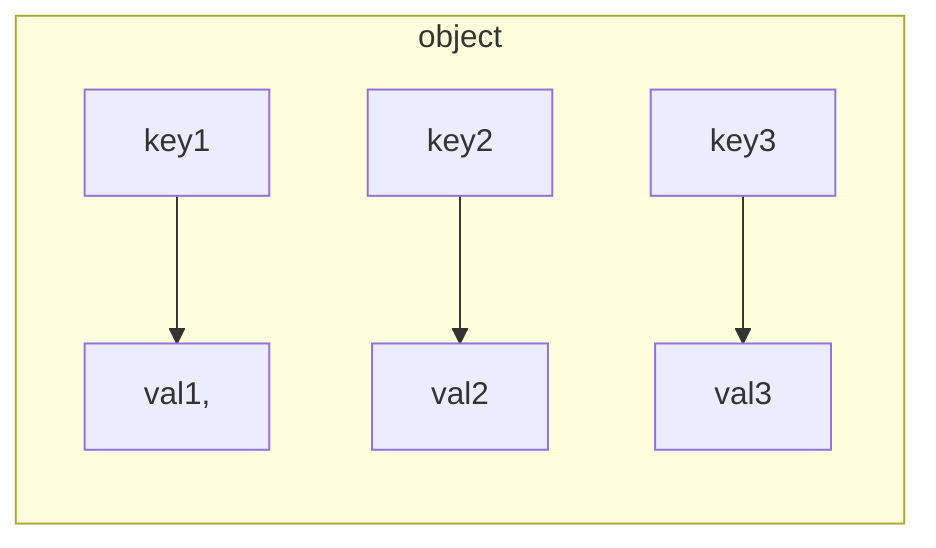
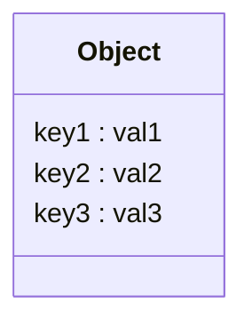
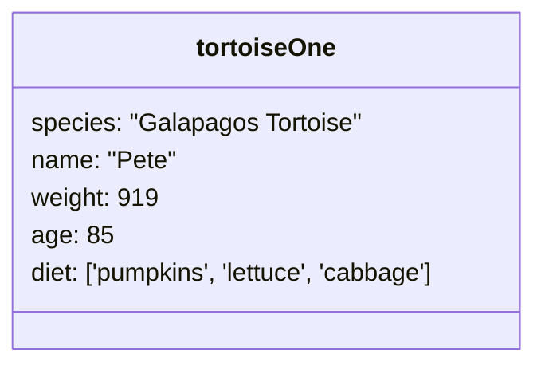
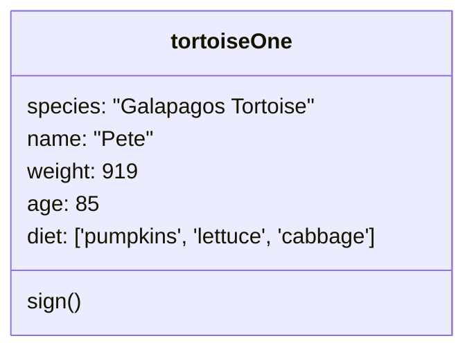
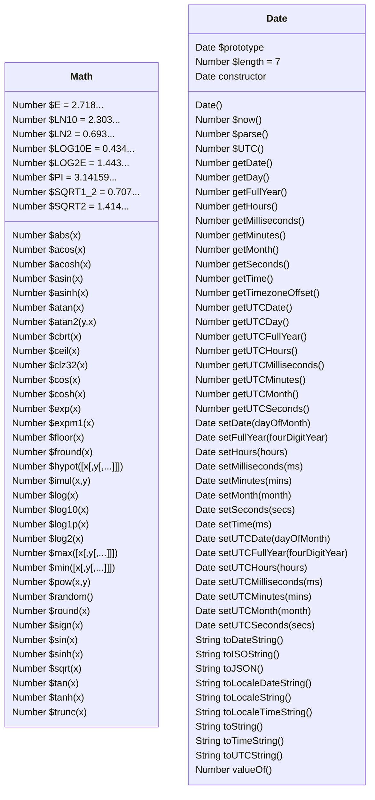

# 12: Objects and the Math Object

[toc]

---

> :reminder_ribbon:  **TODO:** See if you can add the `Date` object as well or separate the `Math` object.

## 12.1. Objects and Why They Matter

So far we have learned a lot about arrays, which are *data structures* that can hold many values. **Objects** are also data structures that can hold many values. Unlike arrays, each **entry** in an object has two parts: a *name* or **key** for reference purposes and a **value** that that key represents. The pairing between a key and its value has given entries another name: **key-value pair**. Object store as many key-value pairs as needed, and each alue needs a key. Without a key, the value can not be access or modified by the programmer.

> :mag: **EDITORS NOTE**: I wanted to rewrite that paragraph because Objects have three important methods for which you can use to fetch a specific part of the array:
>
> * `Object.entries` which will convert an Object into a Array with two-member arrays representing each of the keys and values.
> * `Object.keys` which returns an Array of strings that represent the keys in the array.
> * `Object.values` which returns an Array of values that may be of whatever type the values are. Any objects that are values will still be objects.

This diagram represents how the object looks like.



However, allow me to retract that and use something more professional.



This table above is what is known as a **Class Diagram**. You will see a lot of these  (if you haven't already seen the ones that I've posted) to represent objects, or rather the *class* (type) of object.

A class diagram typically used in a paradigm of programming called **object-oriented programming** (OOP). More than likely we'll dive into what classes are later in this course, even though how they are created in JavaScript is much different.  But I'm getting off track. Let's get back to the book.

### 12.1.1. Initializing Objects

When defining an object, we call the initialization an **object literal**. Objects require three things for the defintion: a name, a set of keys, and their corresponding values.

> :information_source: **NOTE**: Object literals use curly braces (`{}`) to enclose key-value pairs.

Once we have these three things, we write an object literal using the following syntax:

```js
let objectName = { key1 : value1, key2 : value2, ... , keyN : valueN };
```

If we have a lot of entries in our object, we can put them on separate lines.

```js
let objectName = {
    key1 : value1,
    key2 : value2,
    // ...
    keyN : valueN
};
```

> :warning: **WARNING!** When putting key-value pairs on separate lines, it is important to pay attention to the whitespaces (spaces and tabs). Incorrectly spacing or tabbing can cause a bug or error.

When defining an object, key in mind that the keys cna only be value JavaSCript strings. The values can be any data type we've previously discussed.

> **Example** :turtle:
>
> ```js
> let tortoiseOne = {
>     species: "Galapagos Tortoise",
>     name: "Pete",
>     weight: 919,	// lbs
>     age: 85,		// years old
>     diet: ['pumpkins', 'lettuce', 'cabbage']
> };
> ```

We can represent that as a class diagram object



### 12.1.2. Methods and Properties

A **property** of an object is a key-pair of an object. The property's name is the key and the property's data assigned to that key. 

A **method** performs an action on the the object, bcause it is a property that stores a function.

Let's show what our tortoise looks like with methods.



Note that functions go in a separate section of a class object. We also don't write out the function's contents like in the source code.

```js
let tortoiseOne = {
    species: "Galapagos Tortoise",
    name: "Pete",
    weight: 919,	// lbs
    age: 85,		// years old
    diet: ['pumpkins', 'lettuce', 'cabbage'],
    sing: function() {
        return this.name + " is a " + this.species;
    }
};
```

In the example above, on line 8, we see a keywoerd which is new to us. Programmers use the **`this`** keyword when they call on an object's own properties from within ght object itself. We could use the objects name instead of the `this`, but `this` is shorter and easier to read. For example, the method, `sign`, could have a return statement to `tortoiseOne.name + "is a" + tortoiseOne.species`. However, that return statement is a bulky one and will get more difficult to read with more references to the `tortoiseOne` object.

### 12.1.3. Check Your Understanding :white_check_mark:

> :question: **Question**: Which of the following is NOT a true statement about objects?
> a. Objects can store many ~~values~~ entries.
> b. Objects have properties
> c. Objects have methods.
> d. Keys are stored as numbers
>
> :exclamation: **Answer**: d.

> :question: **Question**:  Which keywords can be used to refer to an object within an object?
> a. `Object` 
> b. `let`
> c. `this`
>
> :exclamation: **Answer**: c.

## 12.2. Working with Objects

### 12.2.1. Accessing Properties

When using objects, programmers oftenttimes want to retrieve or change the value of one of the properties. To access the value of a property, you will need the object's name and the key of the property.

Programmers have two ways to access the value of properties:

1. Bracket syntax.
2. Do notation.

#### 12.2.1.1. Bracket Syntax

To access a property with **bracket syntax**, the code looks like: `object["key"]`.

#### 12.2.1.2. Dot Notation

To access a property with **dot notation**, the code looks like `object.key`. NOtice that the key is not surrounded by quotes. However, keys are still strings.

> :information_source: **Note**: Recall the only restraint in naming a key is that it has to be a valid JavaScript string. Since a key could potentially have a space in it, pracket syntax would be the only way to access the value of that property because of the quotes.
>
> :x: **BUT YOU SHOULDN'T HAVE KEYS WITH SPACES IN THEM!** :x:

> **Example**:
>
> ```js
> let tortoiseOne = {
>     species: "Galapagos Tortoise",
>     name: "Pete",
>     weight: 919,	// lbs
>     age: 85,		// years old
>     diet: ['pumpkins', 'lettuce', 'cabbage']
> };
> 
> console.log(tortoiseOne["name"]);
> console.log(tortoiseOne.name);
> ```
>
> ```
> Pete
> Pete
> ```

### 12.2.2. Modifying Properties

A programmer can modify the value of a property by using each notation style.

> :warning: **WARNING!** Recall that mutability means that a data structure can be modified without making a copy of that structure. ==Objects are mutable data structures.== When you change the value of a property, the original object is modified. A copy is not made!

> **Example**
>
> ```js
> let tortoiseOne = {
>     species: "Galapagos Tortoise",
>     name: "Pete",
>     weight: 919,	// lbs
>     age: 85,		// years old
>     diet: ['pumpkins', 'lettuce', 'cabbage']
> };
> 
> console.log(tortoiseOne.weight);
> 
> newWeight = tortoiseOne.weight + 10;
> 
> tortoiseOne["weight"] = newWeight;
> 
> console.log(tortoiseOne["weight"]);
> ```
>
> ```
> 919
> 929
> ```

#### 12.2.2.1. Add New Key-Value Pairs

After declaring an initializing an object, we can add new properties at any time by using bracket syntax:

```js
objectName["new-key"] = propertyValue;		// THIS IS BAD SYNTAX!
```

> :nerd_face: **ACTUALLY...** the above syntax is a BAD EXAMPLE of bracket syntax!
>
> ```js
> objectName["newkey"] = propertyValue;
> ```

> **Example**:
>
> ```js
> let tortoiseTwo = {
>     species: "Galapagos Tortoise",
>     name: "Pete",
>     weight: 919,	// lbs
> };
> 
> console.log(tortoiseTwo);
> 
> tortoiseTwo["age"] = 120;
> tortoiseTwo["speed"] = 'Faster than the hare';
> 
> console.log(tortoiseTwo);
> console.log(tortoiseTwo.age);
> ```
>
> ```
> { species: 'Galapagos Tortoise', name: 'Pete', weight: 919 }
> { species: 'Galapagos Tortoise',
>    name: 'Pete',
>    weight: 919,
>    age: 120,
>    speed: 'Faster than the hare.' }
> 120
> ```

### 12.2.3. Check Your Understanding :white_check_mark:

All of the question below refer to a object called `giraffe` 🦒.

```js
let giraffe = {
  species: "Reticulated Giraffe",
  name: "Cynthia",
  weight: 1500,
  age: 15,
  diet: "leaves"
};
```

> :question: **Question**: We want to add a method after the `diet` property for easily increasing Cynthia's age on her birthday. Which of the following is missing from our method? You can select MORE than one!
>
> ```js
> birthday: function () {age = age + 1;}
> ```
>
> a. `return`
> b. `this`
> c. `diet`
> d. a comma
>
> :exclamation: **Answers**: a and b.
>
> ```js
> birthday: function () { this.age = this.age + 1; return this;}
> ```
>
> The comma would separate `diet` from `birthday`.

> :question: **Question**: Could we use bracket syntax, dot notation, or both to access the properties of `giraffe`?
>
> :exclamation: **Answer**: BOTH! We can access with both.

## 12.3. Coding With Objects

### 12.3.1. Booleans and Objects

==Objects are not stored by their properties or by value but by *reference*.  **"Store by reference"** means that something is stored based on its location in memory.== This can lead to some confusion when comparing objects.

> **Example**
>
> ```js
> let tortoiseOne = {
>     species: "Galapagos Tortoise",
>     name: "Pete",
>     weight: 919,	// lbs
>     age: 85,		// years old
>     diet: ["pumpkins", "lettuce", "cabbage"],
>     sign: function() {
>         return this.name + " is a " + this.species;
>     }
> };
> 
> let tortoiseTwo = {
>     species: "Galapagos Tortoise",
>     name: "Patricia",
>     weight: 800,	// lbs
>     age: 85,
>     diet: ["pumpkins", "lettuce", "cabbage"],
>     sign: function() {
>         return this.name + " is a " + this.species;
>     }
> }
> 
> console.log(tortoiseOne === tortoiseTwo);	// false
> ```
>
> What if we only created the obects with just the parts that are the same?
>
> ```js
> let tortoiseOne = {
>     species: "Galapagos Tortoise",
>     diet: ["pumpkins", "lettuce", "cabbage"],
> };
> 
> let tortoiseTwo = {
>     species: "Galapagos Tortoise",
>     diet: ["pumpkins", "lettuce", "cabbage"],
> }
> 
> console.log(tortoiseOne === tortoiseTwo);	// false
> ```

Even though in the reduced version of our objects, where there is only the same keys and values, they are stored in separate locations in memory. This means that even though you can compare the properties in different objects for equality, you can't compare the object themselves for equality.

### 12.3.2. Iterating Through Objects

We can iterate through all the values in an object, much like we would do with an array. We'll use a `for` loop, but with a slightly different structure. **`for-in` loops** are specifically designed to loop through the properties of an object. Each iteration of the loop accesses a key in the object. The loop stops once it has accessed every property.

> **Example**
>
> ```js
> let giraffe = {
>   species: "Reticulated Giraffe",
>   name: "Cynthia",
>   weight: 1500,
>   age: 15,
>   diet: "leaves"
> };
> 
> for (let item in giraffe) {		// NOTE: You should use `let` here!
>    console.log(`${item}: ${giraffe[item]}`);
> }
> ```
>
> ```
> species: Reticulated Giraffe
> name: Cynthia
> weight: 1500
> age: 15
> diet: leaves
> ```
> In this example, `item` is a variable that holds the string for each key. It is updated with each iterator of the loop.

> 🤔 **Hmm...** What if we tried using an array with `for-in`, what would happen?
> ```js
> let numbers = [ "three", "six", "nine", "tweleve", "fifteen", "eighteen", "twenty-one", "twenty-four", "twenty-seven", "thirty" ];
> 
> for(let num in numbers){
> 	console.log(`${num}: ${numbers[num]}`);
> }
> ```
>
> ```
> 0: three
> 1: six
> 2: nine
> 3: tweleve
> 4: fifteen
> 5: eighteen
> 6: twenty-one
> 7: twenty-four
> 8: twenty-seven
> 9: thirty
> ```
>
> If you run an array through a `for-in` loop, the index of the array is treated as the key and the value at each position is treated as a value. This doesn't make is an object though.

> :information_source: **NOTE**: A `for-in` loop can only use bracket syntax to access the property value.

> 🧩**Try It!** Write a `for-in` loop to print the console of the values in the `tortoiseOne` object. ([Link](https://repl.it/@launchcode/forinLoop/))

### 12.3.3. Objects and Functions

Programmers can pass an object as the input to a function, or use an object as the return value of the function. Any changes to the object within the function will change the object itself.

> **Example**
>
> ```js
> let giraffe = {
>   species: "Reticulated Giraffe",
>   name: "Cynthia",
>   weight: 1500,
>   age: 15,
>   diet: "leaves"
> };
> 
> function birthday(animal) {
>     animal.age = animal.age + 1;
>     return animal;
> }
> 
> console.log(giraffe.age);
> 
> birthday(giraffe);
> 
> console.log(giraffe.age);
> ```
>
> ```
> 15
> 16
> ```
>
> On line 16, when the `birthday` function is called, `giraffe` is passed as an argument and retured. After the function call, `giraffe.age` increases by 1.

### 12.3.4. Check Your Understanding :white_check_mark:

> :question: **Question**: What type of loop is designed for iterating through properties in an object?
>
> :exclamation: **Answer**: `for-in` loop

> :question: **Question**: Given the following object defintions, which statement returns `true`?
>
> ```js
> let tortoiseOne = {
>    age: 150,
>    species: "Galapagos Tortoise",
>    diet: ["pumpkins", "lettuce", "cabbage"]
> };
> 
> let tortoiseTwo = {
>    age: 150,
>    species: "Galapagos Tortoise",
>    diet: ["pumpkins", "lettuce", "cabbage"]
> };
> ```
>
> a. `tortoiseOne == tortoiseTwo`
> b. `tortoiseOne === tortoiseTwo`
> c. `tortoiseOne.age === tortoiseTwo.age`
>
> :exclamation: **Answer**: c.

## 12.4. The `Math` *and `Date`* Object*s*

> :blue_book: **BOOK EDIT**: I've also added information for the `Date` object as well, since it too is like the `Math` object, only instead of math stuff, it returns date and time info.



> :information_source: **NOTE**: `$` in UML diagrams is supposed to indicate a *static* classifier, meaning that the class name is prepended when it is used. (e.g. `$sin()` impilies `Math.sin()`).  Anything that isn't preceeded with a `$` is an instance function, which is prepended with the class name and `prototype` keyword. This is for defintion. For example, when you see `Date.prototype.getMonth()`, if you are using a `Date` object, you only need to use `getMonth()`. We'll explain later.
>
> :information_source: **NOTE**: Returned datatypes are listed for each property and method. This is common in class diagrams. Anything that doesn't have one is likely a *constructor* function. Again, we'll explain what these are in due time.
>
> :information_source: **NOTE**: Depricated methods are not listed in the class diagram above.

JavaScript provides several built-in objects, which can be called directly by the user. One of these is the **`Math` object**, which contains more than the standard mathematical operators (`+`,`-`,`*`,`/`,`%`).

In the previous secions, we learned how to construct, modify and use objects sucha as `giraffe`. However, JavaScript built-in objects cannot be modified by the user.

> ==*Unlike other objects, the `Math` object is immutable.*==

### 12.4.1. `Math` Properties Are Constants

The `Math` object has 8 defined properties. These represent *mathematical constants*:

* **`Math.E`**: Euler's constant $e$, which is the base of natural logarithms. $e \approx 2.718\dots$ 
* **`Math.LN10`** Natural logarithm of 10.
* **`Math.LN2`** Natural logarithm of 2. $\ln 2 \approx 0.693\dots$
* **`Math.LOG10E`** Base 10 logarithm of the Euler constant. $\log_{10} e \approx 2.303\dots$
* **`Math.LOG2E`** Base 2 logarithm of the Euler constant. $\log_2 e \approx 1.443\dots$
* **`Math.PI`** The raio of a circle's circumference to it's diameter. $\pi \approx 3.14159\dots$
* **`Math.SQRT1_2`** The square root of one-half, or one-half the square root of 2. $\sqrt{\frac{1}{2}} = \frac{1}{\sqrt{2}} = \frac{\sqrt{2}}{2} \approx 0.707...$
* **`Math.SQRT2`** The square root of 2. $\sqrt{2} = \frac{2}{\sqrt{2}} \approx 1.414\dots$

Instead of defining a variable to hold as many digits of $\pi$ as we can remember, JavaScript stores the value for us. To use this value, we do NOT need to create a new object. By using dot notation and calling `Math.PI`, we can access the value of $\pi$.

> **Example**:
>
> ```js
> console.log(Math.PI);
> console.log(Math.PI*4);
> console.log(Math.PI + Math.PI);
> ```
>
> ```
> 3.141592653589793
> 12.566370614359172
> 6.283185307179586
> ```

As stated above, the properties within `Math` *cannot* be changed by the user.

> **Example**
>
> ```js
> console.log(Math.PI);
> 
> Math.PI = 1234;
> 
> console.log(Math.PI);
> ```
>
> ```
> 3.141592653589793
> 3.141592653589793
> ```

To use one of the other constants stored in `Math`, we replace `PI` with the property name (e.g. `SQRT2` for $\sqrt{2}$ )

### 12.4.2. Other `Math` Properties

Besides the value of $\pi$, JavaScript provides other constants (which I listed just a little while ago).  How useful you find each of these depends on the type of project you need to complete.

More powerful uses of the `Math` object involve using *methods*.

## 12.5. `Math` Methods

As weith strings and arrays, JavaScript provides some built-in mehtods for the `Math` object. These allow us to perforn calculations or taks that are more involved than with the simple arthmetic operators.

### 12.5.1. Common `Math` Methods

The `Math` object contains ~~over 30~~ 44 methods.

The ten most frequented methods are:

* **`Math.abs(number)`**: **Absolute Value**, which returns the positive value of a `number`. $|x| = \begin{cases} x < 0, x = -x \\ x \ge 0, x = x\end{cases}$
* **`Math.ceil(number)`**: **Ceiling**, which rounds UP a decimal `number` to the closest integer value. $\lceil x \rceil = \min \lbrace n \in \Z\ |\ m \ge x \rbrace$
* **`Math.floor(number)`**: **Floor**, which rounds DOWN a decimal `number` to the closest integer value. $\lfloor x \rfloor = \max \lbrace m \in \Z\ | \ m \le x \rbrace$
* **`Math.max(x,y,...)`**: **Maximum** returns the largest value from a set of numbers.
* **`Math.min(x,y,...)`**: **Minimum** returns the smalles value from a set of numbers.
* **`Math.pow(x,y)`**: **Exponetination**, a.k.a. **power**, is an alternative of `x**y`, and returns $x^y$.
* **`Math.random()`**: **Random**, returns a *pseudo-random* decimal value between 0 and 1, NOT including 1.
* **`Math.round(number)`**: **Round**, returns `number` rounded to the nearest integer value. $\text{round}(x) = \begin{cases} \lceil x \rceil, \text{if}\ |x - \text{trunc}(x)| \ge 0.5 \\ \lfloor x \rfloor, \text{if}\ |x - \text{trunc}(x)| < 0.5 \end{cases}$
* **`Math.sqrt(number)`**: **Square Root**, returns the squre root of a number, $\sqrt{x}$.
* **`Math.trunc(number)`**: **Truncate**, removes any decimal and returns the integer part of a number. In programs like Excel, this is also called `int`.

> :book: **Defintion**: Floor and Ceiling
>
> In the following formulas, $x$ is a real number ($x \in \R$), $m$ and $n$ are integers ($\lbrace m, n \rbrace \in \Z$), and $\Z$ is the set of integers (postive, negative, and zero).
>
> Floor and celing may  be defined be the following set of equations:
> $$
> \begin{aligned}
> \lfloor x \rfloor &= \max \lbrace m \in \Z\ | \ m \le x \rbrace && \text{Floor} \\
> \lceil x \rceil &= \min \lbrace n \in \Z\ | \ n \ge x \rbrace && \text{Ceiling}
> \end{aligned}
> $$
> Since there is exactly one integer in a half-open interval of length one, for any real $x$ (that is $\forall x \in \R$ ) there are unique integers $m$ and $n$ satisifying
> $$
> x - 1 < m \le x \le n < x + 1
> $$
> Then $\lfloor x \rfloor = m$ and $\lceil x \rceil = n$ may be taken as the defintion of floor and ceiling.

> **Example**: Generating random integers.
>
> The simpleset way to generate random integers is with this function
>
> ```js
> function getRandomInt(max) {
>   return Math.floor(Math.random() * Math.floor(max));
> }
> ```
>
> This will pick an integer between 0 and `max` not including `max`.
>
> To get a number between 1 and `max` including `max`, use the code below.
>
> ```js
> function getRandomInt(max) {
>   return Math.floor(Math.random() * Math.floor(max) + 1);
> }
> ```
>
> To get a number between 0 and `max`, including `max`, use the code below.
>
> ```js
> function getRandomIntInclusive(max) {
>   return Math.floor(Math.random() * Math.floor(max + 1));
> }
> ```
>
> To get a number between `min` and `max`, excluding max, use this code.
>
> ```js
> function getRandomInt(min,max) {
>   min = Math.ceil(min);
>   max = Math.floor(max);
>   return Math.floor(Math.random() * (max-min)) + min;
> }
> ```
>
> To get a number between `min` and `max`, including `max`, use this code.
>
> ```js
> function getRandomInt(min,max) {
>   min = Math.ceil(min);
>   max = Math.floor(max);
>   return Math.floor(Math.random() * (max-min + 1)) + min;
> }
> ```

> :reminder_ribbon: **TODO**: Create the entire list!

```
Number $abs(x)
Number $acos(x)
Number $acosh(x)
Number $asin(x)
Number $asinh(x)
Number $atan(x)
Number $atan2(y,x)
Number $cbrt(x)
Number $ceil(x)
Number $clz32(x)
Number $cos(x)
Number $cosh(x)
Number $exp(x)
Number $expm1(x)
Number $floor(x)
Number $fround(x)
Number $hypot([x[,y[,...]]])
Number $imul(x,y)
Number $log(x)
Number $log10(x)
Number $log1p(x)
Number $log2(x)
Number $max([x[,y[,...]]])
Number $min([x[,y[,...]]])
Number $pow(x,y)
Number $random()
Number $round(x)
Number $sign(x)
Number $sin(x)
Number $sinh(x)
Number $sqrt(x)
Number $tan(x)
Number $tanh(x)
Number $trunc(x)
```


### 12.5.2. Check Your Understanding :white_check_mark:

Follow the content in the previous section for the `floor`, `random`, `round`, and `trunc` methods. Review the content then answer and then answer the following questions.

> :question: **Question**: Which of the following returns `-3` when applied to `-3.87`
>
> a. `Math.floor(-3.87)`
> b. `Math.random(-3.87)`
> c. `Math.round(-3.87)`
> d. `Math.trunc(-3.87)`
>
> :exclamation: **Answer**: d. 
>
> `Math.floor()` and `Math.round()` return `-4`. `Math.random()` was being used incorrectly. Only `Math.trunc()` returns `-3` because it returns the integer part of the number.

> :question: **Question**: What is printed by the following program?
>
> ```js
> let num = Math.floor(Math.random()*10);
> 
> console.log(num);
> ```
>
> a. A random number between 0 and 9.
> b. A random number between 0 and 10.
> c. A random number between 1 and 9.
> d. A random number between 1 and 10.
>
> :exclamation: **Answer**: a. `Math.random()` will return a number between 0 through 10 not including 10.

> :question: **Question**: What is printed by the the following program?
>
> ```js
> let num = Math.round(Math.random()*10);
> 
> console.log(num);
> ```
>
> a. A random number between 0 and 9.
> b. A random number between 0 and 10.
> c. A random number between 1 and 9.
> d. A random number between 1 and 10.
>
> :exclamation: **Answer**: b. `Math.round()` will round to the nearest integer, including 0 and 10.

## 12.6. Combining `Math` Methods

The `Math` methods provide useful actions, bt each one is fairly specific in what it does. At first glance, this migh sem to limit how often we need to call on `Math`. However, the methods can be manipulated or combined to produce some clever results.

> :memo: **Remember**: Combining, or "chaining", two or more functions by nesting one inside another is called *composition*! $(f \circ g)(x) = f(g(x))$. The same concept works when we use functions together!

### 12.6.1. Random Selection From an Array

> **Example**: ([link](https://repl.it/@launchcode/KindnessSelection))
>
> ```js
> function randomSelection(arr){
>    let index = Math.floor(Math.random()*arr.length);
>    return arr[index];
> }
> 
> let happiness = ['Hope','Joy','Peace','Love','Kindness','Puppies','Kittens','Tortoise'];
> 
> for (i=0; i < 8; i++){
>    console.log(randomSelection(happiness));
> }
> ```
>
> ```
> Tortoise
> Love
> Kindness
> Hope
> Kittens
> Kindness
> Love
> Hope
> ```

### 12.6.2. Rounding to Decimal Places

Personally, I would have done rounding to a specific number of places with the `toFixed()` method in the `Number` class. However, this way seems to be going for the people writing this book.

I'm not going to write out all the stuff that's in this section. Let's just say, they figured out how to do that but with `Math.round()` instead.

Probably a better way to do rounding, is to do this:

```js
function roundTo(value,places){
    let exp = 10**places;	// or Math.pow(10,places)
    return Math.round(value * exp) / exp;
}
```


### 12.6.3. Check Your Understanding :white_check_mark:

> :question: **Question**: Which of the following correctly rounds 12.345789 to 4 decimal paces?
>
> a. `Math.round(12.3456789*100)/100`
> b. `Math.round(12.3456789*100)/100`
> c. `Math.round(12.3456789*10000)/10000`
> d. `Math.round(12.3456789)*10000/10000`
>
> :exclamation: **Answer**: c.

## 12.X. `Date` Methods

> :blue_book: **BOOK EDIT**: This is NOT part of the book originally! This is something I added.

> :information_source: **NOTE**: Date does have a couple of properties, but they are not relevant right now. So I won't be talking about them.

> :reminder_ribbon: **TODO**: Do this later. 

## 12.7. Exercise: Objects & Math :runner:

> :x: **Censored**

### 12.7.1. Part 1: Create More Objects

#### 12.7.1.1. Add a New Property

#### 12.7.1.2. Add a Method

#### 12.7.1.3. Store the Objects

### 12.7.2. Part 2: Crew Reports

### 12.7.3. Part 3: Crew Fitness

## 12.8. Studio: Objects & Math :studio_microphone:

> :x: **Censored**

### 12.8.1. Before You Start

### 12.8.2. Selec the Crew

#### 12.8.2.1. Randomly Select ID Numbers

#### 12.8.2.2. Build a `crew` Array

### 12.8.3. Orbit Calculations

### 12.8.4. Bonus Missions :rocket:

#### 12.8.4.1. Conserve $\text{O}_2$

#### 12.8.4.2. Fuel Required for Launch :fuelpump:

---

#LaunchCode