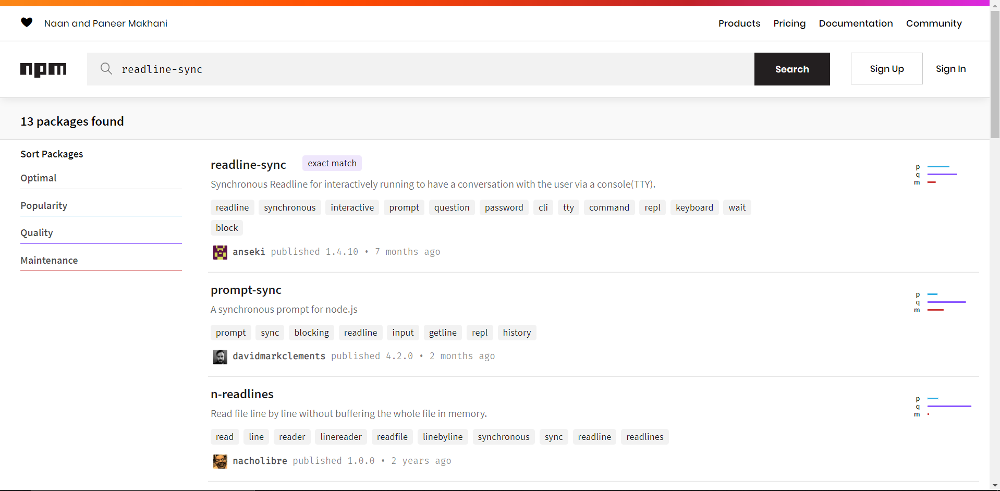

# 13. Modules

[toc]

---

> :information_source: **NOTE:** We start working on Node.js stuff here!

## 13.1. What are Modules?

Just like functions should be kept small and accomplish only one thing, we want to apply the same idea for the different parts of our program. **Modules** allow us to keep the features of our programs in separate, smaller peices. We code these smaller chunks and then connect the modules together to create the big project.

Modules are like Legos. Each peice has its own distinct shape and function, and the same set of pieces can bec combined in lots of different wayt to create uniqu results.

### 13.1.1. One Possible Scenario

Imagine we wanted to create a program that quizzes students on their JavaScript skills.

What would go in this app? Features could include:

1. Selecting questions from a stored array or boect.
2. Presenting the questions to the students and collecting the answers.
3. Scoring the quizzes.
4. Storing the results.

This would be a useful app, but we could make it better by adding some other features. Instead of just quizzing students, maybe we could add some tutorial pages. Our app now porvides some teaching and assessment content.

Next, how about adding some non-graded practice to make sure the students are ready for their final quiz? Once we accomplish that, we could continue adding to our app to make it better and better.

Let's pause for a momemnt to consider what happens to the size of our project. As the program evolves from the straightforward quiz app to one that includes tutorials and practice tasks, the number of lines of code increaded. Now imagine we replicate all of these features for two or three other programming languages.

It would probably look something like this.


The result is a mammoth program tht contains **thousands of lines of code** (measured in **KLOC**). How would this impact debugging? How about keeping the code DRY 🌵?  Do any of the features overlap? How easy is it to add new features?

### 13.1.2. Why Use Modules

Modules help us keep our project origanized. If we find a bug in the quiz part of our program, then we can focus our attention on the quiz module rather than the entire codebase.

Modules also save us effor in other projects--another example of the DRY 🌵 concept. We have already practiced condensing repetitive tasks into loops or functions. Similarly, if we design our quiz module in a generic way, then we can use the same module in other programs.

Even better, we can SHARE our modules with other programmers and use someone else's work (with permission) to enhance our own. Writing the imaginary quiz/tutorial practice app from scratch would take us many, many weeks. However, someone in the coding community might already have modules that we can immediately incorporate into our own project--saving us time and effort.

> ***Modules keep us from reinventing the wheel.***

Some modules also provide us with useful shortcuts. `readline-sync` allowed us to collect input from a user, and this module contains a lot of other methods besides the `.question` we used in our examples. Rather than making every developer write their own code for interacting with the user through the console, `readline-sync` makes the process easier for all by providing a set of ready-to-use functions. We do not need to worry about *how* the modules work. We just need to be able to pull it into our projects and use its functions.

## 13.2. `require` Modules

In order to take advantage of modules, we must *import* them with the **`require`** command. You've seen this before with `readline-sync`.

```js
const input = require('readline-sync');

let name = input.question("What is your name?");
console.log(`Hello, ${name}`);
```

LIne 1 imports the `readline-sync` module and assigns its functions to the input variable.

==Modules are either *single functions* or *objects that contain multiple functions*. If importing a module returns a single function, we use the variable name to call that function. If the module returns an object, we use dot notation to call the function sotred in the object.== In line 3, we see an example of this. `input.question` calls the `question` function stored in the `readline-sync` module.

Later, we will see examples of importing and using single function modules.

> **Example**: Let's check the type of `input` after we import the `readline-sync` module.
>
> ```js
> const input = require('readlin-sync');
> 
> console.log(typeof input);
> ```
>
> ```
> object
> ```

The `readline-sync` module contains several key-value pairs, each of which matches a key (e.g. `question`) with a specific function.

### 13.2.1. Where Do We Find Modules?

Modules come from three places:

1. A local file on your computer.
2. Node itself, known as **core modules** ([Link](https://nodejs.org/dist/latest-v12.x/docs/api/) or [Link](https://www.w3schools.com/nodejs/ref_modules.asp))
3. An external registry such as [NPM](https://www.npmjs.com/).

### 13.2.2. How Does Node Know Where to Look?

The string value passed into `require` tells Node where to look for a module.

#### 13.2.2.1. User Created Modules

If a module is stored on your computer the string passed into `require` must provide a **path** and a **filename**. This path tells Node where to find the module, and it describes how to move up and down within the folders on your computer. Paths can be extremely detailed but best practice recommends that you keep local modules either in the same folder as your project or only one level from your project. Simple paths are better.

A **relative path** starts with `./` or `../`.

* `./` tells Node to search fomodules in the current project folder, commonly called the **current working directory**.
* `../` tells Node to search for the moduels in folder one level up, also know as the **parent directory**.

Following best practices gives us three scenarios for importing one file into another:

1. **The module is in the current working directory**: If we want to import `hello.js` into `index.js`, we add `const hello = require('./hello.js');` on line 1 of `index.js`.
2. **The module is in the parent directory**: If we want to import `hello.js` from  a directory that is one level up into `myCoolApp.js`, then we add `const hello = require('../hello.js');` on line 1 of `myCoolApp.js`
3. **The module is a child directory**: A **child directory**. or **sub-directory**, is a directory is in the current directory. If we want ot import `myCoolApp.js` in the child directory `Projects`, into `index.js`, then we add `const coolApp = require('./Projects/myCoolApp.js');` on line 1 of `index.js`.

### 13.2.2.2. Other Modules

If the filename passes to `require` does not start with `./` or `../`, the Node checkes two resources for the moduel requested.

* Node looks for a Core module with a matching name.
* Node looks for a module installed from an external source like NPM.

Core modules are installed in a Node itself, and as such do not require a path description. These modules are *local*, but Node knows where to find them. [Core modules](https://www.w3schools.com/nodejs/ref_modules.asp) take precedence over ANY other moddules with the same name.

If Node does not find the requested module after checking Core, it looks to the [NPM registry](https://www.npmjs.com/), which contains hundreds of thousands of free code packages for developers.

### 13.2.3. `packages.json` File

Node keeps track of all the modules you import into your project. The list of modules is stored inside a **`package.json`** file.  For example, if we only import `readline-sync`, the file looks something like this:

```json
{
    "main": "index.js",
    "dependencies": {
        "readline-sync" : "1.4.9"
    }
}
```

> :information_source: **NOTE**: YOu may have seen `package.json` yet, because repl.it hides this file by default. We'll talk more about this later.

### 13.2.4. Check Your Understanding :white_check_mark:

> :question: **Question**: Assume you have the following file structure:
>
> ```
> |- 📄 index.js
> |- 📁 Tubers
> |  |- 📄 rutabaga.js
> |- 📄 project.js
> ```
>
> Which statemen allows you to import the `rutabaga` module into `project.js`?
> a. `const rutabaga = require('/rutabaga.js');`
> b. `const rutabaga = require('./rutabaga.js');`
> c. `const rutabaga = require('../rutabaga.js');`
> d. `const rutabaga = require('./Tubers/rutabaga.js');`
>
> :exclamation: **Answer**: d.

## 13.3. NPM

**Node Package Manager** (**NPM**) is a tool for finding and installing Node modles. NPM has two major parts.

1. A registry of modles.
2. Command line tools for installing modules

### 13.3.1. NPM Registry

The NPM registry a listing of thousands of modules that are stored on a remote server. These can be `require`d  and downloaded to your project. The module has been contributed by other developers just like you.

There's an [online version of the registry](https://www.npmjs.com/) where you can search for a module by desired functionality.

Here's what happens when we search for `readline-sync` on NPM. ([Link](https://www.npmjs.com/search?q=readline-sync) to try it yourself!)



An exact match appear as the first result. That is the `readline-sync` module we require. Clicking on the first result leads to the NPM page that describes the `readline-sync` module.

On the details page, you will see:

1. Usage statsitics (how often the module is used)
2. Instructions on how to tuse the modules (example code)
3. Version information
4. The author(s)
5. Sourcecode repository (also known as a "repo")


### 13.3.2. NPM Command Line Interface (CLI) ​​

The NPM **comand line interface** (**CLI**) is installed with Node. The NPM CLI is used in a computer's *terminal* to install modules into a Node project.  If you don't know what any of that is, you'll find out in a later chapter.

But just to give you a preview, here's what it looks like when I run it on my terminal. (Note: I added some features to my terminal that make it look different. You're may look different.) (By the way, if you run this, you cna exit the program by typing `.exit` (with the period in front of it!))


For now, recall that we coded many Node projects inside of repl.it, which allows us to simulate a development environment WITHOUT having to install any software on our computers. As such, repl.it automatically handles much of the work installing external modules.

> :computer: **You probably should have installed node already.**
>
> Seriously, you can use Node locally as a local repl to try out stuff, sort of like how you would use a calculator to check math. That's what I've been doing.
>
> 
>
> If you haven't installed it, do so! You'll like it!
>
> > :reminder_ribbon: **TODO**: Did I put instructions in here? If not, I should insert that later.

### 13.3.3. NPM CLI With repl.it

> :tired_face: **UGH!** I really don't want to go over this part right now.

	> :reminder_ribbon: **TODO**: Try it doing later.

Even though we added `readline-sync` to `package.json`, our code still fails becaue `input` is not defined. The final step of requiring `readline-sync` to assign it as a variable.

Add `const input = require("readline-sync");` to line 1.

```
const input = require("readine-sync");

const name = input.question("What is your name?");
console.log(`hello ${name}`);
```

> :information_source: **NOTE**: So far, we used repl.it without a `package.json` file. That worked because repl.it tries to make the development experinece as easy as possible. It hides some details in order to let us pay more attention to our code.

### 13.3.4. Yarn

> :blue_book: **BOOK EDIT**: I'm inserting this section. It might be useful!

> :reminder_ribbon: **TODO**: Add a section for using [Yarn](https://yarnpkg.com/)?

## 13.4. Exporting Modules

We learned how to pull in useful code in the form of *modules*, but what if we write clever code that we want to share? Fortunately, Node allows us to make our code available for use in other programs.

But first, some basic points:

1. Every Node.js file (which is just a JavaScript file (`filename.js`)) is treated as a module (also called a *package*).
2. From a file, we can export a single function or a set of functions.

### 13.4.1. Starter Code

We'll use the following code sampe to practice how to **export** our work---making it available to import as a module. (Link)

> :memo: **File: `practiceExports.js`**
>
> ```js
> function isPalindrome(str){
>    return str === str.split('').reverse().join('');
> }
> 
> function evenOrOdd(num){
>    if (num%2===0){
>       return "Even";
>    } else {
>       return "Odd";
>    }
> }
> 
> function randomArrayElement(arr){
>    let index = Math.floor(Math.random()*arr.length);
>    return arr[index];
> }
> ```

These functions are in the `practiceExports.js` file, and our goal is to import them into `index.js`.

### 13.4.2. Exporting a Single Function

Let's start by exporting the `isPalindrome` function. At the bottom of `practiceExports.js`, add the line `module.exports = isPalindrome;`. This makes the function available to other files.

In `index.js`, we import `practiceExports.js` with a `require` statement.  `isPalindrome` gets pulled in and assigned to the new variable `palindromeCheck`, and we can now called the function from within `index.js`.

> 🧩 **Try it**: Add the following code to `index.js`, then click "Run".
>
> > Dont' forget to add this one line to `practiceExports.js`!
> >
> > ```js
> > module.exports = isPalindrome;
> > ```
>
> ```js
> const palindromeCheck = require('./practiceExports.js');
> 
> console.log(typeof palindromeCheck);
> console.log(palindromeCheck('that'));
> console.log(palindromeCheck('radar'));
> ```
>
> ```
> function
> false
> true
> ```

There are several points to make about the code and output:

1. By setting `module.exports` equal to `isPalindrome`, we exported that single finction.
2. Eventhough we `require` the file `practiceExports.js`, it only assigns `isPalindrome` to the variable`palindromeCheck`. Thus, `typeof palindromeCheck` returns `function`.
3. `palindromeCheck` now behaves in the same way as `isPalindrome`, so calling `palindromeCheck('that')` evaluates to `false`, since `'that'` is not a palindrome.

### 13.4.3. Exporting Multiple Functions

`practiceExports.js` contains three functions, and to export all of them, we use a different syntax for `module.exports`.  Instead of setting up a single function, we will create an *object*.

To export multiple functions, the syntax is:

```js
module.exports = {
    isPalindrome: isPalindrome,
    evenOrOdd: evenOrOdd,
    randomArrayElement: randomArrayElement
}
```

Within the `{}`, we create a series of `key: value` pairs. The *keys* will be the names used in `index.js` to call the functions. The *values* are the functions themselves.

> :information_source: **NOTE**: We do not have to make the key match the name of the function, but doing so helps us maintain consistency between files.

> :warning: **WARNING!** You may be tempted to use three `module.exports` statements to export each of the three functions, like this:
>
> ```js
> module.exports = isPalindrome;
> module.exports = evenOrOdd;
> module.exports = randomArrayElement;
> ```
>
> But this will **NOT** work, because Node expects only **ONE** `module.exports` statement in a file. No error will be thrown if you use more than one `module.exports` statement, but `require('./practiceExports.js')` will only pull the information from the LAST `module.exports` statement.
>
> Also, why would you type that statement more than once? Group your functions together!

#### 13.4.3.1. 🧩 Try It

Use the object syntax to modify `module.exports` in `practiceExports.js`. We could include only one or two of the functions (which can be useful if you don't want to export everything), but for this practice, let's use all of them!

Once that is done, modify `index.js` with the following code and run it.

```js
const practice = require('./practiceExports.js');

console.log(typeof practice);		// object
console.log(practice);				// { ... }
```

`typeof` indicates that `practice` isn an object, and printing `practice` gives us a list of its key-value pairs (e.g. `isPalindrome: [Function: isPalindrome]`).

All of the functions from `practiceExports` are included in the `practice` object. To call them we used the dot notation: `practice.functionName(argument)`.

Modify `index.js` again and run it once more.

```js
const practice = require('./practiceExports.js');
let arr = ['Hello', 'World', 123, 987, 'LC101'];

console.log(practice.isPalindrome('mom'));
console.log(practice.evenOrOdd(9));

for (i=0; i < 3; i++){
   console.log(practice.randomArrayElement(arr));
}
```

```
true
Odd
123
World
LC101
```

🎉 **SUCCESS!** 🎉 You exported your first module.

### 13.4.4. What If

You might be wondering, "If I have 20+ functions in a file, and want to export them ALL, do I reall need to type 20+ key-pairs in `module.exports`?"

The quick answer is **YES**. `require` only pulls in items defined in `module.exports`. The long answer is, *Hmmm, you missed the point*.

Just like functions, we want to keep modules small and specific. Each moduel should focus on a single idea and contain only a few related functions. With this in mind, we see that `practiceExports` falls short of the goal. Even though it is small in size, `isPalindrome`, `evenOrOdd`, and `randomArrayElement` do not really complement each other. They would be better placed in different modules.

If you find yourself writing lots of functions in a single file, consider splitting them up into smaller, more detailed modules. Doing this makes debugging eaiser, organizes your work, and helps you identify which modules to import into a new project. A module titled `cleverLC101Work` is not nearly as helpful as one called `arraySortingMethods`.

### 13.4.5. Check Your Understanding :white_check_mark:

> :question: **Question**: A module in Node.js is:
> a. A file containing JavaScript code intended for use in other Node programs.
> b. A separate block of code within a program.
> c. One line of code in a program.
> d. A function.
> e. A file that contains documentation about functions in JavaScript.
>
> :exclamation: **Answer**:

> :question: **Question**: Assume you have the following at the end of a `circleStuff.js` module:
>
> ```js
> module.exports = {
>    areaOfCircle: areaOfCircle,
>    circumference: circumference,
>    findRadius: findRadius,
>    arcLength: arcLength
> }
> ```
>
> Inside your project, you import `circleStuff`:
>
> ```js
> const circleStuff = require('./circleStuff.js');
> ```
>
> Which of the following is the correct way to find the circumference of a cirlce from within your project?
> a. `circleStuff(argument)`
> b. `circleStuff.circumference(argument)`
> c. `circleStuff(circumference(argument))`
> d. `circumference(argment)`
>
> :exclamation: **Answer**: b.

## 13.5. Wrap-Up :racing_car:

In this chapter, we showed how to use `require` to pull a module into your project, and we presented two ways to use `module.epxorts`. Of course, these are not the only ways to share content.

A quick search online shows that besides functions, we can also sare individual variables. There are also aternative syntaxes for `module.exports` -- even one that exports as an object, but most imports as a function (which means not using dot notation).

The skills you practice in this chapter provide a solid foundation for modules. Learning the alternative becomes a matter of perosnal preference and the requirement for your job.

## 13.6. Exercises: Modules :runner:

> :x: **CENSORED**

### 13.6.1. Export Finished Modules

### 13.6.2. Code & Export New Module

### 13.6.3. Import Required Modules

### 13.6.4. Finish the Project

### 13.6.5. Sanity Check!

## 13.7. Studio: Combating Imposter Syndrome :studio_microphone:

> :x: **CENSORED** but it probably doesn't have to be since this studio is kind of subjective.

### 13.7.1. You CAN

### 13.7.2. Discussion

### 13.7.3. Real World Comments

### 13.7.4. Helpful Tips

:checkered_flag: Another chapter done. ​**Up next [Unit Testing](14.Unit%20Testing.md).**

---

#LaunchCode