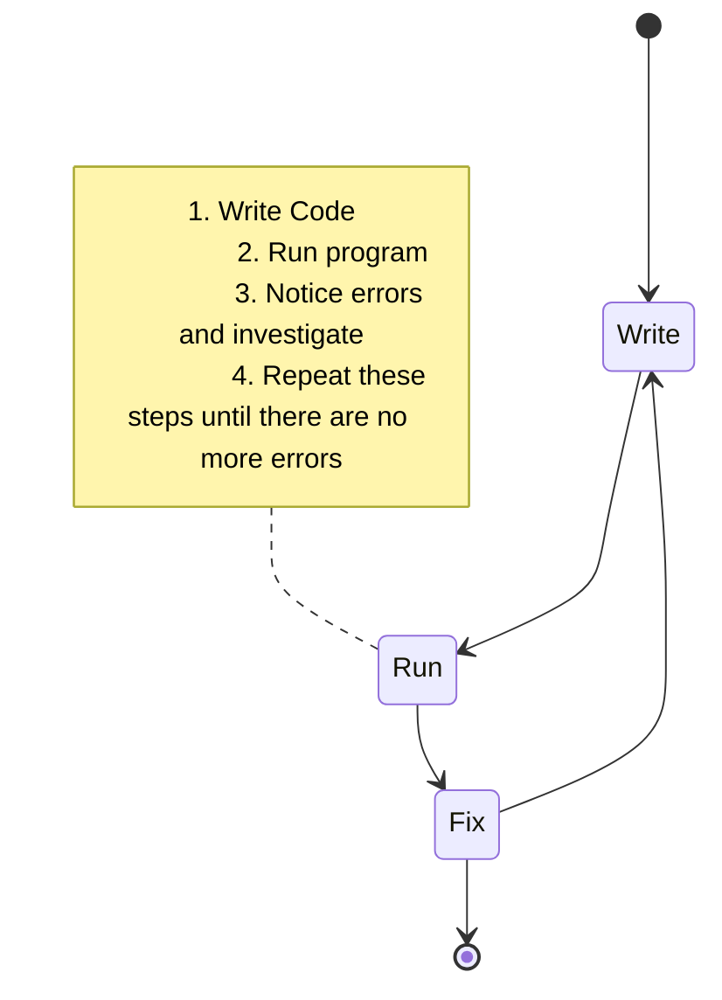
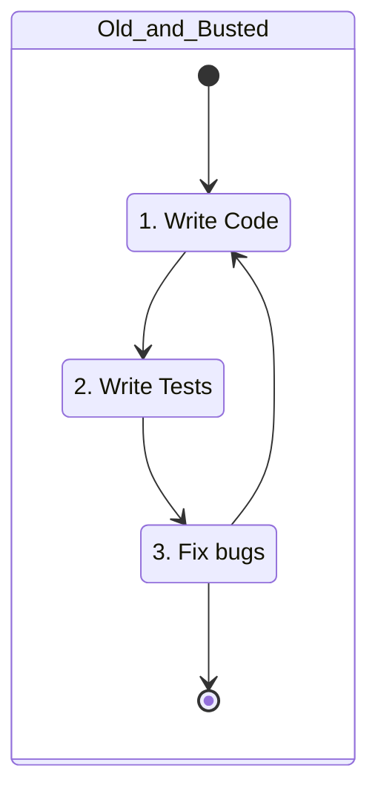
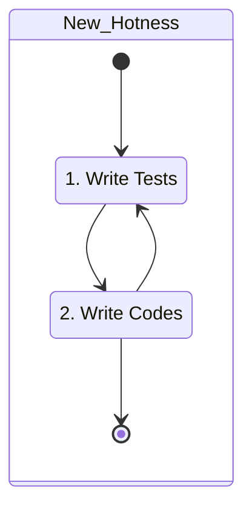
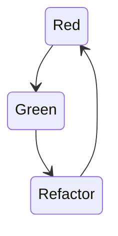

# 14. Unit Testing

[toc]

---

## 14.1. Why Test Your Code?

Checking your code is part of the development process. Developers rarely write code without verifiying it. You are used to debugging programs as you write them. In fact, we devoted an entire chapter to debugging back in [chapter 6](06.Errors%20Debugging.md).

Your development process probably looks something like this.



But there is a better way to test your code using *automated* tests. Automated tests actively test your code and to remove the burden of manual testing. There are many types of automated tests. This chapter focuses on **unit testing**, which tests the smallest components (or *units*) of code. Theyse are typically individual functions.

Before we dive into the *how* of unit testing, let's discuss the *why*.

### 14.1.1. Know Your Code *Really* Works

Manual testing can eventually lead you to a complete, error-free program. Unit testing provides a better alternative.

Does this sound familiar:

>  *You write a program and manually test it. Thinking it is complete, you turn it in only to find that it has a bug or use case that you didn't consider.*

The unit testing process helps avoid this by starting with a list of specific, clearly stated behaviors, that the program should satisify. The behaviors are then converted into automated test that demonstrate program behavior and provide a framework for writing code that *really* works.

### 14.1.2. Find Regressions

How about this situation:

> *You write feature #1 for a program. You move on to feature #2. After finishing feature #2, you realize that your changes broke feature #1.*

Frustrating, right? Espeically with larger programs, adding new features often cause unexpected problems in other part of the code, potentially breaking the entire progra. The introduction of such a bug is known as **regression**.

If you have a collection of tests that can run quickly and consistently, you will know *right away* when a regression appears in your program. This allows you to identify and fix your program more quickly.

### 14.1.3. Tests as Documentation

One of the most poerful aspects of unit testing is that it allows us to clearly define program expectations. ==A good collection of unit test can function as a set of *statements* about *how* the program should behave.== You and others can read the tests and quickly get an idea of the specifics and program behaviors.

> **Example**: Your coworker gives you a function that validates phone numbers, but doesn't provide much detail. Does it handle country codes? Does it require an area code? Does it allow parethesis around area codes? These details would be easily understood if the function had a collection of unit tests that described its behavior.

==Code with a good, descriptive set of unit tests is sometimes called **self-documenting code**.==

Remembering wat your code does and why you structured it a certain way is easy for small programs. However, as the number of your projects increa, and their size grows, the need for documentation becomes critical.

> :tv: **PSA**: I would recommend using [JSDoc](https://jsdoc.app/) notation for documentation in comments.

Documentation can be in the form of code comments or external text documents. These can be helpful, but have one mayor drawback: They can get out of date very quickly. Out-dated, incorrect documentation is very frustrating for a user.

Properly desgined unit tests are runnable documentation for your projects. Beacause unit tests are runnable code that declares and verifies features, they can NEVER get out of sync with the updated code. If a feature is added or removed, the tests must be updated in order to make them pass.

## 14.2. Hello, Jasmine!

> :white_flower: **HEY!** I've added a [Jasmine Reference](../../My%20LC%20Notes/Jasmine%20Reference/index.md) to my notes! Check it out!

In order to unit test our code, we need to use a module. Such a module is called a **unit-testing framework**, **test runner**, or **test harness**, and there are [many to choose from](https://en.wikipedia.org/wiki/List_of_unit_testing_frameworks#JavaScript).

We will use [**Jasmine**](https://jasmine.github.io/).

### 14.2.1. Using Jasmine

Jasmine is an NPM module that can be installed and used in a manner similar to `readline-sync`. We'll learn how to install it later.

In this chapter, we ill continue to use Repl.it which automatically installs NPM modules when it runs a program that contains a `require` statement.

> 🧩 **Try it!** Run some [tests for the `reverse` function](https://repl.it/@launchcode/reverse-Function-With-Tests). This is the same `reverse` function that we we wrote previously in section 10.8.
>
> Don't worry about understanding the code at this point, just hit "Run" to execute the test. How many tests are there? How many passed? How many failed?

A project using Jasmine has several components. Here's the project structure.

```
|- 📄 index.js				// (3)
|- 📁 spec
|  |- 📄 reverse.spec.js	// (2)
|- 📄 package-lock.json
|- 📄 reverse.js			// (1)
```

There are three important files:

1. **`reverse.js`** contains the `reverse` function, which must be exported for use to other files.
2. **`spec/reverse.spec.js`** contains the test for `reverse`.
3. **`index.js`** contains the Jasmine code needed to run the tests. This is the file that executes when you hit "Run" in Repl.it

> :warning: **WARNING!** Jasmine can be set up and used in many different ways. If you are looking for answers on the internet, on sites like [Stack Overflow](https://stackoverflow.com/questions/tagged/jasmine) or in the [Jasmine documentation](https://jasmine.github.io/pages/docs_home.html), you will see widely varying usages of Jasmine that are irrelevant. Rely on this book as your main reference, and you'll be fine.

### 14.2.2. Hello, Jasmine!

Let's build a "Hello, World!" Jasmine project. Open and fork [this Repl.it project](https://repl.it/@launchcode/Hello-Jasmine-Starter-Code).

#### 14.2.2.1. `index.js`

The main file.

```js
var Jasmine = require('jasmine');
var jasmine = new Jasmine();

jasmine.loadConfig({
  spec_dir: 'spec',
  spec_files: [
    "**/*[sS]pec.js"
  ],
});

jasmine.execute();
```

There are three main components of this program:

1. Lines 1 and 2 import the Jasmine module and create the new Jasmine object, `jasmine`. This object is responsible for finding and executing our tests.
2. Lines 4 through 9 configure Jasmine to look for the tests in the `spec` directory of our project. Any file in this directory of the form `filename.spec.js` will be assumed to contain tests, and will be executed by Jasmine.
3. Line 11 triggers Jasmine to find and execute the test.

> 🧩 **Try it!**:  Hit "Run" on the project. Two things will happen:
>
> 1. Repl.it will install Jasmine.
> 2. Jasmine will search for test. Because the `spec` directory doesn't exist yet, there is no `filename.spec.js` file to look for tests to execute.

Let's add some code to test.

#### 14.2.2.2. `hello.js`

Create a new file by clicking on the icon that looks similar to this emoji: 📄

Name the new file `hello.js` then add the following code:

```js
function hello(name) {
   if (name === undefined)
      name = "World";

   return "Hello, " + name + "!";
}
```

The `hello` function takes a single argument, representing a person's name and returns a string greeting that person. If the function is called without an argument, the function returns `"Hello, World!"`.

> :information_source: **NOTE**: We could revise that code to something more modern and shorter.
>
> ```js
> function hello(name = "World") {
>    return `Hello, ${name}!`;
> }
> ```

To use the function outside of `hello.js`, we must export it and add the following line at the bottom:

```js
module.exports = hello;
```

#### 14.2.2.3. `spec/hello.spec.js`

Now that we have a function to test, let's write some test code.

Add a folder (using the icon that looks similar to this emoji 📁 ) and name it `spec`.

Inside the `spec` folder, add a file called `hello.spec.js`.

> **TIP**: If is convetional to put test fo `fileName.js` into `spec/fileName.spec.js` to make it easy to find tests associated with a given file.

Your file tree should look something like this:

```
|- 📄 index.js
|- 📁 spec
|  |- 📄 hello.spec.js
|- 📄 package-lock.json
|- 📄 hello.js
```

At the top of the `hello.spec.js` file, import your function from `hello.js` along with the `assert` module which is part of Node.js.

```js
const hello = require('../hello.js');
const assert = require('assert');
```

Below that, call the function `describe`, passing in the name of the function we want to test along with an empty anonymous function. **`describe`** is a Jasmine function that is used to group related tests. Related tests are placed within an anonymous function that it receives.

```js
describe("hello", function(){
    
});
```

#### 14.2.2.4. Specifications and Assertions

There are two test cases we want to test:

1. The function is called with a string argument. In this case, a custom greeting should be retured.
2. The function is called with no argument. In this case, the general greeting should be returned.

Within `describe`'s function argument, place a test for case 1:

```js
it("should return custom message when name is specified", function(){
    assert.strictEqual(hello("Jasmine"), "Hello, Jasmine!");
});
```

The **`it`** function is part of the Jasmine framework as well. Calling `it` creates a **specification**, or **spec**, which is a description of expected behavior.

The first argument in `it` is a string describing the expected behavior. This string serves to document the test and also is used for reporting test results. Your expectation strings will usually begin with `"should"`, followed by an expected action.

The second argument in `it` is yet another anonymous function. This function contains the test code itself, which takes the form of an assertion. An **assertion** is a declaration of expected behavior *in code*. Let's examine the contents of the anonymous function:

```js
assert.strictEqual(hello("Jasmine"), "Hello, Jasmine!");
```

Calling `assert.strictEqual` with two arguments declares that we expect the two arguments to be (strictly) equal. As you get started with unit testing, nearly *all* of your tests will take this form. The first argment of `assert.strictEqual` is a call to the function `hello`. The second argument is the expected output from that function call.

If the two arguments are indeed equal, the test will pass. Otherwise, the test will fail. In this case, we are declaring that `hello("Jasmine")` should return the value `"Hello, Jasmine!"`.

> :information_source: **NOTE**: Jasmine also has a `.equal` comparison which tests for *loose* equality. It should be pretty obvious from when we spoke of the difference between `==` and `===` operator what the `.equal` and `.strictEqual` functions do in Jasmine.

The test file should now look like this:

```js
const hello = require('../hello.js');
const assert = require('assert');

describe("hello world test", function(){
    it("should return custom message when name is specified", function(){
    	assert.strictEqual(hello("Jasmine"), "Hello, Jasmine!");
	});
    
});
```

#### 14.2.2.5. Test Reporting

This is a fully-functioning test file. Hit "Run" to see for yourself. If all is good, the output wil look like this:

```
Randomized with seed 00798
Started
.


1 spec, 0 failures
Finished in 0.016 seconds
Randomized with seed 00798 (jasmine --random=true --seed=00798)
```

The most important line in the output is line 6:

```
1 spec, 0 failures
```

It tells us that Jasmine found 1 test specification, and that 0 of the specs failed. In other words, *our test passed!*.

Line 3 also contains useful infomration. It contains one dot (`.`) for each successful test, and a `F` for each failed test. As our test suite grows, this becomes a nice visual indicator of the status of our tests.

Let's see what a test failure looks like. Go back to `hello.js` and remove the exclaimation point (`"!"`) from the return statement so that it looks like this:

```js
return "Hello, " + name;
```

Run the tests again. This time, the output looks quite different:

```
Randomized with seed 98738
Started
F

Failures:
1) hello world test should return a custom message when name is specified
Message:
   AssertionError [ERR_ASSERTION]: Input A expected to strictly equal input B:
   + expected - actual

   - 'Hello, Jasmine'
   + 'Hello, Jasmine!'
Stack:
   error properties: Object({ generatedMessage: true, code: 'ERR_ASSERTION', actual: 'Hello, Jasmine', expected: 'Hello, Jasmine!', operator: 'strictEqual' })
      at <Jasmine>
      at UserContext.<anonymous> (/home/runner/spec/reverse.spec.js:23:14)
      at <Jasmine>
      at runCallback (timers.js:705:18)
      at tryOnImmediate (timers.js:676:5)
      at processImmediate (timers.js:658:5)

1 specs, 1 failure
Finished in 0.021 seconds
```

We intentionally made a test fail. The failing test appear in the `Failures:` section on line 5. This  describes exactly what went wrong. The test expected the value `'Hello, Jasmine!'` but received `'Hello, Jasmine'` (without exclaimation point). Notice the failure description is the result of joining the two string arugments from `describe` and `it`. This is why we intentionally define those string the way we did.

The `Stack:` section on line 13 is mostly ignored for now. 

Line 22 has a key statistic showing how many tests, called specs, were run and how many failed. 

```
1 spec, 1 failure
```

Restore `hello.js` back to the way it was and run the test again to mak sure that it works.

Let's add a final spec to test our other cases.

```js
it("should return a general greeting when name is not specified", function(){
     assert.strictEqual(hello(), "Hello, World!");
});
```

This spec declares that calling `hello()` should return `"Hello, World!"`. Run the tests again and you will see the outout:

```
Randomized with seed 81081
Started
..


2 specs, 0 failures
Finished in 0.025 seconds
Randomized with seed 81081 (jasmine --random=true --seed=81081)
```

Awesome! You just created your first program with a full test suite. Compare yours to [how LaunchCode did theirs](https://repl.it/@launchcode/Hello-Jasmine) for reference.

There are a lot of detail in the setup of these test, so take a few minutes to look over the code and describe to yourself what each component is doing.

> :information_source: **NOTE**: There are many ways to structure test specficiations. If you look at the official Jasmine documentation, you see specs with differnt code in place of `assert.stricEqual`.
>
> The book author chose to use `assert.strickEqual` because its syntax is more similar to common testing frameworks in other languages like Java and C#. Learning to use `assert.strictEqual` will make it easier for you to transition to ne of those frameworks later in class.

### 14.2.3. Check Your Understanding :white_check_mark:

> :question: **Question**: Examine the function below, which checks if two strings match:
>
> ```js
> function doStringsMatch(string1, string2){
>    if (string1 === string2) {
>       return 'Strings match!';
>    } else {
>       return 'No match!';
>    }
> }
> ```
>
> Which of the following tests checkes if the function properly handles *case-senstive* answers.
>
> a. `assert.strictEqual(doStringsMatch('Flower', 'Flower'), 'Strings match!');`
> b. `assert.strictEqual(doStringsMatch('Flower', 'flower'), 'No match!');`
> c. `assert.strictEqual(doStringsMatch('Flower', 'plant'), 'No match!');`
> d. `assert.strictEqual(doStringsMatch('Flower', ''), 'No match!');`
>
> :exclamation: **Answer**:

## 14.3. Unit Testing in Action

Testing is a bit of an art: there are no hard and fast rules about how to go about writing good tests. That said, there are some general principles that you should follow.

In this section, we will explore some of these. In particular, we focus on identifying good **test cases** by working through a specific example. ==A test case is a single situation that is being tested.== 

### 14.3.1. What to Test

When writing tests for your code, what should you test? You can't test *every* possible situation or input. But you also don't want to leave out important cases. A function or program that isn't well-tested might have bugs luring beneath the surface.

> :information_source: **Note**: Since we are focusing on *unit* testing, in this chapter we will generally use the term "unit" to refer to the function of program under consideration.

Regardless of the situation, there are three tyes of test cases that you should consider:

1. **Positive test** cases verify expected behavior with valid data.
2. **Negative test** cases verify expected behavior with invalid data.
3. An **edge case** is a subset of postive tests, which checks the extreme edges of valid values.

> **Example**: Imagine a function named `setTemperature` that accepts a number between `50` and `100`.
>
> 1. Positive test values: `56`, `75`, `80`
> 2. Negative test values: `-1`, `101`, `"70"`
> 3. Edge case values: `50`, `100`

Considering postive, negative, and edge tests will go a long way toward heling you create well-tested code.

### 14.3.2. Setting Up

Let's see these actions by writing tests for our `isPalindrome` function. ([Link](https://repl.it/@launchcode/isPalindrome))

```js
function reverse(str) {
   return str.split('').reverse().join('');
}

function isPalindrome(str) {
   return reverse(str) === str;
}
```

Code along with LaunchCode by forking [their Repl.it starter code project](https://repl.it/@launchcode/isPalindrome-With-Tests-Starter). This version includes the above code in `palindrome.js` and the Jasmine test runner code in `index.js`.

Note: The orignainl code's `console.log` statements were removed and exported the `isPalindrome` function:

```js
module.exports = isPalindrome;
```

> **Tip**: When crating a unit-tested projec *always* start by copying the Jasmine test runner code into `index.js` and putting the code you want to test in an appropriately named `.js` file.

==You have become used to testing your code by running it and printing output with `console.log`. When writing unit-testing code, we no longer need to take this approach.==

> **Tip**: If you find yourelf tempted to add a `console.log` statement to your code, write a unit test instead! You would most likely remove that `console.log` after getting your code to work, while the test will remain for you and other developers to use in the future.

Finally, create the `spec` directory and add a spec file, `palindrome.spec.js`. This file should include imports and `describe` block:

```js
const isPalindrome = require('../palindrome.js');
const assert = require('assert');

describe("isPalindrome", function(){

   // TODO - write some tests!

});
```

OK! Let's write some tests!

### 14.3.3. Positive and Negative Test Cases

We'll start with postive and negative tests.

#### 14.3.3.1. Positive Test Cases

For `isPalindrome`, some postive teests have inputs:

* `"a"`
* `"aaaa"`
* `"aba"`
* `"racecar"`

Calling `isPalindrome` with these inputs should return `true` in each case. Notice that these tests are as simple as possible. (K.I.S.S.! :kiss:) Keep test input simple, while still covering your desired test cases, will make it easier to fix a bug in the event that a unit test fails.

Let's add tests for these inputs to `spec/palindrome.spec.js`

```js
const isPalindrome = require('../palindrome.js');
const assert = require('assert');

describe("isPalindrome", function(){

   it("should return true for a single letter", function(){
      assert.strictEqual(isPalindrome("a"), true);
   });

   it("should return true for a single letter repeated", function(){
      assert.strictEqual(isPalindrome("aaa"), true);
   });

   it("should return true for a simple palindrome", function(){
      assert.strictEqual(isPalindrome("aba"), true);
   });

   it("should return true for a longer palindrome", function(){
      assert.strictEqual(isPalindrome("racecar"), true);
   });

});
```

Note the clear test case description (for example, `"should return true for a single letter repeated"`), which will help us easily, identify the expected behavior of our code later.

After adding the positive tests to your file, run them to make sure they all pass.

#### 14.3.3.2. Negative Test Cases

For `isPalindrome`, some negative tests have inputs:

* `"ab"`
* `"launchcode"`
* `"abA"`
* `"so many dynamos"`

Calling `isPalindrome` with those inputs should return `false` in each case. The last two of these negative tests deserve a bit more discussion.

When writing our `isPalindrome` function initially, we made two important decisions:

* Case should be considered ("case-sensitive"), and 
* White space should be considered.

The defintion of a palindrome differs sometimes on these two matters, so it's important to test them.

Testing with input `"abA"` ensures that case is considered, since the lowercase version of this string, `"aba"`, *is* a palindrome.

Testing with `"so many dynamos"` ensures that the whitespace is considered, since the version of this string with whitespace removed, `"somanydynamos"`, *is* a palindrome.

> :information_source: **NOTE**: It's important to isolate your test cases. For example, `"So Many Dynamos"` is a poor choice of input for a negative test, since it contains *two* characteristics that are being tested for--case *and* whitespace. If a test with this input failed, it would NOT be clear why it failed.

Including specific tests that demostrate how *our* `isPalindrome` function behaves in these situations helps make our code *self-documenting*. Someone can read our code and easily see that we *do* consider case and whitespace.

Let's add some tests for these negative cases. Add these with the `describe` call.

```js
it("should return false for a longer non-palindrome", function(){
   assert.strictEqual(isPalindrome("launchcode"), false);
});

it("should return false for a simple non-palindrome", function(){
   assert.strictEqual(isPalindrome("ab"), false);
});

it("should be case-sensitive", function(){
   assert.strictEqual(isPalindrome("abA"), false);
});

it("should consider whitespace", function(){
   assert.strictEqual(isPalindrome("so many dynamos"), false);
});
```

Now run the tests to make sure they pass. Your code nwo includes a set of tests that considers a wide variatety of postive and negative cases.

### 14.3.4. Edge Cases

Recall our defintion of **edge case**:

> ==*An edge case is a test case that provides input at the extreme dge of what the unit should be able to handle.*==

Edge cases can look very different for different units of code. Most of the examples we provide above dealt with numerical edge cases. However, edge cases can aslo be non-numeric.

In the case of `isPalindrome`, the most obvious edge case would be that of the empty string, `""`. This is the smalles possible string that we can use when calling `isPalindrome`. Not only is it the smallest, but it is essentially *different* from the nex longest string, `"a"` -- one has characters and one doesn't.

Should the empty string be considered a palindrome? That decision is up to us, the programmer, and there's no right or wrong answer. In our case, we have decided to take a very literal defintion of the term "palindrome" by considering case and whitespace. In other words, or defintion says that a string is a palindrome exactly when it equals its reverse. Since the reverse of `""` is also `""`, it makes sense to consider the empty string as a palindrome.

Let's add this test case to our spec:

```js
it("should consider the empty string a palindrome", function(){
   assert.strictEqual(isPalindrome(""), true);
});
```

Now run the test, which should all pass.

You might want to think that another edge caise is that the longest possible palindrome. Such a palindrome would be the longest possible string in JavaScript. This case is not worth considering for a couple of reasons:

* The length of the longest string [can vary across different JavaScript implementations](https://developer.mozilla.org/en-US/docs/Web/JavaScript/Reference/Global_Objects/String/length#Description). (YMMV :fuelpump: )
* As of JavaScript specification ES2016 (a.k.a. ES7), states that the maximum allowed lenght of a string should be $2^{53}-1$ characters. This is a lot of characters! 🥜 It's alos unrealistic to expect that our function will ever be given such a string. (This is the part where some guy who thinks they're a hacker says "CHALLENGE ACCEPTED!" fails or waits forever!)

> :information_source: **NOTE**: It might be wise to keep positive, negative, and edge cases grouped together:
>
> ```js
> describe("functionMcFunctonFace",function(){
>     // Positve Tests
>     it("should work",function(){
>         assert.strictEqual(isWorking("testoMcTesto"),true);
>     });
>     // other positive tests here
>     
>     // Negative Tests
>     it("should work",function(){
>         assert.strictEqual(isWorking("failyMacFailFail"),fail)
>     });
>     // other negative tests here
>     
>     // Edge Tests
>     it("should consider empty string",function(){
>         assert.___(isWorking(""),true)
>     });
>     // other edge cases here
> });
> ```

### 14.3.5. Toward a Better Testing Workflow

In this case, we had a well-written function to write tests for, so it was straightforward to create tests that pass. Most situations will not be this simple. Your tests will often uncover bugs, forcing you to go back and update your code. That's OK because it's precisely what tests are for!

The workflow in this situation is:

1. Write code
2. Write Tests
3. Fix any bugs found while testing

The rest of the chapter focusts on a programming technique that allows you to completely eliminate the third step by reversing the order of the first two;

1. Write tests
2. Write code

As you will soon learn, writing yout tests *before* the code is a great way to enhance your programming efficiency and quality.

Let's revew that with this diagra below.

> 🧜‍♀️ **MERMAID**: I would have hoped this state diagram would have been a little more elegant.





> :tv: **FYI**: **ES-*wha?***
>
> You've seen people describe the difference in javascript specifications by year number (ES2016) or by version number (ES7). Let's clear this up really quick.
>
> | Year | Name   | Number |
> | ---- | ------ | ------ |
> | 2015 | ES2015 | ES6    |
> | 2016 | ES2016 | ES7    |
> | 2017 | ES2017 | ES8    |
> | 2018 | ES2018 | ES9    |
> | 2019 | ES2019 | ES10   |
> | 2020 | ES2020 | ES11?  |
>
> > :reminder_ribbon: **TODO**: Add links to the ECMA specifications later.

### 14.3.6. Check Your Understanding :white_check_mark:

Lets' assume we've updated `isPalindrome` to be case-insenstive (e.g. `isPalindrom('Radar')` returns `true`).

> :question: **Question**: Which of the following is an example of a *positive* test case for checking if `isPalindrome` is case-insensitive?
> a. `aa`
> b. `aBa`
> c. `Mom`
> d. `Taco Cat` 
> e. `AbAb`
>
> :exclamation: **Answer**: a, b, and c.

> :question: **Question**: Which of the *negative* test cases listed above are no longer valid for our case-insensitive `isPalindrome`?
> a. `ab`
> b. `launchcode`
> c. `abA`
> d. `so many dynamos`
>
> :exclamation: **Answer**:

## 14.4. Test-Driven Development (TDD)

Now that we know more about unit testing, we are going to learn a new way of using it. So far we've written tests to verify functionality of *existing* code. Next we are going to use test to verify the functionality of code that does not already exist.

As the name sounds, ==**Test-driven development** (**TDD**) is a software development process where the unit tests are written first.== However, that's not the whole story. ==Writing the tests first and intentionally thinking more about code design leads to better code.==  The name comes from the idea of the tests *driving* the development process.

Before we can start using TDD, we need a list of discrete features that can be turned into unit tests. This will help keep our tests focused on specific functionality which should lead to cod that is easy to read. Along the way, we will build confidence as we add features.

> :information_source: **NOTE**: TDD is a process that some organizations choose to use. Using the TDD process is not required when unit testing.

### 14.4.1. Test/Code Cycle

> :reminder_ribbon: **TODO**: :detective: **EDIT!** There were plenty of errors in this section of the book. I may have picked some of them up in my notes here. This section needs to be reviewed later.

With TDD you start the unit test first. As with any unit test, the test should describe a clearly described behavior that can be tested.

> **Example**: Example test case for a data parsing project.
>
> * Take in a string of numbers

Because the test is for a feature that does not exist yet, we need to think about how the feature will be implemented. This is the time to ask questions like:

*  "Should we add a new parameter?"
* "What about an entirely new function?"
* "What will the function return?"

> **Example**: How could we implement our test case? (Remember, we aren't writing the code yet, only think about the design.)
>
> * A function named `parseData`
> * `parseData` will 
>   * have a `data` parameter that will be a string of data
>   * have a `delimiter` parameter that will be used to split the string into an array
>   * return an array
> * `parseData` will be defined in a module.
>
> > :coffee: **JSDoc**: Why not document this in comments using JSDoc?
> >
> > ```js
> > /* @file parse-numbers.js
> >  * @module parse-numbers
> >  */
> > 
> > /* @func parseData
> >  * @desc Take a string of numbers delimited by a character and return an array
> >  * @param {string} text - String of data
> >  * @param {string} delimiter - String that will be used to split string into an array
> >  * @return {array}
> >  */
> > function parseData(text,delimiter){
> >     /* our code */
> > }
> > ```

Next, write the unit test as if the parameter of function you imagined already exists. This may seem odd, but considering how the new code will be used help find bugs and flaws earlier. We also have to use test utilities such as `assert.strictEqual` to clearly demonstrate that the proposed new code function properly.

> **Example**: This is where the ideas are typed out into a test. In this example, the test references a module and a function that have not been created yet. The code follows the plan we came up with earlier. Most importantly, there is a `assert.strictEqual` that verifies that an array is returned.
>
> ```js
> const assert = require('assert');
> const parse = require('../parse-numbers');
> 
> describe("parse numbers", function(){
> 
>    it("returns array when passed comma separated list of numbers", function(){
>       let items = parse("5,8,0,17,6,4,9,3", ",");
>       assert.strictEqual(Array.isArray(items), true);
>    });
> 
> });
> ```

Now run the test! The test should fail. If it doesn't, your code will not compile because you have referenced code that des not exist yet.

Finally, write code that passes the new test. In the earlier chapters, this is where you started, but ==with TDD, writing new code is the *last* step.==

> **Example**: To make the above test pass, a file would be crated that exports a `parseData` function with the logic that satisfies the expected result.
>
> ```js
> function parseData(text,delimiter){
>     return text.split(delimiter);
> }
> 
> module.exports = parseData;
> ```

Coding this way build confidence in your work. No mater how large your code base may get, you know that each part has a test to validate its functionality.

> **Example**: Now that we have one passing test for our data parser project, we could confidently move on to writing tests and code for the remaining features.

### 14.4.2. Red, Green, Refactor

While adding new features and making our code work is the main goal, we also want to write readable, efficient code that we feel good about. The **red, green, refactor mantra** describes the process of writing tests, seeing them pass, then making the code better. As the name suggests, the cycle consisists of three steps:

1. <span style="color:red;">**Red**</span> refers to test results that fail. Write a failing test.
2. <span style="color:green;">**Green**</span> refers to test results that pass. Make it pass by implementing code.
3. **Refactor**. Make the code better.



> :reminder_ribbon: **TODO**:  Oh mermaid! Can't you draw that right?!

**Refactoring** code means to keep the same overall features, but change how those features are implemented. Since we have a test to verify our code, we can change the code with confidence, knowing that any regression will be immediately identified by the tests.

Here are a few examples of refactoring:

* Using different data structures.
* Reducing the number of times needed to loop through an array.
* Moving duplicate logic into a function so that it can be reused.

The refactor is also done in a TDD process:

1. Decide on what is the improved way to implement the feature, then change the unit test to use this new idea.
2. See the test fail, then implement the refactor idea.
3. See the test pass with the refactored design.

## 14.5. TDD in Action

> :reminder_ribbon: **TODO**: Adjust the line numbering for added comments.

In this section, which is super important, we implement a project using TDD.

First thing we need to do is [fork the starter code on repl.it](https://repl.it/@launchcode/Transmission-processor-TDD-starter).

We need to write a Node module to process transmission from the [Voyager1 probe](https://voyager.jpl.nasa.gov/mission/).

> **Example**:
>
> Transmission:
>
> ```js
> "1410::<932829840830053761>"
> ```
>
> Expected Result:
>
> ```js
> {
>    id: 1410,
>    rawData: 932829840830053761
> }
> ```

### 14.5.1. Requirements

The reatures for this project have already been broken down into small testable units. Let's review them and then we will take it slow :turtle:, one step at a time.

1. Take a transmission string and return an object.
2. Return `-1` if the transmission does NOT contain `"::"`.
3. Returned object should contain an `id` property.
   * The value of `id` is part of the transmission *before* the `"::"`.
4. The `id` property should be of type `Number`.
5. Returned object should contain a `rawData` property.
   * The value of `rawData` is the part of the transmission *after* the `"::"`
6. Return `-1` for the value `rawData` if the `rawData` part of the transmission does NOT start with `<` and end with `>`.

### 14.5.2. Requirement #1

>  **Requirement**: *Take in a transmission string and return an object.*

To get started on this we need to:

1. Create a blank test function.
2. Give that test a name that is a clear, testable statement.

Creating a blank test is easy. Go to **`spec/processor.spec.js`** and add an empty test method. ==Tests in Jasmine are declared with an `it` function.== Remember that ==tests go inside of the `describe` function, which along with the string parameter describes the group of tests inside.==

> **Mnemonic device**: Consider this state diagram when using `describe` and `it`.
>
> ```mermaid
> stateDiagram
> [*] --> Describe
> Describe --> It
> It --> It
> It --> [*]
> ```

```js
// @file: spec/processor.spec.js
const assert = require('assert');

describe("transmission processor", function() {

    // Requirement #1 test
   it("", function(){		// TODO: String for test
			// TODO: Code fot test
   });

    // TODO: Additonal tests
});
```

Give the test the name `"takes a string and returns an object"`.

```js
// @file: spec/processor.spec.js
const assert = require('assert');

describe("transmission processor", function() {

   it("takes a string returns an object", function() {
			// Todo: Code for the test
   });

});
```

Now that we identified a clear goal for the test, let's add logic and `assert` calls in the test to verify the desired behavior--BUT WAIT! We haven't added anything except an empty test at this point. There isn't any actual code to verify. That's OK. It's all part of the TDD process.

==We're going to think about and visualize how this feature should be implemented in code. Then we will write out how this new code will be used.==

==We need to think of something that will satisfy the statement `it("takes a string returns an object",...)`. The `it` will be a function that is imported from a module.== Below on line 3, a `processor` function is imported from the `processor.js` module.

```js
// @file: spec/processor.spec.js
const assert = require('assert');
const processor = require('../processor.js');

describe("transmission processor", function() {

   // Requirement #1 test
   it("takes a string and returns an object", function(){
		// TODO: Code for the test
   });

    // TODO: Addtional tests
});
```

We have an idea for a function named `processor` and we have imported it. Keep in mind this function only exists as a concept and we are writing a test to see if this concept makes sense.

Now for the real heart of the test. We are going to use `assert.strictEqual` to verify that if we pass a string to `processor`, an object is returend. Carefully review lines 9 and 10 shown below.

```js
// @file: spec/processor.spec.js
const assert = require('assert');
const processor = require('../processor.js');

describe("transmission processor", function() {

    // Requirement #1 test
   it("takes a string and returns an object", function(){
      let result = processor("9701::<489584872710>");
      assert.strictEqual(typeof result, "object");
   });

   // TODO: Additional tests
});
```

On line 8, the `processor` function is called, with the value being stored in a `result` variable.

On line 9, the result of the expression `typeof result` is compared to the value `object` because the `typeof` operator returns a string representation of a type. Therefore, if `typeof result` evaluates to the string `object`, then we know that `processor` returened an object.

#### 14.5.2.1. Code Red

Let's run the test! Click the "Run" button in your REPL.it. You should see an error about `processor.js` not existing. It makes sense, because we haven't created the file yet.

```
Error: Cannot find module '../processor.js'
```

We are officially in the <span style="color:red;">**red**</span> phase of Red-Green-Refactor!

#### 14.5.2.2. Go Green!

Now that we have a failing test, we have only one choice. Make it pass.

1. Add a **`processor.js`** file to your REPL.it.
2. Inside of the module, declare a **`processor`** function that takes a parameter and returns an object.

```js
// @file: processor.js

// @function process
// @param    {string} transmission
// @returns  {object}
function process(transmission) {
    return {};
}

module.exports = process;
```

Run the test again.

If we get `1 spec, 0 failures` it means we have 1 passing test. In REPL.it, you have to imagine a satisfying <span style="color:green;">**green**</span> color of a passing test.

#### 14.5.2.3. Refactor If Needed

This solution is very simple and does not need to be improved. ==The **refactor** step does not always lead to an actual changing of your code.== The most important part is to ==review your code and make sure that it is efficient and meets your team's standards.==

### 14.5.3. Requirement #2

> **Requirement**: *Return `-1` if the transmission does NOT contain `"::"`.*

Next we have a <span style="color:red;">negative</span> test requirement that tells us what should happen if hte data is invalid. Before juming to the code, let's review the steps we took to implement requirement #1.

> ==**Review of TDD Process**==
>
> 1. ==Create a blank test function.==
> 2. ==Give the test a name that is a clear, testable statement.==
> 3. ==Come up with test data that will trigger the described behavior.==
> 4. ==Think about what is needed then write code that fulfills the stated behavior.==
> 5. ==Reun the test and see the `it` fail.==
> 6. ==Implement the new code or feature used in the test.==
> 7. ==Run the test and see `it` pass.==
> 8. ==Review to see if refactor is needed.==

For Requirement #2, the solution for steps 1 through 4 can be seen on lines 14 through 17 below.

```js
// @file: spec/processor.spec.js
const assert - require('assert');
const processor = require('../processor.js');

describe("transmission processor", function() {

    // Requirement #1 test
   it("takes a string and returns an object", function(){
      let result = processor("9701::<489584872710>");
      assert.strictEqual(typeof result, "object");
   });
    
	// Requirement #2 test
   it("returns -1 if '::' not found", function(){
      let result = processor("9701<489584872710>");
      assert.strictEqual(result, -1);
   });

    // TODO: Additional Tests
});
```

Now for *step 5*, run the test and see if fail. When you run the tests, you should see the below error message. Notice that `-1` was the expected value, but the actual value was object.

```
Failures:
1) transmission processor returns -1 if '::' not found
Message:
 AssertionError [ERR_ASSERTION]: Input A expected to strictly equal input B:
 + expected - actual

 - 'object'
 + -1
```

Next is *step 6*, write code that will make the test pass. Go to `processor.js` and update the `processor` function to check the `transmission` argument for the presence of `"::"`.

```js
// @file: processor.js

// @function process
// @param    {string} transmission
// @returns  {object}
function process(transmission) {
    if(transmission.indexOf("::") < 0){
        // Data is invalid
        return -1;
    }
    return {};
}

module.exports = process;
```

*Step 7*: Run the test again. The should both pass.

```
2 specs, 0 failures
Finished in 0.035 seconds
```

Finally *step 8* is to review the code to see if it needs refactoring. As with the first requirement, our code is quite simple and cannot be improved at this time.

### 14.5.4. Requirement #3

> **Requirement**: <i>Returned object should contain an `id` property. The `id` is the part of the transmission **before** the `"::"`.</i>

The same steps will be followed, even though they are not explicitly listed.

See lines 20 through 23 to see the added test requirement. To test this case `notStrictEqual` was used, which is checked if the two values are NOT equal. `notStrictEqual` is used ot make sure that the `result.id` is NOT equal to `undefined`. Remember, ==if you reference a property on an object that does NOT exist, `undefined` is returned.==

```js
// @file: spec/processor.spec.js
const assert - require('assert');
const processor = require('../processor.js');

describe("transmission processor", function() {

    // Requirement #1 test
   it("takes a string and returns an object", function(){
      let result = processor("9701::<489584872710>");
      assert.strictEqual(typeof result, "object");
   });
    
	// Requirement #2 test
   it("returns -1 if '::' not found", function(){
      let result = processor("9701<489584872710>");
      assert.strictEqual(result, -1);
   });

   // Requirement # 3 test
   it("returns id in object", function() {
     let result = processor("9701::<489584872710>");
     assert.notStrictEqual(result.id, undefined);
   });
    
    // TODO: Additional Tests
});
```

The fail message looks a little different than what we have seen. The phrase `"Identical input passed to notStrictEqual"` lets us know that the two alues were equal when we didn't expect them to be.

```
Failures:
1) transmission processor returns id in object
Message:
   AssertionError [ERR_ASSERTION]: Identical input passed to notStrictEqual: undefined
```

The object returned from `processor` does not have an `id` property. We need to split the transmission on `'::'` and then add that value to the object with the key `id`. See solution in the `processor.js` below.

```js
// @file: processor.js

// @function process
// @param    {string} transmission
// @returns  {object}
function process(transmission) {
    if(transmission.indexOf("::") < 0){
        // Data is invalid
        return -1;
    }
    let parts = transmission.split("::");
    return {
        id: parts[0]
    };
}

module.exports = process;
```

Run the test again That did it! The Test passed! 🙌

Line 11 splits `transmission` into the parts array, and line 13 assigns the first entry in the array to the key `id`.

```
3 specs, 0 failures
Finished in 0.011 seconds
```

### 14.5.5. Requirement #4

> **Requirement**: *The `id` property should by of type `Number`.*

Again, the same steps are followed, though not listed.

New test to be added to `specs/processor.spec.js`

```js
// @file: spec/processor.spec.js
const assert - require('assert');
const processor = require('../processor.js');

describe("transmission processor", function() {

    // Requirement #1 test
   it("takes a string and returns an object", function(){
      let result = processor("9701::<489584872710>");
      assert.strictEqual(typeof result, "object");
   });
    
	// Requirement #2 test
   it("returns -1 if '::' not found", function(){
      let result = processor("9701<489584872710>");
      assert.strictEqual(result, -1);
   });

   // Requirement # 3 test
   it("returns id in object", function() {
     let result = processor("9701::<489584872710>");
     assert.notStrictEqual(result.id, undefined);
   });
    
    // Requirement #4 test
    it("converts id to a number", function() {
   		let result = processor("9701::<489584872710>");
   		assert.strictEqual(result.id, 9701);
	});
    
    // TODO: Additional Tests
});
```

Fail message

```
Failures:
1) transmission processor converts id to a number
Message:
   AssertionError [ERR_ASSERTION]: Input A expected to strictly equal input B:
   + expected - actual

   - '9701'
   + 9701
```

Convert the `id` part of the string to be the type `number`.

```js
// @file: processor.js

// @function process
// @param    {string} transmission
// @returns  {object}
function process(transmission) {
    if(transmission.indexOf("::") < 0){
        // Data is invalid
        return -1;
    }
    let parts = transmission.split("::");
    return {
        id: Number(parts[0])		// Wow, that was a bit much for one line
    };
}

module.exports = process;
```

Now to watch our test pass.

```
4 specs, 0 failures
Finished in 0.061 seconds
```

> :information_source: **NOTE**: You may be wonderng what happens if that data is bad and the `id` can't be turned into a number. That is a <span style="color:red;">negative test case</span> related to this feature, and it's left for you to address in the final section.

### 14.5.6. Requirement #5

> **Requirement**: <i>Returned object should contain a `rawData` property. The `rawData` is the part of the transmission **after** the `"::"`.</i>

New test to be added to `specs/processor.spec.js`

```js
// @file: spec/processor.spec.js
const assert - require('assert');
const processor = require('../processor.js');

describe("transmission processor", function() {

    // Requirement #1 test
   it("takes a string and returns an object", function(){
      let result = processor("9701::<489584872710>");
      assert.strictEqual(typeof result, "object");
   });
    
	// Requirement #2 test
   it("returns -1 if '::' not found", function(){
      let result = processor("9701<489584872710>");
      assert.strictEqual(result, -1);
   });

   // Requirement # 3 test
   it("returns id in object", function() {
     let result = processor("9701::<489584872710>");
     assert.notStrictEqual(result.id, undefined);
   });
    
    // Requirement #4 test
    it("converts id to a number", function() {
   		let result = processor("9701::<489584872710>");
   		assert.strictEqual(result.id, 9701);
	});
    
    // Requirement #5 test
    it("returns rawData in object", function() {
   		let result = processor("9701::<487297403495720912>");
   		assert.notStrictEqual(result.rawData, undefined);
	});
    
    // TODO: Additional Tests
});
```

Fail message

```
Failures:
1) transmission processor returns rawData in object
Message:
   AssertionError [ERR_ASSERTION]: Identical input passed to notStrictEqual: undefined
```

We need to extract the `rawData` from the second half of the `transmission` string after it has been split. Then return that in the object.

```js
// @file: processor.js

// @function process
// @param    {string} transmission
// @returns  {object}
function process(transmission) {
    if(transmission.indexOf("::") < 0){
        // Data is invalid
        return -1;
    }
    let parts = transmission.split("::");
    let rawData = parts[1];
    return {
        id: Number(parts[0]),
        rawData: rawData
    };
}

module.exports = process;
```

Here we go! Time to pass another test!

```
5 specs, 0 failures
Finished in 0.041 seconds
```

### 14.5.7. Requirement #6

> **Requirement: *Return `-1` for the value of `rawData` if the `rawData` part of the transmission does NOT start with `<` and end with `>`.*

The final boss. Here we've got something a little more complex.

Let's think about what test data to use for this requirement. What ways could the transmission data be invalid?

1. It could be missing `<` at the beginning
2. It could be missing `>` at the end
3. It could be missing both `<` and `>`
4. It could have `<` but in the wrong place.
5. It could have `>` but in the wrong place.

All thse cases need to be covered by a test. Let's start with item #1.

Another test is added to `specs/processor.spec.js`

```js
// @file: spec/processor.spec.js
const assert - require('assert');
const processor = require('../processor.js');

describe("transmission processor", function() {

    // Requirement #1 test
   it("takes a string and returns an object", function(){
      let result = processor("9701::<489584872710>");
      assert.strictEqual(typeof result, "object");
   });
    
	// Requirement #2 test
   it("returns -1 if '::' not found", function(){
      let result = processor("9701<489584872710>");
      assert.strictEqual(result, -1);
   });

   // Requirement # 3 test
   it("returns id in object", function() {
     let result = processor("9701::<489584872710>");
     assert.notStrictEqual(result.id, undefined);
   });
    
    // Requirement #4 test
    it("converts id to a number", function() {
   		let result = processor("9701::<489584872710>");
   		assert.strictEqual(result.id, 9701);
	});
    
    // Requirement #5 test
    it("returns rawData in object", function() {
   		let result = processor("9701::<487297403495720912>");
   		assert.notStrictEqual(result.rawData, undefined);
	});
    
    // Requirement #6, item #1 test
    it("returns -1 for rawData if missing < at position 0", function() {
   		let result = processor("9701::487297403495720912>");
   		assert.strictEqual(result.rawData, -1);
	});
    
    // TODO: Additional Tests
});
```

Fail Message

```
Failures:
1) transmission processor returns -1 for rawData if missing < at position 0
Message:
   AssertionError [ERR_ASSERTION]: Input A expected to strictly equal input B:
   + expected - actual

   - '487297403495720912>'
   + -1
```

New code added to `processor.js` to make the test pass. Note that we do not simply return `-1`, the requirement is to return the object and set the value of `rawData` to `-1`.

```js
// @file: processor.js

// @function process
// @param    {string} transmission
// @returns  {object}
function process(transmission) {
    if(transmission.indexOf("::") < 0){
        // Data is invalid
        return -1;
    }
    let parts = transmission.split("::");
    let rawData = parts[1];
    if (rawData[0] !== "<") {
        rawData = -1;
    }
    return {
        id: Number(parts[0]),
        rawData: rawData
    };
}

module.exports = process;
```

Pass message

```
6 specs, 0 failures
Finished in 0.056 seconds
```

> 🧩 **Try It!** The test data we used was missing `<` at the beginning. Add test to cover these cases. `-1` should be returned as the value for `rawData` for all of these.
>
> * `"9701::8729740349572>0912"`
> * `"9701::4872<97403495720912"`
> * `"9701::487297403495720912"`
> * `"9701::<487297403495<720912>"`

> :reminder_ribbon: **TODO**: We should DEFINTELY do this!

### 14.5.8. Use TDD to Add These Features

Use the steps demonstrated above to implement all ~~or some~~ of the below features. Take your time, **YOU CAN DO IT!** :cowboy_hat_face:

1. Trim leading and trailing whitespace from `transmission`.
2. Return `-1` if the `id` part of the `transmission` cannot be converted to a number.
3. Return `-1` if more than one `"::"` found in `transmission`.
4. Return `-1` for value of `rawData` if anything besides number are present.
5. Allow for multiple `rawData` values
   * `rawData` would be returned as an array of numbers.
   * Get the new test working and then fix any broken existing tests. (Wait? Isn't that NOT TDD?!)
   * Example transmission: `"9701::<21212.232323.242424>"`
   * Result: `{id: 9701, rawData: [21212,232323,242424] }`

> :reminder_ribbon: **TODO**: Guess what tonights homework is! THIS! :stuck_out_tongue_closed_eyes:

## 14.6. Exercises: Unit Testing :runner:

> :x: **CENSORED**

> :reminder_ribbon: **TODO**: You know what, I WILL share this one! Stay tuned!

### 14.6.1. Automatic Testing to Find Errors

### 14.6.2. Try One on Your Own

### 14.6.3. Bonus Mission :rocket:

## 14.7. Studio: Unit Testing :studio_microphone:

> :x: **CENSORED**

### 14.7.1. Source Code

### 14.7.2. Write the First Test

### 14.7.3. Write Code to Pass the First Test

### 14.7.4. Write the Next Two Tests

### 14.7.5. Write Code to Pass the New Tests

### 14.7.6. Hmmm, Tricky

### 14.7.7. More Tests and Code Snippets

### 14.7.8. New Condition

### 14.7.9. Bonus Missions :rocket:

#### 14.7.9.1. DRYing the Code

#### 14.7.9.2. What If We Already Have Code?


:checkered_flag: **OH THANK HEAVENS! IT'S OVER!** This chapter was such a long thing to do and I don't think I did a couple of things I should have. We'll get back to them later. Right now, let's knock out this next chapter on [Scope](15.Scope.md).

---

#LaunchCode

