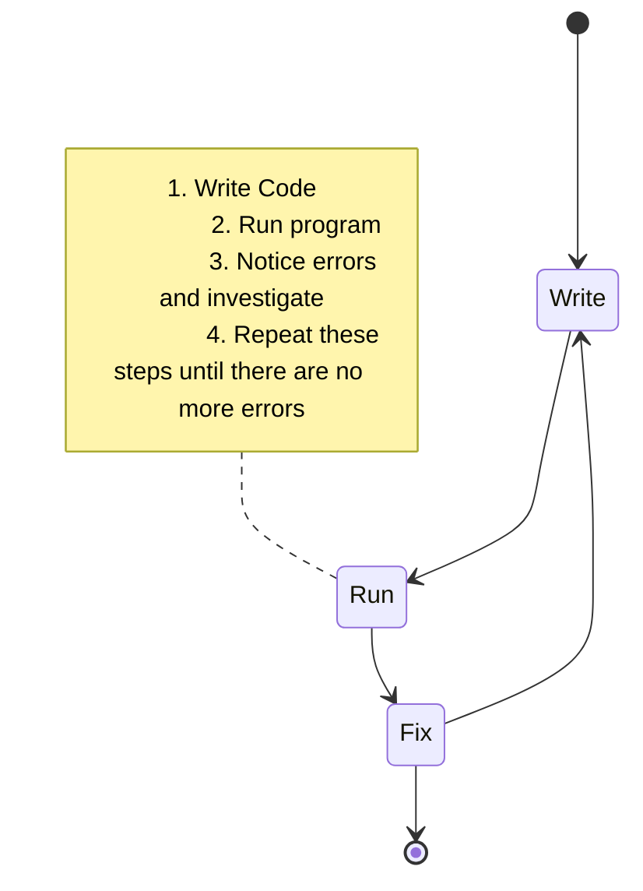

# 14. Unit Testing

[toc]

---

## 14.1. Why Test Your Code?

Checking your code is part of the development process. Developers rarely write code without verifiying it. You are used to debugging programs as you write them. In fact, we devoted an entire chapter to debugging back in [chapter 6](06.Errors%20Debugging.md).

Your development process probably looks something like this.

But there is a better way to test your code using *automated* tests. Automated tests actively test your code and to remove the burden of manual testing. There are many types of automated tests. This chapter focuses on **unit testing**, which tests the smallest components (or *units*) of code. Theyse are typically individual functions.

Before we dive into the *how* of unit testing, let's discuss the *why*.

### 14.1.1. Know Your Code *Really* Works

Manual testing can eventually lead you to a complete, error-free program. Unit testing provides a better alternative.

Does this sound familiar:

>  *You write a program and manually test it. Thinking it is complete, you turn it in only to find that it has a bug or use case that you didn't consider.*

The unit testing process helps avoid this by starting with a list of specific, clearly stated behaviors, that the program should satisify. The behaviors are then converted into automated test that demonstrate program behavior and provide a framework for writing code that *really* works.

### 14.1.2. Find Regressions

How about this situation:

> *You write feature #1 for a program. You move on to feature #2. After finishing feature #2, you realize that your changes broke feature #1.*

Frustrating, right? Espeically with larger programs, adding new features often cause unexpected problems in other part of the code, potentially breaking the entire progra. The introduction of such a bug is known as **regression**.

If you have a collection of tests that can run quickly and consistently, you will know *right away* when a regression appears in your program. This allows you to identify and fix your program more quickly.

### 14.1.3. Tests as Documentation

One of the most poerful aspects of unit testing is that it allows us to clearly define program expectations. ==A good collection of unit test can function as a set of *statements* about *how* the program should behave.== You and others can read the tests and quickly get an idea of the specifics and program behaviors.

> **Example**: Your coworker gives you a function that validates phone numbers, but doesn't provide much detail. Does it handle country codes? Does it require an area code? Does it allow parethesis around area codes? These details would be easily understood if the function had a collection of unit tests that described its behavior.

==Code with a good, descriptive set of unit tests is sometimes called **self-documenting code**.==

Remembering wat your code does and why you structured it a certain way is easy for small programs. However, as the number of your projects increa, and their size grows, the need for documentation becomes critical.

> :tv: **PSA**: I would recommend using [JSDoc](https://jsdoc.app/) notation for documentation in comments.

Documentation can be in the form of code comments or external text documents. These can be helpful, but have one mayor drawback: They can get out of date very quickly. Out-dated, incorrect documentation is very frustrating for a user.

Properly desgined unit tests are runnable documentation for your projects. Beacause unit tests are runnable code that declares and verifies features, they can NEVER get out of sync with the updated code. If a feature is added or removed, the tests must be updated in order to make them pass.

## 14.2. Hello, Jasmine!

> :white_flower: **HEY!** I've added a [Jasmine Reference](../../My%20LC%20Notes/Jasmine%20Reference/index.md) to my notes! Check it out!

### 14.2.1. Using Jasmine

### 14.2.2. Hello, Jasmine!

#### 14.2.2.1. `index.js`

#### 14.2.2.2. `hello.js`

#### 14.2.2.3. `spec/hello.spec.js`

#### 14.2.2.4. Specifications and Assertions

#### 14.2.2.5. Test Reporting

### 14.2.3. Check Your Understanding :white_check_mark:

## 14.3. Unit Testing in Action

### 14.3.1. What to Test

### 14.3.2. Setting Up

### 14.3.3. Positive and Negative Test Cases

#### 14.3.3.1. Positive Test Cases

#### 14.3.3.2. Negative Test Cases

### 14.3.4. Edge Cases

### 14.3.5. Toward a Better Testing Workflow

### 14.3.6. Check Your Understanding :white_check_mark:

## 14.4. Test-Driven Development (TDD)

### 14.4.1. Test/Code Cycle

### 14.4.2. Red, Green, Refactor

## 14.5. TDD in Action

### 14.5.1. Requirements

### 14.5.2. Requirement #1

#### 14.5.2.1. Code Red

#### 14.5.2.2. Go Green!

#### 14.5.2.3. Refactor If Needed

### 14.5.3. Requirement #2

### 14.5.4. Requirement #3

### 14.5.5. Requirement #4

### 14.5.6. Requirement #5

### 14.5.7. Requirement #6

### 14.5.8. Use TDD to Add These Features

## 14.6. Exercises: Unit Testing :runner:

### 14.6.1. Automatic Testing to Find Errors

### 14.6.2. Try One on Your Own

### 14.6.3. Bonus Mission :rocket:

## 14.7. Studio: Unit Testing :studio_microphone:

### 14.7.1. Source Code

### 14.7.2. Write the First Test

### 14.7.3. Write Code to Pass the First Test

### 14.7.4. Write the Next Two Tests

### 14.7.5. Write Code to Pass the New Tests

### 14.7.6. Hmmm, Tricky

### 14.7.7. More Tests and Code Snippets

### 14.7.8. New Condition

### 14.7.9. Bonus Missions :rocket:

#### 14.7.9.1. DRYing the Code

#### 14.7.9.2. What If We Already Have Code?

---

#LaunchCode

