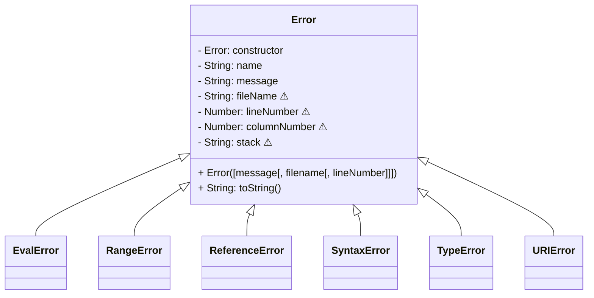

# 17. Exceptions

[toc]

---

## 17.1. Introduction

Errors are a part of coding. As programmers, we occasionally make mistakes, and do our best to correct them by reading different resources, examining a list of error messages (also called the **stacktrace**), or asking for help.

Earlier in this course, ==we learned about two different types of errors: Runtime and logic. A **logic error** is when your program executes without breaking, but doesn't behave the way you though it would. These errors usually require you to consider how you are going about solving the issue to resolve. **Runtime errors** are when your program doesn't run correctly and an *exception* is raised.==

==An **exception** is a runtime error in which a *name* and a *message* are displayed to provide more information about the error.==

### 17.1.1. Exceptions and Errors

In JavaScript, a *runtime error* and an *exception* are the same thing and can be used interchangeably. This can cause confusion because logic errors can not be represented by exceptions.

### 17.1.2. `Error` Object

Remember this diagram from [Chapter 6](06.Errors%20and%20Debugging.md)?



==When a runtime error (<abbr title="also known as">a.k.a.</abbr> exception) is raised, JavaScript returns an `Error` object. An **`Error` Object** has two properties: a *name* and a *message*. The name refers to the type of error that occured, while the message gives the user information on why that exception occured.==

JavaScript has built-in execeptions, with pre-defined names and messages, however JavaScript also gives you the ability to create your own error messages. You've undoubtedly experienced various exceptions already through this class. Let's look at a few common exceptions.

### 17.1.3. Common Exceptions

JavaSCript has some built-in exceptions ou may have already encountered. One of the most ocmoon errors in JavaScript is ==a **`SyntaxError`** which is thrown when we include a symbol JavaScript is not expecting.==

> **Example**:
>
> ```js
> console.log("This is" an example);
> ```
>
> ```
> SyntaxError: missing ) after argument list
> ```
>
> We put our second quotation mark in the wrong place. JavaScript does not know what to do with the second half of our phrase and throws a `SyntaxError` with the message: `missing ) after argument list`.

==A **`ReferenceError`** is thrown when we try to use a variable that has not been defined yet.==

> **Example**:
>
> ```js
> console.log(x[0]);
> ```
>
> ```
> ReferenceError: x is not defined
> ```
>
> We attempted to print out our first element in the variable `x`, but we never declared `x`. JavaScript throws a `ReferenceError` with the message: `x is not defined`.

==A **TypeError** is thrown when JavaScript expects something to be one type, but the provided value is a different type.==

> **Example**:
>
> ```js
> const a = "Launch";
> 
> a = "Code";
> ```
>
> ```
> TypeError: invalid assignment to const 'a'
> ```
>
> In this case, we declared a constant on the string `"Launch"`, and then tried to change the immutable variable to `"Code"`. JavaScript throws a `TypeError` with the message `invalid assignment to consts 'a'`.

Exceptions give us a way to provide more inforomation on how something went wrong. JavaScript's built-in exceptions are regularly used in the debugin process.

There are more built-in Exceptions in Javascript and you can read more about them on ==[MDN](https://developer.mozilla.org/en-US/docs/Web/JavaScript/Reference/Errors)== and [W3Schools](https://www.w3schools.com/js/js_errors.asp).

> :reminder_ribbon: **TODO**: Integrate the content from this page on [MDN](https://developer.mozilla.org/en-US/docs/Web/JavaScript/Reference/Errors) with my notes later. So many good examples of common errors!

### 17.1.4. Check Your Understanding :white_check_mark:

> :question: **Question**: What is the difference between a runtime error, and a logic error?
>
> :exclamation: **Answer**: A runtime error happens when your program doesn't run correctly and an *exception* is raised. A logic error is when your program executes without breaking, but doesn't behave the way you though it would.

> :question: **Question**: What are some of the common errors included in JavaScript?
>
> :exclamation: **Answer**:
>
> * SyntaxError - thrown when we include a symbol JavaScript is not expecting
> * ReferenceError - thrown when we try to use a variable that has not been defined yet
> * TypeError - thrown when JavaScript expects something to be one type, but the provided value is a different type

## 17.2. `throw`

In most programming languages, when the compiler or interpreter encounteres code it does not know how to handle, it **throws** and exception. This is how the compiler notifies the programmer that something has gone wrong. Throwing an exception is also know as *raising* and exception.

JavaSCript gives us the ability to raise exceptions using the **`throw`** statement. One reason to throw exceptions is if your code is being used in an unexpected way.

### 17.2.1. Throw Default Error

We can throw an default error by using the `throw` statement and passing in a string description as an argument.

> **Example**: ([Link](https://repl.it/@launchcode/throw-example))
>
> ```js
> throw Error("You cannot divide by zero!");
> ```
>
> ```
> Error: You cannot divide by zero!
>     at /home/runner/yb8omk3oa3r/index.js:1:7
>     at Script.runInContext (vm.js:133:20)
>     at Object.<anonymous> (/run_dir/interp.js:156:20)
>     at Module._compile (internal/modules/cjs/loader.js:778:30)
>     at Object.Module._extensions..js (internal/modules/cjs/loader.js:789:10)
>     at Module.load (internal/modules/cjs/loader.js:653:32)
>     at tryModuleLoad (internal/modules/cjs/loader.js:593:12)
>     at Function.Module._load (internal/modules/cjs/loader.js:585:3)
>     at Function.Module.runMain (internal/modules/cjs/loader.js:831:12)
> ```
>
> The error text displays the error name, and it contains details about where the error was thrown. The text `at /home/runner/yb8omk3oa3r/index.js:1:7` indicates that the error as thrown from line 1, which we know is true because our example only had one line of code in it.

### 17.2.2. Pre-existing Error

JavaScript also gives us the power to throw a more specific type of error.

> **Example**:
>
> ```js
> throw SyntaxError("That is the incorrect syntax");
> ```
>
> ```
> SyntaxError: That is the incorrect syntax
> ```
>
> JavaScript gives us flexibility by allowing us to raise standard library errors and to define our own errors. We can use exceptions to allow our program to break and provide useful information as to why something wen wrong.

### 17.2.3. Custom Error

JavaScript will also let you define new types of Errors. You may find this helpful in the future, however, that goes beyond the scode of this class.

> :reminder_ribbon: **TODO**: Explore this in the future.

### 17.2.4. Check Your Understanding :white_check_mark:

> :question: **Question**: Waht statement do we use to raise an exception?
>
> :exclamation: **Answer**: `throw`

> :question: **Question**: How do we customize the message of an exception?
>
> :exclamation: **Answer**: Write a string inside the Error object describing what it is for.

## 17.3. Exceptions as Control Flow

Runtime errors occur as the program runs, and they are also called exceptions. Exceptions are caused by referencing undeclared variables and invalid or unexpected data.

### 17.3.1. Control Flow

==The **control flow** of a program is the order in which the statements are executed.== Normal control flow runs from top to bottom of a file. An exception breaks the normal flow and stops the program. A stopped program can no longer interact with the user. Luckly, JavaScript provided a way to anticipate and handle exceptions.

### 17.3.2. Catching an Exception

JavaScript provides **`try`** and **`catch`** statements that allow us to keep our programs running even if there is an exception. We can tell Javascript to *try* to run a block of code, and if an exception is thrown, to *catch* the exception and run a specific block of code. Anticipating nd catching the execption makes the exception now part of the control flow.

> :information_source: **NOTE**: Catching and exception is also know as *handling* an exception, or **exception handling**.

> :reminder_ribbon: **TODO**: Copy the example at the end of this section later.

> :bulb: **Tip**: `catch` blocks only execute if an exception is thrown.

### 17.3.3. `finally`

JavaScript also provides a **`finally`** block which can be used with `try` and `catch` blocks. A `finally` block runs after the `try` and `catch`. What is special about `finally` is that `finally` code block ALWAYS runs, even if an exception is NOT thrown.

> :reminder_ribbon: **TODO**: Copy the example at the end of this section later also.

### 17.3.4. Check Your Understanding :white_check_mark:

> :question: **Question**: What statement do we use if we want to attempt to run code, but think an exception might be thrown?
> a. `catch`
> b. `try`
> c. `throw`
> d. `finally`
>
> :exclamation: **Answer**: b.

> :question: **Question**: How do you handle and exception that is thrown?
> a. With code placed within the `try` block.
> b. With code placed within the `catch` block.
> c. With code placed within a `throw` statement.
> d. With code placed within the `finally` block.
>
> :exclamation: **Answer**:

> :question: **Question**: What statement do you use to ensure a code block is executed regardless if an exception was thrown?
> a. `throw`
> b. `catch`
> c. `try`
> d. `finally`
>
> :exclamation: **Answer**: d.

## 17.4. Exercises :runner:

> :x: Censored

### 17.4.1. Zero Division: `throw`

### 17.4.2. Test Student Labs

## 17.5. Studio: Strategic Debugging :studio_microphone:

> :x: Censored

### 17.5.1. Summary

### 17.5.2. Activity

### 17.5.3. Debugging Process

:checkered_flag: **Another short chapter! Now for something big: [Classes](18.Classes.md)!**

---

#LaunchCode

