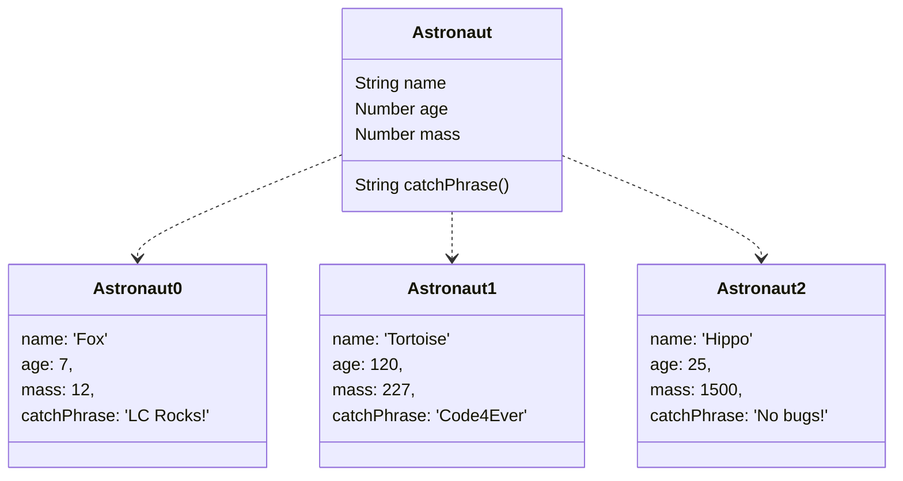
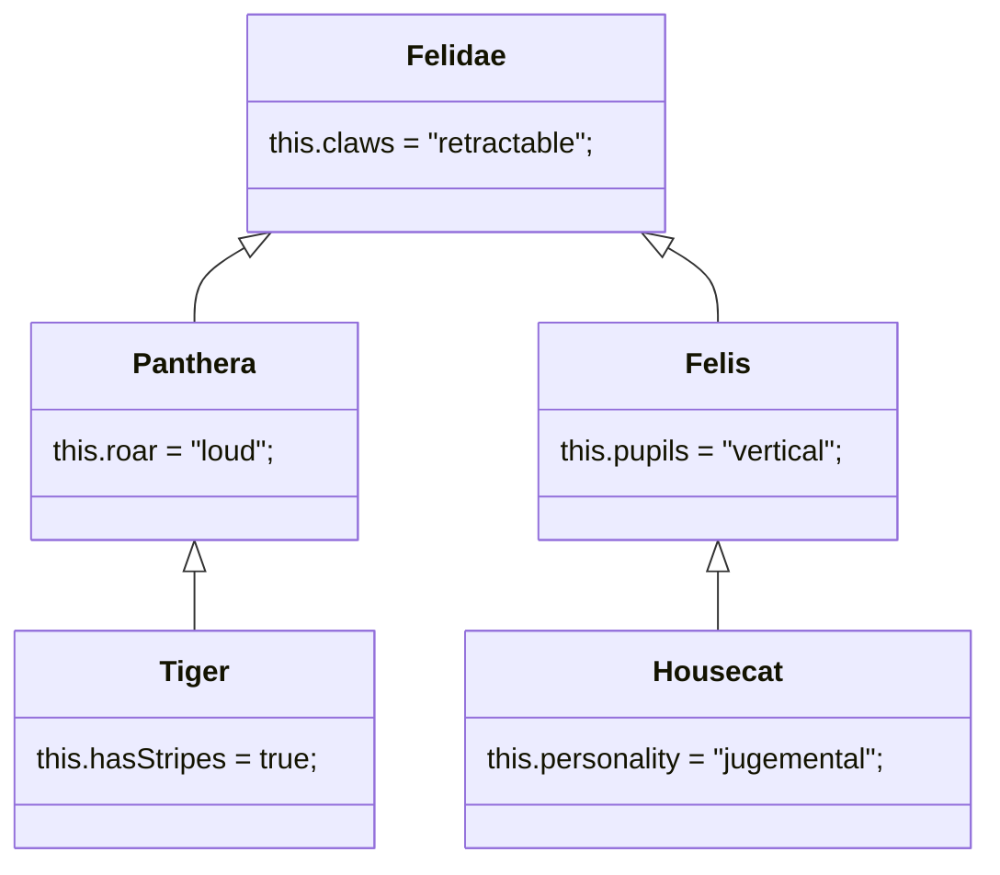

# 18. Classes

[toc]

---

> :runner: **RUSH!** Some stuff was skipped because a a lack of time. We'll go back eventually and fill in some of the blanks.

## 18.1 What Are Classes

Recall that ==objects are and data structures  that hold many values which consist of *properties* and *methods*.==

We often need to create many objects of the same *type*. To do this in an efficient way, we define a **class**, which allows us to set up the general structure for an object. We can then reuse that structure to buil multiple objects. These objects all have the same set of *keys*, but will have various *values* assigned to each key.

### 18.1.1. An Astronaut Object

Let's revisit the animal astronauts from earlier exercises.

When we create an object to hold an astronaut's data, it might look something like:

```js
let fox = {
    name: 'Fox',
    age: 7,
    mass: 12,
    catchPhrase: function(repeats){
        let phrase = 'LaunchCode';
        for (let i = 0; i < repeats; i++){
            phrase += ' Rocks';
        }
        returns phrase;
    }
}

console.log(`${fox.name} is ${fox.age} years old and has a mass of ${fox.mass} kg.`);
console.log(`${fox.name} says, "${fox.catchPhrase(3)}."`);
```

```
Fox is 7 years old and has a mass of 12 kg.
Fox says, "LaunchCode Rocks Rocks Rocks."
```

The `fox` object contains all the data and functions for the astronaut named `'Fox'`.

Of course, we have multiple astronauts on our team. To store data for each one, we would need to copy the structure for `fox` multiple times and then change the values to suit each crew member. This is inefficient and repetitive.

By letting us define our ouw classes, JavaScript provides a better way to create multiple similar objects.



## 18.2. Declaring and Calling a Class

### 18.2.1. Creating a Class

Just like the `function` keyword defines a new function, the **`class`** keyword defines a new class. By convention, a class name starts with a capital leader to distinguish them from JavaScript function and variable names. Class names are in *title case* (`MyClassName`) where as methods and properties are in camel case (`myFunctionName`).

Remember that ==classes are blueprints for building muiltiple objects of the same type.== The general forma for delcaring a class is:

```js
class ClassName {
    constructor(parameters){
        // assign properties
    }
    // define methods
}
```

Note the keyword **`constructor`**. This is a special method for creating objects of the same type, and it assigns the key-value pairs. Parameters are passed into `constructor` rather than the `class` declaration.

#### 18.2.1.1. Assigning Properties

Let's set up an `Astronaut` class to help us store data about our animal crew. Each animal has a `name`, `age`, and `mass`, and we assign these properties in the constructor as follows:

```js
class Astronaut {
    constructor(name, age, mass){
        this.name = name;
        this.age = age;
        this.mass = mass;
    }
}
```

The **`this`** keyword defines a key-value pair, where the text attached to `this` becomes the key, and the value follows the equal sign (`this.key = value`).

`constructor` uses the three `this` statements (`this.name = name`, etc.) to achieve the same results as the object declaration `let objectName = {name: someName, age: someNumber, mass: someMass }`. Each time the `Astronaut` class is called, `constructor` builds an object with the same set of keys, but assigns different values to the keys based on the arguments.

> :information_source: **NOTE**: Each class requires ***one*** `constructor`. Including more than one `constructor` results in a syntax error. If `constructor` is left out of a class declaration, JavaScript adds an empty `constructor(){}` automatically.

### 18.2.2. Creating a New Class Object

To create an object from a class, we use the `new` keyword.

```js
let objectName = new ClassName(arguments);
```

`new` create an **instance** of a class, which means that the object generated shared the same set of keys as every other object made from the class. However, the values assigned to key may differ.

> **Example**: Let's create an object for two of our crew members: Fox and Hippo.
>
> ```js
> class Astronaut {
>     constructor(name, age, mass){
>         this.name = name;
>         this.age = age;
>         this.mass = mass;
>     }
> }
> 
> let fox = new Astronaut('Fox',7,12);
> let hippo = new Astronaut('Hippo',25,1500);
> 
> console.log(typeof hippo, typeof fox);	// "object object"
> 
> console.log(hippo,fox);
> ```
>
> ```
> object object
> Astronaut { name: 'Hippo', age: 25, mass: 1500 }
> Astronaut { name: 'Fox', age: 7, mass: 12 }
> ```

In lines 9 and 10, we call the `Astronaut` class twice and pass in different sets of arguments, creating the `fox` and `hippo` objects.

The output of line 14 shows that `fox` and `hippo` are bot the same *type* of object (`Astronaut`). The two share the same *keys*, but they have different values assigned to those keys.

> **Note**: Two object created from the same class are NOT equal, even if the keys within the objects have the same values. We discussed this previously back in Chapter 12. :reminder_ribbon:

After creating an `Astronaut` object, we can access, modify, or add new key-value pairs as described in Chapter 12.

> **Try it**: Play around with modifying and adding properties inside and outside of the `class` declaration. [repl.it](https://repl.it/@launchcode/classExamples01)
>
> ```js
> class Astronaut {
>    constructor(name, age, mass){
>       this.name = name;
>       this.age = age;
>       this.mass = mass;
>    }
> }
> 
> let fox = new Astronaut('Fox', 7, 12);
> 
> console.log(fox);
> console.log(fox.age, fox.color);
> 
> fox.age = 9;
> fox.color = 'red';
> 
> console.log(fox);
> console.log(fox.age, fox.color);
> ```
>
> ```
> Astronaut { name: 'Fox', age: 7, mass: 12 }
> 7 undefined
> Astronaut { name: 'Fox', age: 9, mass: 12, color: 'red' }
> 9 'red'
> ```

Attempting to print `fox.color` in line 12 returns `undefined`, since that property is not included in the `Astronaut` class. Line 15 adds the `color` property to the `fox` object, but this change will not affect any other objects created with `Astronaut`.

#### 18.2.2.1. Setting Default Values

What happens if we create a new `Astronaut` without passing in all of the required arguments?

>  **Try it!** [repl.it](https://repl.it/@launchcode/classExamples02)
>
> ```js
> class Astronaut {
>    constructor(name, age, mass){
>       this.name = name;
>       this.age = age;
>       this.mass = mass;
>    }
> }
> 
> let tortoise = new Astronaut('Speedy', 120);
> 
> console.log(tortoise.name, tortoise.age, tortoise.mass);
> ```
>
> ```
> Speedy 120 undefined
> ```

To avoid issues with missing arguments, we can set a *default* value for a parameter as follows:

```js
class Astronaut {
   constructor(name, age, mass = 54){
      this.name = name;
      this.age = age;
      this.mass = mass;
   }
}
```

Now if we call `Astronaut` but do not specify a mass value, the constructor automatically assigns a value of 54. If an argument is included for `mass`, then the default value is ignored.

### 18.2.3. Check Your Understanding :white_check_mark:

The questions below refer to a class called `Car`.

```js
class Car {
   constructor(make, model, year, color, mpg){
      this.make = make;
      this.model = model;
      this.year = year;
      this.color = color;
      this.mpg = mpg;
   }
}
```

> :question: **Question**: If we call the class with `let myCar = new Car('Chevy', 'Astro', 1985, 'gray', 20)`, what is the output by `console.log(typeof myCar.year)`?
>
> a. `object`
> b. `string`
> c. `function`
> d. `number`
> e. `property`
>
> :exclamation: **Answer**: d.

> :question: **Question**: If we call the class with `let myCar = new Car('Tesla', 'Model S', 2019)`, what is output by `console.log(myCar)`?
>
> a. `Car {make: 'Tesla', model: 'Model S', year: 2019, color: undefined, mpg: undefined }`
> b. `Car {make: 'Tesla', model: 'Model S', year: 2019, color: '', mpg: '' }`
> c. `Car {make: 'Tesla', model: 'Model S', year: 2019 }`
>
> :exclamation: **Answer**: a.

## 18.3. Assigning Class Methods

Just as with objects, we may want to add methods to our classes in addition to properties. So far, we have learned how to set values of the class's properties inside the `constructor`.

When assigning methods in classes, we can either create them *outside* or *inside* the `constructor`.

### 18.3.1. Assigning Methods Outside `constructor`

When assigning methods outside of the `constructor`, we simply declare our methods the same way we would normally do for [objects](12.Objects%20and%20Math.md).

```js
class ClassName {
    constructor(parameters){
        // assign properties with this.key = value;
    }
    methodName(parameters){
        // function code
    }
}
```

> **Example**:
>
> ```js
> class Astronaut {
>    constructor(name, age, mass){
>       this.name = name;
>       this.age = age;
>       this.mass = mass;
>    }
> 
>    reportStats() {
>       let stats = `${this.name} is ${this.age} years old and has a mass of ${this.mass} kg.`;
>       return stats;
>    }
> }
> 
> let fox = new Astronaut('Fox', 7, 12);
> console.log(fox.reportStats());
> ```
>
> ```
> Fox is 7 years old and has a mass of 12 kg.
> ```
>
> We declared or method, `reportStats()` outside of the constructor. When we delare a new instance of the `Astronaut` class, we can use the `reportStats()` method to return a concise string containing all of the info we would need about an astronaut.

### 18.3.2. Assigning Methods Inside `constructor`

When declaring methods inside the `constructor`, we need to make use of the `this` keyword, just as we would with or properties.

```js
class ClassName {
    constructor(parameters){
        this.methodName = function(parameters){
            // function code
        }
    }
}
```

> **Example**: Let's consider the `Astronaut` class that we have been working with. When assigning the method `reportStats()`, inside the `constructor`, we would do so like this:
>
> ```js
> class Astronaut {
>    constructor(name, age, mass){
>       this.name = name;
>       this.age = age;
>       this.mass = mass;
>       this.reportStats = function() {
>          let stats = `${this.name} is ${this.age} years old and has a mass of ${this.mass} kg.`;
>          return stats;
>       }
>    }
> }
> 
> let fox = new Astronaut('Fox', 7, 12);
> 
> console.log(fox.reportStats());
> ```
>
> ```
> Fox is 7 years old and has a mass of 12 kg.
> ```
>
> Initially, this may see to produce teh same result as assigning `reportStats()` outside the constructor. We will weigh the prose and cons of both methods below.

### 18.3.3. Which Way Is Preferred?

> **Try It!**: Try comparing the outputs of `fox` and `hippo` to see the effect of assigning a method *inside* the constructor versus *outside* the constructor. [Link](https://repl.it/@launchcode/ClassMethodsTryIt)
>
> ```js
> // Here we assign the method inside the constructor
> class AstronautI {
>    constructor(name, age, mass){
>       this.name = name;
>       this.age = age;
>       this.mass = mass;
>       this.reportStats = function() {
>          let stats = `${this.name} is ${this.age} years old and has a mass of ${this.mass} kg.`;
>          return stats;
>       }
>    }
> }
> 
> // Here we assign the method outside of the constructor
> class AstronautO {
>    constructor(name, age, mass){
>       this.name = name;
>       this.age = age;
>       this.mass = mass;
>    }
> 
>    reportStats() {
>       let stats = `${this.name} is ${this.age} years old and has a mass of ${this.mass} kg.`;
>       return stats;
>    }
> }
> 
> let fox = new AstronautI('Fox', 7, 12);
> let hippo = new AstronautO('Hippo', 25, 1000);
> 
> console.log(fox);
> console.log(hippo);
> ```

IN the case of assigning the method *inside* the constructor, each `Astronaut` object carries around the code for `reportStatus()`. With today's computers, this is a relatively minor concern. However, each `Astronaut` has extra code that may not be needed. This consumes memory, which you need to consider since today's businesses want efficient code that doesn't tax their systems.

Plus there could be the possibly you could be working at some company that is *still* using [Windows XP](https://www.extremetech.com/computing/289440-microsoft-xp-is-finally-dead-nearly-18-years-post-launch) (and [*STILL* won't let it die!](https://windowsreport.com/keep-using-windows-xp/)), still [stores all their data in COBOL](https://thehill.com/homenews/news/491526-nj-seeking-help-from-cobol-programmers-in-coronavirus-fight), and is run by some guy who has been there so long he remembers when <abbr title="International Business Machines">IBM</abbr> used to be called <abbr title="Computer-Tabulating-Recording Company">CTR</abbr>.

Because of this (and that other stuff), if a method is the same for ALL objects of a class, define that method *outside* of the constructor. Each object does not need a copy of identical code. Therefore, the declaration of a method outside of the constructor will not consume as much memory.

> **NERD NOTE**: I'm not sure why, but the prhase "late binding" popped into my head here. It's probaby not relevant here, but it is something to research later.

### 18.3.4. Check Your Understanding :white_check_mark:

## 18.4. Inheritance

> Elsa: "I knew it was you. You have your father's eyes."
>
> Indiana: "And my mother's ears, but the rest belongs to you."
>
> --*Indiana Jones and the Last Crusade* (1989)

**Object-oriented programming** (OOP), is a *software paradigm* (type of software design, or more appropriately a software design method) where the codebase is organized around *objects* and *classes*. Objects contain the functions and the central logic of a program.


OOP stands on top of four principals: abstraction, polymorphism, encapsulation, and inheritance.

We will dive into inheritance now and work with the other three principles in Unit TWo of this class.

**Inheritance** refers to the ability of one class to acquire properties and methods from another.

Think of it this way, in the animal kingdom, a *species* is a unique entity that inherits traits from its *genus*. The *genus* also has unique properties, but inherits traits from its *family*. For example, a tiger and a house cat are two different species, however they share similar traits such as retractable claws. The two cats inherted their similar traits from their shared family, *felidae*.

> 🧪 **SCIENCE NOTE**: [Taxonomic rank](https://en.wikipedia.org/wiki/Taxonomic_rank) is way more complicated than this example.

Using inheritance in programming, we can create a structure of classes that inherit properties and methods from other classes.

If we wanted to program classes for our tiger and housecat, we could create a felidae class for the family. We would then create two classes for the panthera genus and the felis genius. We would create classes for the tiger and housecat species as well. The species classes would inherit properties and methods from the genus classes and the genus classes would inherit properties and methods from the family class.



> 🧜‍♀️ **MERMAID NOTE**: Normally we would use `hasStripes = true` instead of `this.hasStripes = true;` in UML Class diagrams, but in the above class diagram, I am making an exception.

The classes inheriting properties and methods are **child classes**, and the classes passing down properties and methods are **parent classes**.

> **UML NOTE**: As strange as it looks in a UML class diagram, the arrows indicating inheritance ALWAYS point from the child class to the parent class, and parents should generally be above their children whenever possible.

### 18.4.1. `extends`

When designating a class as the child class of another class in JavaScript, we use the **`extends`** keyword. We must also use the **`super()`** constructor to get the properties and methods from the parent class.

```js
class ChildClass extends ParentClass {
    constructor(){
        super();
        // properties
    }
}
```

In the case of a tiger, tigers have stripes, but they also have a loud roar! Their ability to roar loudly is a trait shared with other members of the *panthera* genus. Tigers also get their retractable claws from the *felidae* family.

> **Example** (more like ***Try It!***): [Link](https://repl.it/@launchcode/InheritanceTryIt)
>
> ```js
> class Felidae {
>    constructor() {
>       this.claws = "retractable";
>    }
> }
> 
> class Panthera extends Felidae {
>    constructor() {
>       super();
>       this.roar = "loud";
>    }
> }
> 
> class Tiger extends Panthera {
>    constructor() {
>       super();
>       this.hasStripes = "true";
>    }
> }
> 
> let tigger = new Tiger();
> 
> console.log(tigger);
> ```
>
> When creating the classes for our tiger, we can use the `extends` keyword to set up `Tiger` as the child class of `Panthera`. The `Tiger` class inherits the property `roar` from the `Panthera` class and has an additional property `hasStripes`.

> **NOTE**: The `extends` keyword is not supported in Internet Explorer. On the other hand, why would anyone use Internet Explorer?

### 18.4.2. Check Your Understanding :white_check_mark:

## 18.5. Exercises: Classes :runner:

## 18.6. Studio: Classes :studio_microphone:

### 18.6.1. Before You Start

### 18.6.2. Getting Started

### 18.6.3. Part 1 -- Add Class Properties

### 18.6.4. Part 2 -- Add First Class Method

### 18.6.5. Part 3 -- Add More Methods

#### 18.6.5.1. Calculating the Test Average

#### 18.6.5.2. Determining Candidate Status

### 18.6.6. Part 4 -- Play a Bit


---

#LaunchCode

