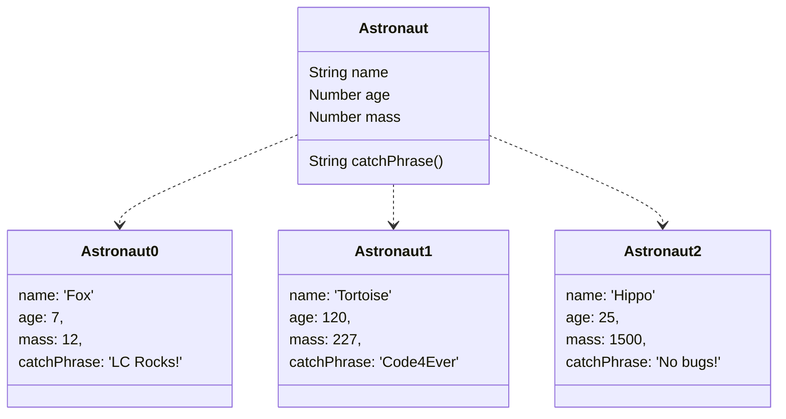

# 18. Classes

[toc]

---

## 18.1 What Are Classes

Recall that ==objects are and data structures  that hold many values which consist of *properties* and *methods*.==

We often need to create many objects of the same *type*. To do this in an efficient way, we define a **class**, which allows us to set up the general structure for an object. We can then reuse that structure to buil multiple objects. These objects all have the same set of *keys*, but will have various *values* assigned to each key.

### 18.1.1. An Astronaut Object

Let's revisit the animal astronauts from earlier exercises.

When we create an object to hold an astronaut's data, it might look something like:

```js
let fox = {
    name: 'Fox',
    age: 7,
    mass: 12,
    catchPhrase: function(repeats){
        let phrase = 'LaunchCode';
        for (let i = 0; i < repeats; i++){
            phrase += ' Rocks';
        }
        returns phrase;
    }
}

console.log(`${fox.name} is ${fox.age} years old and has a mass of ${fox.mass} kg.`);
console.log(`${fox.name} says, "${fox.catchPhrase(3)}."`);
```

```
Fox is 7 years old and has a mass of 12 kg.
Fox says, "LaunchCode Rocks Rocks Rocks."
```

The `fox` object contains all the data and functions for the astronaut named `'Fox'`.

Of course, we have multiple astronauts on our team. To store data for each one, we would need to copy the structure for `fox` multiple times and then change the values to suit each crew member. This is inefficient and repetitive.

By letting us define our ouw classes, JavaScript provides a better way to create multiple similar objects.



## 18.2. Declaring and Calling a Class

### 18.2.1. Creating a Class

Just like the `function` keyword defines a new function, the **`class`** keyword defines a new class. By convention, a class name starts with a capital leader to distinguish them from JavaScript function and variable names. Class names are in *title case* (`MyClassName`) where as methods and properties are in camel case (`myFunctionName`).

Remember that ==classes are blueprints for building muiltiple objects of the same type.== The general forma for delcaring a class is:

```js
class ClassName {
    constructor(parameters){
        // assign properties
    }
    // define methods
}
```

Note the keyword **`constructor`**. This is a special method for creating objects of the same type, and it assigns the key-value pairs. Parameters are passed into `constructor` rather than the `class` declaration.

#### 18.2.1.1. Assigning Properties

Let's set up an `Astronaut` class to help us store data about our animal crew. Each animal has a `name`, `age`, and `mass`, and we assign these properties in the constructor as follows:

```js
class Astronaut {
    constructor(name, age, mass){
        this.name = name;
        this.age = age;
        this.mass = mass;
    }
}
```

The **`this`** keyword defines a key-value pair, where the text attached to `this` becomes the key, and the value floows the equal sign (`this.key = value`).

`constructor` uses the three `this` statements (`this.name = name`, etc.) to achieve the same results as the object declaration `let objectName = {name: someName, age: someNumber, mass: someMass }`. Each time the `Astronaut` class is called, `constructor` builds an object with the same set of keys, but assigns different values to the keys based on the arguments.

> :information_source: **NOTE**: Each class requires ***one*** `constructor`. Including more than one `constructor` results in a syntax error. If `constructor` is left out of a class delcaration, JavaScript adds an empty `constructor(){}` automatically.

### 18.2.2. Creating a New Class Object

#### 18.2.2.1. Setting Default Values

### 18.2.3. Check Your Understanding :white_check_mark:

## 18.3. Assigning Class Methods

### 18.3.1. Assigning Methods Outside `constructor`

### 18.3.2. Assigning Methods Inside `constructor`

### 18.3.3. Which Way Is Preferred?

### 18.3.4. Check Your Understanding :white_check_mark:

## 18.4. Inheritance

### 18.4.1. `extends`

### 18.4.2. Check Your Understanding :white_check_mark:

## 18.5. Exercises: Classes :runner:

## 18.6. Studio: Classes :studio_microphone:

### 18.6.1. Before You Start

### 18.6.2. Getting Started

### 18.6.3. Part 1 -- Add Class Properties

### 18.6.4. Part 2 -- Add First Class Method

### 18.6.5. Part 3 -- Add More Methods

#### 18.6.5.1. Calculating the Test Average

#### 18.6.5.2. Determining Candidate Status

### 18.6.6. Part 4 -- Play a Bit


---

#LaunchCode

