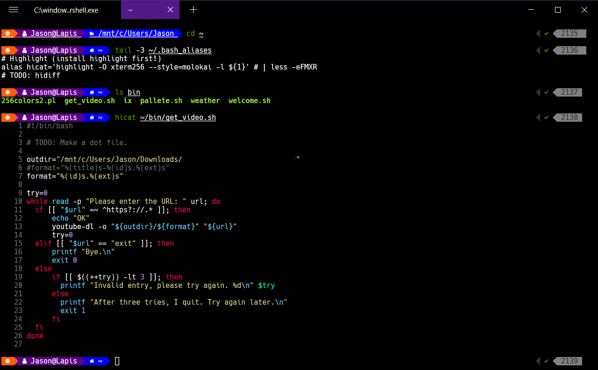

# 19. Terminal

[toc]

---

> :information_source: **NOTE**: Check out my Linux Guide (coming soon)

## 19.1. What is a terminal?



> :information_source: **NOTE**: :x: Censored: part of line 5 in the example in the image was removed. It had a directory from a previous job I had.

### 19.1.1. GUIs and CLIs

Most of the time when we use our computers, we do so thorugh a **graphical user interface** (**GUI**) (pronounced "goo-ee"). ==A GUI is a system designed with icons and visual representation of the machine's fiel systems.==

Programmers often use another kind of interface called the *command line*. A **command line interface** (**CLI**) (pronounced "see-el-eye"), uses *textual commands*, rather than dragging and dropping icons, to give the computer instructions.

The applicaton responsible for running a CLI is called a **terminal** and the program interpreting the commands is called the **shell**.

> :information_source: **NOTE**: The terms "command line", "terminal", and "shell" are often used interchageably, at least by the author of this book. I will try to strive to use them more appropriately as much as possible.

### 19.1.2. Why use the terminal?

Both of the images above represent the same file structure. While the GUI may appearn more user-friendly, as you grow more familiar with the commands available, you'll find there can be advantages to using the terminal.

In the terminal, you'll be able to:

* quickly move through your computer's file structure.
* make new files and directories
* remove items from folders
* install software
* open programs
* run programs directly

### 19.1.3. Setup the Terminal

> :reminder_ribbon: **TODO**: Insert instructions for each file system.

The command line is a vital took to learn for any programmer. Over the course of this program and your carreer, you will find yourself navigating to it frequenly.

#### Linux Users 🐧

If you are using a Linux system, you don't really need to do anything. However there are a few things you should probably install based on what **distribution** you are using.  A distribution is basically the flavor of which LInux was interpreted. I'll list three of them in the next paragraph.

Software is installed in *packages* which are often maintained by a software called a *package manager*.  On Arch Linux and Manjaro Linux distributions, the package manager is called **`pacman`**. On Debian, Ubuntu, and Raspbian Linux distributions, the package manager is called **`apt`**. On Red Hat and Fedora Linux distributions, the package manager is called **`dnf`**.  In the older days, Red Hat and Fedora distributions were managed by another program called **`rpm`**, but that has since changed.

Fortunately, the folks at Arch Linux provided some what of a ["Rosetta Stone"](https://wiki.archlinux.org/index.php/Pacman/Rosetta) of installation commands which can help interpret what each command is for.

For new users, Ubuntu is a good fit, but for more experienced Linux users, especially those who really want to customize everything, Manjaro is a better choice. Manjaro was created because Arch Linux leaves it up to the users to install everything, which might not be a good idea if you are not familar with Linux. Manjaro is trying to fix that.

Raspbian is a version of Ubuntu (which was based in Debian) intended for use with the Raspberry Pi. Until the Raspberry Pi 4 came around, Raspbian was one of the last few distributions for 32-bit systems because the hardware architecture of Raspberry Pis uses a special set of microprocessors created by a company called ARM.

I recommend giving Raspberry Pi, espeically if you want to learn about things like Secure Shell (**`ssh`**) and networking between computers. But all that is beyond the scope of LC101.

#### Mac Users :apple:

Despite what the instructions for this course says, the Mac options isn't as simple as "Good news! The Terminal application comes with every Mac!" More so if it asks questions like "Do you want the terminal to access [insert directory name here]" in some pop-up, which kinds disrups the work flow.

Still you can access the Terminal application in two ways:

##### Through the Finder

1. Open a new Finder window and navigate to the Applications folder.
2. Open the Applications folder, navigate to the Utilities folder.
3. Open the Utilities folder, inside is the Terminal application.
4. Add the Terminal to your Dock
5. Open the Terminal

##### Through LaunchPad

1. If you prefere to use the LaunchPad program, you can press F4.
2. Look in the Other or Utilities folder and look for the Terminal.
3. Add the Terminal to your Dock
4. Open the Terminal

#### Windows Users 🚪

Windows has moved away from the classic "command prompt" (`cmd.exe`) to a new program called **PowerShell**. It sucks.  In classic Microsoft motivation, PowerShell is basically Microsoft's attempt to make their own version of a Linux-style command prompt which would include all their terrible ".Net" (dot-net) nonsense to appeal tho the Mac Users who were trying to mimic Linux users.

There are a few options however to make the command line experience so much more bearable:

##### Install Chocolatey

For almost all the options below, I recommend installing Chocolatey.

 [**Chocolatey**](https://chocolatey.org/) is an unofficial package manager for Windows, but it will provide you with some experience using package managers like the ones that Linux uses.

FIrst we will need to install Chocolatey.  We recommend you have adminstrative access to Powershell. Type `Window Key + X` then scroll to `Windows Powershell (Adminstrative)`. You can also type into the search bar `Powershell` where there should be an option where you can `Run as Adminstrator`. You may get a security prompt. Click `Yes`.

YOu will then need to run this command. Select it all!

```powershell
Set-ExecutionPolicy Bypass -Scope Process -Force; [System.Net.ServicePointManager]::SecurityProtocol = [System.Net.ServicePointManager]::SecurityProtocol -bor 3072; iex ((New-Object System.Net.WebClient).DownloadString('https://chocolatey.org/install.ps1'))
```

This command bypasses the security restrictions. The full story can be found on the [Chocolatey install page](https://chocolatey.org/install).

It may take a while for Chocolatey to install, but when it is done, we can install software using the **`choco`** command.

If you want to install Node, Git Bash, or VS Code for Windows, I would highly recommend using Chocolatey for that even though it is in the PowerShell.

```powershell
choco install nodejs-lts
choco install git
choco install github-desktop
choco install vscode
```

Or install them all at once!

```powershell
choco install -y nodejs-lts git github-desktop vscode
```

##### WSL

Seeing as how Powershell wasn't really that appealing, Microsoft gave up and decided to go a new direction that has actually been more appealing but still has many faults: **Window Subsystem for Linux** (**WSL**).

In order ot use WSL, ==you need Windows 10==. You can install it using [the directions from this page](https://docs.microsoft.com/en-us/windows/wsl/install-win10).

There is a downside to this way:

1. You are stuck with a handful of common distros, and those distros likely won't be updated. Installed WSL back in 2018, used Ubuntu distro (which is still 18.04) and Microsoft *still* hasn't provided a new version of this distribution.
2. You could be installing the software redundantly. You could find yourself installing a version of a program you installed for Windows installed again for Linux.
3. Using WSL to interact with windows on stuff can be problematic.  While you can access it through the shell (Your Windows user directory can be access via `/mnt/c/Users/${username}`), manipulating files this way can be a problem.

##### Git Bash

Another option is that you can do is use **Git Bash**. Git Bash is part of the [Windows version of Git](https://gitforwindows.org/).  It provides a *minimal* version of Linux-bash functinaly using a program called [MinGW](https://sourceforge.net/projects/mingw-w64/). This version of MinGW is intended for use with an open source C/C++ compiler called [GCC](https://gcc.gnu.org/).

There is one advantage to using Git Bash.  When Microsoft bough Github in 2018 (much to the chagrin of a lot of open source software advocates), it also meant that Microsoft wanted to use some of Git Bash's assest to create [Visual Studio Code](https://code.visualstudio.com/) (VSCode).  Github was working on their own *independent development environment* (IDE) called [Atom](https://atom.io/), which was using Node.js (which mean Node integration) but it was also using [Electron](https://www.electronjs.org/) (which was kinda clunky at the time).

VSCode users have the option to use Git Bash instead of Powershell as integrated terminal, which is recommended considering now you have the ability to use Git (with Github's extra features) and Node (provided you installed in for Windows).

If you do go this route, I recommend installing VSCode, Git for Windows, and Node using Chocolatey.

While you can access Chocolatey in Git Bash, you CANNOT install or upgrade packages from it. You have to use an *ADMINSTRATIVE* PowerShell to install software from Chocolatey just as you would need adminstrative access to install software on Windows.

> :reminder_ribbon: **TODO**: Add instructions for integrating Git Bash with VSCode later.

##### MSYS2

[**MSYS2**](https://www.msys2.org/) is another solution.  Microsoft doesn't like this one namely because they're not involved.

MSYS2 was actually the main compontent in early program called Cygwin that provided an open source environment for Windows.

We will still need to install it with Chocolatey. However, the advantage here is that when we want to install software with it, we can do as we would if we were using WSL, but use `pacman` inside of the shell.

> :information_source: **NOTE**: I have not install this, but I would really like to try it out later.

> :reminder_ribbon: **TODO**: I should add instructions for using this later.

#### Everybody

##### `sudo` Command

>  :information_source: **NOTE**: applies to everyone except Windows Powershell and Git Bash.

Some terminal command require the addtion of `sudo` ad the front fo the command. This name gives the user *SuperUser* access. `sudo` is often required when installing software from the terminal.

```bash
$ sudo pacman -S nodejs-lts
Password: 
```

The terminal will asl you for the machine's password. Press "Enter" when you are finished.

>:information_source: **NOTE**: When typing, don't be alarmed if you don't see your keystrokes while typing your password. Your machine will still receive this information.  Also, you can use backspace if you think you messed up. You'll want to press it a whole bunch of times. But if you get it wrong anyway, you should be allowed a couple more chances to enter it correctly.

If you're attempting to run a command from the terminal and recieve a permission error, check if adding `sudo` to your command will resolve the error.

## 19.2. Filesystems and Paths?

A **filesystem** is a structure for the computer to store files and folders that make up the data of the operating system.

Inside a file system, folders are refered to as **directories**. Folder that exist inside other folders are called **subdirectories**. A **root directory** can refer to a few different things, but essentially means the top most directory of a given system. In other words, a root directory is not a subdirectory, but it will contain its own subdirectories.

Inside the machine you work with call your computer, the root directory is the location of the primary hard drive:

* In Windows, that's your `C:\` dirve.
* On Mac, Unix, and Linux, that directory is represented as `/`.

The root directory is the **parent directory** for the folders stored inside of it. So you coul say that the subdirectories of a parent directory can also be called the **child directories**.

> **Example**: Most of you have a `Desktop` folder on your computer (which is actually a subdirectory of your user directory called the **home directory**). If you created a folder to store you LC101 Homework called `"LC101_Homework"`, then the parent directory of `LC101_Homework` is `Desktop`.  But you probably shouldn't put that there anyway but use a shortcut to that folder, also called an *alias* or *soft link*.

A **path** for files and folders is the list of parent directories that the computer must go through to find that particular item.

Filesystems have two different types of paths:

* The **absolute path** is the path to a file from the root directory.
* The **relative path** is the path to a file from the current directory.

When working with a relative path, you may find yourself wanting to go up into a parent directory to find a file in a different child drectory. in order to do so, you can use **`..`** (**two dots**) in the file path to tell the compute to go up to the parent directory.

> **Example**: If `homework.js` is a file inside the `LC101_Homework` directory, the absolute path to it is `/Users/${username}/Desktop/LC101_Homework`. (Windows users may find it at `C:\Users\${username}\Desktop\LC101_Homework`.)  If the current directory is `Desktop`, then the relative path to homework is `/LC101_Homework` (`\LC101_Homework` for Windows).
>
> If `homework.js` is in a different directory in the `Desktop` directory called `CoderGirl_Homework`, and your current directory (also called a *current working directory*) is `LC101_Homework`, the relative path to the `CoderGirl_Homework` directory would be `../CoderGirl_Homework` (or `..\CoderGirl_Homework` on Windows).

> :information_source: **NOTE**: On windows, at least in `cmd.exe` still, yo have to use the back slash to to traverse directories. Powershell allows using forward slash like every other operating system.

May programmer use paths to navigate through the file system in the terminal. We'll discuss the commands to do this in the next section.

## 19.3. How To Do Stuff in the Terminal

### 19.3.1. Navigating the Terminal Window

Moving from a GUI to a CLI can be difficult for people who are used to dragging files from one folder to another. One of the difficulties is simply figuring out whe we are in the file system. Here are some indicators that the terminal gives us to show us where we are:

```bash
Jason@Lapis MINGW64 ~
$
```

These lines (which are often one line) is calle the **prompt**. The prompt lets us know that the terinal is ready to accept commands. `Lapis` is the name of my computer, my username on this computer is `Jason`. The *tilde* (`~`) tells us we are are currently in the **home diretory**. The home directory is a folder that contains everything ~~in the computer~~ *that belongs to a user*. 

The home directory varies from operating system:

* On Linux the home directory is generally located at `/home/${username}`.
* On Mac (which uses Unix), the home diretory is generally located at `/Users/${username}`.
* On Windows, the home directory is generally located at `C:\Users\${username}`.

For each of those items in the above list, `${username}` represents the name of a user.

On some operating systems, you can actually customize the appearance of the prompt. One site that can help with that is [Bashrc Generator](http://bashrcgenerator.com/).

### 19.3.2. Basic Commands

There are many command use can sue in the terinal to move through the filesystem of your computer and projects.

##### Basic Terminal Commands

| Command                                   | What it does                                                 | Notes                                                        |
| ----------------------------------------- | ------------------------------------------------------------ | ------------------------------------------------------------ |
| `whoami`                                  | Tells you who you are, what your *username* is.              | In powershell, it may return the machine name too.           |
| `pwd`                                     | Print Working Directory, where are you in the system.        |                                                              |
| `ls [<options>] [<path>]`                 | List files. Show what files are in a directory.              | `ls` is a fundamental command.<br />There are a list of `<options>` I could list here, but there's not enough room on this table to describe them all.<br />The `<path>` is optional. If you don't use it, it will print the files in the current directory |
| `cat <file>`                              | Print what's in a file.                                      | `cat` is actually short for *concatentation*. `cat` can be use to concatenate two  files together, but it can also be used to print what's in a text file.<br />:warning: **CAUTION!** Some files are *binary* which do not show the source of a file. If you cat a file that is binary, could could mess up the prompt's appearance.  I'm sure there's a command to check for this. I'll post it later.<br />There's also a command called `highlight` which is not part of the operating system, but if you can get it (which it should be available through your package manager) I find it to be more helpful tha using `cat` for look at files. It's still new to me and there are a couple of alias commands in `~/.bash_alias` I want to add later to make it more functional. |
| `less -eFMXR`                             | Look at something on teh screen but with better control.     | `less` is a program that allows you.<br />These extra options, `-eFMXR`, are some general options that I use for better control. Using `less` with another command can allow you to scroll through a file or directory instead of the prompt just dumping it all on you and miss out on something important.<br />Generally `less` is *piped*.<br />`cat really_long_file.text | less -eFMXR` |
| `cd <path>`                               | Change directory (which is what `cd` means for short) to the `<path>` directory. Change your location. | :information_source: **Note**: If you get lost, remember to use `pwd` to show where you are. |
| `mkdir [-p] <new_folder>`                 | Make Directory. Create a new directory.                      | If you use the `-p` option, you can create a child directory is inside of a parent directory in one command. <br />`mkdir -p parent/child` |
| `touch <new_file>`                        | Create a blank file                                          |                                                              |
| `rm [-rf] <old_files>...`                 | Remove (delete) one or more files.                           | :warning: **DO NOT USE `rm -rf /`!** you will delete your entire system that way! Also bad is `rm -rf ~`.<br />Be very careful when using `-r` and `-f` to delete entire directories of files! There is no Trash/Recycling Bin to recover file from. |
| `rmdir <old_folders>...`                  | Remove old folders.                                          | :information_source: **NOTE**: You can only delete empty directories with this command. |
| `man <command>`                           | Manual. Learn more about a command.                          | :information_source: **NOTE**: The man command is only available on Linux and Mac UNIX. It is not available on Windows or Git Bash.  You can try using `--help` to see if a program has a help feature. |
| `cp <orignal> <copy>`                     | Copy a file.                                                 | :information_source: **NOTE**: You can copy an entire directory. But if if you are copying files, it's just best to copy them one at a time. |
| `mv <old> <new>`                          | Move or Rename a file or directory.                          | This one can be a little tricky.<br />:reminder_ribbon: **TODO**: Maybe provide some context for this one. |
| `ln -s <source> [<target>]`               | Create a *soft link* (an alias/shortcut) to a file           | The `-s` option is maniditory.<br />The `<source>` is the file you want to create a shortcut to.<br />The `<target>` is optional. It provides a different anme for the shorcut we want to create in the directory. A path may prepend the `<target>` to say where to put it, but the easiest way to use soft links is to use them in the current working directory. |
| `date`                                    | Print the current time and date.                             | There are options to manipulate how it appears, but I won't get into that right now. |
| `nano`, `vim`, `nvim` (NeoVim) or `emacs` | Various text editors.                                        | `nano` is generally good if you want to quickly edit something. |
| `tmux`                                    | Termial multiplexer                                          | :information_source: **NOTE**: This might not be installed, but if you can: DO IT! `tmux` can save your sessions if you do something dumb or if you use `ssh` and get disconnected. Google it. |
| `clear`                                   | Clear the screen                                             |                                                              |
| `node`                                    | Run some progrm that's probably not important. :stuck_out_tongue_winking_eye: | :information_source: **NOTE**: `node` provides a command line interface to try stuff with. |
| `npm`                                     | Node Pacakge Manager                                         | The package manager for `node`                               |
| `git`                                     | Git                                                          | Git is a Software Configuration Management (SCM) software. We'll learn more about it later. |
| `gh`                                      | Git for Github                                               | This is actually a new command. One I want to include in these notes eventualy |
| `chmod <mode> <filename>`                 | Change modes                                                 | If you want to make a file executable, you need to change the modes. I could list how it all works, but I'll have to do it later. |
| `chown <user>[:<group>] <filename>`       | Change owner                                                 | Change the user ownership of a file.<br />:bulb: **Tip**: I recommend using this to also change the group owner ship.<br />`sudo chown some_user:some_group filename` |
| `chgrp <group> <filename>`                | Change group                                                 | Change the group ownership of a file.                        |
| `find`                                    | Find and manipulate files.                                   | :reminder_ribbon: **TODO**: Describe what `find` really does, as well as its relationship to `xargs` (or is it some other program?) |

##### Directory Shortcuts

| Shortcut | Where it goes                   | Notes                                             |
| -------- | ------------------------------- | ------------------------------------------------- |
| `~`      | The home directory              | This directory may vary based on operating system |
| `.`      | The current (working) directory |                                                   |
| `..`     | The parent working directory    |                                                   |
| `/`      | The root directory              |                                                   |

There's a ton of other command I could put here, but won't. Check out my Linux Guide later.

> :nerd_face: **Personal Experience**
>
> The shell that is typically part of Linux is called **`bash`**, however there's new shell called [**`zsh`**](http://zsh.sourceforge.net/) (pronounced "zee-shell" or if you Canadian "zed-shell") that is new, which is what I'm using in my WSL screenshots like the one at the begining of this chapter.)  The theme it uses is something called [Powerlevel9k](https://github.com/Powerlevel9k/powerlevel9k) which I think I installed using something called [Oh My Zsh](https://ohmyz.sh/). (There's also a newer team called [PowerLevel10K](https://github.com/romkatv/powerlevel10k), but PL9K is still my theme.)
>
> One of the things I really like to do is **text processing** which is basically one of the things that Node does, but there are other tools I like to use.
>
> * [`bash`](https://www.gnu.org/software/bash/manual/) (`man bash` is a LOOOOOOONG mess. Try looking at it as HTML.)
> * [`curl`](https://curl.haxx.se/) - Use this to download files directly (Hacker-y stuff ensues.) Ideal if you want to [quickly download and extract packages](https://github.com/jrcharney/rigel/wiki/Download-using-curl-and-tar "Some old page by some nerd."). (I should ad commands for that later.)
> * [`grep`](https://www.gnu.org/software/grep/manual/grep.txt) - Search for text. Generally, using [Regular Expression](https://regex101.com/).
> * [`awk`](http://awklang.org/) - a mini-programming language. ([This page has a lot of one-liners!](http://www.softpanorama.org/Tools/Awk/awk_one_liners.shtml))
> * [`sed`](http://sed.sourceforge.net/) - called the "Stream Editor". ([Here's some useful one-liners](http://sed.sourceforge.net/sed1line.txt).)
> * [`jq`](https://stedolan.github.io/jq/) (This is a new tool. You can manipulate JSON in it. [Try it!](https://jqplay.org/))
>
> There's also some fun things you can do in text:
>
> * [Check the weather](http://wttr.in/) with `curl wttr.in`
> * [Colorize text](https://github.com/busyloop/lolcat) with `lolcat`.
> * [ASCII Word Art](http://www.figlet.org/) with `figlet`.
> * [Put stuff in text boxes](https://boxes.thomasjensen.com/) with `boxes`.
> * [Access useful cheat sheets](https://cheat.sh/) with `curl cheat.sh` (Admins: No! This does not help people cheat at tests!)

### 19.3.3. Check Your Understanding :white_check_mark:

> :question: **Question**: What line in a CLI indicates tha the terminal is ready?
>
> a. prompt
> b. command
> c. shell
> d. There isn't a line that does that.
>
> :exclamation: **Answer**: a. The prompt!

> :question: **Question**: What shortcut takes you to the parent directory?
> a. `.`
> b. `~`
> c. `..`
>
> :exclamation: **Answer**: c. Two dots referes to the parent directory. One dot refers to the current directory. And the tilde (`~`) refers to the home directory.

## 19.4. Running Programs in the Terminal

Quickly navigating thorugh our files systems is just one benefit of using the terminal for programmers. We can also quickly run our code inside of the terminal to set the outputs.

The commands used to run a program in the terminal vary widely based on type of program you want to run. However, no matter what language you are coding in. the doucmentation will include, in some format, ways to run the program in the terminal.

Let's say there's an error in our program like an infinite loop. How do we get it to stop running so we can get back and fix our code?

In many cases, ==typing **`CTRL+C`** into the terminal will stop a process that is currently running.== However, if that doesn't work, the `exit` command can also stop a currently running process. But `CTRL+C` (Sometimes denoted `^C`) will help you kill it.

## 19.5. Exercises: Terminal :runner:

1. If you haven't done so already, set up your command line environment with instructions I added to these notes.
2. Using your terminal, navigate to your Home directory using `cd ~`.
3. Use `ls` to view the contents of your Home directory.
4. Use `cd` to move into your Desktop directory. For most, the command to do this is `cd Desktop/` since the `Desktop` is most often a child of the Home directory.
5. In the terminal, use `mkdir` to create a folder on the Desktop called `'my_first_directory'`. Look on your Desktop. Do you see it?
6. Use `cd my_first_directory/` to move inside that directory.
7. `pwd` to check your location.
8. There, make a file called `'my_first_file.txt'` with `touch my_first_file.txt`.
9. Open the file and write yourself a message!
10. Back in the terminal, list the contents of your current directory from the terminal with `ls`.
11. Make a copy of your `'my_first_file.txt'` from it's current spot to directly on the Desktop with `cp my_first_file.txt ../my_first_copy.txt`.
12. Move back out to your Desktop directory from the terminal with `cd ..`.
13. Use ls in the terminal to verify your `'my_first_copy.txt'` on your Desktop. Open it up. Is it the same as your first file?
14. Move your copied file into your `'my_first_directory'` with `mv my_first_copy.txt my_first_directory/`.
15. Use `ls` to see that the the copied file is no longer on your Desktop.
    Type `cd my_first_directory/`, followed by `ls` to confirm that your copy has been moved into `'my_first_directory'`.
16. `cd ..` to get back out to your Desktop.
17. Type `rm -r my_first_directory/` and do a visual check, as well as ls on your terminal, to verify that the directory has been removed.

:checkered_flag: **Time for something new! [HTML](20.HTML.md)!**

---

#LaunchCode

