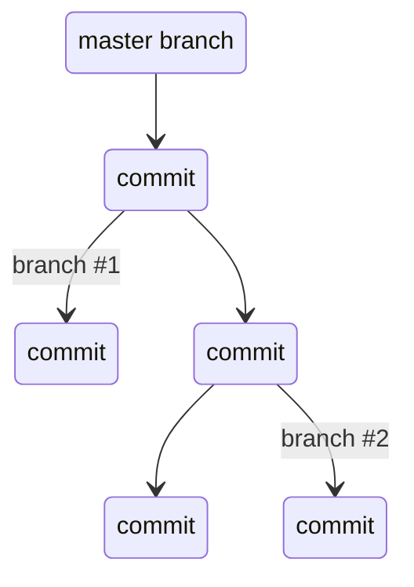

# 22. Git More Collaboration

[toc]

---

> :information_source: **NOTE**: I was hoping to avoid this, but I think I may need to make a Git Guide.

## 22.1. What is Git?

### 22.1.1. Version Control Systems

==A **version control system** (VCS) is a systme for tracking changes to a code pbase and storing each version.== VCSs assist programmers with keeping backups and a history of the revisions made to the code base over time. With that history, programmers can rollback to a version without a particular bug. A VCS also enables collaboration between programmers as they can work on different versions of a code base and share their work.

Git is one VCS and is one VCS and is prevalent amongst programmers and corporations.

==A VCS has a **repository** (or **repo** for short) which is a storage container for the code base.== Repos include files within the code base, the versions over time and a log of the changes made. When a programmer updates the repo, it means they are making a **commit**.

### 22.1.2. Getting Started with Git

In order ot get started with Git, you need to install Git on you machine and install Visual Studio Code.

> :information_source: **NOTE**: I spent a good part of a weekend editing the instructions on [Assigment #4](../B.%20Assignments/A4.HTML%20Me%20Something.md) on how to do this. Go look at that for instructions.

### 22.1.3. Check Your Understanding :white_check_mark:

> :question: **Question**: What is a benefit of using a VCS?
>
> :exclamation: **Answer**:

## 22.2. Repositories and Commits

### 22.2.1. Create a Repository

To get started with a git repo, the programmer (you) must firs create one. To create a git repository, the programmer navigates to their project directory and uses the command `git init`, like so:

```bash
$ pwd
/Users/student/
$ mkdir homework
$ cd homework
$ git init
	Initializing empty Git repository in /Users/student/homework/.git/
```

The programmer is ready to code away!

### 22.2.2. Making Commits

After a while, the programmer has made a lot of changes and saved their code files many times over. So when they do make a commit to their repo?

==*The general rule of thumb is that any time a significant change in functionality is made, a commit should be made.*==

If the programmer has created the Git repo and is ready to commit, they can do so by following the commit process.

> :information_source: **NOTE**: Git does not have a simple commit command, however, making a proper commit requires that the programmers follow a longer procedure than just one command.

The procedure for making a commit to a Git repo includes 4 stages:

1. `git status` give the programmer information about files that have been changed.
2. `git add` allow the programmer to add specific or all changed files to a commit.
   * `git rm` allows a programer to remove a specific file from a commit. These two commands are part of the *staging* process.
3. `git commit` creates the new commit with the files that the programmer added.
4. `git log` display a log of every commit in the repo.

If the steps above are followed correctly, the programmer will find their latest commit at the top of the log.

Here's how the process will look in the terminal:

```bash
Students-Computer:homework student$ git status
On branch master

Initial commit

Untracked files:
  (use "git add <file>..." to include in what will be committed)

        learning-git.js

nothing added to commit but untracked files present (use "git add" to track)
Students-Computer:homework student$ git add .
Students-Computer:homework student$ git commit -m "My first commit"
 [master (root-commit) 2c1e0af] My first commit
  1 file changed, 1 insertion(+)
  create mode 100644 learning-git.js
Students-Computer:homework student$ git log
commit 2c1e0af9467217d76c7e3c48bcf9389ceaa4714b
Author: Student <lc101.student@email.com>
Date:  Wed Apr 24 14:44:59 2019 -0500

    My first commit
```

To break down what happns in a commit even further:

When using `git status`, the output shows two categories:

* **Modified tracked files** (`M`) - The files exist in the Git repo already, but is different from the version in the repo.
* **Modified untracked files** (`U`) - The file is a new file that is not currently tracked in the repository.

`git add` adds files to the commit, but does not commit those file. By using `git add .` (with a period), all the modified files are added to the commit. If a programmer only wants to add one modified file, they can do so.

`git commit` acutally commits the files that were added to the repo. By adding `-m "My first commit"`, a comment was added to the commit. This is helpful for looking through the log and seeing detailed comments on the changed made in each commit.

`git log` shows the author of the commit, the date made, the comment, and a 40-character hash. This *hash* is a value that is a key for Git to refer to the version. Programmers rarely use these hashes unless they want to roll back to that version.

> **NOTE**: **Take the Subway!** :train: Use `git log` to print out changes as a "subway map" using `git log --all --graph`. There's a program called `gitk` that can also do this.  If you use the `--graph` option, take advantage of the `--decorate` option.
>
> **Sources**
>
> * [git-log](https://git-scm.com/docs/git-log)
> * [MetroGit](https://github.com/vbarbaresi/MetroGit)

### 22.2.3. Check Your Understanding :white_check_mark:

> :question: **Question**: What `git` command is NOT a part of the commit process?
> a. `git add`
> b. `git log`
> c. `git status`
> d. `git push`
>
> :exclamation: **Answer**: b or c?

## 22.3. Remote Repositories

### 22.3.1. Local, Remote, Github, Oh My!

So far, we've covered how to set up a Git repo on the local machine. But one of the benefits of using a VCS was storage fo backups. So what happens to the code base if something happens to the machine? That is where remote respositories come in. Instead of keeping a Git repo only on a local machine, the code base is a **remote repository** and the programmers keep working on it keep copies on their local machine.

To get started with remote repos, create an account on [Github](https://www.github.com/). From there, programmers can create a remote repo, view commit history, and report issues with the code.

### 22.3.2. Collaborating with Colleagues

What if a programmer wants to start collaborating with their colleages on a new project? They might need to start with the work that one of their colleagues has already done. In this particular case, the programmer has to import the work that is being stored in an online repo on to their local machine.

They can clone a remote repo by using the `git clone <url>` command. Git and other online Git systems give users the option to clone the repository through HTTPS or SSH, depending on how their Github profile is set up. The `<url>` of the command is where the programmer adds the URL to the repository that they are cloning.

> **Note**: Throughout this book, HTTPS will be used for cloning repos.

### 22.3.3. Contributing to a Remote Repository

Now that the programmer has a profile on Github and a local copy of a remote repo, they can start coding!

Once they create a new featuere, it is time to make a commit. When working with a remote, the commit process has give steps:

1. `git status` check on the status of files that were created or updated.
2. `git add` stage the new or updated files for uploading.
3. `git commit -m "Insert required message"` commit the files.
4. `git push origin master` or simply `git push` to upload the commits.
5. `git log` to see what happened.

> **NOTE**: If you are using VSCode, you may notice that the Source Control Sidebar doesn't have a visible `git push` option. You will need to go to the hamburger menu to select `git push`.

The fourth step uses the new command `git push` where the commit is pushed to the remote from the local. `origin` indicates that the commit does indeed to to the remote and `master` is the name of the branch that the commit goes to. Generally, we don't need to include `origin master` except on the first commit.

### 22.3.4. Check Your Understanding :white_check_mark:

> :question: **Question**: What is the new command for making a commit to a remote repository?
>
> :exclamation: **Answer**: `git commit`, but don't forget to message! (`-m "Message string"`)

## 22.4. Branches

### 22.4.1. Branching in Git

So far this book had talked about Git's ability to store different versions of a code base. What if two programmers work on different features of the code base at the same time? They may want to start with the same version and then one programmer wants to change the HTML and the other the CSS? If would not be effective for the two programmers to commit their changes to the repository at the same time. Instead, Git has branches.

==A **branch** is a separate version of the same code base.== Like a branch on a tree, a branch in Git shares the same trunk as other branches, but is an individual. With branches, the two programmers could work on separate versions of the same website without interfering with each other's work. Besides collaboration, programmers use branches for storing and testing new featueres of sofware called *feature branches*.

The master branch is the default branch or a repository. Many programmers keep the live version of their code in the master branch. For that reason, major work should be don in a new branch so that it doesn't impact the live software.



### 22.4.2. Creating a New Branch

A programmer is on a master and they want to start building an new feature in a new branch, their first step would be to create a new branch for their work.

To create a branch, use this command

```
git checkout -b <branch name>
```

By using this command, note only is a new branch created, but also the programmer switches to the new branch.

### 22.4.3. Switching to an Existing Branch

If a branch already exists, the programmer may want to switch to that branch. To do so, use this command.

```
git checkout <branch name>
```

Basically, the `git checkout` command but with out the `-b` option that creates a new branch.

### 22.4.4. Check Your Understanding :white_check_mark:

> :question: **Question**: What is a reason for creating a branch in Git?
>
> :exclamation: **Answer**:

## 22.5. Merging in Git

### 22.5.1. How to Merge

In Git, ==a **merge** is when the code in two branches are combined in the repo.== The command to merge a branch called `test` into `master` is

`git merge test`

Before running the merge, command, the programmer should make sure that they are in the branch they want to merge into. (So you may want to `git checkout master` first!) 

### 22.5.2. Merge Conflicts

The process is often seamless. For example, a programmer created the branch to change the HTML and another programmer did the same to change the CSS. Because the two programmers changed different files, the merge of the updated HTML and updated CSS won't create a conflict.

==A **merge conflict** is when a change was made to the same line of code on both branches.== Git doesn't know which change to accept, so it is up to the programmers to resolve it.

Merge conflicts are minor on small applications, but can cause issues with large enterprise applications. Even though the thought of ruining software can be scary, every programmer deals with a merge conflict during their career. The best way to deal with a merge conflict is to face it head on and rely on teammates for support!

#### 22.5.2.1. Ways to Avoid Merge Conflicts

Even though merge conflicts are normal in Git, it is also normal for programmers to want to do everything they can to avoid one. Here are some tips on how to avoid a merge conflict:

1. Git has a dry-run option for many commands. When a programmer uses that option, Git outputs what WILL happen, but doesn't DO it. With merging in Git, the command to run a dry-run and make sure there aren't any conflicts is

   ```
   git merge --no-commit --no-ff <branch>
   ```

   `--no-commit` and `--no-ff` tell Git to run the merge without committing the result to the repository.

2. Before merging in a branch, any uncommitted work that would cause a conflict needs to be dealt with. A programmer can opt to not commit that work and instead **stash** ist. By using the `git stash` command, the uncommitted work is saved in the stash and the repository is returned to the state at the last commit.

### 22.5.3. Check Your Understanding :white_check_mark:

> :question: **Question**: If a programmer is on the branch `test` and wants to merge a branch called `feature` into `master`, what steps should they take?
>
> :exclamation: **Answer**:
>
> ```
> $ git checkout master		# change to master branch
> $ git merge feature			# merge the feature branch into master branch
> ```

## 22.6. Exercises: Git :runner:

> :reminder_ribbon: **TODO** Pick up here later. :bookmark:

### 22.6.1. Working in a Local Repository

### 22.6.2. Setting Up a Github Account

## 22.7. Studio: Communication Log :studio_microphone:

### 22.7.1. Getting Ready: Code Together :couple:

### 22.7.2. Overview

### 22.7.3. Studio

#### 22.7.3.1. Step 1: Create a New Repository

#### 22.7.3.2. Step 2: Share Your Repository On GitHub

#### 22.7.3.3. Step 3: Clone a Project from GitHub

#### 22.7.3.4. Step 4: Add a Collaborator to a GitHub Project

#### 22.7.3.5. Step 5: Join the Project and Push

#### 22.7.3.6. Step 6: Pull Pilot's Line and Add Another Line

#### 22.7.3.7. Step 7: Do It Again: Pull, Change, and Push!

#### 22.7.3.8. Step 8: Create a Branch in Git

#### 22.7.3.9. Step 9: Create a Pull Request in GitHub

#### 22.7.3.10. Step 10: Make a Change in the New Branch

#### 22.7.3.11. Step 11: Merge the Pull Request

#### 22.7.3.12. Step 12: Merge Conflicts!

#### 22.7.3.13. Step 13: Resolving Merge Conflicts

#### 22.7.3.14. Step 14: Pulling the Merged Code

#### 22.7.3.15. Step 15: More Merge Conflicts!

#### 22.7.3.16. Resources :books:


---

#LaunchCode

