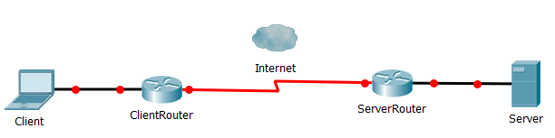

# 24. HTTP: The Postal Service of the Internet

[toc]

---

## 24.1. How the Internet Works

> *"The Internet is not a big truck! It's a [series of tubes](https://www.youtube.com/watch?v=EtOoQFa5ug8)!"*
>
> --Ted Stevens (1923-2010)

Most people use the Internet without fully understanding how it works. Without much trouble, they can open a browser, navigate to a site, and interact with it. They do not need to know precisely *how* the Internet works ino rder to use it.

For web developers, howerver, fundamental understanding of the flow of information across the internet is essential.

### 24.1.1. Servers and Clients

The Internet uses the **client-server model**. A **server** is an application that provides resources---such as raw data, web pages, or images. A **client** is an application that requests resources from a server.



> **Note**: Yes I know, Cisco Geeks, I don't have my connections set up for these devices in Packet Tracer. But I needed a quick diagram.

When navigating the web, the client is the web browser on your computer or smartphone. When you click on a line or type in an address and hit *Enter*, the client/browser makes a request to the server that sits in a building somewhere out in the world. The server receives the request, and sends a response back to the client. The client then displays the content of the response.

> **Fun Fact**: In the client-server modle, the server may sometimes be on the *same* computer as the client. This is often the case when a programmer is building a web application. The in-progress, development version of the application is on their laptop, as is their browser that they use to test the app.

### 24.1.2. Protocols

A **protocol** is a standard for communcation between computers. Mosts web communication uses *three* protocols, in fact.

> :nerd_face: **Actually...** It's more complex that that. (Insert a who bunch of stuff from Cisco here.) (Not really, but just saying.

We will go over three of the more frequent protocols in this section, but a thorough understanding of each protocol is well beyond the scope of this class. However, as a web developer, it is important that you have a general understanding of their role. Each protocol has a different and critical job in enabling web communication.

**Common Web Protocols**

| Protocol                                                     | Role                                                         |
| ------------------------------------------------------------ | ------------------------------------------------------------ |
| **Hypertext Transfer Protocol** (HTTP)                       | High-level web communication for transfering files and information, including:<br />* HTML, CSS, and JavaScript files<br />* Images and other media<br />* Form submissions |
| **Transmission Control Protocol/Internet Protocol** (TCP/IP) | Low-level web communication for transferring small chuncks of raw data known as *packets*. |
| **Domain Name Service** (DNS)                                | Translate human-friendly names into Server IP Addresses.     |


#### 24.1.2.1. HTTP

**Hypertext Transfer Protocol** (**HTTP**) is the most important protocol for web developers to understand, which you may have guessed from the title fo this chaper. It specifies how request for common web data---such as HTML files or images---should be structured, as well as responses to such request. The details of request and response message structures are the topic of the rest of this chapter.

==**HTTPS** referes to the HTTP protocol used with a secure connection.== A secure connection encrypts so that it can't be read while in-transit. The data is encrypted by the server/client before being transmitted, and decrypted once it is received by the client/server. The precise details of how such encryption works is beyond the scope of this corse.

#### 24.1.2.2. TCP/IP

> **The OSI Model** or Open System Interconnection Model, defines a networking framework to implement prototocols in seven layers. The Internet Protocol Suite groups this model into four groups.
>
> ```
> 7. Application Layer
> 6. Presentation Layer
> 5. Session Layer
> 4. Transport Layer
> 3. Network Layer
> 2. Data Link Layer
> 1. Physical Layer
> ```
>
> ```mermaid
> stateDiagram
> 	state User {}
> 	
> 	state Application {
> 		state "Application Layer" as L7
> 		state "Presentation Layer" as L6
> 		state "Session Layer" as L5
> 		
> 		L7 --> L6 : Transmit
> 		L6 --> L5 : Transmit
> 		L5 --> L6 : Receive
> 		L6 --> L7 : Receive
> 	}
> 
> 	state Transport {
> 		state "Transport" as L4
> 	}
> 	
> 	state Internet {
> 		state "Network" as L3
> 	}
> 	state Link {
> 		state L2 {
> 			state "Media Access Control" as MAC
> 			state "Logical Link Control" as LLC
> 			MAC --> LLC
> 			LLC --> MAC
> 		}
> 		note left of L2
> 			Date Link
> 			* MAC sublayer controls how a computer on the network gains access to the data and permission to transmit it.
> 			* LLC sublayer controls frame synchronization, flow control and error checking
> 		end note
> 	}
> 
> 	state "Physical" as L1
> 	
> 	User --> Application : Input
> 	Application --> User : Output
> 	note right of User
> 		The User is an "unofficial" layer
> 		jokingly called "the 8th layer"
> 		of the OSI Model
> 	end note
> 	
> 	Application --> Transport : Transmit
> 	note right of Application
> 		Application Layer
> 		HTTP, HTTPS, SSH, DNS, DHCP
> 	end note
> 
> 	Transport --> Internet : Transmit
> 	note right of Transport
> 		Transport Layer
> 		TCP, UDP
> 	end note
> 	
> 	Internet --> Link : Transmit
> 	note right of Internet
> 		Internet Layer
> 		IP
> 	end note
> 
> 	Link --> L1 : Transmit
> 	note right of L1
> 		Physical Layer
> 		Ethernet
> 	end note
> 
> 	Link --> Internet : Receive
> 	Internet --> Transport : Receive
> 	Transport --> Application : Receive
> 	L1 --> Link : Receive
> 
> ```
>
> 
>
> 

#### 24.1.2.3. DNS

### 24.1.3. Web Addresses

#### 24.1.3.1. Scheme

#### 24.1.3.2. Host

#### 24.1.3.3. Port

#### 24.1.3.4. Path

#### 24.1.3.5. Query String

### 24.1.4. Putting It All Together

### 24.1.5. Check Your Understanding :white_check_mark:

## 24.2. HTTP at a Glance

### 24.2.1. Requests and Responses

### 24.2.2. The Postal Service of the Internet :postal_horn:

## 24.3. Requests

### 24.3.1. Request Methods

#### 24.3.1.1. The `GET` Method

#### 24.3.1.2. The `POST` Method

### 24.3.2. Headers

### 24.3.3. Body

### 24.3.4. Check Your Understanding :white_check_mark:

## 24.4. Responses

### 24.4.1. Response Codes

### 24.4.2. Response Headers

### 24.4.3. Response Body

### 24.4.4. Check Your Understanding :white_check_mark:

## 24.5. HTTP in the Browser

### 24.5.1. Viewing Requests and Responses Using Developer Tools :hammer_and_wrench:

### 24.5.2. Browser Flow

### 24.5.3. Check Your Understanding :white_check_mark:


---

#LaunchCode

