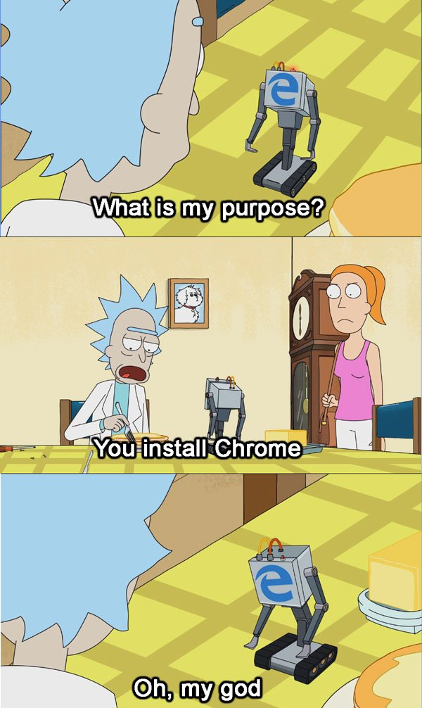

# 26. Fetch & JSON

[toc]

---

## 26.1. Introduction

> :runner: **RUSH!** We're in a rush to get things done. Eventually I'll come back and fill in the blanks.

### 26.1.1. API

* GUI = Graphical User Interface
* CLI = Command Line Interface
* API = Application Programming Interface ​(:reminder_ribbon: TODO: but WHAT does it do?)

A GUI uses APIs to communicate with other programs.

## 26.2. Data Formats and JSON

### 26.2.1. JSON

* JSON = JavaScript Object Notation

### 26.2.2. JSON Rules

> **NOTE**: I was hoping when they mention "JSON Rules" there would be a list of rules.

JSON is a collection of key-value pairs.

1. A JSON key MUST be a string, but the value may be a number, string, boolean, array, object, or null.
2. JSON can be used to describe a collection of objects at the same time.
3. JSON keys MUST be in double quotes.

### 26.2.3. JSON & JavaScript Object Differences

### 26.2.4. Check Your Understanding :white_check_mark:

## 26.3. Fetching Data

> NOTE: As usual, anything that is bound to work in Firefox or Chrome likely doesn't work in Internet Explorer. SCREW Internet Explorer!
>
> 

### 26.3.1. `fetch` Function

To request data from an API, we will use the [**`fetch`**](https://developer.mozilla.org/en-US/docs/Web/API/WindowOrWorkerGlobalScope/fetch) function. `fetch` is a global function that requests ("fetches") resources (i.e. data) from an API.

> **Note**: [Even `fetch` has an API.](https://developer.mozilla.org/en-US/docs/Web/API/Fetch_API)

Take note of two necessary aspects of the `fetch` function:

1. The URL of where the data is located.
2. The response handler function to utilize the data that is being fetched.

>**Example**: Notice  string URL is passed to `fetch`. Also notice the anonymous *request handler function* that has a `response` (or `res`) parameter. The `.then` method will be explained shortly.
>
>```js
>fetch("https://handlers.education.launchcode.org/static.weather.json").then((res) => {
>    console.log(res);
>});
>```
>
>In this example, we are requesting data from the URL in the fetch function and our response handler (the anonymous function) simply logs the response to the console.

### 26.3.2. `fetch` Example

Let's break down how `fetch` works:

1. A URL is passed to `fetch` as a parameter.
2. This causes an HTTP GET request to be sent from the browser to the API.
3. The API processes the request and sends back a response, which contains data.
4. Once the browser receives the response, the `.then()` statement executes.
5. The anonymous response handler function called by `.then(function(res))` runs and the function deals with the data sent back from the API.
6. Based on the code in the handler function, the webpage gets updated using DOM methods.

> **Note**: In this section, `fetch` is used to make GET requests. `fetch` can also be used to make other types of HTTP requests, such as POST and PUT.

#### 26.3.2.1. View the `GET` Request

#### 26.3.2.2. Response Object

The response to the GET request is contained in a `Response` object, which is an instance of the [`Response`](https://developer.mozilla.org/en-US/docs/Web/API/Response) class which contains methods that allow us to access the status of an API request and the data returned in the response.

```js
fetch(url).then((res) => {
    res.json().then((json) => {
        console.log(json);
        /* other stuff to manip the JSON data to fill the webpage */
    })
});
```


#### 26.3.2.3. Use the DOM and JSON Data to Update the Page

> **NOTE**: `fetch` was chosen as the tool to request data because it's supported by modern browsers

### 26.3.3. Check Your Understanding :white_check_mark:

## 26.4. Asynchronous and Promises

In order to fully explain how the `fetch` function works, we need to define and talk about the terms **asynchronous** and **synchronous**.

* **asynchronous** : Not simultaneous or concurrent in time.
* **synchronous** : Simultaneous or concurrent in time.

When fetching data in JavaScript, the HTTP requests are asynchronous. In short, that means when an HTTP request is sent, we don't know exactly when a response will be received by the browser. Remember that HTTP requests are sent to an address, then a response is sent.  That process takes a variable amount of time depending on the network speed, the address location, and response time.

> **Note**: These requests are also called **AJAX requests** (Asynchronous JavaScript and XML). The XML part of AJAX refers to the data format that was popular before JSON.
>
> I guess you could say we do more *AJAJ* than *AJAX*.

### 26.4.1. Response Handlers

The browser can't stop everything and wait for a response to an HTTP request. Browsers have to render HTML, interact with the user, and run JavaScript. To keep these processes running seamlessly, with out any noticeable pauses, the browser relies on events.

This is where the `.then()` and the response handler function come in. The browser provides us with a way to handle the response whenever it is received.

### 26.4.2. Promises and the `then` Function

Let's look at a simple fetch example. Notice on line 1 that `then` is called on the value returned from `fetch`.

```js
fetch(url).then(function(res){
    console.log(res);
});
```

To make this clearer, let's capture the values returned by `fetch` in a variable named `fetchPromise`.

```js
const fetchPromise = fetch(url);
fetchPromise.then(function(res){
    console.log(res);
});
```

`fetch` returns an instance from the [`Promise`](https://developer.mozilla.org/en-US/docs/Web/JavaScript/Reference/Global_Objects/Promise) class, which represents a **promise**. A promise is the *eventual* outcome of an asynchronous event. In the above example, `fetchPromise` represents the eventual response from the HTTP request to the URL.

A promise can be fulfilled or rejected. When a promise is fulfilled, data is passed to the response handler function. The `then` method of `Promise` defines what will happen when the promise is fulfilled. When a promise is rejected, the error reason is returned.

The above example can be translated to these steps:

1. Make an HTTP request to the URL.
2. When the response is received, THEN run the response handler function (passing in response data).
3. In the response handler function, console log the `res` (response) object.

### 26.4.3. More Promises

Above we showed a promise representing the outcome of an HTTP request, however promises can represent to outcome of *any* asynchronous event. For example, the `res` object has a `json()` function that will return the JSON data in the response. The `json()` function returns a *promise* that represents the future result of turning the response data into JSON.

The example below shows how promises are used to represent two different types of asynchronous events and the outcomes.

> **Example**: 
>
> ```js
> const fetchPromise = fetch(url);
> fetchPromise.then((res) => {
>     const jsonPromise = res.json();
>     jsonPromise.then((json) => {
>         console.log("temp", json.temp);
>     })
> });
> ```
>
> The example involves two promises. On line 1, `fetchPromise` is a promise that represents the fetch request. On line 3, `jsonPromise` represents a promise that represents the response data being turned into JSON.
>
> Finally on line 5, the JSON data can be logged.

> **Tip**: Promises can be a hard concept to understand. Focus on the examples and the theory will make sense in time.

### 26.4.4. Check Your Understanding :white_check_mark:

## 26.5. Exercises :runner:

### 26.5.1. JSON

### 26.5.2. Fetch

## 26.6. Studio: Fetch & JSON :studio_microphone:

### 26.6.1. Get Started

### 26.6.2. Requirements

#### 26.6.2.1. Example JSON

#### 26.6.2.2. HTML Template

#### 26.6.2.3. Expected Results

### 26.6.3. Bonus Missions :rocket:


---

#LaunchCode