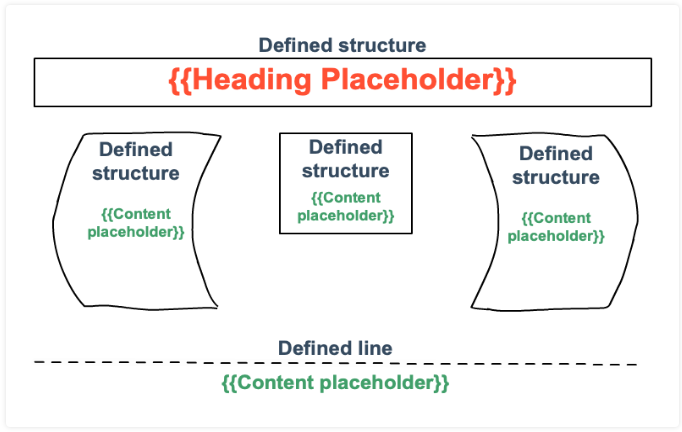
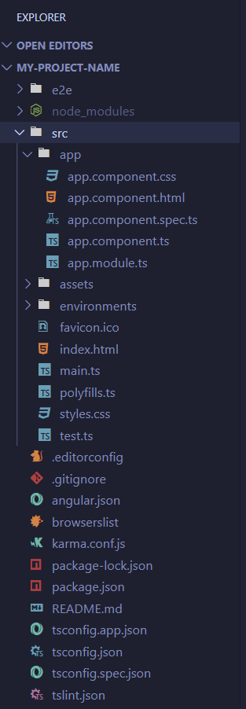
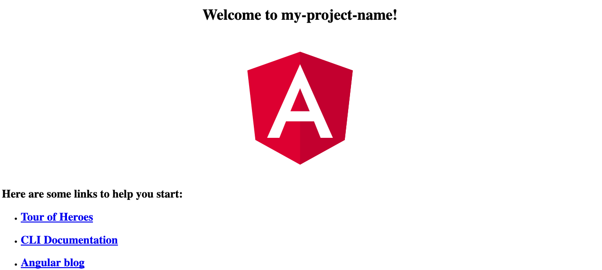

# 28. Angular, Part 1

[toc]

---

> :runner: **RUSH!** There's going to be some stuff that will be skipped temporarily

## 28.1. Why Use JavaScript Libraries

> Moe: "Woah, hey, you didn't pay for the beer."
>
> Homer: "Can't someone else do it?"
>
> [Moe and homer laugh together. As Homer starts to leave the tavern, Moe cocks and points a shotgun at him and clears his throat.]
>
> Moe: "Seriously, give me the money."
>
> --*The Simpsons* "Trash of the Titans" (Season 9, episode 22) (1998)

We use libraries to make our lives as developers easier. We can focus on solving or specific problems if we don't have to spend time figuring out how information flows throughout our project.

When it comes to web based applications, there are two very different places code can exist: in the user's browser ("front end") and on the host's server ("back end").

For web app development, consider the front end as what the user interacts with and sees, while the back end contains the logic and manipulation that the user doesn't need to worry about. Similar to how an old mechanical clock works. The front end would be the face with the 12 numbers and two moving hands. The user only needs the clock face to determine the time. The back end for the clock would be the various cogs, wheels, and power source.

In this chapter, we will use **Angular** as our front-end JavaScript framework. Angular dictates how to structure our files, as well as how information flows between them. It also contains a number of tools to help us bind other part of the application users see in their web browsers.

> **NOTE**: There are many ways to create front-end web applications with JavaScript. Popular frameworks for JavaScript include React, Vue, Ember, etc.

Angular is a framework that breaks the overall project into smaller pieces, each with their own code and styling. Angular then combines all of the pieces to create the full web page.

Taking this modular based approach allows us to separate the individual pieces of our application so we can focus on them one at a time.

Through these next three chapters, we will look at the basic building blocks of an Angular application.

## 28.2. Templates

### 28.2.1. Your Own Websites

### 28.2.2. Templates are Frameworks

A **template** provides the general structure for a web page. It identifies where different elements get placed on the page, but it does not fill them with content. Think of a template as an outline for what we want the page to look like. No details yet, just defined space where information needs to be added.

#### 28.2.2.1. No Template

To demonstrate how helpful templates can be, you will need a copy of the LaunchCode Angular projects repo:

1. Fork the [angular-lc101-projects repo](https://github.com/LaunchCodeEducation/angular-lc101-projects) on GitHub.

2. In a terminal, navigate to the folder you've been using to make clones of your LC101 repos. Clone your fork (`git clone https://github.com/<your_user_name_here>/angular-lc101-projects`) The repo contains a lot of Angular code that we will soon go over. We'll go over this shortly.

   ```
   $ cd lc101
   $ git clone https://github.com/${github_username}/angular-lc101-projects
   ```

3. Open VS Code and and open the `angular-lc101-projects` folder. This folder will be used as a workspace.

4. Navigate to `lesson1/examples/noTemplate`. 

5. The code in `noTemplate/index.html` builds a simple 3-column webpage. It defines the location for each heading, unordered list, and button. The `noTemplae/style.css` file specifies the font, text size, colors, etc. 

   ```html
   <body>
      <h1>Hello, Screen!</h1>
      <div class="row list">
         <div class='movie'>
            <h4>Movies</h4>
            <ul>
               <li>Hidden Figures</li>
               <li>The Princess Bride</li>
               <li>Ferris Bueller's Day Off</li>
            </ul>
            <button class='movie'>More</button>
         </div>
         <div class='school'>
            <h4>Education</h4>
            <ul>
               <li>LaunchCode</li>
               <li>Monsters University</li>
               <li>My HS</li>
            </ul>
            <button class='school'>More</button>
         </div>
         <div class='hobby'>
            <h4>Hobbies</h4>
            <ul>
               <li>Knitting</li>
               <li>Cycling</li>
               <li>Shark Rodeo</li>
            </ul>
            <button class='hobby'>More</button>
         </div>
      </div>
      <hr>
      <div class="links">
         <h2>Links</h2>
         <a href="https://www.launchcode.org/" target="_blank">LaunchCode</a> <br>
         <a href="https://www.webelements.com/" target="_blank">WebElements</a>
      </div>
   </body>
   ```

   In the Explorer sidebar in VSCode, right click in the `noTemplate/index.html` file and select "Copy Path" then open a new tab in your browser and Paste the address into the address bar. (You may want to prepend it with `file:///` and replace the back slashes with forward slashes.)

We could drastically improve the appearance and content of the page by playing around with the tags, classes, styles, and text. However, any changes we want to make need to be coded directly into HTML and CSS files.

This quickly becomes inefficient, especially if changing the items involves multiple blocks of code.

#### 28.2.2.2. A Better Way

Each section in a template contains one or more *blanks* where specific items need to be added. Separate JavaScript code sends data to the template to fill in these blanks, and the data can change based on a user's actions.

```html
<body>
   <h1>{{mainHeading}}</h1>
   <div class="row list">
      <div class='movie'>
         <h4>Movies</h4>
         <ul>{{movieTitles}}</ul>
         <button class='movie'>More</button>
      </div>
      <div class='school'>
         <h4>Education</h4>
         <ul>{{schoolNames}}</ul>
         <button class='school'>More</button>
      </div>
      <div class='hobby'>
         <h4>Hobbies</h4>
         <ul>{{hobbies}}</ul>
         <button class='hobby'>More</button>
      </div>
   </div>
   <hr>
   <div class="links">{{headingAndLinkList}}</div>
</body>
```

> **NOTE**: Don't change the HTML in `noTemplate/index.html`. We haven't yet covered the Angular work needed to make use of this template syntax.

The HTML looks similar to the previous example, but saves about 16 lines. It provides the same `<div></div>` structure but replaces some of the specific text between tags with **placeholders**, also called [handlebars](https://handlebarsjs.com/) or [mustaches](https://mustache.github.io/).

Each item listed inside `{{}}` refers to data that will be passed into the template and automatically formatted. Form example, the template converts `{{movieTitles}}` into a sequence of `<li></li>` tags.

By defining our templates in an even more general manner, we could replace the `h4`, `ul`, and `button` structure with a single placeholder.

```html
<body>
   <h1>{{mainHeading}}</h1>
   <div class="row list">
      <div class='movie'>{{movieContent}}</div>
      <div class='school'>{{schoolContent}}</div>
      <div class='hobby'>{{hobbyContent}}</div>
   </div>
   <hr>
   <div class="links">{{linkContent}}</div>
</body>
```

By using a template to build the website, changing the list of movies, schools, or hobbies involves altering something as simple as an array or object. After changing the data, the template does the tedious work of modifying the HTML. The list of movies would update automatically if we add [*Up*](https://www.imdb.com/title/tt1049413/) to our `favoriteMovies` array, which then gets passed into `{{movieContent}}`. We do not need to worry about re-coding any of the tags.

#### 28.2.2.3. Templates Support Dynamic Content

If we add a search box to our website, a user could enter "NASA images", "giraffe gif", "movie trailers", etc. We cannot know ahead of time what a user will request, but we want our website to be able to display any relevant requests.

Besides making it easier to organize and display content, templates also allow us to create a **dynamic page**, meaning that its appearance changes to fit new information.

For example, we can define a grid for displaying photos in rows of four across the page. Whether the images are giraffes, tractors, balloons, or whatever doesn't matter. ==The template sets the layout and the code feeds in the data.== If more photos are found, extra rows are produced on the pages, but each row shows 4 images.

Templates must be used anytime we create a webpage that response to a changing set of data, especially if that data is unknown to us.

### 28.2.3. Templates Provide Structure, Not Content

Templates allow us to decide where to display data on our webpages, even if we do not know what exactly the data will be. Information pulled from forms, APIs, or user input will be formatted to fit within our design.



> **NOTE**: The figure above is called a **mockup** or "wireframe" of a webpage.  Mockups can be used to create unit tests called "mock objects". The main reason to create such mockups is to be able to test one part of a software system (a unit) without having to use dependent modules. We did this before back in [Chapter 14](./14.Unit%20Testing.md).
>
> You can create one of these with programs like Photoshop, GIMP, Illustrator, or [Inkscape](https://inkscape.org/gallery/=ui-mockup/). But more than likely, your naïve Mac-using employer will want you to use something like [Balsamiq](https://balsamiq.com/). But I ain't paying for software with a subscription service (*cough* *Adobe* *cough*). As usual, I want to find something that is **Free and Open Source Software** (FOSS). I'm still looking for something good.

In the above figure, the black outlines represent different structures defined by the template. Each structure governs a specific portion of the screen. As data gets fed into the template, the appearance of the page changes.

If no data is sent to a particular structure, that part of the screen remains empty because the space is still reserved. Other components of the page will work around that space.

### 28.2.4. Check Your Understanding :white_check_mark:

## 28.3. Angular File Structure

Each Angular project contains a standard file structure.

```
📁 project-name
|- 📁 src
    |- 📄 (support files)
    |- 📁 app
       |- 📄 index.html
       |- 📄 main.ts
       |- 📄 style.css
       |- 📄 test.ts
       |- 📄 polyfills.ts
       |- 📁 (app files and subfolders)
```

All of the project files (and there will be <u>a lot</u> of them) are stored in the single, top-level folder, *`project-name`*, which contains a `src` folder and a set of support files.

> **NOTE**: When you start a new Angular project, do not worry about the support files. These will be generated automatically, and they take care of the routine technical details for making your project run smoothly.

`src` contains the `app` folder, and five important files: `index.html`, `main.ts`, `style.css`, `tests.ts`, and `polyfills.ts`. We will explore these files in more details in section 28.4. For now, recognize that they control *how* the Angular project operates.

The `app` folder contains the files and subfolders needed to control the nitty-gritty details of displaying a webpage. For your projects, most of your time and effort will be spent modifying the contents within `app`.

### 28.3.1. Installing Angular :hammer_and_wrench:

Finally! The part you've been waiting for!

Angular uses its own set of command line instructions to create, update, and launch projects. Before you dive too deeply into the Angular lessons, you will need to install the Angular <abbr title="Command Line Interface">CLI</abbr> on you computer.

> **NOTE**: There is a newer version of Angular than 8.2.2, and you might see NPM sa something like `npm WARN depricated request@2.88.2` (which involves a dependency package that version of Angular used, but for the purposes of this lesson is not important right now.) however for any of the stuff to work for LC101, we need to use that specific version. After LC101 is over, and your last assignment checked by the TA, you can upgrade Angular to your liking.

1. Open up the terminal or the terminal panel in VS Code. (`CTRL+Shift+backtick`)
2. Run this specific command `npm install -g @angular/cli@8.2.2`

>  **Note:** If it asks if you want to share "anonymous usage data with the Angular Team at Google", type `N` for no.  If the installer prompts you to make any other choices, accept all the default options.

The NPM command installs the CLI *globally* (hence the `-g` flag), which means that Angular command will work regardless of the folder you have open. Most of the time when you use packages for specific objects, installing globally might not be the best ideal, but for things like TypeScript and Angular, they are.

Angular commands begin with the keyword `ng` (for A**ng**ular) and the most commonly used include:

1. **`ng new`** (or `ng n`) -- Creates a new Angular project in the current directory.
2. **`ng generate`** (or `ng g`) -- Creates new files within an existing project.
3. **`ng serve`** (or `ng s`) -- Compiles a project and *launches* it in a form that can be displayed in a browser.

For a complete list of commands, refer to the [Angular documentation](https://angular.io/cli#command-overview).

#### 28.3.1.1. Check Your GitHub Account

For the "HTML Me Something" assignment, you created an account. Since you will modify Angular projects for over several lessons, you need access to GitHub to download starter code and store your progress.

#### 28.3.1.2. What's in a Name?

An any time we need to look up something related to Angular, the website we should look at is [**angular.io**](https://angular.io) not AngularJS.

### 28.3.1.2. Ready to Go

With all that said, let's get started!

## 28.4. Angular First Steps

The goal here is to create a minimum working template for a webpage. It will serve as a jumping-off point for later exercises and studios, so take as much time as you need to get comfortable with the basics.

### 28.4.1. Starting a New Project

First, let' use the terminal to create a folder for all your angular projects. This will be a new folder, not one that you cloned or forked. Once that is done, navigate into the new folder and create your first Angular project.

```bash
$ mkdir angular_practice
$ cd angular_practice
$ ng new my-project-name
? Would you ke to add Angular routing? (y/N) N
? Which stylesheet format would you like to use? CSS
```

This next part is going to take a little time to create. But when it is done, you may want to open the new Angular project folder in VSCode.

#### 28.4.1.1. Examine the Files Created



1. The `src` folder holds the files and source code needed for the project.
2. The `app` folder holds the content for the web page. Although the page is treated as a single entity, it actually consists of multiple pieces. `app` holds these different parts and establishes links between them. We will modify some of these files soon.
3. `index.html` is the highest level for displaying content. Anything added to this file will appear on every page within a website.
4. `main.ts` imports the core methods required to make everything work. It also imports the content from the `app` folder.
5. `styles.css` holds the global style settings for the entire website.

#### 28.4.1.2. What to Ignore

For every new project, Angular automatically sets up the code to make the different parts communicate with each other. As your skills grow during your career, you may need to learn how to modify these files. For now, however, leave the following files alone:

1. **DO NOT TOUCH THESE TYPESCRIPT FILES**: `main.ts`, `test.ts`, and `polyfills.ts`.
2. **DO NOT TOUCH THESE FOLDERS**: `e2e`, `node_modules`, and `environments`.
3. **DO NOT TOUCH THE GENERATED JSON FILES**: If it ends with `.json`, no touchy!
4. **The `assets` folder is a "Maybe touch."** It holds user defined files that support a project. Examples include: JavaScript Code, image files, gifs, or video clips. The exercises in the next chapter will use this folder, but we will leave it empty for this lesson.

### 28.4.2. Launch the Page

`ng new` creates all the files required to launch a functioning web page. You have not added any content yet, but Angular provides a standard starting point that allows you to check if everything works. 

Before sending an Angular project out in the world, you should preview it *locally* in a browser. Any changes you make to the project files will be reflected only on your screen so you can play around with the code without worry.

> **NOTE**: Even though you view our work in a browser, "local" means no one else can access your webpage, since it is stored on your computer. If you want to share your local page with someone, they'll have to look over your shoulder or do a screen share.

To *launch* your new web page, use the Terminal to navigate into the project folder, then enter the command `ng serve`. (I think I mentioned how to do this similarly [in Python](https://developer.mozilla.org/en-US/docs/Learn/Common_questions/set_up_a_local_testing_server#Running_a_simple_local_HTTP_server), but thanks to one of Angular's dependencies called [Express](https://expressjs.com/), [you can do it with Node.js too](https://expressjs.com/en/starter/hello-world.html)...or at least that is the dependency I think makes that possible.)

```bash
$ cd my-project-name
$ ng serve
```

Be prepared to wait...the compiler requires some time to build and deploy even small projects, and it may be a few moments before you see any action in the terminal. If no errors occur, "Completed successfully" message eventually appears.

> :reminder_ribbon: **TODO**: Wasn't there an article on dev.to about better management of node dependencies and assets to make compilation faster? I know I have it book marked somewhere. Not sure if Yarn or Webpack are involved.

The important part of this feedback is the [**`localhost`**](http://localhost:4200/) line, which provides a URL for viewing your work in a browser, as if it was posted online (with the `http://` prefix) rather than how it would appear offline (with the `file:///` prefix). Copy the URL and paste it into the address bar of you web browser.

> :reminder_ribbon: **TODO**: Copy part of the processing log here that includes the line showing the localhost address.

> **NOTE**: Angular will likely use port 4200 (`:4200`) which is an important part of the `localhost` address you are <abbr title="Copying and Pasting">copypastaing</abbr>. Make sure that no other application is using that port.

#### 28.4.2.1. What is `ng serve` Doing?

**`ng serve`** allows you to view your project in a browser by running a series of tasks in the background. It's not magic, just the tedious mechanics that you don't need to set up yourself.

`ng serve` performs the following tasks:

1. Compiles and analyzes your Angular files to *build* HTML and JavaScript files that can be run in a browser.
   * This step throws errors if you try to serve code that contains syntax errors or other errors.
   * You will learn more about the different types of files that are compiled in the coming sections.
2. Starts a web server on your computer that serves the built version of your Angular project.
   * Your Angular project is viewable at the web address [`http://localhost:4200/`](http://localhost:4200/)

> **NOTE**: Angular projects are written in TypeScript, your web browser can run HTML, CSS, and JavaScript. In order for your Angular project to run in the browser, the TypeScript code has to be converted into JavaScript.  The conversion from TypeScript to JavaScript happens during the build phase of `ng serve`.

### 28.4.3. Yay! A Webpage!

🎉🥳😄 **CONGRATULATIONS!** You have a function webpage. You should see the following in your browser:

 

This is the default forma created by `ng new`, but your chosen project name will replace `my-project-name` in the title. ( :reminder_ribbon: **TODO**: Hopefully I won't need to rename that. 🤪 ) The links lead back to selected pages from the [angular.io](https://angular.io/) documentation.

Feel free to play around a little before continuing. Don't worry about breaking anything. If necessary, you can always start another new project.

#### 28.4.3.1. Try It

In VSCode, open the four files within the `app` ~~(AND `src`)~~ folder. 

* ~~`src/index.html` (which you won't need to make any changes here)~~
* ~~`src/styles.css` (So you can change the `<body>` element's appearance and any global changes)~~
* `src/app/app.components.html` (to edit the content in `<app-root>`)
* `src/app/app.components.css` (to change the styles of the components in `src/app/app.component.html`)
* `src/app/app.component.ts`
* `src/app/app.module.ts`

Modify the code to accomplish the following:

1. Find where your project name is assigned to the `title` variable. Replace it with a different string.
2. Change one `h2` heading to an `h3`.
3. Change the color for the "Welcome to..." heading.
4. Change one of the lines to send users to your favorite website.
5. Replace the Angular shield with a different image.

After making each change, save your work. Your webpage should automatically refresh.

> **NOTE**: While files did you modify?
>
> * Mostly `app.component.html` and `app.component.css`?
> * :reminder_ribbon: **TODO**: What changes the background color if the page has no `<body>`?
>   * More than likely, those are manipulated in the `src/styles.css` file rather than the `src/app/app.component.css` file. (I fixed this. They probably should have mentioned that.)
>   * For global changes, you should edit `src/styles.css` (~~and don't forget to add the `<link rel="stylehsheet" href="./styles.css">` in `src/index.html`~~ actually you don't. Angular will do that.).
>   * For component changes, edit the `src/app/app.component.css` 

Don't worry if you got stuck on some of the tasks. This was an time for experimentation. As long as you tried something and saw the result, you still learned something valuable.

> **What's up with that?** *Why do the links that have a `target="_blank"` attribute (which tells the browser to open it in another tab) have a `rel=nopenner` attribute?*
> Supposedly, it's for some security thing. ( :reminder_ribbon: **TODO**: Explain later. )

### 28.4.4. Un-launching Your Page

`ng serve` will continue to run until you press `ctrl+c` in the terminal. Go ahead and interrupt the process now. If you try refreshing your page, you will see an error.

Now let's take a look at the different project files.

> **Quick Recap**
>
> 1. `ng new ${project_name}` to create a new Angular project in a project folder called `${project_name}`.
>    * Alternatively, use `ng generate` to create an Angular project from an existing project. (We didn't go over this too well.)
> 2. `cd ${project_name}` so that you remember where to run `ng serve` later.
> 3. Most of the files (for now) that you will be working on will be in the `src/app` directory.
> 4. `ng serve` to launch a the project (remember to `cd` into it first!)
>    * The project will be seen at `http://localhost:4200/`
>    * The project should refresh automatically when you make changes to files.
>    * Use `ctrl+c` to shut down the server when you are done.

## 28.5. The Angular Framework

> **NOTE**: Looks like some of those things I suggested were actually applied here in this section. They should have mentioned it sooner.

In VSCode, navigate to the `src` folder and open `index.html` and examine the code:

```html
<!doctype html>
<html lang="en">
<head>
  <meta charset="utf-8">
  <title>MyProjectName</title>
  <base href="/">

  <meta name="viewport" content="width=device-width, initial-scale=1">
  <link rel="icon" type="image/x-icon" href="favicon.ico">
</head>
<body>
  <app-root></app-root>
</body>
</html>
```

You have seen most of the HTML tags before, but look line 12. The `<app-root>` tag representa a key idea behind building template. Angular allows us to define our own tags, which are used as another type of placeholder in an HTML file. In this case, `<app-root></app-root>` reserves space on the webpage for information supplied by other files. Line 12 essentially says, "Display all the content from the `app` folder here."

As we add more pieces to our template, we will define specific tags to help us arrange the different items on the screen. This makes it easier for use to keep track of our content. For example, if we wanted to build a web page that contains a shopping list, a list of movies to watch, and family photos, we can define the tags `<grocery-list>`, `<movies>`, and `<family-photos>`, respectively.  With these tags, we can reference specific content whenever we want and clearly place it on a page. The tags also make it easy to play with new styles and formats for our grocery list without changing much code or altering the appearance of the movie list or photos.

Most of our work with Angular will take place within the `app` folder, so let's look over some of the files in it.

### 28.5.1. Inside the `app` Folder

One way of changing the color of the "Welcome to..." heading would be to open the `app.component.css` file and add some styling:

```css
h1 {
    color: brown;
}
```

We can freely modify this file, but the CSS instructions only affect the HTML files within `app`. Also the code in `app.component.css` overrides any CSS found in the higher level `styles.css` file. (Remember this is the nature of how *Cascading* Stylsheets work.)

This is the pattern for Angular. CSS instructions further down in the file tree have a higher priority. ( :nerd_face: Actually, if two stylesheets have the same definition, the file future down the list overwrites it. The CSS files in `app` are loaded after `styles.css` is loaded.) If the `app` folder contained a subfolder with its own `.css` file, then those instructions would be applied to the HTML files within that subfolder.

#### 28.5.1.1. `app.component.html` File

> **Example**: Here's a sample of the default code inside `app.component.html`:
>
> ```html
> <div style="text-align:center">
>    <h1>
>       Welcome to {{ title }}!
>    </h1>
>    
> </div>
> <h2>Here are some links to help you start: </h2>
> <ul>
>    <!-- List items here... -->
> </ul>
> ```

`app.component.html` contains the structure and most of the text seen on the "Welcome to..." page. Notice the placeholder `{{title}}` in line 3. This gets filled with data passed in from another file, and it allows us to modify the content on the page without revising the HTML.

`app.component.html` serves as the main template for your webpage. This file will usually NOT hold a lot of HTML code. Instead, it will contain many placeholders for content defined elsewhere in the project.

Later in this chapter, you will learn how to add new components to the `app` folder, as well as how to arrange them in the HTML file.

#### 28.5.1.2. `app.component.ts` File

> **Example**: `app.component.ts`
>
> ```typescript
> import { Component } from '@angular/core';
> 
> @Component({
>    selector: 'app-root',
>    templateUrl: './app.component.html',
>    styleUrls: ['./app.component.css']
> })
> export class AppComponent {
>    title = 'my-project-name';
> }
> ```

`app.component.ts` performs several important functions with very few lines:

1. Line 4 defines the `<app-root>` tag, which we saw on line 12 of `index.html`. This tag can also be used in any files that import the `AppComponent` class.
2. Line 5 imports `app.component.html` which we examined above.
3. Line 6 imports `app.component.css` which applies styles to the HTML file. (Well, not everything. You'll still want to edit `styles.css` to change the `<body>` element.) If you set a different color to the "Welcome to..." sentence in the Try It tasks, this is why changing the CSS file worked.
4. Line 8 makes the `AppComponent` class available to other files.

Take a look at `app.component.html` again. We mentioned the `{{title}}` placeholder earlier and said that it gets filled with data from a different file. Line 9 in `app.component.ts` supplies this data by assigning the string `'my-project-name'` to the `title` variable. Changing `'my-project-name'` to a different value alters the web page.

#### 28.5.1.3. `app.module.ts` File

> **Example**: `app.module.ts`
>
> ```typescript
> import { BrowserModule } from '@angular/platform-browser';
> import { NgModule } from '@angular/core';
> 
> import { AppComponent } from './app.component';
> 
> @NgModule({
>    declarations: [ AppComponent ],
>    imports: [ BrowserModule ],
>    providers: [],
>    bootstrap: [AppComponent]
> })
> export class AppModule { }
> ```

Just like before, there is a lot going on within very few lines.

1. Lines 1, 2, and 8 import and assign the core modules that make Angular work. This is part of the automatic process, so don't play with these (yet).
2. Line 4 imports the class `AppComponent` from the local file `app.component.ts`.
3. Line 4 also pulls in references to any other files lined to `app.component.ts`.
4. Line 7 declares the imported local files as necessary for the project.
5. Line 12 exports the `AppModule` class and makes it available to other files.

`app.module.ts` does the main work of pulling the core libraries and local files. As new parts are added to a project, the import statements, `imports` array, and `declarations` array update automatically. We do not have to worry about the details for adding the critical code ourselves.

### 28.5.2. Change the Content

Enough detail. Let's explore some more.

If you didn't complete all of the *Try It* tasks from earlier, attempt them now, After that...

#### 28.5.2.1. Try It!

1. Run `ng serve` in the terminal to launch your webpage again.

2. In `app.component.ts`, declare and assign two variables in the `AppComponent` class: `name` and `itemList`.

   * `name` holds your name.
   * `itemList` is an array holding at least 4 items.

   ```type
   export class AppComponent {
      name: string = 'Barbara Liskov';
      itemList: string[] = ['item1', 'item2', 'item3', 'item4'];
   }
   ```

   > **NOTE**: Instead of using the strong TypeScript variable declarations in step 2, we could substitute a pattern more like JavaScript (You know what, do it in TypeScript like above. PRACTICE!):
   >
   > ```js
   > export class AppComponent {
   >    name = 'Brendan Eich';
   >    itemList = ['item1', 'item2', 'item3', 'item4'];
   > }
   > ```

3. Replace Line 4 in `app.component.html` with `<h1>{{name}}'s First Angular Project</h1>`. Save your work and check to see if the web page shows the new heading.

4. Modify the `<li></li>` elements in `app.component.html` to display the elements from `itemLists` in an unordered list. Be sure to use placeholders like `{{itemList[0]}}` between tags.

5. Define a `rectangle` object in `AppComponent` that has keys of `length`, `width`, and `area`. Assign numbers to `length` and `width`, and have `area` be a function that calculates and returns the area.

   ```typescript
   rectangle = {
      length: 5,
      width: 6,
      area: function() {
         return this.length * this.width;
      }
   }
   ```

6. Add a `<p></p>` element in `app.component.html` to display the sentence with the placeholders in the following code snippet.

   ```html
   <p>The rectangle has a length of {{rectangle.length}} cm, a width of {{rectangle.width}} cm, and an area of {{rectangle.area()}} cm^2.</p>
   ```

### 28.5.3. Filename Pattern

Each of the files in the `app` folder contains the word `component` in their name. This results from the fundamental ideal idea behind Angular. Each *template* for a web page is constructed from smaller pieces, and these pieces are the *components*.

Our next step is to take a closer look at these building blocks within a template.

### 28.5.4. Check Your Understanding :white_check_mark:

## 28.6. Components

In Angular, a **component** controls one part of the page, called a **view**.

Angular builds a web page by combining multiple components together. Splitting our page into individual components makes our application more organized. It also increases our ability to focus on one section of our web application at a time.

Everything in Angular centers on the idea of building a webpage from separate, smaller pieces. We must understand how to get these pieces to work together, and that begins by exploring what makes each individual component. In order to build a reliable component, we must understand how each of its parts work and interact.

### 28.6.1. Start Fresh

In the terminal, navigate back to the `angular_practice` folder and create a new project called `component-practice`.

```bash
$ cd ..
$ ng new component-practice
$ cd component-practice
```

Open the `src/app/app.component.html` file in VS code. Remove ALL of the code and replace it with an empty `div` element.

```html
<div>
    
</div>
```

The stage is set for a closer look at components.

### 28.6.2. Component Files

Angular components consist of 4 files:

1. An HTML file (`.html`)
2. A CSS file (`.css`)
3. A TypeScript file (`.ts`)
4. A TypeScript test file. (`.spec.ts`)

These files are put into their own folder in the `src/app` directory

> :reminder_ribbon: **TODO**: What if we made a bash script that could generate these files?
>
> ```bash
> #!/bin/bash
> # File: component.sh
> project=${1}
> component=${2}
> 
> cd ${project}/src/app
> mkdir ${component}
> cd ${component}
> 
> files=(html css ts spec.ts)
> 
> for file in "${files[@]}"; do
> 	touch ${component}.component.${file}
> done
> ```
>
> We could then generate these files in one command
>
> ```bash
> $ ./component.sh path/to/project component_name
> ```

Looking at the files tree, we see that all four files contain the name of the component `header` in a folder called `header`.

```
📁 src
|- 📁 app
|  |- 📁 header
|  |  |- 📄 header.component.css
|  |  |- 📄 header.component.html
|  |  |- 📄 header.component.spec.ts
|  |  |- 📄 header.component.ts
```

If we add a new component name `task-list` the four files inside the task list folder would be called

1. `task-list.component.html` - holds the HTML required for the task-list and no other component.
2. `task-list.component.css` - holds the styles for `task-list.component.html`
3. `task-list.component.ts` - holds the TypeScript code that only applies to the task-list component.
4. `task-list.component.spec.ts` - holds the unit tests for task-list

### 28.6.3. Adding a New Component

Each component is a smaller part of an overall web application. The main component,  `app`, serves as a base structure and it comes standard with all Angular applications. It is the container that holds all of the other components, and it organizes them into the web application.

When you generate a new component using the Angular CLI, it is automatically added to `app`.

> :angry: **NOTE**: I really wish they would stop writing this in such a way that I write something on how I would approach a solution I though they didn't think of with me having to write it anyway. I'M PRESSED FOR TIME HERE!

#### 28.6.3.1. `ng generate`

To create a new Angular component, we use the **`ng generate`** command.

```bash
$ cd src/app
$ ng generate component ${component_name}
```

> :warning: **WARNING!** A common mistake is to create a new component in the wrong location, say in the `src` folder instead of the `app` folder.
>
> `ng generate` places the new component folder within your current directory. Use the terminal to navigate to where you want the component to go *before* running the generate command.

 creating a `task-list` component looks something like this:

```bash
$ ng g component task-list
CREATE src/app/task-list/task-list.component.html (24 bytes)
CREATE src/app/task-list/task-list.component.spec.ts (643 bytes)
CREATE src/app/task-list/task-list.component.ts (280 bytes)
CREATE src/app/task-list/task-list.component.css (0 bytes)
UPDATE src/app/app.module.ts (406 bytes)
```

From the output, we see that `ng generate` command creates four new files in the `src/app/task-list` folder.

> **NOTE**: Recall that `ng g` is an alias for `ng generate`.

#### 28.6.3.2. Try It

1. Use the terminal panel (`CTRL+SHIFT+backtick`) in VSCode to navigate into the `app` folder.
2. Run `ng generate component task-list`.
3. Add a `header` component by running `ng generate component header`
4. List the files in the `app`, `app/task-list` and `app/header` directories.

```bash
$ pwd
some/path/to/angular_practice
$ cd component-practice/src/app
$ ls
app.component.css  app.component.html  app.component.spec.ts  app.component.ts  app.module.ts
$ ng generate component task-list
CREATE src/app/task-list/task-list.component.html (24 bytes)
CREATE src/app/task-list/task-list.component.spec.ts (643 bytes)
CREATE src/app/task-list/task-list.component.ts (280 bytes)
CREATE src/app/task-list/task-list.component.css (0 bytes)
UPDATE src/app/app.module.ts (406 bytes)
$ ng g component header
CREATE src/app/header/header.component.html (21 bytes)
CREATE src/app/header/header.component.spec.ts (628 bytes)
CREATE src/app/header/header.component.ts (269 bytes)
CREATE src/app/header/header.component.css (0 bytes)
UPDATE src/app/app.module.ts (488 bytes)
$ ls
app.component.css   app.component.spec.ts  app.module.ts  task-list
app.component.html  app.component.ts       header
$ ls task-list/
task-list.component.css   task-list.component.spec.ts
task-list.component.html  task-list.component.ts
$ ls header/
header.component.css  header.component.html  header.component.spec.ts  header.component.ts
```

### 28.6.4. `app.moudule.ts`

In order to communicate with the new components, `app.module.ts` needs new `import` statements. Fortunately, `ng generate` updates the code automatically, so we don't need to worry about taking care of this task ourselves.

> Before using `ng generate`:
>
> ```typescript
> import { BrowserModule } from '@angular/platform-browser';
> import { NgModule } from '@angular/core';
> 
> import { AppComponent } from './app.component';
> 
> @NgModule({
>    declarations: [ AppComponent ],
>    imports: [ BrowserModule ],
>    providers: [],
>    bootstrap: [AppComponent]
> })
> export class AppModule { }
> ```
>
> After using `ng generate` to generate the `header` and `task-list` components:
>
> ```typescript
> import { BrowserModule } from '@angular/platform-browser';
> import { NgModule } from '@angular/core';
> 
> import { AppComponent } from './app.component';
> import { TaskListComponent } from './task-list/task-list.component';
> import { HeaderComponent } from './header/header.component';
> 
> @NgModule({
>    declarations: [
>       AppComponent,
>       TaskListComponent,
>       HeaderComponent
>    ],
>    imports: [ BrowserModule ],
>    providers: [],
>    bootstrap: [AppComponent]
> })
> export class AppModule { }
> ```

Angular updates `app.module.ts` by adding new `import` statements on lines 5 and 6 as well as expanding the `declarations` array on line 9.

> **Note**: Generating a new component automatically updates `app.module.ts`. However, if you *delete* an component, you must MANUALLY remove its import statement and its name in the `declarations` array.

### 28.6.5. Arranging Components

Run `ng serve`. The page is empty because we removed everything from `app.compoent.html` and replaced it with a `div`.

Add an `<app-header></app-header>` tag inside the div.

```html
<div>
    <app-header></app-header>
</div>
```

Save your changes and wait for the page to refresh in the browser. You should see `header works!` at the top of the page.

This is another helpful feature with Angular. When you correctly implement a new component, confirmation text appears.

How did `<app-header></app-header>` make this happen? Let's look inside the `header.component.ts` file.

```typescript
import { Component, OnInit } from '@angular/core';

@Component({
  selector: 'app-header',
  templateUrl: './header.component.html',
  styleUrls: ['./header.component.css']
})
export class HeaderComponent implements OnInit {

  constructor() { }

  ngOnInit() {
  }

}

```

Line 4 defines the HTML tag for the `header` component to be `app-header`. If we changed the string to `'orange'`, we would see the "header works!" text disappear from the webpage. This is because the HTML tag `<app-header>` is no longer linked to the component. The string assigned in line 4 MUST match the tags used in `app.component.html`.

#### 28.6.5.1. Modify the Header Text

Open `header.component.html`:

```html
<p>header works!</p>
```

This is the HTML file that contains the text that appears on our webpage. Anything added to this file will appear between the `<app-header></app-header>` tags in `app.component.html`.

> **Try It!**
>
> 1. Replace line 1 in `header.component.html` with:
>
>    ```html
>    <h1>My header works!</h1>
>    <p>This is not a header, but I'm adding it anyway.</p>
>    <div style="text-align: center">
>       <h2>Look! A centered h2.</h2>
>       <p>More centered text.</p>
>    </div>
>    <p>Not centered text.</p>
>    ```
>
>    Save your code and refresh the page. How does its appearance change?
>
>    * The contents of the page changed
>
> 2. What happens if we use `<app-header>` TWICE in `app.component.html`? Let's find out.
>
>    ```html
>    <div>
>       <app-header></app-header>
>       <app-header></app-header>
>    </div>
>    ```
>
>    * The component was used twice!

#### 28.6.5.2. Bring in `task-list`

Line 4 in `header.component.ts` defined the `app-header` tag, and line 4 in `task-list.component.ts` does something similar.

Modify the `app.component.html` as follows:

The web pages should change once again with a "task-list works" string near the bottom.

> **Try It!** Move `<app-task-list></app-task-list>` above `<app-header></app-header>`. How does the page change?
>
> * This should change the order of the two components such that the `task-list` appears before the `header`.

#### 28.6.5.3. **This Is Why Templates Are Awesome!**

Try to correctly format and place content on a webpage can be difficult, especially if you need to present lots of data or mix different formatting styles for heading, lists, plain text, etc.

Rather than deal with our header, task, and other content at the same time, creating components allows us to:

1. Create a simple HTML file that serves as a framework.
2. Format each piece of our content separately, without worrying about how that formatting affects other parts of the webpage.
3. Easily add content to the framework by using custom HTML tags.
4. Quickly relocate the component on a page just by rearranging their custom tags.

### 28.6.6. Component Nesting

Components can be put inside other components. In essence, this is how the `app` component works. It is the component that holds all other components.

However, sometimes you might want to nest a new component inside of another rather than in `app`.

Let's assume we want to add a new component within our `task-list` folder. In this case, we navigate into the `task-list` directory and then run the `ng generate component` command.

```bash
$ ls
app.component.css   app.component.spec.ts  app.module.ts  task-list
app.component.html  app.component.ts       header
$ cd task-list
$ ng generate component inside-task-list
```

Running this command nests our new folder inside of the `task-list` folder, and it contain the four files we would expect.

```
📁 app
|- 📁 header
|- 📁 task-list
|  |- 📁 inside-task-list
|  |  |- 📄 inside-task-list.component.css
|  |  |- 📄 inside-task-list.component.html
|  |  |- 📄 inside-task-list.component.spec.ts
|  |  |- 📄 inside-task-list.component.ts
|  |- 📄 task-list.component.css
|  |- 📄 task-list.component.html
|  |- 📄 task-list.component.spec.ts
|  |- 📄 task-list.component.ts
```

When we place one component inside of another, we must pay attention to how the components interact. The nested component, `inside-task-list`, is called the **child**, while the original component, `task-list`, is called the **parent**.

1. Any CSS, HTML, or JavaScript we write for the nested component (the child) only effects that component. Changes to the child do *not* affect the parent.
2. The parent component *does* influence the nested one. For example, any CSS within `task-list.component.css` applies to both `task-list.component.html` AND `inside-task-list.component.html`.
3. If we want `inside-task-list` to have different styling, we need to add code to `inside-task-list.component.css` to override the parent.

### 28.6.7. Check Your Understanding :white_check_mark:

If you have not already done so, use `ng generate` to *nest* the `inside-task-list` component inside the `task-list-component`.

> :question: **QUESTION**: EXPERIMENT! DISCOVER!
>
> Where would could we place the `<app-inside-task-list></app-inside-task-list>` element to make `"inside-task-list works!"` appear on the screen. Select ALL options that work.
>
> a. Place the element in `app.component.html`
>
> b. Place the element in `task-list.component.html`
>
> c. Place the element in `inside-task-list.component.html`
>
> d. Place the element in `index.html`
>
> :exclamation: **ANSWER**: a, b.
>
> Putting it in c. will cause it to load RECURSSIVELY!
>
> Putting it in d. will not display it at all.

## 28.7. Exercises: Angular, Lesson 1 :runner:

### 28.7.1. Starter Code

### 28.7.2. Part 1: Modify the CSS

#### 28.7.2.1. Add More Movies

#### 28.7.2.2. Complete the `fav-photos` Component

### 28.7.3. Part 2: Add More Components

### 28.7.4. Part 3: Rearrange the Components

#### 28.7.4.1. Optional Final Touches

### 28.7.5. Sanity Check

## 28.8. Stuido: Angular, Part 1 :studio_microphone:

### 28.8.1. Mission Planning Dashboard

### 28.8.2. Setup

#### 28.8.2.1. Create Angular Project

### 28.8.3. Requirements

#### 28.8.3.1. Update Starter Page Content

#### 28.8.3.2. Header Component

#### 28.8.3.3. Crew Component

#### 28.8.3.4. Equipment Component

#### 28.8.3.5. Experiments Component

### 28.8.4. Commit Your Work

### 28.8.5. Bonus Mission :rocket:

---

#LaunchCode