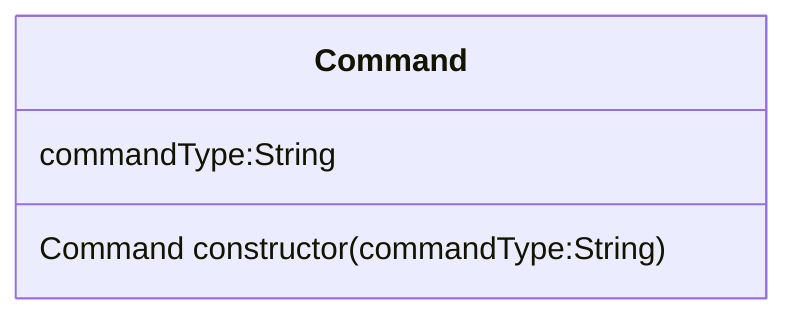
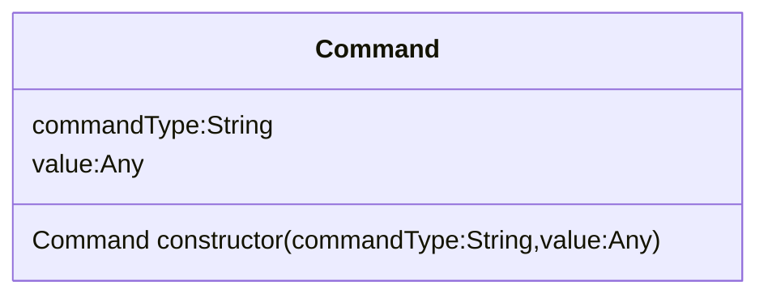

# Assignment #3: Mars Rover

[toc]

---

## Introduction

A lot of people are still having trouble with A3. So I thought I would help out.

Sometimes the best way to make an assignment easier is to look at it from another perspective or to reorganize the information in such a way that it is better to comprehend.

### Class Diagram

One way that I find helpful, at least in terms of this assignment, is to organize the information into a [class diagram](https://en.wikipedia.org/wiki/Class_diagram) since we are doing something involved with object oriented programming (OOP). Often times, when you are doing an assignment where OOP is involved, there's a class diagram to provide a blueprint of our project.

For A3, this is what it looks like:

```mermaid
classDiagram

class commandType {
<<enumeration>>
"MODE_CHANGE"
"MOVE"
"STATUS_CHECK"
}

class Command{
	Command constructor(commandType:String<commandType>,value:Any)
	commandType:String<commandType>
	value:Any
}

class Message{
	Message constructor(name:String,commands:Array<Command>)
	name:String
	commands:Array<Command>
}

class Rover{
	Rover constructor(position:Number)
	Object receiveMessage(message:Message)
	position:Number
	mode:String<roverMode> = 'NORMAL'
	generatorWatts:Number = 110
}

class roverMode {
	<<enumeration>>
	"LOW_POWER"
	"NORMAL"
}

Command ..> commandType : Uses
Message "0" ..> "*" Command : Contains
Rover ..> Message : Uses
Rover ..> roverMode : Uses
```

> :information_source: **NOTE**: In that class diagram, you only need to create the `Command`, `Message`, and `Rover` classes. `commandType` is supposed to represent an enumeration (list) of accepted values the `commantType` variable in `Command` may accept.

> :warning: **WARNING!**: Do not create the enumerated lists as separate objects. These lists are illustrated to show what will be processed in the final product and intended to show what will be constructed INSIDE one of the functions in the class. You should only create the three classes `Command`, `Message`, and `Rover`.

However, don't go writing all this up in JavaScript just yet. If you do, you'll want to consider commenting out the parts of the program that we haven't built yet. In fact, you shouldn't build everything in the diagram just yet. Some of the unit tests will need you to build your project as you test. 

### Test Lists

I believe the Unit Testing Chapter has flaws. While there is information provided on how to unit test, in terms of instructions, the *purpose* and *motivation* for doing so seems lacking.  You can tell an artists to paint a picture, but unless you tell them what they should paint or for what reason, you'll only make things more frustrating or confusing.

We created this story about the Mars Rover, which is a good plot point and story, *but* for a lot of people it's a lot like trying to tell someone to fetch a pail of water from a well that is dry.

Maybe if we had made a game out of this or made it feel more like a scavenger hunt rather than "do this write that".

A **test list** should be sort of like a clue sheet, or like in charades where you need to solve a multiword answer. Once you get the gist of the game or find the majority of the words, the rest of the game (or in this case the tasks) is easy.

Submitted for your approval, I want to rewrite this assignment. If the class diagram can describe our three modules should be written, the tests lists should be the "what-if" part of the game.

---

You need to create Six files. For every Module you make (`command.js`, `message.js`, and `rover.js`) you must create a `spec` file that contains tests for each class (`spec/command.spec.js`, `spec/message.spec.js`, `spec/rover.spec.js`)

> :information_source: **NOTE**: Because this *is* an assignment, I won't be listing the answers here. I will on the other hand provide class diagrams to show what you three main classes should look like at each test step.

## Command class

> * Module: `command.js`
> * Spec: `spec/command.js`
>
> **Class**
>
> This class builds an object with two properties: `constructor(commandType,value)`.
>
> * `commandType` is a string that represents the type of command from the `commandType` enumerated list: `'MODE_CHANGE'`, `'MOVE'`, and `'STATUS_CHECK'`.
> * `value` is a value related to the type of command. Not all commands will use it, as you will find out later. 
>
> **Tests**
>
> 1. Create a `Command` that throw an error if a `commandType` is not passed into the constructor as the first parameter. (Basically, use `assert.throws()` because `Command` was used without any arguments.)
> 2. Create a `Command` that test to see if `commandType` is set. (Basically, use `assert.isStrictEqual()` to test that `commandType` in the `Command` constructor produces the value that `commandType` was assigned to when it was created.)
> 3. Create a `Command` with a second argument. Much like with Test 2, test to see if the `value` in the `Command` constructor produces the value that `value` was assigned to when it was created. (You don't need to know a proper `value` in order to write this test.)

### Test 1



Use an `assert.throws()` to test that an exception was thrown if `commandType` is not used in the `Command` constructor.

### Test 2


Use an `assert.isStrictEqual()` to test that `commandType` exists by testing if it is a `String`.

### Test 3



User an `assert.isStrictEqual()` to test that `value` exists.

## Message class

> * Module: `message.js`
> * Spec: `spec/message.spec.js`
>
> **Class**
>
> This class builds an object with two properties: `constructor(name, commands)`
>
> * `name` is a string that is the name of the message.
> * `command` is an array of `Command` objects.
>
> You will need to include the `command.js` file in `message.js` so there should be a line near the top of `message.js` that says
>
> ```js
> const Command = require('./command.js');
> ```
>
> You will also need to export the `Message` class, so there should be a line at the bottom that says
>
> ```js
> exports { Message }
> ```
>
> > :bookmark: PICK UP HERE
>
> **Tests**

### Test 4

### Test 5

### Test 6

## Rover class

> * Module: `rover.js`
> * Spec: `spec/rover.spec.js`

### Test 7

### Test 8

### Test 9

### Test 10

### Test 11

### Test 12

### Test 13

### Test 14 (Bonus Mission)

---

## Submit your work

Once you've completed this test

---

#LaunchCode