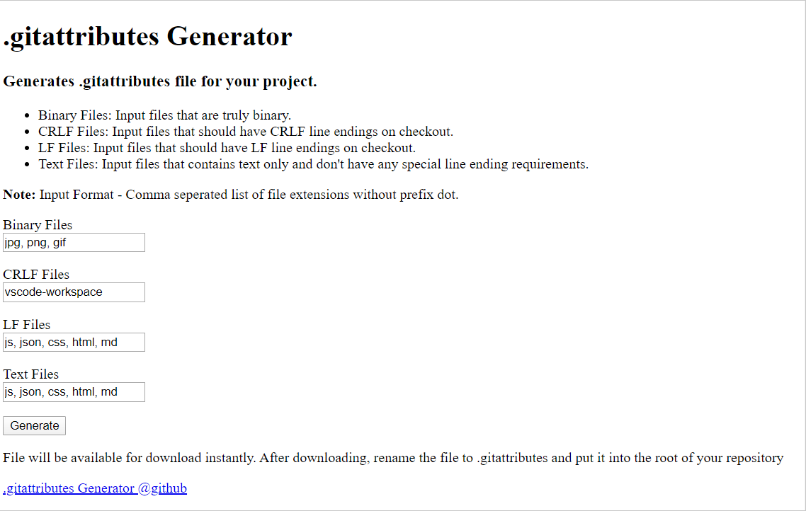

Assignment #4: HTML Me Something

[toc]

---

Assignment #4 is a rare case where I want to write out the assignment, namely because it has a lot of important stuff for using Git, Github, and Github Pages.

## Background

First, a little bit of background.

[Github Pages](https://pages.github.com/) uses [Jekyll](https://jekyllrb.com/), which was made in [Ruby](https://www.ruby-lang.org/), another programming language.  The plus side with using Jekyll is that we can use Github Flavored Markdown (a sub set of Markdown) to write content in pages quickly without having to meddle with HTML.

But we're learning node. What if we want to deploy a Node.js set up using a MEAN stack (MongoDB/Express/Angular/Node)? This course does have us fiddling with Angular later, of which TypeScript will be there.

Those are all some very important questions which will be answered in due time.

---

## The assignment

You've learned a bit of HTML and some CSS, but have only scratched the surface so far by adding or modifying content in exercises, or pre-existing files. In this assigment, you are going to take another great step forward by building an entire page from scratch.

While the assignment does say you only have to make one page, over time you'll want to revisit this assignment and build upon it. I know I will!

You will also get some practice using Git. You won't need to worry about branching or merging, just the basic stuff.

There are two parts to this exericse. One focuses on HTML. The other focuses on CSS. HTML makes up the *structure and content* of a web page, while CSS defines the *visual style*.

Remember this diagram:


Best practices dictate that *content* and *style* should be kept as separate as possible. (I'll add some code snippets to help with that.) TO that end, we will build the HTML portion of our page first, and afterwards, we will add a few styles with CSS. We do this to avoid using HTML tags to change the general apperance of our pages. Inline styles should only be used in rate cases, and even if you do use them you should define classes for stuff like that whenever able. (Be glad you didn't have to endure how folks applied styles prior to HTML4. That's ancient history, and we're learning history post-1980s as far as I'm concerned!) Still, inf you need to use the `style` attribute in an HTML tag, use it sparingly.

### Getting Started

> :building_construction: **You need a Github account at this part!** If you haven't signed up for Github yet, do so.
>
> :building_construction: **You need to install Github first!** Windows users can [get it here](https://gitforwindows.org/), as well as the simple Bash set up we need to so some of the stuff here.
>
> :book: **Did you read chapters 19 through 22?** To understand how to use just about everything in this assignment, you need to read these chapters first.

Follow the steps below to create a folder for your project and initialize it as a Git Repository.

#### Setup the project

> :information_source: **NOTE**: When we speak of Bash here, we are talking about the terminal. Bash is our default shell, but if you are using Zsh, that's fine too. If you are using Git Bash (Bash that came with Git for Windows), that also applies here when we speak of "Bash".

1. Navigate to the home directory of Bash, or if you have a cloud directory (Microsoft One Drive, Google Drive, or Mega, you can start this project there) so as long as you remember where you put this project later.  We want to put all of our Launch Code stuff in a directory called `lc101`.

   ```bash
   $ cd ~/OneDrive/2020
   $ mkdir lc101
   $ cd lc101
   ```

2. Make a new folder for this assignment called `html-me-something`. This directory should be in the `lc101` folder.

   ```bash
   $ mkdir html-me-something
   ```

   > :information_source: **NOTE**: We could have created two directories at one time. The `-p` attribute will allow us to make multiple, nested directories.
   >
   > ```bash
   > $ mkdir -p lc101/html-me-something
   > ```
   >
   > Then we can navigate to it
   >
   > ```bash
   > $ cd lc101/html-me-something
   > ```
   >
   > If you have a Mac or Linux, you can probably us a command called `tree` to show the relationship between the two directories.
   >
   > ```bash
   > $ tree lc101
   > lc101
   > |- html-me-something
   > ```
   >
   > 

3. Go into the `html-me-something` directory and use touch to create your HTML file. The homepage on any website is called `index.html`, though the prefix may be different depending on how your website is deployed. Since this is supposed to be a simple assignment, we just need to make an `index.html` file. We can make other HTML files with different names (e.g. `bananaphone.html`) some other time, but for now, we need an `index.html` file.

   ```bash
   $ touch index.html
   ```

   > :information_source: **NOTE**: Alternatively, we could have used touch in the parent directory or just opened a new file called `index.html` with a text editor.
   >
   > ```bash
   > $ pwd
   > lc101
   > $ ls
   > html-me-something
   > $ ls html-me-something	# returns nothing because nothing is in it yet
   > $ touch html-me-something/index.html
   > $ ls
   > index.html
   > $ nvim html-me-something/index.html		# opens a text editor 
   > ```
   >
   > > :information_source: **NOTE**: If you find yourself stuck in `vim` or Neovim (`nvim`) by accident, hit the `ESC` key, then enter the command `:q!` followed by `ENTER`. This will force `vim` to quit.
   > >
   > > I don't care what Shawn thinks! Learning Vim can be easy [AND FUN!](https://vim-adventures.com/) 

   > :information_source: **The file name `index.html` is a standard convention for the name of the root page of a website. Most web servers will treat `index.html` as the default file to load from a given directory.

4. Open your new file in a text editor. I recommend using [VS Code](https://code.visualstudio.com/), but if you are looking for something lighter, consider using something like [Notepad++]((https://notepad-plus-plus.org/)) or [NeoVim](http://neovim.org/).  For simple stuff and quick edits, I recommend using a text editor that can be opened in the shell (i.e. `nano`, `vim`, or `neovim`), but if you don't know how to use any of htose things, use a graphical text editor (Notepad++). Write an HTML file.

   > :disappointed: **UNBELEIVEABLE!** What is this crap?! "Add a single line with the following HTML: `<p>YOUR NAME</p>`"?! HTML DOES NOT WORK THAT WAY!
   >
   > The author of this assignment thinks you can get buy just making a paragraph with your name in it. But that is syntactically wrong!
   >
   > When you write an HTML file, it should have the following items:
   >
   > * A `<!DOCTYPE html>` on the first line.
   > * An `<html>` element to put everything in with `<head>` and `<body>` children.
   > * A `<head>` to put your `<meta>`, `<title>`, and `<link>` tags in.
   > * A `<body>` to put that `<p>Your Name</p>` in.
   >
   > If your HTML page doesn't have those items in them, it's not a very good page.
   >
   > TLDR: Your page should look like this
   >
   > ```html
   > <!DOCTYPE html>
   > <html>
   >     <head>
   >         <meta charset="utf-8">
   >         <title>LC101 - HTML Me Something</title>
   >         <link rel="stylesheet" href="./style.css">
   >     </head>
   >     <body>
   >         <h1>Jason Charney</h1><!-- Make your name BIG! -->
   >     </body>
   > </html>
   > ```
   >
   > We'll worry about the `style.css` file and semantic HTML elements later.

   > :information_source: **Note**: If you are using `vim` or `nvim`, the command to insert text (which enters "Insert Mode") is `i` ("`i` for Insert"). If you type `a` ("`a` for Append"), the cursor will start at the next character. If you use capital `I` or `A`, insert mode will start at the first or last character of a line, respectively.

5. Save your file.

   > :information_source: **Note**: If you are using `vim` or `nvim`, the command to save a file is `:w`. Remember when you use one of these editors, you need to press `ESC` to enter command mode and use `ENTER` to execute a command that starts with `:`. To exit the editor, use `:q`.

6. Finally, open the file in a web browser. Use `pwd` to identify your present working directory if you need to. In the browser, you can go to a file on your computer by typing `file:///` followed by the path to the file.

   > :information_source: **Note**: If you are using Windows, you will need to enter the path but replace the backslashes with forward slashes.
   >
   > For example, my `lc101` folder is located in `C:\Users\Jason\OneDrive\2020`, so I have to go to that directory in my browser through `file:///C:/Users/Jason/OneDrive/2020/lc101`.
   >
   > If I were using a Linux system and storing this project on Google Drive, I probably would have created the `lc101` directory in `'/home/Jason/Google Drive/2020'` which would have been entered into the browser as `file:///home/Jason/Google%20Drive/2020/lc101` .
   >
   > If I were using a Mac and using something like [MEGA](https://mega.nz/),  I probably would have created in in `file:///Users/Jason/MEGASync/2020/lc101`. 
   >
   > Whatever you use and wherever you put your `lc101` file, put it somewhere you can remember it.

#### Use Git

Let's incorporate Git into our project.

Because websites change, screenshots should change too. As of March 2020, here's what the top part of [GitHub.com](https://github.com/) looks like. I didn't want to show everything in my browser.

##### Step 1. Go to Github.com click the green button


As the first step of part of the assignment, click the green New button in the left column.

##### Step 2. Fill out the New Project form

You will then be taken to `github.com/new` to fill out a form to create a new Git project. While this assignment wants you to create a project called `html-me-something`, I'm going to do something similar to that and set up a project to establish my own Github Pages site thorugh Github. Generally, it is your username followed by `.github.io`. So by the end of this part, we should have [jrcharney.github.io](https://jrcharney.github.io) set up.


There are a few things happening here. 

Since I am the owner of my project, I don't need to change that. If you are part of a team, you may wnat to change that field.  I want to call my project `jrcharney.github.io`.  I can add a description describing what it is. 

I could set the repository to Private, but it would only be visible to me. Besides, you can keep stuff on your computer until it is time to publish it, so leave the Public radio button checked.

A good Git project has a README file (called `README.md`). We can use it here to send a message to people to go to the website instead of the repo.

Adding a `.gitignore` file is a good idea if you are using an IDE (Independent Development Environment) like Visual Studio Code. If you are using VS Code, I would recomment choosing VisualStudio. I should devote a section to stuff that you can use `.gitignore` for, but I'll do that another time. 

> :information_source: **NOTE**: In retrospect, I should probably have also checked to see if there were setting for Node.js. You can add more stuff to ignore using [gitignore.io](https://www.gitignore.io/). For instance, it would be more accurate to apply things that should be ignored in [Node.js and Visual Studio code](https://www.gitignore.io/api/node,visualstudiocode). We'll edit our `.gitignore` later.

Another thing you should consider is adding a license to your project. If you are creating a project that will be distributed to other systems, it's a good idea to add a license file (which will generally be located at `LICENSE`) telling people how they can legally use your software. It's intended to make sure your work is recognized and attributed if other people use it.  I generally recommend the **MIT License**.

Once that is done, take a deep breathe, click the green **Create Repository** button!

##### Step 3. Set up your page for Deployment

After letting that dramatic breath of air out of your body to let the stress exit your body. Take a look at the three files that are in your repository.


The page you are looking at on your GitHub page is is your `README.md`. You could edit it here, but we want to practice doing that stuff with Github in the command line.

Click on the :gear: **Settings** link on the page's tab bar.

The setting page should look something like this.


Because the person who designed this page didn't put a module to scroll down to the part of this page that we want that controls **Github pages**.

Scroll down until you see that section.

##### Step 4. Change the Source Branch

By default this is likely set to `None`, but we want to change it to **`master branch`**. The Master Branch is where all the stuff is applied by default in a Github project unless it is changed to something else.


When that is done the Github pages section should look something like this.


If you are building a website ending in `.github.io`, this step is already done, and the page should look something like this.


> :information_source: **NOTE**: If you get a 404 Message, give it a few minutes for GitHub to process that you are you are creating a new page.

> :question: **Question**: What would happen if you created `html-me-something` in one repository, but you wanted to do what I am doing in these instructions and establish your website in another repository that is represented by another repository?
>
> That is a very good question, and one I hope to answer in these instructions. Maybe you can merge `html-me-something` into `YourUserNameHere.github.io` later.

> :information_source: **NOTE**: You can actually do stuff explicitly for Github on your computer using the `gh` command. But that's kind of new and I'm not going to go into that right now. Also, creating a Git repo over the command line often requires writing a JSON file and sending it to GitHub's computer to do the stuff we did in steps 1 through 4 "hacker wizardry" style. *But you're not a wizard, Harry.* (At least not yet.) Also, it's just easier to do that part on the website.

##### Step 5. Do the command line stuff.

For some reason, the LaunchCode folks decided to instruct everyone todo the stuff on Github second and the command line stuff first. While that does work, it is much better to do the stuff you need to do on Github first THEN do the stuff on you computer.

> :information_source: **NOTE**: Remember how the assignment wants you to put your LC101 stuff in `lc101`? I'm putting this project that I am using in a different directory on OneDrive called `Code Projects`. If you are trying to navigate files with spaces in them, your path needs to be enclosed in quotes when using commands like `cd`.
>
> ```bash
> $ pwd
> /c/Users/Jason/OneDrive/
> $ cd 'Code Projects'
> $ pwd
> /c/Users/Jason/OneDrive/Code Projects/
> ```

We need to get the **Clone URL** from our repository (which we will call the "repo" from now on). Click on the green **Clone or Download** button then click the clipboard icon to copy the URL. The URL will be something like this `https://github.com/jrcharney/html-me-something`

###### The LaunchCode Way

The LaunchCode way to do this was to create your HTML stuff inside a directory called `html-me-something`, set up the repo on Github, then pair your local repo with the remote repo that was created. This is the **remote** way since the `git remote` command is used first.

```bash
$ pwd
/c/Users/Jason/OneDrive/2020/lc101/html-me-something
$ git remote add origin https://github.com/jrcharney/html-me-something.git
```

If you don't see the new files, try doing a `git pull` command. Hopefully those files will merge with the files you already created.

###### My Way

My way would have been to **clone** the repo we created first, then create the HTML file (as well as any other files for CSS, etc.)

```bash
$ pwd
/c/Users/Jason/OneDrive/Code Projects/
$ git clone https://github.com/jrcharney/jrcharney.github.io.git
$ cd jrcharney.github.io.git
$ pwd
/c/Users/Jason/OneDrive/Code Projects/jrcharney.github.io.git
$ ls -a
.  ..  .git .gitignore  LICENSE  README.md
```

In this method, we don't need to use `git pull` to get our files.

###### Step 6. Test to make sure you can commit and push

> :information_source: **NOTE**: I've noticed that Git Bash locks up sometimes when doing simple things like an `ls` or using `vim`. This shouldn't happen. In the future, I will replace Git Bash with MSYS2, even if Microsoft doesn't like it! (You blew it, Microsoft!) Besides, we can do more Linux stuff in it.

Every time we come to a checkpoint in our project, we want to do a **commit**. A commit MUST include a message using the `-m` command other wise the text editor will open in the Bash shell, and you don't want that! (It's why I put those basic `vim` command in these instructions in case you make a mistake, which you will at some point. Even I've done it at times.)

In this example, I'm in my repo (`jrcharney.github.io`).

Let's start by creating a blank file that we can remove later.

We want to use a command called `git status` which is like `ls` but it shows us what files we haven't pushed to the repo. Files we don't want pushed to the repo are generally put in the `.gitignore` file (which we need to update to use the stuff I was talking about earlier because VisualStudio is *NOT* VS Code.)

```bash
$ touch test.txt
$ ls
LICENSE README.md test.txt
$ git status
On branch master
Your branch is up to date with 'origin/master'.

Untracked files:
  (use "git add <file>..." to include in what will be committed)
        test.txt

nothing added to commit but untracked files present (use "git add" to track)
```

The text for `test.txt` file may appear red.

As the instructions imply, you should use `git add` the file to the repo.

```bash
$ git add test.txt
$ git status
On branch master
Your branch is up to date with 'origin/master'.

Changes to be committed:
  (use "git restore --staged <file>..." to unstage)
        new file:   test.txt
```

The text for `test.txt` should now appear green, indicating it's readly to be **pushed** to Github.

We are now ready to commit our file. Committing files to a repo is sometimes called **staging**.

```bash
$ git commit -m "Test Commit"
[master a1eda32] Test Commit
 1 file changed, 0 insertions(+), 0 deletions(-)
 create mode 100644 test.txt
```

It should be noted that when we commit our files, the `git status` is shown to have no files in it. We can commit multiple times before we push.

```bash
$ git status
On branch master
Your branch is ahead of 'origin/master' by 1 commit.
  (use "git push" to publish your local commits)

nothing to commit, working tree clean
```

Finally, we should be ready to push.

```bash
$ git push
Enumerating objects: 4, done.
Counting objects: 100% (4/4), done.
Delta compression using up to 4 threads
Compressing objects: 100% (2/2), done.
Writing objects: 100% (3/3), 271 bytes | 135.00 KiB/s, done.
Total 3 (delta 1), reused 0 (delta 0)
remote: Resolving deltas: 100% (1/1), completed with 1 local object.
To https://github.com/jrcharney/jrcharney.github.io.git
   0465f29..a1eda32  master -> master
```

These change should be reflected in our repository.


##### Use Git Desktop

Prior to Microsoft's take over of GitHub in 2018, Github also had a graphical user interface called **Github Desktop**. In this section, we want to set up Github desktop. If you intend to use something like NotePad++ as your text editor, or if you are using a application like **Typora** (which is being used to compile these notes you are seeing), You'll want to use it.

You can get it at [desktop.github.com](https://desktop.github.com/), or you can install it the easy way with [Chocolatey](https://chocolatey.org/) and install it through an adminstrative PowerShell (if you are using Windows).

```powershell
> choco install github-desktop
```

> :reminder_ribbon: **TODO**: Instructions for Mac and Linux!

Open Github Desktop. In the File menu, select "Add Local Repository". (You could do a clone remotely, but let's have the command line do that.)


In the Local path field click "Choose...", navigate to the folder where your repo is.


Once selected, click "Select Folder".


Click "Add Repository".

You are now ready to use Github Desktop with your Repo.


More practically, here's another example of Git Desktop as I'm using it for these notes!


I'd like to go into the nuances of all that Git Desktop does, but we'll get into that later.

##### Use VS Code

Finally, there's one other place you can use Git to do stuff in Github and that is [**Visual Studio Code**](https://code.visualstudio.com/). You can get that via Chocolatey.

```powershell
> choco install vscode
```

Open VS Code.

> :information_source: **NOTE**: You may need to install some other stuff. I don't have screenshots of it. But that's why I recommend using Chocolatey or a command line software manager in Linux or Mac to deal with that.


> :information_source: **NOTE**: There's like a bunch of plugin that I've added. Also, this theme, [Synthwave x Fluoromachine](https://marketplace.visualstudio.com/items?itemName=webrender.synthwave-x-fluoromachine), is also not the default theme. You can get it and themes like it either in the [Visual Studo Marketplace](https://code.visualstudio.com/), or find other themes at [VSCodeThemes.com](https://vscodethemes.com/).

###### Get the GitHub Pull Requests Extension

We first need to make sure we have the extension we need to do Git stuff in VS Code. Go to the Extensions tab (`Ctrl+Shift+X`)  on the left side of the screen.

You'll see a sidebar with a bunch of stuff.


You're going to see a lot of garbage apps (just like any other App store).

Viewing the extensions you do have is alot eaiser than looking up the ones that are available.

Typically you go to Preferences (`Ctrl+,` (that is `Ctrl+Comma`) or `File > Preferences > Settings`) and the main part of the screen will look like this.


Then in the left colum of the main section, click on `Extensions` to see the list of extensions you do have.


> :reminder_ribbon: **TODO**: Add a list of recommendations later.

Let's go to the Extension Sidebar and search for "Github".


As you can see, there's some other guy who has his extension ahead of the **GitHub Pull Requests**. Even "KnisterPeter" recommends downloading Github Pull Request over his extension. When downloading extenions, look who the provider of the extension is.

We want to install the GitHub Pull Requests extension.


There should be a link in the header that says "Install" click on that. When it is installed, you may need to restart VS Code but you should see the Octocat logo in the left sidebar.

Typically, the command that opens the Source Control software (`Ctrl+Shift+G`) should show that we have a folder open. But since we don't we have this.


We'll figure this out later. right now, we need to do one other important thing: Set up the integrate terminal.

###### Set up the Internal Terminal

Integrated Development Environments (IDEs) have become quite complicated these days. So much so, there is now a command to find other commands. **`Ctrl+Shift+P`** is generally the command used for that task.

> :writing_hand: **Technical Note**: Typically I use *Screen Snip* and *Snip & Sketch* to take my screenshots. However, you can't do that when trying to screenshot pop-up boxes like the ones `Ctrl+Shift+P` uses. You'll need to be a little more clever than than to get screenshots like the couple I'm about to add here.
>
> The way to get the screenshots for `Ctrl+Shift+P` is to use an older Windows trick `WindowKey + PrintScreen` (The window key is sometimes denoted as `WinKey` or `Meta` in some documentation, while Print Screen is sometimes labled `PrtScr` because of how it is labeled.)  If you need to, use a full keyboard for stuff like that.
>
> Screen shots taken using the `WinKey` method often are stored in `C:\Users\{Username}\Pictures\Screenshots`, so you may want to delete them later after you've used *Screen Snip* to grab the cropped part of the picture you wanted to take.


Select Type in the panel `"Default Shell"` and look for `Terminal: Select Default Shell`.


Since we have Git Bash installed, Select `Git Bash` from the lsit of options. When we open the terminal in the IDE, we can now use Git Bash like we use if it was on its own.

Another way to set this up (and to make sure it is done with a sense of permanence) is to open the Settings menu and in the `Features > Terminal` section, scroll down to a link that says "Edit in settings.json" which should open a JSON file that shows all the settings you've applied.


I'm not a fan of this way. I mean, look. What this nonsense about `Terminal.app`. I would have liked to have used External Linux considering the features that are in some of my screenshots were made using a Zsh shell, but LaunchCode has is hanging around with Git Bash (which is basically sorta broken, but we need it anyway.) You can set the terminal here editing the `Exernal: Windows Exec` option and chaing it to `C:\Program Files\Git\bin\bash.exe`, but chaos ensue. 

The best way to handle the problem is directly which is why this next way of doing is my cup of tea.

You can also use `Ctrl+Shift+P` to find the `settings.json` file that control that stuff. This JSON file is typically stored in `C:\Users\{Username}\AppData\Roaming\Code\User\settings.json`.

> :warning: **WARNING!**: Don't mess with `Preferences: Open Default Settings (JSON)`. Th file we want to modify is the **`Preferences Open Settings (JSON)`** that has our **`settings.json`** file. If you edit the `defaultSettings.json` file, nothing will happen. You might even break something. While this screen shot below shows that I have the `defaultSettings.json` file selected, you want to select the second file listed below.


Here's what my `settings.json` looks like.  I haven't used VS Code a whole lot until recently so it's rather small.


You want to set `"terminal.integrated.shell.windows"` to `C:\\Program Files\\Git\\bin\\bash.exe`. (Eventually I will change this to whatever MSYS2 is using since Git Bash has some issues.) We need to escape our backslashes in the path.

To open a terminal in VS Code, we use **`Ctrl+Shift+\``** (`Ctrl+Shift+Backtick`). If you don't know where that key is, the backtick key is generally paired with the tilde (`~`) on most American keyboards to the left of the `1` key or below the `ESC` key. (This is why I'm not a fan of crazy keyboard layouts. I'm looking at you Chromebooks and Apple!)


Here's a familar sight! We can finally get to work.

###### Opening our first Workspace

We want to open our project in something called a **workspace**. A workspace is basically a project environment. Anything open in that environment is part of the workspace, so be careful when opening files in VSCode that are not part of the workspace.

> :warning: **WARNING!** ALWAYS CLOSE THE WORKSPACE THAT YOU ARE USING BEFORE OPENING ANOTHER PROJECT!
>
> I'm starting to get the hang of this, but the issue here is that if you try opening another file or project when there is an active workspace open, those files will become part of that workspace, whether you want them to be or not. That is really bad! It messes up the organization of your files and is added to whatever file that is in the `.vscode` directory or `.workspace` file that is managing what files are part of your project. It's a mess to clean up when it happens.
>
> > :reminder_ribbon: **TODO**: Find someting that can prevent that from happening.

We want to open our project folder and make it a workspace. Type `Ctrl+K` then `Ctrl+O`. This is a rare instance where we need to type two control commands sequentially to do something.

Navigate to the folder that our project is in.


Once there click "Select Folder".


VS Code will likely reopen with the Welcome. (Close it, but definely let it show up on startup.) But look at this!


It's all of our files!

Look where we are when we open up a terminal with `Ctrl+Shift+\``.


Very nice!

Let's save our workspace by going to `File > Save Workspace As...`.

We will want to save the file in our folder. Typically, it is the name fo the folder with `.code-workspace` added to the end. So, save this one as `jrcharney.github.io.code-workspace`.


We've added files let's see what happens when we update one and remove one.

###### Modify .gitignore

Remember how I said eariler that `.gitignore` was not configured properly because the contents of the file were not configured properly, but that there was a website where we could generate a better `.gitignore`? Let's update our `.gitignore` by going to [gitignore.io](https://gitignore.io) an in the field look up `Node` and `VisualStudioCode`.


Next, click "Create".

Select all (`Ctrl+A`) the contents in the file generated then Copy (`Ctrl+C`) them.

In VSCode, switch to the Explorer (`Ctrl+Shift+E`) Sidebar.


If you hover over the `JRCHARNEY.GITHUB.IO (WORKSPACE)` line, you will notice a set of icons appear on the right. Let's go over those real quick.


* New Document - Create a new document
* New Folder - Create a new folder
* Refresh Explorer - Update the list of files manually if it doesn't do that automatically.
* Collapse Folders in Explorer - Fold the lists of files at each directory. We don't have any directories in this list right now so it's not that important.

If we right click on `jrcharney.github.io` we see a list of options that can be applied to this directory.


If we right click on `.gitignore`, we have a different set of options.


It turns out we don't really need to do anything with those options just yet. I *was* going to say "Right Click on `.gitignore` in the list and select `Open to the Side` (`Ctrl+Enter`)", but that just opens `.gitignore` to the right of the Welcome tab.

We want to just open `.gitignore`, so just double click on `.gitignore` to open it. This will open `.gitignore` in a new tab, but it won't close the Welcome tab so we should probably close that.


You may notice there is something on the right side of the window. There's some extension (I think) that allows you to see a small version of the file. It can be used to jump around long files quickly. Our concern right now is the contents of the file that is open.

Select all (`Ctrl+A`) the contents in `.gitignore` and Paste (`Ctrl+V`) the contents from gitignore.io into our `.gitignore`. Save (`Ctrl+S`) when you are done.

###### Deleting and Restoring files

Let's try to remove the `test.txt` file. 

In the console, delete the test file with `rm test.txt` and see how that looks not just in our console but in the Source Control (`Ctrl+Shift+G`) but also the Github Pull Extension

```bash
$ rm test.txt
$ ls -a
.  ..  .git  .gitignore  jrcharney.github.io.code-workspace  LICENSE README.md
$ git status
On branch master
Your branch is up to date with 'origin/master'.

Changes not staged for commit:
  (use "git add/rm <file>..." to update what will be committed)
  (use "git restore <file>..." to discard changes in working directory)
        modified:   .gitignore
        deleted:    test.txt

Untracked files:
  (use "git add <file>..." to include in what will be committed)
        jrcharney.github.io.code-workspace

no changes added to commit (use "git add" and/or "git commit -a")
```

According to the text in the `git status` commna, we have the option to update this change with `git rm test.txt` or we can restore it with git using `git restore test.txt` We definitely want to get rid of this file and will confirm its removal upon the next `git commit`.

Here's what happens when we use `git restore` on `test.txt`.

```bash
$ git restore test.txt
$ git ls -a
.  ..  .git  .gitignore  jrcharney.github.io.code-workspace  LICENSE  README.md  test.txt
$ git status
$ git status
On branch master
Your branch is up to date with 'origin/master'.

Changes not staged for commit:
  (use "git add <file>..." to update what will be committed)
  (use "git restore <file>..." to discard changes in working directory)
        modified:   .gitignore

Untracked files:
  (use "git add <file>..." to include in what will be committed)
        jrcharney.github.io.code-workspace

no changes added to commit (use "git add" and/or "git commit -a")
```

Let's delete our test file again this time in the Explorer. Right click on `test.txt` and select `Delete`. You may be asked if you want to toss it in the Recylce Bin or Trash, go ahead and do that.

I have a feeling about it (and I should probably check the documentation to be sure), but I'm pretty sure that once you `git commit`, there is no going back with the `git restore` command. You'll need to roll back a commit a that point. It's not a topic I want to cover here.

###### Create .gitattributes

There is one file I recommend adding and that is a `.gitattrubtes` file. Click on `jrcharney.github.io` in the explorer and select `New file`. You will be asked to enter a new name for the file. Type in `.gitattributes`. 

To our good fortune, just just gitignore.io exists to help create `.gitignore` files, there also happens to be a [getattributes.io](https://gitattributes.io/) file for creating a `.gitattributes` file. But that site missses the mark in that it seems to want to set things up much like a `.gitignore` file. Instead we want to use [ihopepeace's .gitattribute generator](https://ihopepeace.github.io/gitattributes_generator/).



In each of the four fields, insert the following:

* Binary Files: `jpg, png, gif`
* CRLF Files: `vscode-workspace`
* LF Files: `js, json, css, html, md`
* Text Files: `js, json, css, html, md`

Once that is done, hit "Generate" and save the file as `.gitattributes` in your Workspsace folder.

###### Using Source Control

We are now ready to **Source Control** (`Ctrl+Shift+G`).


You may notice there are three kinds of letters on the right:

* U = **Untracked** - This file is not part of the repo's most recent commit.
  * A = **Added** - Any U file will turn to an A file once it is staged the first time. 
* M = **Modified** - This file has changes the file in the repo's most recent commit does not have.
* D = **Deleted** - This file was removed and will be removed from the repo upon the next commit.

If we hover over each file in the list, we will see three icons.

* Open file - Open a file in a tab.
* Discard Changes - Undo all the changes back to what they were in the last repo. (essentially our `git restore`.)
* Stage Changes - Add/Remove a file much like how `git add` or `git remove` works.

==Files must be staged before they are committed.==

If you right click on a file, there are a list of other options that I won't get into right now.

Also take note of the field over the `CHANGES` header. Here you enter your required message followed by `Ctrl+Enter` to commit any staged. This works just like in Github Desktop.

You may also notive in the `Source Control` heading, there are also a few icons:

* Toggle View Mode - Switch between flat and tree view.
* Commit - Commit your staged files. (Don't forget to fill out the message field below.)
* Refresh - Update the list of files the `CHANGES` list. (Useful if another contributor has made changes.)
* More Actions... - A long list of other things I won't get into in these notes.

Let's use it to stage our four files for changes. Click on the Plus sign on each of the files or in the `CHANGES` header, hover over it and click the Plus sign to stage all the files in the list.

Three things will happen once files are staged

* Unstaged file wll become Added files. Their U status changed to an A.
* Staged files are put under a `STAGED CHANGES` header. This means that these files will be readed to be committed
* Plus signs relaced with minus signs. This is your last chance to unstage a file. Press the Minus sign and the file won't be part of the next commit. It will go back to the `CHANGES` category.

I think we are ready to commit. In the message field write the message you want follwed by clicking the check mark above it or type `Ctrl+Enter` when you are ready.

Once we commit, the files that were in the `STAGED CHANGES` category disappear, however they are not *pushed*.

==Files have to be committed before they are pushed==. You can commit as many times as you like before the next push.

A commit is just a checkpoint for your work. It isn't submitted online until it is pushed, but there is no Push icon.

==In the "More Actions..." option above the Message field, search for the `Push` option.==

> :information_source: **NOTE**: If you are working with others, **pull** their changes first before you **push** yours. It's kind fo complex, but we'll cover it in the Git Chapter in the LaunchCode text book.

With all this considered, you are ready to complete the rest of this assignment and post it online!

> :reminder_ribbon: **TODO**: Use mermade to create a state diagram showing how the stage-commit-push process works.

### Part 1: HTML

> :reminder_ribbon: **TODO**: Coming Soon: HTML Reference

### Part 2: CSS

> :reminder_ribbon: **TODO**: Coming Soon: CSS Reference and CSS Guides

### Submitting Your Work

> :reminder_ribbon: **TODO**: Still need to do this part.


---

## See Also

* Launch Code Textbook
  * [Chapter 19: Terminal](../A.%20Chapters/19.Terminal.md)
  * [Chapter 20: HTML](../A.%20Chapters/20.HTML.md)
  * [Chapter 21: CSS](../A.%20Chapters/21.CSS.md)
  * [Chapter 22: Git](../A.%20Chapters/22.Git.md)

## References

[^gh-pages]: [Github Pages](https://pages.github.com/).
[^ jekyll]: [Jekyll](https://jekyllrb.com/).
[^jekyll-gh]: Github - [Jekyll](https://github.com/jekyll/jekyll).


---

#LaunchCode